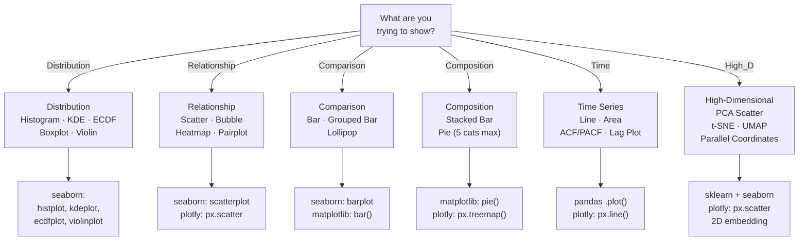
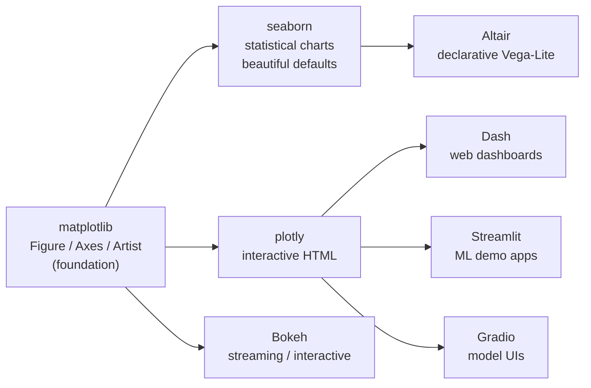

# Data Visualization for ML

> [!abstract] TL;DR
> Visualization is the fastest way to find bugs, understand distributions, and communicate model behavior — matplotlib provides the raw canvas, seaborn adds statistically-aware defaults, and plotly makes it interactive; knowing which tool to reach for and which chart type fits your data is an essential ML engineering skill.

---

## Intuition — Analogy First

**Analogy:** Imagine trying to navigate a new city using only a spreadsheet of GPS coordinates — technically all the information is there, but your brain cannot process 10,000 rows of numbers. A map makes patterns (highways, clusters of restaurants, dead ends) instantly obvious.

Data visualization is that map for your dataset. Before you train any model, you need to *see* the data: where are the outliers? Do the classes overlap? Is there a time trend? Are two features so correlated that one is redundant? A histogram reveals in three seconds what a `describe()` table takes five minutes to process.

For ML specifically, visualization is not just EDA — it's also the primary debugging tool for models. A learning curve tells you whether you're underfitting or overfitting. A confusion matrix heatmap shows exactly which classes your model confuses. A SHAP beeswarm plot explains why the model made a specific prediction.

---

## How It Works

### Chart Selection Guide

Choose your chart type based on the *question you are asking*, not the data format:



### Library Ecosystem



---

## Core Concepts

### 1. Matplotlib Fundamentals

Matplotlib uses a three-level **object hierarchy**:

| Level | Object | What it represents |
|-------|--------|--------------------|
| Top | `Figure` | The entire window/canvas — holds one or more Axes |
| Middle | `Axes` | A single plot with its own x/y coordinate systems and ticks |
| Bottom | `Artist` | Every visible element (line, text, patch, legend) |

```
Figure
└── Axes (ax1)          ← "the plot"
    ├── Title Artist
    ├── XAxis / YAxis
    ├── Line2D          ← each data series
    ├── Legend
    └── Patches (bars, rectangles, etc.)
```

**OO interface vs pyplot interface:**

```python
import matplotlib.pyplot as plt

# ── pyplot (implicit) — quick prototyping only ────────────────────────────────
plt.plot([1, 2, 3], [4, 5, 6])
plt.title("Quick plot")
plt.show()

# ── OO interface (preferred for production and multi-panel) ───────────────────
fig, axes = plt.subplots(nrows=2, ncols=2, figsize=(10, 8))
ax = axes[0, 0]         # grab one Axes
ax.plot([1, 2, 3], [4, 5, 6], color="#4a9eff", linewidth=2, label="series A")
ax.set_title("Panel Title")
ax.set_xlabel("X label")
ax.set_ylabel("Y label")
ax.legend()

# Figure-level adjustments
fig.suptitle("Dashboard Title", fontsize=14, fontweight="bold")
fig.tight_layout()                        # auto-adjust spacing
fig.savefig("plot.png", dpi=150, bbox_inches="tight")
plt.show()
```

> [!tip] `tight_layout()` vs `constrained_layout`
> Use `plt.subplots(..., layout="constrained")` (matplotlib 3.5+) — it handles complex subplots more reliably than `tight_layout()` and avoids overlapping labels automatically.

---

### 2. Seaborn

Seaborn is a statistical visualization library built on matplotlib. It accepts pandas DataFrames natively, applies sensible themes, and produces publication-quality charts with less boilerplate.

**Distribution plots:**

```python
import seaborn as sns
import matplotlib.pyplot as plt

sns.set_theme(style="whitegrid", palette="muted")

fig, axes = plt.subplots(1, 3, figsize=(15, 4))

# Histogram + KDE overlay
sns.histplot(data=df, x="feature", hue="class", kde=True,
             stat="density", common_norm=False, ax=axes[0])

# Kernel Density Estimate only
sns.kdeplot(data=df, x="feature", hue="class",
            fill=True, alpha=0.3, ax=axes[1])

# Empirical CDF — shows percentiles clearly
sns.ecdfplot(data=df, x="feature", hue="class", ax=axes[2])
```

**Categorical plots:**

```python
# Boxplot — shows IQR, median, outliers
sns.boxplot(data=df, x="class", y="feature", ax=ax)

# Violin = boxplot + KDE; shows bimodality
sns.violinplot(data=df, x="class", y="feature", inner="box", ax=ax)

# Strip plot — shows every point; combine with violin
sns.stripplot(data=df, x="class", y="feature", alpha=0.4,
              jitter=True, ax=ax)

# Bar chart with 95% CI bootstrapped automatically
sns.barplot(data=df, x="class", y="metric", estimator="mean",
            errorbar=("ci", 95), ax=ax)
```

**Relational and matrix plots:**

```python
# Scatter with color and size encoding
sns.scatterplot(data=df, x="feat_a", y="feat_b",
                hue="class", size="weight",
                palette="deep", ax=ax)

# Heatmap — ideal for correlation matrices
corr = df[numeric_cols].corr()
sns.heatmap(corr, annot=True, fmt=".2f", cmap="coolwarm",
            center=0, square=True, linewidths=0.5, ax=ax)

# Clustermap — hierarchical clustering on rows and columns
sns.clustermap(corr, cmap="coolwarm", center=0,
               figsize=(10, 10), dendrogram_ratio=0.15)
```

**Multi-plot grids:**

```python
# Pairplot — all pairwise scatters with diagonal distributions
g = sns.pairplot(df[features + ["class"]], hue="class",
                 diag_kind="kde", plot_kws={"alpha": 0.5})
g.fig.suptitle("Pairwise Feature Relationships", y=1.02)

# FacetGrid — repeat the same plot across subgroups
g = sns.FacetGrid(df, col="product_tier", row="region",
                  height=3, aspect=1.2)
g.map_dataframe(sns.histplot, x="amount", bins=30, kde=True)
g.add_legend()
g.set_axis_labels("Amount ($)", "Count")
```

---

### 3. Plotly Express

Plotly produces interactive charts that render as HTML in Jupyter or a browser. The `px` module provides a high-level API nearly as concise as seaborn.

```python
import plotly.express as px

# Interactive scatter with color and hover
fig = px.scatter(
    df, x="mean_radius", y="mean_texture",
    color="diagnosis",
    size="mean_area",
    hover_data=["mean_perimeter", "mean_smoothness"],
    title="Feature Space: Breast Cancer Dataset",
    color_discrete_map={"Malignant": "#e05c5c", "Benign": "#5c8ee0"},
)
fig.update_traces(marker=dict(opacity=0.7))
fig.show()

# Histogram with marginal distribution
fig = px.histogram(df, x="mean_radius", color="diagnosis",
                   marginal="box", barmode="overlay",
                   title="Mean Radius Distribution")
fig.show()

# Faceted box plot — separate subplot per feature
fig = px.box(df_long, x="diagnosis", y="value",
             facet_col="feature", color="diagnosis",
             facet_col_wrap=3, height=600)
fig.update_layout(showlegend=False)
fig.show()

# Line chart with facets by category
fig = px.line(ts_df, x="date", y="value",
              facet_col="channel", color="metric",
              title="Daily Metrics by Channel")
fig.show()
```

> [!tip] Custom hover templates
> ```python
> fig.update_traces(
>     hovertemplate="<b>%{customdata[0]}</b><br>"
>                   "Radius: %{x:.2f}<br>"
>                   "Texture: %{y:.2f}<extra></extra>"
> )
> ```

---

### 4. ML-Specific Visualizations

#### Confusion Matrix Heatmap

```python
from sklearn.metrics import confusion_matrix, ConfusionMatrixDisplay

cm = confusion_matrix(y_test, y_pred)

# Option A: seaborn (more customizable)
sns.heatmap(cm, annot=True, fmt="d", cmap="Blues",
            xticklabels=class_names, yticklabels=class_names)
plt.ylabel("Actual"); plt.xlabel("Predicted")

# Option B: sklearn's built-in (one-liner)
disp = ConfusionMatrixDisplay(cm, display_labels=class_names)
disp.plot(cmap="Blues")
```

#### ROC and Precision-Recall Curves

```python
from sklearn.metrics import RocCurveDisplay, PrecisionRecallDisplay

fig, axes = plt.subplots(1, 2, figsize=(12, 5))
RocCurveDisplay.from_estimator(clf, X_test, y_test, ax=axes[0])
PrecisionRecallDisplay.from_estimator(clf, X_test, y_test, ax=axes[1])
axes[0].set_title("ROC Curve"); axes[1].set_title("Precision-Recall Curve")
plt.tight_layout()
```

#### Feature Importance Bar Chart

```python
from sklearn.ensemble import RandomForestClassifier

rf = RandomForestClassifier(n_estimators=100, random_state=42)
rf.fit(X_train, y_train)

importance_df = pd.DataFrame({
    "feature": feature_names,
    "importance": rf.feature_importances_
}).sort_values("importance", ascending=True)

fig, ax = plt.subplots(figsize=(8, 6))
ax.barh(importance_df["feature"], importance_df["importance"],
        color="#4a9eff")
ax.set_xlabel("Mean Decrease in Impurity")
ax.set_title("Random Forest Feature Importance")
plt.tight_layout()
```

#### Learning Curves

Learning curves plot training score vs validation score as a function of training set size — the canonical diagnostic for bias vs variance.

```python
from sklearn.model_selection import LearningCurveDisplay

LearningCurveDisplay.from_estimator(
    clf, X, y,
    train_sizes=np.linspace(0.1, 1.0, 10),
    cv=5, scoring="roc_auc", n_jobs=-1
)
plt.title("Learning Curve — Training Size vs AUC")
```

#### Calibration Plot

```python
from sklearn.calibration import CalibrationDisplay

CalibrationDisplay.from_estimator(clf, X_test, y_test, n_bins=10)
plt.title("Calibration Curve (Reliability Diagram)")
```

#### Partial Dependence Plots (PDPs)

PDPs show the marginal effect of one or two features on the predicted outcome, averaging over all other features.

```python
from sklearn.inspection import PartialDependenceDisplay

fig, ax = plt.subplots(figsize=(12, 4))
PartialDependenceDisplay.from_estimator(
    rf, X_train, features=[0, 1, (0, 1)],
    feature_names=feature_names, ax=ax
)
plt.suptitle("Partial Dependence Plots")
plt.tight_layout()
```

---

### 5. High-Dimensional Data Visualization

When features exceed 2D, you must reduce first, then plot the 2D embedding.

```python
from sklearn.decomposition import PCA
from sklearn.preprocessing import StandardScaler

# ── PCA Scatter ────────────────────────────────────────────────────────────────
scaler = StandardScaler()
X_scaled = scaler.fit_transform(X)

pca = PCA(n_components=2)
X_pca = pca.fit_transform(X_scaled)

fig, ax = plt.subplots(figsize=(8, 6))
scatter = ax.scatter(X_pca[:, 0], X_pca[:, 1],
                     c=y, cmap="RdYlGn", alpha=0.6, edgecolors="k", linewidths=0.3)
ax.set_xlabel(f"PC1 ({pca.explained_variance_ratio_[0]:.1%} var)")
ax.set_ylabel(f"PC2 ({pca.explained_variance_ratio_[1]:.1%} var)")
ax.set_title("PCA: First Two Principal Components")
plt.colorbar(scatter, ax=ax, label="Class")

# ── t-SNE Scatter ──────────────────────────────────────────────────────────────
from sklearn.manifold import TSNE

X_tsne = TSNE(n_components=2, perplexity=30, random_state=42).fit_transform(X_scaled)
df_tsne = pd.DataFrame({"x": X_tsne[:, 0], "y": X_tsne[:, 1], "label": y})
fig = px.scatter(df_tsne, x="x", y="y", color="label",
                 title="t-SNE Embedding", color_continuous_scale="RdYlGn")
fig.show()

# ── Parallel Coordinates ───────────────────────────────────────────────────────
fig = px.parallel_coordinates(
    df[features + ["target"]],
    color="target",
    color_continuous_scale=px.colors.sequential.Viridis,
    title="Parallel Coordinates — Feature Profiles by Class",
)
fig.show()
```

---

### 6. Time Series Visualization

```python
import matplotlib.dates as mdates

fig, axes = plt.subplots(3, 1, figsize=(12, 10))

# Line plot with resampling
monthly = ts_df.resample("ME").mean()
axes[0].plot(monthly.index, monthly["value"], color="#4a9eff", linewidth=2)
axes[0].xaxis.set_major_formatter(mdates.DateFormatter("%b %Y"))
axes[0].set_title("Monthly Average")

# Seasonal decomposition
from statsmodels.tsa.seasonal import seasonal_decompose

result = seasonal_decompose(ts_df["value"], model="additive", period=12)
result.plot()  # returns its own Figure with trend/seasonal/residual panels

# ACF and PACF — diagnose AR/MA order for ARIMA
from statsmodels.graphics.tsaplots import plot_acf, plot_pacf

plot_acf(ts_df["value"].dropna(), lags=40, ax=axes[1])
plot_pacf(ts_df["value"].dropna(), lags=40, ax=axes[2])
axes[1].set_title("Autocorrelation Function (ACF)")
axes[2].set_title("Partial Autocorrelation Function (PACF)")

# Lag plot — shows autocorrelation visually
pd.plotting.lag_plot(ts_df["value"], lag=1)
plt.title("Lag-1 Plot: Value(t) vs Value(t-1)")
```

---

### 7. Color and Design Principles

**Colormap categories:**

| Type | Use when | Good choices |
|------|----------|--------------|
| Sequential | Ordered numeric data (0→max) | `viridis`, `cividis`, `plasma` |
| Diverging | Data with a meaningful center (e.g., correlation) | `coolwarm`, `RdBu`, `PuOr` |
| Categorical | Unordered classes | `tab10`, `Set2`, `Deep` |

**Colorblind safety:** `viridis`, `cividis`, `plasma`, `inferno`, `magma` are all colorblind-safe by design (perceptually uniform, readable in greyscale). Avoid the legacy `jet` and `rainbow` — they create false visual discontinuities and are not colorblind-safe.

```python
# Explicitly set colormaps
sns.heatmap(corr, cmap="coolwarm")                        # diverging
sns.histplot(data=df, x="val", hue="class",
             palette="colorblind")                         # categorical, CB-safe
plt.scatter(x, y, c=values, cmap="viridis")               # sequential

# Avoid chartjunk
sns.set_theme(style="whitegrid")     # clean grid, no heavy borders
ax.spines[["top", "right"]].set_visible(False)   # remove unnecessary spines
```

**Principle of data-ink ratio (Tufte):** Remove every element that does not carry information — 3D effects, redundant tick labels, decorative fill patterns. Every "non-data ink" competes with the signal.

---

### 8. Dashboard Tools for ML Demos

| Tool | Primary Use | Visualization Backend | Lines to Demo |
|------|-------------|----------------------|---------------|
| **Streamlit** | Rapid ML demo apps, internal tools | matplotlib/plotly native | ~10 |
| **Gradio** | Model inference UIs (inputs + outputs) | plotly/custom | ~5 |
| **Dash** | Production analytics dashboards | plotly exclusive | ~30+ |

```python
# Minimal Streamlit ML dashboard
import streamlit as st
import plotly.express as px

st.title("Model Performance Dashboard")
df = load_data()
fig = px.scatter(df, x="feature_1", y="feature_2", color="prediction")
st.plotly_chart(fig, use_container_width=True)
st.metric("AUC-ROC", value="0.94", delta="+0.02 vs baseline")
```

---

## Code Demo

EDA dashboard for a classification dataset: four panels covering the most common ML visualization needs.

```python
import numpy as np
import pandas as pd
import matplotlib.pyplot as plt
import matplotlib.gridspec as gridspec
import seaborn as sns
from sklearn.datasets import load_breast_cancer
from sklearn.linear_model import LogisticRegression
from sklearn.model_selection import train_test_split
from sklearn.preprocessing import StandardScaler
from sklearn.metrics import confusion_matrix

sns.set_theme(style="whitegrid", palette="muted", font_scale=1.0)

# ── 1. Load data ───────────────────────────────────────────────────────────────
data = load_breast_cancer()
df = pd.DataFrame(data.data, columns=data.feature_names)
df["target"] = data.target
df["diagnosis"] = df["target"].map({0: "Malignant", 1: "Benign"})

features = ["mean radius", "mean texture", "mean perimeter",
            "mean area", "mean smoothness"]

# ── 2. Train a quick classifier for the confusion matrix ───────────────────────
X = df[features].values
y = df["target"].values
X_train, X_test, y_train, y_test = train_test_split(
    X, y, test_size=0.25, random_state=42, stratify=y
)
scaler = StandardScaler()
X_train_s = scaler.fit_transform(X_train)
X_test_s  = scaler.transform(X_test)
clf = LogisticRegression(max_iter=1000, random_state=42)
clf.fit(X_train_s, y_train)
y_pred = clf.predict(X_test_s)

# ── 3. Build 2×2 EDA dashboard ─────────────────────────────────────────────────
fig = plt.figure(figsize=(14, 10))
fig.suptitle("Breast Cancer EDA Dashboard", fontsize=14,
             fontweight="bold", y=0.98)
gs = gridspec.GridSpec(2, 2, figure=fig, hspace=0.42, wspace=0.35)

# Panel A — Distribution of mean radius by class (matplotlib histogram)
ax_a = fig.add_subplot(gs[0, 0])
colors = {"Malignant": "#e05c5c", "Benign": "#5c8ee0"}
for label, grp in df.groupby("diagnosis"):
    ax_a.hist(grp["mean radius"], bins=30, alpha=0.55,
              label=label, density=True, color=colors[label], edgecolor="white")
ax_a.set_xlabel("Mean Radius"); ax_a.set_ylabel("Density")
ax_a.set_title("A. Distribution by Class")
ax_a.legend(); ax_a.spines[["top", "right"]].set_visible(False)

# Panel B — Correlation heatmap of selected features (seaborn)
ax_b = fig.add_subplot(gs[0, 1])
corr = df[features].corr()
sns.heatmap(corr, annot=True, fmt=".2f", cmap="coolwarm", center=0,
            square=True, linewidths=0.5, ax=ax_b, annot_kws={"size": 8},
            cbar_kws={"shrink": 0.8})
ax_b.set_title("B. Feature Correlation Heatmap")
ax_b.tick_params(axis="x", rotation=45, labelsize=8)
ax_b.tick_params(axis="y", rotation=0,  labelsize=8)

# Panel C — Boxplot: mean radius by class (seaborn)
ax_c = fig.add_subplot(gs[1, 0])
sns.boxplot(data=df, x="diagnosis", y="mean radius",
            palette=colors, ax=ax_c, linewidth=1.5,
            flierprops={"marker": "o", "markersize": 3, "alpha": 0.5})
ax_c.set_xlabel(""); ax_c.set_ylabel("Mean Radius")
ax_c.set_title("C. Mean Radius by Diagnosis")
ax_c.spines[["top", "right"]].set_visible(False)

# Panel D — Confusion matrix heatmap (seaborn)
ax_d = fig.add_subplot(gs[1, 1])
cm = confusion_matrix(y_test, y_pred)
class_labels = ["Malignant", "Benign"]
sns.heatmap(cm, annot=True, fmt="d", cmap="Blues", square=True,
            xticklabels=class_labels, yticklabels=class_labels,
            ax=ax_d, linewidths=0.5, annot_kws={"size": 14})
ax_d.set_ylabel("Actual"); ax_d.set_xlabel("Predicted")
ax_d.set_title("D. Confusion Matrix — Logistic Regression")

fig.savefig("eda_dashboard.png", dpi=150, bbox_inches="tight")
plt.show()
print(f"Test accuracy: {(y_pred == y_test).mean():.3f}")
```

---

## Real-World Example

> **Example: Weights & Biases (wandb) experiment tracking.** W&B logs training metrics and automatically renders learning curves, confusion matrices, and ROC curves in its web UI — all as interactive plotly figures. Internally, every `wandb.log({"loss": 0.34, "val_auc": 0.91})` call streams data to W&B's servers, which aggregate it and render the same charts described in this note (learning curves via `LearningCurveDisplay`, feature importance via bar charts, calibration via `CalibrationDisplay`). Teams that skip these visualizations and tune hyperparameters blind consistently over-optimize their validation metric while missing data leakage, class imbalance drift, or model calibration failures that a single chart would have caught in seconds.

---

## Trade-offs

| Aspect | matplotlib | seaborn | plotly |
|--------|-----------|---------|--------|
| Customization | Unlimited — every pixel controllable | High — overrides via `ax` object | High — `update_layout()` / `update_traces()` |
| Interactivity | None (static PNG/PDF) | None (static) | Full — zoom, hover, filter |
| Learning curve | Steep — verbose API | Gentle — pandas-native | Gentle — `px` API mirrors seaborn |
| Default aesthetics | Minimal (requires manual styling) | Publication-quality out of the box | Modern, polished |
| Performance (1M pts) | Fast (rasterized) | Fast | Slow — DOM-based SVG; use `scattergl` for large data |
| Jupyter support | Inline via `%matplotlib inline` | Same as matplotlib | Inline via `plotly.io` renderer |
| File output | PNG, PDF, SVG, EPS | Same as matplotlib | HTML, PNG (requires `kaleido`) |
| Best for | Publication figures, precise control | Statistical EDA, quick insight | Interactive dashboards, presentations |

---

## When to Use vs Avoid

**Use matplotlib when:**
- You need publication-quality figures (PDF/SVG for papers)
- You require fine-grained control over every element (fonts, tick positions, annotations)
- You are building a reusable plot class or custom visualization library

**Use seaborn when:**
- You are doing statistical EDA on a pandas DataFrame
- You want distribution, relational, or categorical plots with good defaults in two lines
- You need FacetGrid or pairplot for multi-group comparisons

**Use plotly when:**
- Your audience will consume the figure in a browser or Jupyter
- You need hover tooltips, zoom, or dropdown filters
- You are building a Streamlit or Dash demo

**Avoid pie charts when:**
- You have more than 5 categories — human perception cannot accurately compare thin slices
- You need to show change over time — use a line or area chart instead

---

## Common Pitfalls

- **Truncated y-axis** — starting the y-axis at a non-zero value makes small differences look dramatic. Always check `ax.set_ylim()` and use `ax.set_ylim(0, ...)` for bar/line charts unless you explicitly want to emphasize change relative to a baseline.

- **Pie charts for too many categories** — beyond 5 slices, area comparison becomes unreliable. Use a sorted horizontal bar chart (lollipop) instead; the eye compares lengths far more accurately than angles.

- **Overplotting in scatter plots** — plotting 100K points on a scatter creates a solid black blob. Fix with: (1) `alpha=0.05` for transparency, (2) `hexbin(x, y, gridsize=50, cmap="viridis")` for density binning, or (3) `sns.kdeplot(x=..., y=..., fill=True)` for a contour density overlay.

- **3D plots that hide structure** — 3D surface or scatter plots rotate-to-understand; static screenshots lose all depth cues. Use a 2D projection (PCA scatter, heatmap, contour) — they communicate the same information without ambiguity.

- **Using `jet` or `rainbow` colormaps** — these colormaps have artificial perceptual discontinuities (a bright yellow band) that create phantom features in the data. Replace with `viridis` for sequential and `coolwarm` for diverging data.

- **Fitting statistics on the full dataset before EDA split** — computing per-class statistics or normalization factors before train/test split, then visualizing them, can lead you to design features that inadvertently encode test-set information. Keep EDA on training data only.

- **Ignoring figure size and DPI** — the default figure (`figsize=(6.4, 4.8)`) renders blurry in presentations. Use `figsize=(10, 6)` at minimum and `dpi=150` for saving; use `dpi=300` for print.

---

## Related Concepts

- [[_MOC_Foundations|Foundations MOC]] — section entry point

- [[Pandas]] — the primary data layer; DataFrames feed directly into matplotlib/seaborn via the `data=df` argument; `.plot()` method wraps matplotlib for inline EDA.

- [[NumPy_Fundamentals]] — array arithmetic underpins all plot calculations; matplotlib axes accept ndarrays directly; embedding outputs (PCA, t-SNE) are ndarrays.

- [[Scikit_Learn]] — source of model outputs (predictions, probabilities, feature importances) that every ML-specific chart in this note visualizes; provides `RocCurveDisplay`, `ConfusionMatrixDisplay`, `CalibrationDisplay`, and `PartialDependenceDisplay`.

- [[Classification_Metrics]] — defines the confusion matrix, precision, recall, and F1; this note covers how to *visualize* those metrics as heatmaps and bar charts.

- [[ROC_and_AUC]] — explains the TPR/FPR math behind ROC and Precision-Recall curves; this note covers the `RocCurveDisplay` / `PrecisionRecallDisplay` implementation.

- [[Bias_Variance_Tradeoff]] — learning curves are the canonical visualization of this tradeoff; a training-score vs validation-score gap directly reveals overfitting or underfitting.

- [[PCA]] — the most common first step before a 2D scatter visualization of high-dimensional data; explained variance ratio guides how many components to retain.

- [[tSNE]] — non-linear 2D embedding visualization; reveals cluster structure that PCA misses; perplexity and random seed choices affect the picture significantly.

- [[UMAP]] — faster t-SNE alternative with better global structure preservation; preferred for large datasets (>10K samples) and production embedding visualization.

- [[Time_Series_Analysis]] — ACF/PACF plots, lag plots, and seasonal decomposition charts are the diagnostic toolkit for this domain.

- [[SHAP]] — SHAP summary plots, beeswarm plots, and waterfall plots are all matplotlib-backed visualizations; understanding Figure/Axes is prerequisite for customizing them.

- [[Feature_Engineering]] — EDA visualizations (distributions, correlations, pairplots) are the primary input that drives feature engineering decisions.

- [[Hyperparameter_Tuning]] — validation curves and hyperparameter heatmaps (e.g., `GridSearchCV` result plotted as a 2D heatmap) are key diagnostics during HPO.

---

## Review Questions

1. **Figure/Axes API:** Explain the difference between `plt.plot(x, y)` (pyplot interface) and `ax.plot(x, y)` (OO interface). In what scenario does using the pyplot interface silently produce a bug? How does `plt.subplots()` relate to both `Figure` and `Axes` objects?

2. **Plot selection:** You have a DataFrame with 50,000 rows, a continuous target variable, and 20 numeric features. You want to understand which features are correlated with each other and with the target. Describe the exact sequence of visualizations you would produce — name the specific seaborn/matplotlib functions — and explain what signal each plot is designed to reveal.

3. **ML diagnostics:** Your learning curve shows training AUC = 0.99 and validation AUC = 0.72 across all training set sizes, with the gap remaining constant rather than narrowing. What does this pattern indicate? What plots would you produce next to diagnose the root cause?

4. **Interactivity trade-off:** A colleague says "plotly is always better than matplotlib because it's interactive." Give two concrete scenarios where matplotlib is the strictly correct choice over plotly, and one scenario where plotly is strictly better. What is the practical cost of using plotly for publication-quality PDF output?

---

## Sources

- [Matplotlib Official Documentation](https://matplotlib.org/stable/contents.html)
- [Seaborn Official Documentation](https://seaborn.pydata.org/)
- [Plotly Express API Reference](https://plotly.com/python/plotly-express/)
- [scikit-learn Visualization API](https://scikit-learn.org/stable/visualizations.html)
- [Fundamentals of Data Visualization — Claus O. Wilke (O'Reilly, free online)](https://clauswilke.com/dataviz/)
- [Matplotlib Tutorial — Scientific Visualization (Nicolas P. Rougier)](https://github.com/rougier/scientific-visualization-book)
- [ColorBrewer 2.0 — Color Advice for Maps and Charts](https://colorbrewer2.org/)
- [Streamlit Documentation](https://docs.streamlit.io/)

---

#visualization #matplotlib #seaborn #plotly #data-analysis #python #ml-foundations #beginner-intermediate
