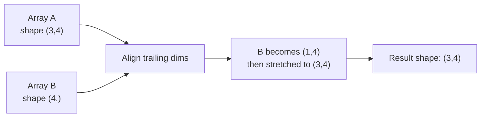

# 🔢 NumPy Fundamentals

> [!abstract] TL;DR
> NumPy's `ndarray` is a fixed-type, contiguous-memory array that enables vectorized numerical computation in Python by delegating all heavy lifting to optimized C code — it is the foundational data structure for the entire scientific Python ecosystem.

---

## Intuition — Analogy First

Think of a standard Python list as a filing cabinet where each drawer holds an arbitrary object — a number, a string, a cat picture, anything. The cabinet is flexible but slow: to sum all the numbers you must open every drawer, check what's inside, and add them one at a time.

NumPy's `ndarray` is a **spreadsheet on steroids** — every cell holds the *same type* of value, stored back-to-back in a single block of RAM. Because the layout is predictable, the CPU can load 8 values into a SIMD register and add them *simultaneously*. Operations apply to all cells at once, not one at a time.

PyTorch tensors extend this analogy: same philosophy, same API conventions, but the "spreadsheet" lives on GPU memory instead of CPU RAM.

---

## How It Works — Mechanics

### Broadcasting Rules (Step by Step)

When two arrays have different shapes, NumPy aligns them from the *trailing* dimensions and applies these rules:

1. If the arrays have different numbers of dimensions, prepend `1`s to the smaller shape.
2. Dimensions of size `1` are stretched to match the other array.
3. If sizes differ and neither is `1`, raise a `ValueError`.



### Memory Layout: C vs F Order

```
C order (row-major, default):   F order (column-major):
  [1, 2, 3,                       [1, 4,
   4, 5, 6]                        2, 5,
                                    3, 6]
  Memory: 1 2 3 4 5 6             Memory: 1 4 2 5 3 6
```

- **C order** is faster for row-wise operations (iterating across columns in a row).
- **F order** is faster for column-wise operations (common in Fortran-style linear algebra).
- Most ML libraries default to C order; PyTorch uses C-contiguous tensors internally.

### ndarray Key Attributes

| Attribute | Description | Example |
|---|---|---|
| `.shape` | Tuple of dimension sizes | `(1000, 28, 28)` |
| `.dtype` | Element data type | `float32`, `int64` |
| `.ndim` | Number of dimensions | `3` |
| `.size` | Total number of elements | `784000` |
| `.itemsize` | Bytes per element | `4` (for float32) |
| `.strides` | Bytes to step in each dim | `(3136, 112, 4)` |
| `.flags` | C/F contiguous, writeable | `C_CONTIGUOUS: True` |

---

## The Math

### Broadcasting Formal Rule

For shapes $\mathbf{s}_A = (d_{A,1}, \ldots, d_{A,n})$ and $\mathbf{s}_B = (d_{B,1}, \ldots, d_{B,m})$, pad the shorter shape with leading 1s. The output shape dimension $k$ is:

$$d_k = \max(d_{A,k}, d_{B,k}) \quad \text{if } \min(d_{A,k}, d_{B,k}) \in \{1, d_{A,k}\}$$

otherwise incompatible → `ValueError`.

### Einstein Summation (`np.einsum`)

`einsum` notation encodes any tensor contraction compactly. The subscript string maps indices to dimensions:

$$C_{ik} = \sum_j A_{ij} B_{jk} \quad \Leftrightarrow \quad \texttt{np.einsum('ij,jk->ik', A, B)}$$

| Operation | einsum string | Equivalent |
|---|---|---|
| Matrix multiply | `'ij,jk->ik'` | `A @ B` |
| Element-wise multiply + sum | `'ij,ij->'` | `(A*B).sum()` |
| Batch matrix multiply | `'bij,bjk->bik'` | `np.matmul(A, B)` |
| Trace | `'ii->'` | `np.trace(A)` |
| Outer product | `'i,j->ij'` | `np.outer(a, b)` |

---

## Code Demo

### Array Creation

```python
import numpy as np

# From Python data
a = np.array([1, 2, 3], dtype=np.float32)

# Special arrays
zeros  = np.zeros((3, 4))              # shape (3,4), all 0.0
ones   = np.ones((2, 3, 4))           # shape (2,3,4), all 1.0
eye    = np.eye(4)                     # 4x4 identity matrix
diag_m = np.diag([1, 2, 3])           # 3x3 diagonal matrix
rng    = np.linspace(0, 1, 100)       # 100 evenly spaced values

# Random (always set seed for reproducibility)
rng_gen = np.random.default_rng(seed=42)   # new-style API
X = rng_gen.standard_normal((100, 10))     # shape (100, 10)
```

### Shape, Reshape, Transpose

```python
X = np.arange(24, dtype=np.float64)   # 1-D, shape (24,)

X_2d = X.reshape(4, 6)               # shape (4, 6)
X_3d = X.reshape(2, 3, 4)            # shape (2, 3, 4)
X_T  = X_2d.T                        # shape (6, 4), view not copy
X_ax = np.transpose(X_3d, (1, 0, 2)) # permute axes: (3, 2, 4)

# Flatten back
flat = X_3d.ravel()                   # returns view when possible
flat2= X_3d.flatten()                 # always returns copy
```

### Broadcasting in Practice

```python
# Add a bias vector to a batch of activations
activations = np.random.randn(32, 128)   # batch=32, features=128
bias        = np.random.randn(128)       # shape (128,)

# Broadcasting: (32,128) + (128,) → bias expanded to (32,128)
result = activations + bias              # no loop, no memory copy

# Subtract per-column mean (common normalization)
col_mean = activations.mean(axis=0)      # shape (128,)
centered = activations - col_mean        # shape (32,128)
```

### Indexing and Fancy Indexing

```python
X = np.random.randn(100, 5)

# Basic slicing (returns VIEW)
row0     = X[0]          # first row
col2     = X[:, 2]       # third column, all rows
submat   = X[10:20, 1:4] # rows 10-19, cols 1-3

# Boolean indexing (returns COPY)
mask     = X[:, 0] > 0           # (100,) bool array
positive = X[mask]                # rows where col0 > 0

# Fancy indexing (returns COPY)
idx      = np.array([0, 5, 99])
selected = X[idx]                 # rows 0, 5, 99
```

### Universal Functions (ufuncs) and einsum

```python
A = np.random.randn(50, 30)
B = np.random.randn(30, 20)

# Matrix multiply — three equivalent ways
C1 = A @ B                        # preferred operator
C2 = np.dot(A, B)                 # legacy
C3 = np.einsum('ij,jk->ik', A, B) # explicit

# Element-wise ufuncs
np.sqrt(A**2)        # element-wise square root
np.exp(A)            # element-wise exp
np.log1p(np.abs(A))  # log(1+|x|), numerically stable

# Aggregation along axes
A.sum(axis=0)        # sum across rows → shape (30,)
A.max(axis=1)        # max across columns → shape (50,)
A.argmax(axis=1)     # index of max per row
```

---

## Real-World Example

**PyTorch tensors are essentially GPU-accelerated NumPy arrays.** The design is intentional — PyTorch's `torch.Tensor` API mirrors NumPy's `ndarray` API almost 1:1: `reshape`, `transpose`, `dtype`, `shape`, slicing syntax, and broadcasting rules are all the same.

The key difference: `torch.Tensor` lives on a device (CPU or CUDA GPU), tracks gradient computation for autograd, and supports in-place ops that feed the autograd graph. When you call `tensor.numpy()`, PyTorch literally returns a NumPy array that shares the same memory buffer (no copy) — demonstrating that the two are different views of the same contiguous memory abstraction.

Understanding NumPy deeply means PyTorch feels immediately familiar, and debugging shape errors in neural networks becomes straightforward.

---

## Trade-offs

| Operation | NumPy `ndarray` | Python list | PyTorch Tensor |
|---|---|---|---|
| Memory efficiency | High (contiguous, typed) | Low (pointer array) | High (+ CUDA) |
| Vectorized math | Excellent (C SIMD) | None (loop required) | Excellent (CUDA) |
| Flexibility of element types | No (homogeneous) | Yes | No (homogeneous) |
| GPU support | No | No | Yes |
| Autograd | No | No | Yes |
| Serialization | `npy`/`npz` | pickle | `torch.save` |

---

## When to Use vs Avoid

**Use NumPy when:**
- You need fast numerical computation on CPU
- Working with tabular data, linear algebra, signal processing
- Preprocessing data before feeding to a framework
- You want a stable, dependency-light array library

**Use PyTorch/TensorFlow instead when:**
- You need GPU acceleration
- You are building a neural network with automatic differentiation
- You need distributed training

**Avoid NumPy when:**
- Data is heterogeneous (strings + numbers) — use Pandas
- You need GPU compute — use PyTorch/CuPy
- Datasets don't fit in RAM — use Dask or streaming

---

## Common Pitfalls

1. **View vs Copy confusion.** Slicing returns a view — mutating it modifies the original. Use `.copy()` explicitly when you need independence.

   ```python
   x = np.array([1, 2, 3])
   y = x[1:]     # view
   y[0] = 99     # also changes x[1]!
   z = x[1:].copy()  # safe
   ```

2. **dtype surprise.** `np.array([1, 2, 3])` creates `int64`; most ML frameworks want `float32`. Always set dtype explicitly for model inputs.

3. **Shape `(n,)` vs `(n,1)` vs `(1,n)`.** These broadcast differently. A common source of silent bugs:

   ```python
   a = np.ones(3)       # shape (3,)
   b = np.ones((3, 1))  # shape (3,1)
   a + b                # → shape (3,3), probably NOT what you want
   ```

4. **Random state not seeded.** `np.random.seed()` is global state — prefer `np.random.default_rng(42)` per generator for reproducible, isolated experiments.

5. **Using Python `sum()` on a NumPy array** instead of `arr.sum()` — the Python built-in iterates element-by-element; the NumPy method uses a C reduction.

---

## Related Concepts

- [[_MOC_Foundations|↑ Section MOC]]

- [[Python_for_ML]] — Python performance, vectorization philosophy
- [[Linear_Algebra]] — the math that NumPy operations implement
- [[PyTorch_Fundamentals]] — NumPy's GPU-aware sibling with autograd
- [[Broadcasting_Rules]] — deep dive into shape compatibility

---

## Review Questions

1. **Scenario:** You have a weight matrix `W` of shape `(512, 256)` and a batch of inputs `X` of shape `(32, 512)`. You want to compute the linear transformation `Z = X @ W`. What is the output shape? Now suppose you need to add a bias `b` of shape `(256,)` — does broadcasting handle this automatically? Explain why.

2. **Scenario:** You notice that modifying a "copy" of a NumPy array also changes the original array. How would you diagnose whether you have a view or a copy, and what is the fix?

3. **Scenario:** You have a 3-D array of shape `(batch, seq_len, features)` = `(64, 128, 512)`. You need to compute the mean and standard deviation across the `features` dimension to normalize each token. Write the NumPy code, carefully handling shapes so the result can be broadcast back to subtract and divide the original array.

---

## Sources

- NumPy documentation — [Array creation](https://numpy.org/doc/stable/user/basics.creation.html)
- NumPy documentation — [Broadcasting](https://numpy.org/doc/stable/user/basics.broadcasting.html)
- Harris et al. — *Array programming with NumPy*, Nature 585 (2020) 357–362
- VanderPlas, J. — *Python Data Science Handbook*, Chapter 2 (O'Reilly, 2023)
- PyTorch documentation — [NumPy Bridge](https://pytorch.org/tutorials/beginner/blitz/tensor_tutorial.html#bridge-to-np-label)

---

#numpy #arrays #vectorization #broadcasting #linear-algebra #ml-foundations #beginner
