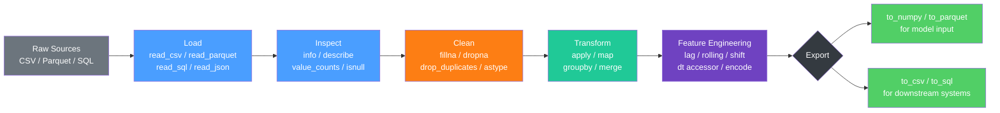

# 🐼 Pandas for ML

> [!abstract] TL;DR
> Pandas is Python's primary library for labeled tabular data — it gives every row and column a name, turning raw files into inspectable, cleanable, and transformable DataFrames that serve as the standard on-ramp for any ML pipeline.

---

## Intuition — Analogy First

**Analogy:** Imagine a giant Excel spreadsheet that you can control entirely with code — one that never crashes on 10 million rows, lets you write formulas across whole columns in a single line, and snaps directly onto the input slot of any ML model.

That is pandas. It sits between raw data (CSV files, SQL queries, JSON APIs) and the models that consume it (scikit-learn, PyTorch, XGBoost). Its job is to give every piece of data a *label* — a row index and a column name — so you can say "give me all rows where `churn == True` and `tenure < 6`" instead of "give me rows 4, 7, and 23". Labels make data human-readable and error-resistant in a way that bare NumPy arrays are not.

---

## How It Works — Mechanics

### Core Data Structures

**Series** — a 1-D labeled array. Every element has an index label.

```
index   value
  0     28.5    ← float64 Series called "age"
  1     34.1
  2     22.0
```

**DataFrame** — a 2-D labeled table: rows have an index, columns have names. Internally, each column is a `Series` sharing the same index.

```
   age   salary   churn
0  28.5  60000    False
1  34.1  85000    True
2  22.0  45000    False
```

The **index** is the row label (defaults to 0, 1, 2… but can be a date, a user ID, or any hashable value). Columns are just the dictionary keys of the DataFrame.

---

### Loading Data

| Function | Source | Key Options |
|---|---|---|
| `pd.read_csv(path)` | CSV / TSV | `sep`, `header`, `usecols`, `dtype`, `parse_dates` |
| `pd.read_parquet(path)` | Parquet (columnar) | `columns`, `engine='pyarrow'` |
| `pd.read_json(path)` | JSON / JSON Lines | `lines=True` for JSONL |
| `pd.read_sql(query, con)` | SQL DB (SQLAlchemy conn) | `chunksize` for large tables |
| `pd.read_excel(path)` | Excel xlsx | `sheet_name`, `skiprows` |

```python
import pandas as pd

# Efficient: only load the columns you need, parse dates eagerly
df = pd.read_csv(
    "transactions.csv",
    usecols=["user_id", "amount", "timestamp", "label"],
    dtype={"user_id": "int32", "amount": "float32", "label": "int8"},
    parse_dates=["timestamp"],
)
```

---

### Inspection

```python
df.shape          # (n_rows, n_cols)
df.dtypes         # column name → dtype
df.head(5)        # first 5 rows
df.tail(5)        # last 5 rows
df.info()         # column names, non-null counts, dtypes, memory usage
df.describe()     # count/mean/std/min/percentiles for numeric cols

# Frequency analysis
df["label"].value_counts()            # class distribution
df["category"].value_counts(normalize=True)  # as proportions
df["user_id"].nunique()               # cardinality
df.isnull().sum()                     # missing count per column
df.isnull().mean() * 100              # missing % per column
```

---

### Indexing and Selection

Pandas has two primary accessors for row+column selection:

| Accessor | Meaning | Example |
|---|---|---|
| `loc[row_label, col_label]` | **Label-based** — uses index values and column names | `df.loc[0:10, "age"]` |
| `iloc[row_pos, col_pos]` | **Position-based** — uses integer offsets, 0-indexed | `df.iloc[0:10, 2]` |

```python
# loc — labels (index is 0,1,2... here so looks like iloc, but isn't)
df.loc[df["age"] > 30, ["salary", "churn"]]

# iloc — pure position
df.iloc[100:200, :]        # rows 100-199, all columns

# Boolean indexing — the workhorse
mask = (df["amount"] > 1000) & (df["label"] == 1)
high_value_churners = df[mask]

# query() — readable string syntax for complex filters
df.query("amount > 1000 and label == 1 and tenure < 6")

# Single column as Series
df["age"]            # preferred: explicit, tab-completable
df.age               # works but fails if column name has spaces
```

> [!warning] `loc` vs `iloc` confusion
> `df.loc[0:10]` returns **11** rows (0 through 10, label-inclusive). `df.iloc[0:10]` returns **10** rows (0 through 9, position-exclusive). They differ even when the index is integers.

---

### Data Cleaning

**Missing values:**

```python
df.isnull().sum()                    # count NaNs per column

# Drop rows where any specified column is NaN
df.dropna(subset=["salary", "label"], inplace=True)

# Fill strategies
df["age"].fillna(df["age"].median(), inplace=True)       # median imputation
df["category"].fillna("Unknown", inplace=True)            # constant
df["sales"].fillna(method="ffill", inplace=True)          # forward-fill (time series)
```

**Duplicates:**

```python
df.duplicated().sum()                        # count exact duplicates
df.drop_duplicates(inplace=True)             # remove exact duplicates
df.drop_duplicates(subset=["user_id", "date"])  # key-based dedup
```

**Type casting:**

```python
df["label"] = df["label"].astype("int8")
df["timestamp"] = pd.to_datetime(df["timestamp"])
df["tier"] = df["tier"].astype("category")      # memory-efficient for low-cardinality
df["amount"] = pd.to_numeric(df["amount"], errors="coerce")  # coerce bad values → NaN
```

---

### Data Transformation

**`apply()`** — calls a function row-by-row or column-by-column (slow; use vectorization first):

```python
# Column-wise (axis=0 default) — apply to each column
df.apply(lambda col: col.max() - col.min())

# Row-wise (axis=1) — apply to each row; often slow
df.apply(lambda row: row["salary"] / row["age"], axis=1)
```

**`map()`** — element-wise on a Series; great for lookup/encoding:

```python
tier_map = {"bronze": 0, "silver": 1, "gold": 2, "platinum": 3}
df["tier_encoded"] = df["tier"].map(tier_map)
```

**Vectorized string operations via `.str` accessor:**

```python
df["email"].str.lower()
df["name"].str.strip().str.split(" ").str[0]   # first name
df["code"].str.startswith("US")
df["description"].str.contains("urgent", case=False, na=False)
df["phone"].str.extract(r"(\d{3})-(\d{3})-(\d{4})")  # regex groups → columns
```

**Vectorized datetime operations via `.dt` accessor:**

```python
df["hour"]        = df["timestamp"].dt.hour
df["day_of_week"] = df["timestamp"].dt.dayofweek   # 0=Monday
df["month"]       = df["timestamp"].dt.month
df["is_weekend"]  = df["timestamp"].dt.dayofweek >= 5
df["quarter"]     = df["timestamp"].dt.quarter
```

---

### Groupby and Aggregation

`groupby()` splits the DataFrame into groups, applies a function, then combines results (split-apply-combine pattern).

```python
# Single aggregation
df.groupby("tier")["amount"].mean()

# Multiple aggregations on multiple columns
summary = df.groupby("tier").agg(
    total_revenue=("amount", "sum"),
    avg_age=("age", "mean"),
    churn_rate=("label", "mean"),
    n_users=("user_id", "nunique"),
)

# Custom aggregation function
df.groupby("region")["amount"].agg(lambda x: x.quantile(0.9))

# transform() — returns same shape as input (useful for feature engineering)
# e.g., add group mean as a new feature without collapsing rows
df["tier_avg_amount"] = df.groupby("tier")["amount"].transform("mean")
df["amount_vs_tier_avg"] = df["amount"] / df["tier_avg_amount"]

# pivot_table — cross-tabulation with aggregation
pd.pivot_table(df, values="amount", index="tier", columns="region", aggfunc="sum", fill_value=0)
```

---

### Merging and Joining

```python
# merge() — SQL-style join on key columns
merged = pd.merge(orders, users, on="user_id", how="left")
# how: "inner" (default), "left", "right", "outer"

# merge on different column names
pd.merge(orders, users, left_on="buyer_id", right_on="user_id", how="inner")

# concat() — stack DataFrames vertically (axis=0) or horizontally (axis=1)
combined = pd.concat([train_df, val_df], axis=0, ignore_index=True)
features  = pd.concat([df_numeric, df_encoded], axis=1)

# join() — index-on-index join (convenient shorthand)
df_a.join(df_b, how="left")
```

| Join Type | Rows Kept |
|---|---|
| `inner` | Only rows with matching keys in both tables |
| `left` | All rows from left, NaN where right has no match |
| `right` | All rows from right, NaN where left has no match |
| `outer` | All rows from both, NaN where no match exists |

---

### Feature Engineering in Pandas

Pandas is especially powerful for **time-series feature engineering**:

```python
# Sort before lag/rolling operations on time series
df = df.sort_values("timestamp")

# Lag features — value from N steps ago
df["amount_lag1"] = df.groupby("user_id")["amount"].shift(1)
df["amount_lag7"] = df.groupby("user_id")["amount"].shift(7)

# Rolling window aggregations (within each user group)
df["amount_roll7_mean"] = (
    df.groupby("user_id")["amount"]
    .transform(lambda x: x.shift(1).rolling(7).mean())  # shift to avoid leakage
)
df["amount_roll7_std"] = (
    df.groupby("user_id")["amount"]
    .transform(lambda x: x.shift(1).rolling(7).std())
)

# Expanding window (cumulative)
df["cumulative_spend"] = df.groupby("user_id")["amount"].cumsum()

# Days since last event
df["days_since_last_purchase"] = (
    df.groupby("user_id")["timestamp"]
    .transform(lambda x: (x - x.shift(1)).dt.days)
)
```

---

### Memory Optimization

Pandas DataFrames can be surprisingly large. Key techniques to reduce RAM footprint:

```python
# 1. Downcast numeric types
df["age"]    = pd.to_numeric(df["age"],    downcast="integer")  # int64 → int8/16/32
df["amount"] = pd.to_numeric(df["amount"], downcast="float")    # float64 → float32

# 2. Use category dtype for low-cardinality string columns
for col in ["tier", "region", "product_type"]:
    df[col] = df[col].astype("category")

# 3. Only load needed columns
df = pd.read_csv("huge.csv", usecols=["user_id", "amount", "label"])

# 4. Chunked reading for files that don't fit in RAM
chunks = []
for chunk in pd.read_csv("huge.csv", chunksize=100_000):
    # process each chunk
    chunk = chunk[chunk["amount"] > 0]
    chunks.append(chunk)
df = pd.concat(chunks, ignore_index=True)

# Check memory usage
df.memory_usage(deep=True).sum() / 1024**2   # MB
df.info(memory_usage="deep")
```

---

### Pandas for ML Data Prep

End-to-end pipeline from raw DataFrame to model-ready arrays:

```python
from sklearn.model_selection import train_test_split
from sklearn.preprocessing import StandardScaler

# 1. Separate features and target
X = df.drop(columns=["label", "user_id", "timestamp"])
y = df["label"]

# 2. Train/test split (before any fitting — critical)
X_train, X_test, y_train, y_test = train_test_split(
    X, y, test_size=0.2, random_state=42, stratify=y
)

# 3. Encode categoricals
X_train = pd.get_dummies(X_train, columns=["tier", "region"], drop_first=True)
X_test  = pd.get_dummies(X_test,  columns=["tier", "region"], drop_first=True)
X_test  = X_test.reindex(columns=X_train.columns, fill_value=0)  # align columns

# 4. Scale (fit on train only — prevents data leakage)
scaler = StandardScaler()
X_train_scaled = scaler.fit_transform(X_train)   # returns NumPy array
X_test_scaled  = scaler.transform(X_test)
```

---

### Pandas vs NumPy: When to Use Which

| Aspect | Pandas | NumPy |
|---|---|---|
| Data structure | Labeled (index + column names) | Positional (integer indices only) |
| Data types per column | Heterogeneous (different dtypes per column) | Homogeneous (one dtype for whole array) |
| Primary use | Tabular / relational data manipulation | Numerical computation, linear algebra |
| Overhead | Higher (metadata, indexing bookkeeping) | Lower (raw C arrays) |
| Interop | `.values` or `.to_numpy()` → ndarray | `pd.DataFrame(arr)` → DataFrame |

**Rule of thumb:** Use pandas to load, inspect, clean, and engineer features. Convert to NumPy at the model boundary with `.to_numpy()` or `.values`.

---

## Pipeline Diagram



---

## Code Demo

End-to-end: load raw data, clean, engineer features, export for a classifier.

```python
import pandas as pd
import numpy as np

# ── 1. Load ──────────────────────────────────────────────────────────────
df = pd.read_csv("customer_transactions.csv",
                 parse_dates=["event_time"],
                 dtype={"user_id": "int32", "amount": "float32"})

print(f"Shape: {df.shape}")
print(df.isnull().mean().sort_values(ascending=False).head(10))

# ── 2. Clean ─────────────────────────────────────────────────────────────
# Drop rows with no target label
df.dropna(subset=["churn_label"], inplace=True)

# Median-impute amount (avoids outlier influence)
df["amount"] = df["amount"].fillna(df["amount"].median())

# Category dtype for low-cardinality strings
df["product_tier"] = df["product_tier"].astype("category")

# Remove exact duplicates on business key
df.drop_duplicates(subset=["user_id", "event_time"], inplace=True)

# ── 3. Sort for time-series correctness ──────────────────────────────────
df.sort_values(["user_id", "event_time"], inplace=True)
df.reset_index(drop=True, inplace=True)

# ── 4. Feature engineering ───────────────────────────────────────────────
# Date/time features
df["hour"]        = df["event_time"].dt.hour
df["day_of_week"] = df["event_time"].dt.dayofweek
df["is_weekend"]  = (df["day_of_week"] >= 5).astype("int8")
df["month"]       = df["event_time"].dt.month

# Lag and rolling features per user (shift avoids target leakage)
grp = df.groupby("user_id")["amount"]
df["amount_lag1"]        = grp.shift(1)
df["amount_lag7"]        = grp.shift(7)
df["amount_roll7_mean"]  = grp.transform(lambda x: x.shift(1).rolling(7, min_periods=1).mean())
df["amount_roll7_max"]   = grp.transform(lambda x: x.shift(1).rolling(7, min_periods=1).max())
df["cumulative_spend"]   = grp.cumsum() - df["amount"]   # exclude current row

# Per-tier z-score: how unusual is this transaction within its tier?
tier_stats = df.groupby("product_tier")["amount"].transform
df["amount_tier_zscore"] = (
    (df["amount"] - tier_stats("mean")) / (tier_stats("std") + 1e-8)
)

# Frequency encoding for product tier
tier_freq = df["product_tier"].value_counts(normalize=True)
df["tier_freq"] = df["product_tier"].map(tier_freq)

# ── 5. Aggregate to user-level (one row per user for classification) ──────
feature_cols = [
    "amount_lag1", "amount_lag7", "amount_roll7_mean", "amount_roll7_max",
    "cumulative_spend", "amount_tier_zscore", "tier_freq",
    "hour", "day_of_week", "is_weekend", "month",
]
user_df = df.groupby("user_id")[feature_cols].last()   # last transaction features
user_df["churn_label"] = df.groupby("user_id")["churn_label"].last()

# ── 6. Encode and export ──────────────────────────────────────────────────
X = user_df.drop(columns=["churn_label"])
y = user_df["churn_label"].astype("int8")

# Fill any remaining NaNs from lag windows
X.fillna(X.median(), inplace=True)

# Convert to NumPy for sklearn/XGBoost
X_np = X.to_numpy(dtype=np.float32)
y_np = y.to_numpy()

print(f"Feature matrix: {X_np.shape}, Target: {y_np.shape}")
print(f"Churn rate: {y_np.mean():.3f}")
```

---

## Real-World Example

> **Example: Kaggle tabular competitions and production fraud detection at Stripe.** In most top-placed Kaggle solutions for tabular data, the winning edge comes from pandas-based feature engineering: rolling statistics per entity (card, merchant, user), lag features, time-since-last-event, cross-feature ratios, and target-encoded categoricals — all constructed with `groupby().transform()`, `shift()`, and `.rolling()`. Stripe's fraud models follow the same pattern in production: raw event streams land as Parquet, pandas (or Polars at scale) engineers hundreds of features per transaction per user, and those features feed gradient-boosted trees. The pandas code is the intellectual heart of the system; the model is almost secondary.

---

## Trade-offs

| Aspect | Pandas | Polars | Apache Spark |
|--------|--------|--------|--------------|
| Data size | < ~5 GB in RAM comfortably | < ~50 GB on single node | TB-scale distributed |
| Speed (single node) | Moderate (eager, Python GIL) | Very fast (Rust, parallel, lazy) | Slower (JVM overhead) |
| API familiarity | Industry standard, vast ecosystem | Growing, similar API | SQL-like or verbose Python |
| Lazy execution | No (eager by default) | Yes (`LazyFrame`) | Yes (DAG-based) |
| Memory efficiency | High if dtypes tuned | Very high (Arrow columnar) | Moderate (JVM GC overhead) |
| Learning curve | Low | Low-medium | High |
| Best for | Prototyping, < 5 GB tabular | Production ETL, medium data | Big data clusters |

**Rule of thumb:** Start with pandas. Migrate to Polars when single-node performance becomes a bottleneck. Migrate to Spark when data exceeds a single machine.

---

## When to Use vs Avoid

**Use pandas when:**
- Data fits comfortably in RAM (up to a few GB)
- You need heterogeneous columns (strings, dates, floats, categoricals in one table)
- You are doing exploratory data analysis (EDA) or building an ML pipeline prototype
- You need rich I/O support (CSV, Parquet, JSON, Excel, SQL)
- Your team already knows pandas — cognitive overhead matters

**Avoid pandas when:**
- Data exceeds available RAM — use Polars with lazy evaluation or Spark
- You need pure numeric computation — use NumPy directly (less overhead)
- You need GPU-accelerated data processing — use cuDF (RAPIDS)
- You need streaming / incremental processing — use Kafka + Flink or Spark Structured Streaming

---

## Common Pitfalls

- **Chained assignment and SettingWithCopyWarning** — `df[mask]["col"] = value` modifies a temporary copy, not the original. Always use `df.loc[mask, "col"] = value`. Pandas 2.0+ raises `ChainedAssignmentError` by default to catch this early.

- **Fitting transformers on the full dataset before splitting** — computing `fillna(df["col"].mean())` before the train/test split leaks test statistics into training. Always split first; compute fill values only on `X_train`.

- **Slow `apply()` on large DataFrames** — `df.apply(fn, axis=1)` is a Python loop in disguise. Prefer vectorized operations (`+`, `/`, `np.where`, `.str`, `.dt`) which run in C. When you must use `apply`, consider `swifter` or `pandarallel` for parallelism.

- **Object dtype masquerading as numeric** — after `read_csv`, a column with mixed types (e.g., `"$1,200"`) becomes `object`. Always check `df.dtypes` and cast explicitly with `pd.to_numeric(errors="coerce")`.

- **Index misalignment after filtering** — after `df = df[mask]`, the index still has gaps (e.g., 0, 3, 7…). Rolling windows and lag operations depend on a contiguous index. Call `df.reset_index(drop=True)` after subsetting.

- **Missing `.copy()` after slicing** — `sub = df[cols]` is a view. Mutating `sub` may or may not change `df` depending on pandas internals. Use `sub = df[cols].copy()` to get an independent DataFrame.

- **Memory explosion with `pd.get_dummies`** — one-hot encoding a column with 10,000 unique categories creates 10,000 new columns. Use target encoding, frequency encoding, or ordinal encoding for high-cardinality categoricals.

---

## Related Concepts

- [[_MOC_Foundations|Foundations MOC]] — section entry point

- [[NumPy_Fundamentals]] — pandas Series/DataFrame are built on top of NumPy arrays; `.to_numpy()` converts back; NumPy handles homogeneous numeric ops that pandas delegates to it internally.

- [[Python_for_ML]] — Python performance philosophy: why pandas pushes work to C and why `apply()` in a loop defeats that purpose.

- [[Feature_Engineering]] — pandas is the primary *tool* for implementing feature engineering strategies; rolling windows, lag features, and encodings described there are all implemented with pandas APIs.

- [[Data_Quality_and_Validation]] — pandas is used for initial data profiling (`describe`, `isnull`, `value_counts`) before more formal validation tools like Great Expectations are applied.

- [[ETL_ELT_for_ML]] — pandas fits the E (extract) and T (transform) steps of lightweight ETL pipelines; at scale these steps migrate to Spark or dbt.

- [[Linear_Regression]] — pandas prepares the feature matrix and target vector that linear models consume; understanding how pandas constructs `X` and `y` arrays is essential for correct model training.

- [[Apache_Spark_for_ML]] — the natural migration target when data grows beyond what pandas can handle on a single node; Spark's DataFrame API was consciously modeled on pandas.

---

## Review Questions

1. **Conceptual:** Explain the difference between `loc` and `iloc` when the DataFrame index is `[100, 200, 300]`. What does `df.loc[100:200]` return vs `df.iloc[0:2]`? What trap does this create if you sort a DataFrame and then use `iloc` for what you think is a positional slice?

2. **Scenario:** You are building a churn model. Your dataset has one row per user-transaction. You want to add a "rolling 30-day spend per user" feature. Walk through the correct pandas steps — including how you prevent data leakage from including the current transaction in the window.

3. **Trade-off:** Your manager says the data pipeline is "too slow" and suggests switching from pandas to Apache Spark. The raw data is 3 GB and the pipeline runs on a single 32-core machine. What would you investigate first, and under what conditions would Spark actually be the right choice versus optimizing the existing pandas code (dtype tuning, vectorization, Polars)?

---

## Sources

- [Pandas Official Documentation](https://pandas.pydata.org/docs/)
- [Pandas User Guide — Indexing and Selecting Data](https://pandas.pydata.org/docs/user_guide/indexing.html)
- [Pandas User Guide — GroupBy](https://pandas.pydata.org/docs/user_guide/groupby.html)
- [Pandas User Guide — Time Series / Date Functionality](https://pandas.pydata.org/docs/user_guide/timeseries.html)
- [Pandas 2.0 What's New — Copy-on-Write and ChainedAssignment](https://pandas.pydata.org/docs/whatsnew/v2.0.0.html)
- [VanderPlas, J. — Python Data Science Handbook, Chapter 3 (O'Reilly)](https://jakevdp.github.io/PythonDataScienceHandbook/)
- [Polars vs Pandas benchmark (2024)](https://pola.rs/posts/benchmarks/)

---

#pandas #data-manipulation #data-cleaning #feature-engineering #tabular-data #ml-foundations #intermediate
