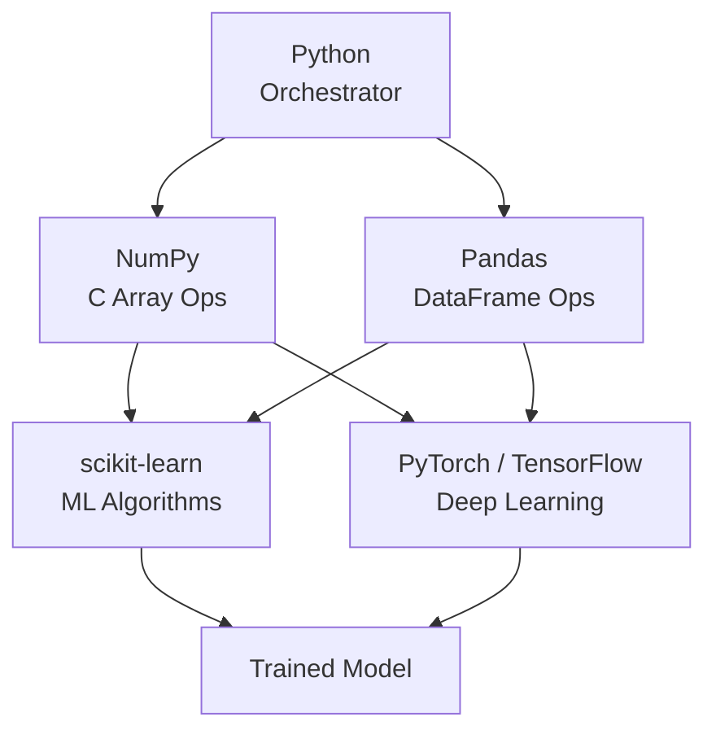

# 🐍 Python for ML

> [!abstract] TL;DR
> Python is the orchestrator of the ML stack — its power comes not from loops but from delegating computation to optimized C/CUDA libraries via vectorization, broadcasting, and efficient data structures.

---

## Intuition — Analogy First

Imagine a tailor hand-stitching 10,000 shirts one at a time versus a factory assembly line that sews all 10,000 simultaneously with specialized machinery. The tailor is a Python `for` loop — flexible, readable, but painfully slow. The assembly line is NumPy vectorization — the same operation applied to every element at once by optimized C code underneath.

Python itself is slow for numerical work for two reasons:
1. **Interpreted overhead** — every line is parsed and dispatched at runtime.
2. **The GIL (Global Interpreter Lock)** — only one thread can execute Python bytecode at a time, killing parallelism for CPU-bound work.

The trick: push the hot loops into C/CUDA libraries (NumPy, PyTorch) and use Python only as the glue.

---

## How It Works — Mechanics

### The Python ML Stack



### Key Performance Concepts

| Concept | What it means | Why it matters |
|---|---|---|
| Vectorization | Replace `for` loops with array ops | 10–100× speedup |
| Broadcasting | Implicit shape expansion in NumPy | Avoids redundant memory allocation |
| Views vs Copies | Slices return views; ops return copies | Controls memory usage |
| Generator expressions | Lazy evaluation of sequences | Handles datasets larger than RAM |
| Memory layout (C/F order) | Row-major vs column-major storage | Cache efficiency for matrix ops |

### Virtual Environments

```bash
# Create isolated environment for a project
python -m venv .venv
source .venv/bin/activate      # Linux/Mac
.venv\Scripts\activate         # Windows

# Pin exact versions for reproducibility
pip freeze > requirements.txt
pip install -r requirements.txt
```

### Type Hints in ML Code

```python
import numpy as np
from numpy.typing import NDArray

def normalize(X: NDArray[np.float64]) -> NDArray[np.float64]:
    """Zero-mean, unit-variance normalization."""
    return (X - X.mean(axis=0)) / X.std(axis=0)
```

Type hints do not speed up Python at runtime, but they make ML pipelines dramatically easier to debug and review — especially when tensors and arrays look identical without annotations.

---

## The Math

Vectorized operations correspond directly to linear algebra. A Python loop over $n$ elements runs $n$ Python bytecode dispatches; NumPy runs one C function call that internally iterates in optimized SIMD instructions.

For a vector operation like dot product:

$$\mathbf{a} \cdot \mathbf{b} = \sum_{i=1}^{n} a_i b_i$$

**Loop version:** $O(n)$ Python operations (slow).  
**NumPy version:** $1$ Python call + $O(n)$ C operations (fast).

The overhead ratio is roughly **100–1000 ns per Python op** vs **<1 ns per C SIMD op**, so for $n = 10^6$ the difference is ~1 second vs ~1 millisecond.

---

## Code Demo

### Vectorized vs Loop Benchmark

```python
import numpy as np
import time

n = 1_000_000
a = np.random.rand(n)
b = np.random.rand(n)

# --- Slow: Python loop ---
start = time.perf_counter()
result_loop = sum(a[i] * b[i] for i in range(n))
loop_time = time.perf_counter() - start

# --- Fast: NumPy vectorized ---
start = time.perf_counter()
result_np = np.dot(a, b)
np_time = time.perf_counter() - start

print(f"Loop:  {loop_time:.4f}s")   # ~0.2s
print(f"NumPy: {np_time:.6f}s")     # ~0.001s
print(f"Speedup: {loop_time/np_time:.0f}x")
```

### Broadcasting Example

```python
import numpy as np

# Normalize a (1000, 10) dataset without loops
X = np.random.rand(1000, 10)        # 1000 samples, 10 features

mean = X.mean(axis=0)               # shape (10,)
std  = X.std(axis=0)                # shape (10,)

# Broadcasting: (1000,10) - (10,) → (1000,10) — no loop needed
X_norm = (X - mean) / std

print(X_norm.shape)                  # (1000, 10)
print(X_norm.mean(axis=0).round(6)) # all ~0.0
print(X_norm.std(axis=0).round(6))  # all ~1.0
```

### Pandas GroupBy for Feature Engineering

```python
import pandas as pd
import numpy as np

# Simulate transaction data
np.random.seed(42)
df = pd.DataFrame({
    'user_id': np.random.choice(['A', 'B', 'C'], 1000),
    'amount':  np.random.exponential(50, 1000),
    'is_fraud': np.random.choice([0, 1], 1000, p=[0.98, 0.02])
})

# Aggregate features per user (vectorized groupby)
user_features = df.groupby('user_id').agg(
    total_spent   = ('amount', 'sum'),
    avg_amount    = ('amount', 'mean'),
    n_transactions= ('amount', 'count'),
    fraud_rate    = ('is_fraud', 'mean')
).reset_index()

print(user_features)
```

### Generator for Large Datasets

```python
from pathlib import Path

def read_csv_chunks(filepath: str, chunksize: int = 10_000):
    """Yields DataFrame chunks — never loads full file into RAM."""
    for chunk in pd.read_csv(filepath, chunksize=chunksize):
        yield chunk

# Use without loading 10GB CSV into memory
for chunk in read_csv_chunks('huge_dataset.csv'):
    process(chunk)   # your processing function
```

### Memory Profiling

```python
# pip install memory-profiler
from memory_profiler import profile

@profile
def bad_approach(n: int) -> list:
    return [i ** 2 for i in range(n)]   # full list in memory

@profile
def good_approach(n: int):
    return (i ** 2 for i in range(n))   # generator, O(1) memory
```

---

## Real-World Example

**PyTorch and TensorFlow** are the canonical examples of this architecture. Both frameworks are written almost entirely in C++ and CUDA for performance-critical paths. Python provides the high-level API, autograd graph construction, and training loop orchestration — but the actual tensor multiplications, convolutions, and gradient computations happen in native code.

When you write `loss.backward()` in PyTorch, Python constructs an autograd graph, then hands it off to a C++ engine that traverses and executes it. The Python overhead is a handful of microseconds; the C++ execution of a full backward pass is where the milliseconds go.

This means even "Python ML code" is really C++/CUDA code controlled by a Python interface — making Python's GIL and interpreter overhead largely irrelevant for the hot paths.

---

## Trade-offs

| Approach | Speed | Memory | Readability | Use When |
|---|---|---|---|---|
| Python `for` loop | Slowest | High (refs) | High | Prototyping tiny data |
| List comprehension | Slightly faster | High (full list) | High | Small collections |
| Generator | Same as loop | O(1) | Good | Streaming large data |
| NumPy vectorized | Very fast | Moderate | Good | Numerical array ops |
| Pandas `.apply()` | Moderate | Moderate | High | Per-row logic (fallback) |
| Pandas vectorized | Fast | Moderate | Good | Column-level ops |

---

## When to Use vs Avoid

**Use vectorization when:**
- Operating on arrays/matrices of numerical data
- Inside training loops or data preprocessing pipelines
- Benchmarking shows a loop is the bottleneck

**Stick with loops when:**
- Business logic is complex and branchy (hard to vectorize)
- Dataset is tiny (<1000 rows) — overhead doesn't matter
- Readability is the priority in exploratory analysis

**Use generators when:**
- Dataset does not fit in RAM
- Processing a stream of records (logs, API responses)

---

## Common Pitfalls

1. **Calling `.apply()` on Pandas when a vectorized alternative exists.** `df['col'].apply(lambda x: x*2)` is 10–50× slower than `df['col'] * 2`.

2. **Forgetting `np.random.seed()` or `np.random.default_rng(seed)`.** Reproducibility is non-negotiable in ML experiments.

3. **Creating unnecessary copies.** `X[:, 0]` is a view (fast); `X[:, 0].copy()` allocates new memory. Modify views with care — but don't copy unless you need to.

4. **Mixing Python floats and NumPy floats.** `float(np_scalar)` in a hot loop is expensive. Keep operations inside NumPy.

5. **Using `pd.DataFrame.iterrows()` in production code.** It's 100× slower than vectorized operations and a common code review red flag.

6. **Global virtual environment installs.** Dependency conflicts across projects are a constant source of "works on my machine" bugs. Always use per-project venvs.

---

## Related Concepts

- [[_MOC_Foundations|↑ Section MOC]]

- [[NumPy_Fundamentals]] — the array library that makes vectorization possible
- [[Linear_Algebra]] — the math that vectorized operations implement
- [[Pandas_for_ML]] — deeper dive into DataFrame operations
- [[Memory_Management]] — understanding heap vs stack in Python contexts

---

## Review Questions

1. **Scenario:** Your data pipeline processes 10 million rows with a Pandas `.apply()` call that takes 45 seconds. A colleague suggests rewriting it as a vectorized operation. Walk through how you would identify whether the operation is vectorizable, and what NumPy/Pandas primitives you would use.

2. **Scenario:** You are training a PyTorch model on a dataset that is 3× larger than your available RAM. You need to feed data to the model in batches without loading everything at once. Which Python construct would you use, and how does it interact with PyTorch's `DataLoader`?

3. **Scenario:** You inherit an ML codebase where all float arrays are built with Python lists and converted to NumPy inside the training loop: `np.array(python_list)` called 10,000 times per epoch. Explain why this is slow and how you would refactor it.

---

## Sources

- Python documentation — [Generator Expressions](https://docs.python.org/3/reference/expressions.html#generator-expressions)
- NumPy documentation — [Broadcasting](https://numpy.org/doc/stable/user/basics.broadcasting.html)
- McKinney, W. — *Python for Data Analysis* (3rd ed., O'Reilly, 2022)
- VanderPlas, J. — *Python Data Science Handbook* (O'Reilly, 2023)
- Real Python — [Python GIL Explained](https://realpython.com/python-gil/)

---

#python #vectorization #numpy #pandas #performance #ml-foundations #beginner
