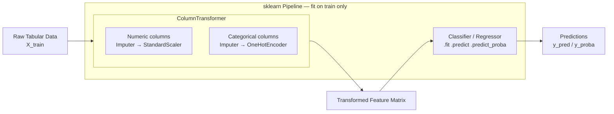

# Scikit-Learn

> [!abstract] TL;DR
> Scikit-learn is Python's standard library for classical ML — built on NumPy/SciPy, it gives every algorithm the same `fit / predict / transform` interface and a `Pipeline` abstraction that chains preprocessing and modeling steps safely, eliminating data leakage during cross-validation.

---

## Intuition — Analogy First

**Analogy:** Think of scikit-learn as a standardized power-tool kit where every tool — drill, sander, saw, router — has identical controls: one switch to power on (`fit`), one trigger to operate (`predict` or `transform`). You don't learn a new interface for each tool; you swap tools in the same workflow without re-reading the manual.

The `Pipeline` is the assembly line that connects the tools in sequence. Raw wood goes in one end; a finished chair comes out the other. Critically, the jig that guides the saw is calibrated only on the production run's own wood — you never use measurements from the quality-control sample to set the jig. That constraint is exactly what Pipeline enforces during cross-validation: the scaler sees only the training fold, never the test fold.

---

## How It Works — Mechanics

### The Estimator API

Every object in scikit-learn is an **Estimator**. The interface has three operations:

| Method | Who implements it | What it does |
|--------|-------------------|--------------|
| `fit(X, y)` | All estimators | Learn parameters from training data; stores learned state as attributes ending in `_` (e.g. `mean_`, `coef_`) |
| `predict(X)` | Classifiers, Regressors | Return predicted labels or values for new data |
| `transform(X)` | Transformers (scalers, encoders, PCA) | Map data to a new representation |
| `fit_transform(X)` | Transformers | `fit` then `transform` in one call — only call on training data |
| `predict_proba(X)` | Probabilistic classifiers | Return class probability scores |
| `score(X, y)` | All estimators | Return the default evaluation metric (accuracy or R²) |

**Rule:** Call `fit` only on training data. Call `transform` or `predict` on both train and test. Never call `fit_transform` on test data.

### Preprocessing Tools

| Class | Purpose | Key Parameters |
|-------|---------|----------------|
| `StandardScaler` | Zero-mean, unit-variance scaling | `with_mean`, `with_std` |
| `MinMaxScaler` | Scales to `[0, 1]` range | `feature_range` |
| `RobustScaler` | Uses median/IQR; outlier-resistant | `quantile_range` |
| `OneHotEncoder` | Categorical → binary indicator columns | `handle_unknown`, `sparse_output` |
| `LabelEncoder` | Ordinal integer encoding of target `y` | — |
| `SimpleImputer` | Fill missing values | `strategy`: mean/median/most_frequent/constant |

### Pipeline and ColumnTransformer

`Pipeline` chains steps sequentially. Every step except the last must be a Transformer; the last step is typically an Estimator.

```
Pipeline([
    ("step1", SomeTransformer()),
    ("step2", AnotherTransformer()),
    ("model", SomeEstimator()),
])
```

`ColumnTransformer` applies different transformers to different column subsets in parallel, then concatenates the results. It is the standard way to handle mixed numeric + categorical data.

When wrapped in a Pipeline, these are the guarantees:
- During `cross_val_score`, each fold calls `pipe.fit(X_train_fold)` — the scaler is fitted on that fold's training data only.
- `pipe.predict(X_test)` calls `transform` on test data using the already-fitted scaler.
- No information from the test fold leaks into preprocessing.

### Flow / Architecture



### Model Selection Utilities

| Function / Class | Purpose |
|-----------------|---------|
| `train_test_split` | Single stratified split for a final holdout set |
| `cross_val_score` | K-fold CV returning an array of scores |
| `GridSearchCV` | Exhaustive search over a discrete parameter grid |
| `RandomizedSearchCV` | Random sampling from parameter distributions |
| `StratifiedKFold` | Preserves class ratios in each fold |
| `TimeSeriesSplit` | Chronological splits — no future leakage |

### Metrics

| Metric function | Task | Returns |
|----------------|------|---------|
| `accuracy_score` | Classification | Scalar |
| `classification_report` | Classification | Precision / recall / F1 per class |
| `confusion_matrix` | Classification | NxN matrix |
| `roc_auc_score` | Binary classification | Scalar AUC |
| `mean_squared_error` | Regression | Scalar MSE |
| `mean_absolute_error` | Regression | Scalar MAE |
| `r2_score` | Regression | Coefficient of determination |

### Feature Importance

Two approaches — use both:

1. **`feature_importances_` attribute** (tree models): impurity-based importance averaged over trees. Fast, but biased toward high-cardinality features.
2. **`permutation_importance(model, X_val, y_val)`**: measures the drop in score when a feature's values are randomly shuffled. Model-agnostic, reliable, but 2–10× slower.

### Saving and Loading Models

```python
import joblib

# Save (joblib is faster than pickle for large numpy arrays)
joblib.dump(pipeline, "model.joblib")

# Load
pipeline = joblib.load("model.joblib")
```

`pickle` works but is slower for models with large weight arrays (e.g. large forests). `joblib` uses memory-mapped files for the numpy arrays embedded in the model, making serialization 2–5× faster. For cross-language or cross-version portability, export to ONNX instead.

---

## Code Demo

```python
import numpy as np
from sklearn.datasets import load_breast_cancer
from sklearn.pipeline import Pipeline
from sklearn.compose import ColumnTransformer
from sklearn.preprocessing import StandardScaler, OneHotEncoder
from sklearn.impute import SimpleImputer
from sklearn.ensemble import RandomForestClassifier
from sklearn.model_selection import (
    train_test_split, cross_val_score, GridSearchCV, StratifiedKFold
)
from sklearn.metrics import classification_report, roc_auc_score
from sklearn.inspection import permutation_importance
import joblib

# ── 1. Load data ───────────────────────────────────────────────
X, y = load_breast_cancer(return_X_y=True, as_frame=True)
numeric_features = X.columns.tolist()   # all 30 features are numeric here

# ── 2. Hold out a test set — never touched until final eval ────
X_train, X_test, y_train, y_test = train_test_split(
    X, y, test_size=0.2, random_state=42, stratify=y
)

# ── 3. Build Pipeline with ColumnTransformer ──────────────────
numeric_transformer = Pipeline([
    ("imputer", SimpleImputer(strategy="median")),
    ("scaler",  StandardScaler()),
])

preprocessor = ColumnTransformer([
    ("num", numeric_transformer, numeric_features),
])

pipe = Pipeline([
    ("preprocessor", preprocessor),
    ("classifier",   RandomForestClassifier(n_estimators=100, random_state=42)),
])

# ── 4. Cross-validate on training set (scaler fitted per fold) ─
cv = StratifiedKFold(n_splits=5, shuffle=True, random_state=42)
cv_scores = cross_val_score(pipe, X_train, y_train, cv=cv, scoring="roc_auc")
print(f"CV AUC: {cv_scores.mean():.4f} ± {cv_scores.std():.4f}")

# ── 5. Hyperparameter search ───────────────────────────────────
param_grid = {
    "classifier__n_estimators": [50, 100, 200],
    "classifier__max_depth":    [None, 5, 10],
    "classifier__min_samples_leaf": [1, 5],
}
grid = GridSearchCV(pipe, param_grid, cv=cv, scoring="roc_auc", n_jobs=-1)
grid.fit(X_train, y_train)

print(f"Best params: {grid.best_params_}")
print(f"Best CV AUC: {grid.best_score_:.4f}")

# ── 6. Final evaluation on held-out test set ──────────────────
best = grid.best_estimator_
y_pred  = best.predict(X_test)
y_proba = best.predict_proba(X_test)[:, 1]

print(classification_report(y_test, y_pred,
                             target_names=["malignant", "benign"]))
print(f"Test AUC: {roc_auc_score(y_test, y_proba):.4f}")

# ── 7. Feature importance (permutation-based — no cardinality bias) ──
result = permutation_importance(best, X_test, y_test,
                                n_repeats=10, random_state=42)
top5_idx = result.importances_mean.argsort()[::-1][:5]
for i in top5_idx:
    print(f"  {numeric_features[i]:<35s} {result.importances_mean[i]:.4f}")

# ── 8. Save and reload ────────────────────────────────────────
joblib.dump(best, "breast_cancer_pipeline.joblib")
loaded = joblib.load("breast_cancer_pipeline.joblib")
assert (loaded.predict(X_test) == y_pred).all(), "Model reload mismatch"
```

---

## Real-World Example

> **Example:** Spotify's audio feature-based playlist personalization. For tabular track features (tempo, energy, danceability, loudness — all numeric), Spotify's data science teams use scikit-learn Pipelines with `StandardScaler` → `GradientBoostingClassifier` or `LogisticRegression` as the baseline. The Pipeline ensures that when they retrain weekly on new listening data, the scaler's mean and variance are computed from the new training window only — no contamination from the evaluation period. `GridSearchCV` or `RandomizedSearchCV` tunes regularization strength and tree depth. The trained Pipeline object is serialized with joblib and loaded directly into the prediction service. The entire workflow — from raw audio features to a deployed model — requires zero custom training-loop code.

---

## Scikit-Learn vs PyTorch / TensorFlow

| Dimension | Scikit-Learn | PyTorch / TensorFlow |
|-----------|-------------|----------------------|
| Data type | Tabular (numeric + categorical) | Images, text, sequences, graphs |
| Model type | Classical ML (trees, SVMs, linear models, clustering) | Neural networks of arbitrary depth |
| Training | Closed-form or iterative CPU solvers; no GPU needed | GPU/TPU required for large models |
| Data size | Up to ~10M rows in RAM | Billions of tokens, millions of images |
| Debugging | Print model params, inspect `Pipeline.steps` | Requires understanding autograd graphs |
| Deployment | `joblib.dump` → load in any Python service | TorchScript, ONNX, TF SavedModel |
| When to choose | Structured tabular data, fast iteration, auditable pipelines | Unstructured data (text, images), >10M rows, custom architectures |

**Decision rule:** If your data fits in a Pandas DataFrame and your task is classification/regression/clustering on tabular features, start with scikit-learn. Only move to deep learning frameworks if the problem requires representation learning from raw unstructured data or the scale exceeds what sklearn can handle.

---

## Trade-offs

| Aspect | Pro | Con |
|--------|-----|-----|
| API consistency | Identical `fit/predict/transform` for 100+ algorithms — trivial to swap models | Cannot express custom training loops or exotic architectures |
| Pipeline safety | Cross-validation is leak-free by construction when using `Pipeline` | Debugging errors inside pipelines requires `set_output` or step-by-step inspection |
| Algorithm breadth | Every classical ML algorithm available, well-tested, documented | Cutting-edge algorithms (XGBoost, LightGBM) are in separate libraries with sklearn-compatible wrappers |
| Scalability | Excellent for tabular data up to ~10M rows on a single machine | Not designed for GPU, distributed training, or out-of-core learning |
| Reproducibility | `random_state` parameter on every stochastic object | Must set `random_state` explicitly — easy to forget |

---

## When to Use vs Avoid

**Use when:**
- Data is tabular (rows = samples, columns = features)
- Problem is classification, regression, clustering, or dimensionality reduction
- You need rapid prototyping with many interchangeable algorithms
- Explainability and auditable pipelines matter (regulatory, business)
- You are benchmarking classical ML against deep learning baselines

**Avoid when:**
- Training deep neural networks on images, text, or audio (use PyTorch or TensorFlow)
- Dataset does not fit in RAM (use Dask-ML, Spark MLlib, or online learning libraries)
- Real-time inference requires sub-millisecond latency (export to ONNX or use lighter libraries)
- You need custom gradient-based optimization with non-standard loss functions

---

## Common Pitfalls

- **Fitting the scaler on the full dataset before CV** — calling `scaler.fit_transform(X)` and then passing the result to `cross_val_score` means the scaler has seen all folds, including the test fold. The fix: always put the scaler inside a `Pipeline` so that `cross_val_score` fits it only on the training portion of each fold.

- **Calling `fit_transform` on test data** — `StandardScaler().fit_transform(X_test)` computes new mean/std from test statistics, producing incompatible feature scaling. Only call `transform(X_test)` using the already-fitted scaler.

- **Using KFold for time-series data** — random shuffling in standard `KFold` causes the model to train on future events and test on past events, a form of temporal leakage. Use `TimeSeriesSplit` to enforce chronological order.

- **Misinterpreting `feature_importances_`** — impurity-based importance from `RandomForestClassifier.feature_importances_` inflates the importance of features with many unique values. When feature selection matters, validate with `permutation_importance` on a held-out validation set.

- **Forgetting `n_jobs=-1` in GridSearchCV** — hyperparameter search is embarrassingly parallel. Omitting `n_jobs=-1` leaves all but one CPU core idle, turning a 2-minute search into a 16-minute one on an 8-core machine.

- **Pickling models across sklearn versions** — a model saved with sklearn 1.3 may not load under 1.4 if internal data structures changed. Pin library versions in `requirements.txt` and use `joblib` rather than raw `pickle`.

---

## Related Concepts

- [[_MOC_Foundations|↑ Section MOC]]

- [[NumPy_Fundamentals]] — scikit-learn arrays are NumPy `ndarray`s; all model inputs and outputs are `float64` ndarrays by default
- [[Python_for_ML]] — the broader Python ML ecosystem scikit-learn sits within; understanding vectorization explains why sklearn is fast on tabular data
- [[Cross_Validation]] — the theory behind `cross_val_score`, `KFold`, `StratifiedKFold`, and `TimeSeriesSplit`
- [[Hyperparameter_Tuning]] — `GridSearchCV` and `RandomizedSearchCV` are sklearn's built-in HPO tools; Optuna/Hyperopt provide Bayesian search on top of sklearn estimators
- [[Feature_Engineering]] — `ColumnTransformer` and `Pipeline` are the implementation layer for feature engineering workflows
- [[Linear_Regression]] — `sklearn.linear_model.LinearRegression` is the canonical ridge/lasso/OLS estimator
- [[Logistic_Regression]] — `sklearn.linear_model.LogisticRegression` with L1/L2/ElasticNet regularization
- [[Random_Forests]] — `RandomForestClassifier` / `RandomForestRegressor`; source of `feature_importances_`
- [[SVM]] — `sklearn.svm.SVC` / `SVR`; requires `StandardScaler` in a Pipeline (SVMs are not scale-invariant)
- [[KNN]] — `sklearn.neighbors.KNeighborsClassifier`; requires scaling; `algorithm` param controls tree structure
- [[KMeans]] — `sklearn.cluster.KMeans`; `n_init` and `init` strategy are the key hyperparameters
- [[PCA]] — `sklearn.decomposition.PCA`; `TruncatedSVD` is the sparse-matrix-friendly variant
- [[Gradient_Boosting]] — `sklearn.ensemble.GradientBoostingClassifier`; XGBoost/LightGBM provide sklearn-compatible wrappers
- [[Classification_Metrics]] — `classification_report`, `confusion_matrix`, `roc_auc_score` are all in `sklearn.metrics`
- [[Regression_Metrics]] — `mean_squared_error`, `mean_absolute_error`, `r2_score`
- [[ROC_and_AUC]] — `roc_curve` and `roc_auc_score` from `sklearn.metrics`
- [[DBSCAN]] — `sklearn.cluster.DBSCAN`; density-based clustering with no predetermined cluster count

---

## Review Questions

1. **Conceptual:** Why does wrapping a `StandardScaler` inside a `Pipeline` prevent data leakage during cross-validation, while calling `scaler.fit_transform(X)` on the full dataset before `cross_val_score` does not? Trace the data flow through one fold to explain.

2. **Scenario:** You have a dataset with 20 numeric features, 3 low-cardinality categorical features, and 5% missing values spread across both numeric and categorical columns. Sketch the `ColumnTransformer` + `Pipeline` structure you would use, naming the specific sklearn classes for each step and the order they appear.

3. **Trade-off:** You are comparing `GridSearchCV` over a 4-parameter grid (3 values each = 81 combinations) against `RandomizedSearchCV` with 30 iterations, both using 5-fold CV. Under what conditions would random search find a better result than grid search with fewer model fits? When would you prefer grid search despite its higher cost?

---

## Sources

- [scikit-learn User Guide — Pipelines and composite estimators](https://scikit-learn.org/stable/modules/compose.html)
- [scikit-learn User Guide — Cross-validation: evaluating estimator performance](https://scikit-learn.org/stable/modules/cross_validation.html)
- [scikit-learn User Guide — Model evaluation](https://scikit-learn.org/stable/modules/model_evaluation.html)
- [scikit-learn User Guide — Feature importance](https://scikit-learn.org/stable/modules/permutation_importance.html)
- Pedregosa et al. — *Scikit-learn: Machine Learning in Python*, JMLR 12 (2011) 2825–2830
- Géron, A. — *Hands-On Machine Learning with Scikit-Learn, Keras, and TensorFlow* (3rd ed., O'Reilly, 2022)

---

#sklearn #scikit-learn #classical-ml #python #pipeline #data-leakage #model-selection #ml-foundations #beginner
