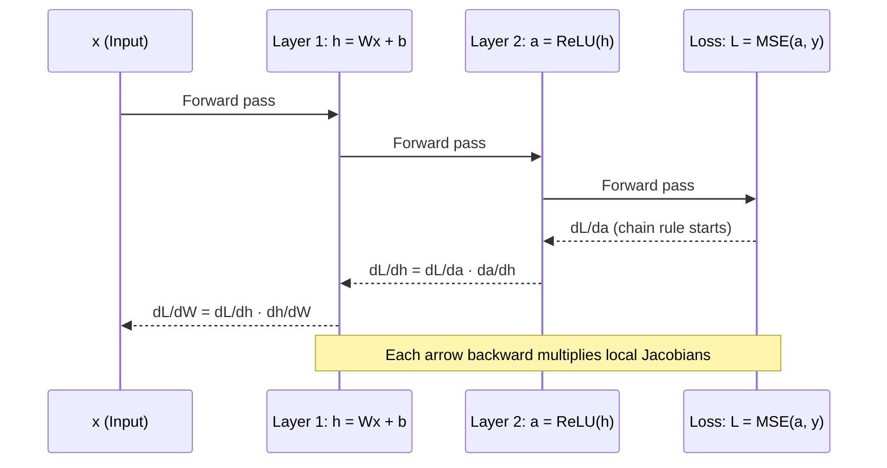

# 📐 Calculus for ML

> [!abstract] TL;DR
> Calculus gives neural networks their ability to learn — derivatives measure how much each parameter affects the loss, the chain rule propagates that information backward through layers, and gradient descent uses it to update weights.

---

## Intuition

**Analogy:** Imagine you are hiking blindfolded on a hilly landscape and your goal is to find the lowest valley. You cannot see the full terrain, but you *can* feel the slope under your feet at every step. The gradient tells you which direction is steepest uphill — so you take a step in the *opposite* direction. That is gradient descent. The chain rule is how you figure out the slope at your feet when you are standing on a hill that is itself on top of another hill — you multiply the local slopes together.

In ML: the "landscape" is your loss function, your "position" is the current weight values, and each training step is one blindfolded stride toward a lower valley.

---

## How It Works

### Core Mechanics

**Derivatives — Rate of Change:**
A derivative `df/dx` at a point tells you: "if I nudge `x` by a tiny amount ε, how much does `f` change?"
- Positive derivative → f increases as x increases.
- Negative derivative → f decreases as x increases.
- Zero derivative → a flat point (could be a minimum, maximum, or saddle point).

**Partial Derivatives — Multi-Variable Functions:**
Most ML functions have thousands of inputs (weights). A partial derivative `∂L/∂wᵢ` asks: "if I nudge only weight `wᵢ`, holding all others fixed, how does the loss L change?"
- The notation `∂` (curly d) signals a partial derivative.
- Computing partials for every weight simultaneously is what backprop does.

**The Gradient — All Partials Packaged Together:**
The gradient `∇f` is a vector of all partial derivatives:
```
∇f(x₁, x₂, ..., xₙ) = [∂f/∂x₁, ∂f/∂x₂, ..., ∂f/∂xₙ]
```
- Points in the direction of steepest *ascent*.
- Gradient descent moves in the direction of `-∇f` (steepest descent).
- The gradient has the same shape as the parameter vector — one scalar per weight.

**The Chain Rule — How Gradients Flow:**
For composed functions `z = f(g(x))` (i.e., layer 2 is a function of layer 1's output):
```
dz/dx = dz/dy · dy/dx      where y = g(x)
```
This extends to any depth: multiply the local gradients as you go backward. This is exactly backpropagation — the chain rule applied repeatedly from the loss output back to the first layer's weights.

**Jacobians — Chain Rule for Vectors:**
When both input and output are vectors (as in a neural net layer), the derivative is a matrix called the Jacobian:
```
J[i,j] = ∂yᵢ/∂xⱼ
```
Full Jacobian computation is expensive (m×n matrix for m outputs, n inputs), which is why ML frameworks use reverse-mode autodiff (backprop) to efficiently compute vector-Jacobian products without materializing the full Jacobian.

### Visual Overview



---

## The Math

**Derivative Definition:**
$$f'(x) = \lim_{h \to 0} \frac{f(x+h) - f(x)}{h}$$

**Partial Derivative:**
$$\frac{\partial L}{\partial w_i} = \lim_{\epsilon \to 0} \frac{L(\dots, w_i + \epsilon, \dots) - L(\dots, w_i, \dots)}{\epsilon}$$

**Gradient Vector:**
$$\nabla_\theta L = \left[\frac{\partial L}{\partial \theta_1},\ \frac{\partial L}{\partial \theta_2},\ \dots,\ \frac{\partial L}{\partial \theta_n}\right]^\top$$

**Chain Rule (scalar):**
$$\frac{dz}{dx} = \frac{dz}{dy} \cdot \frac{dy}{dx}$$

**Chain Rule (extended, 3 layers):**
$$\frac{\partial L}{\partial w} = \frac{\partial L}{\partial a} \cdot \frac{\partial a}{\partial h} \cdot \frac{\partial h}{\partial w}$$

Where $h = Wx + b$, $a = \sigma(h)$, $L = \text{loss}(a, y)$.

**Common Derivatives You Must Know:**
| Function | Derivative |
|----------|-----------|
| $x^n$ | $nx^{n-1}$ |
| $e^x$ | $e^x$ |
| $\ln(x)$ | $1/x$ |
| $\sigma(x) = \frac{1}{1+e^{-x}}$ | $\sigma(x)(1-\sigma(x))$ |
| $\text{ReLU}(x)$ | $1$ if $x > 0$, else $0$ |
| $\tanh(x)$ | $1 - \tanh^2(x)$ |

---

## Code Demo

```python
import numpy as np

# ── 1. Numerical gradient (finite differences) ───────────────────────────────
def f(x):
    """A simple scalar loss: f(x) = x^3 - 2x^2 + x"""
    return x**3 - 2*x**2 + x

def numerical_gradient(f, x, eps=1e-5):
    return (f(x + eps) - f(x - eps)) / (2 * eps)

x = 2.0
print(f"f(2.0) = {f(x):.4f}")
print(f"Numerical gradient at x=2: {numerical_gradient(f, x):.6f}")
# Analytical: f'(x) = 3x^2 - 4x + 1 → f'(2) = 12 - 8 + 1 = 5
print(f"Analytical gradient at x=2: {3*x**2 - 4*x + 1:.6f}")

# ── 2. Chain rule manually (one step of backprop) ───────────────────────────
def sigmoid(x):
    return 1 / (1 + np.exp(-x))

def sigmoid_grad(x):
    s = sigmoid(x)
    return s * (1 - s)

# Forward: h = w*x + b, a = sigmoid(h), L = (a - y)^2
w, b, x_in, y_true = 0.5, 0.1, 2.0, 1.0
h = w * x_in + b
a = sigmoid(h)
L = (a - y_true)**2

# Backward (chain rule step by step)
dL_da   = 2 * (a - y_true)               # ∂L/∂a
da_dh   = sigmoid_grad(h)                 # ∂a/∂h  (sigmoid derivative)
dh_dw   = x_in                            # ∂h/∂w  (linear layer)

dL_dw = dL_da * da_dh * dh_dw            # chain rule: multiply all local grads
print(f"\nManual chain rule: dL/dw = {dL_dw:.6f}")

# ── 3. PyTorch autograd (same computation, automatic) ───────────────────────
try:
    import torch
    w_t = torch.tensor(0.5, requires_grad=True)
    b_t = torch.tensor(0.1, requires_grad=True)
    x_t = torch.tensor(2.0)
    y_t = torch.tensor(1.0)

    h_t = w_t * x_t + b_t
    a_t = torch.sigmoid(h_t)
    L_t = (a_t - y_t)**2
    L_t.backward()

    print(f"PyTorch autograd: dL/dw  = {w_t.grad.item():.6f}")
    print(f"Match: {np.isclose(dL_dw, w_t.grad.item())}")
except ImportError:
    print("(PyTorch not installed — manual result above is correct)")

# ── 4. Gradient of a multivariate loss ──────────────────────────────────────
# Loss surface: L(w1, w2) = w1^2 + 3*w2^2
def loss_surface(w):
    return w[0]**2 + 3 * w[1]**2

def analytical_grad(w):
    return np.array([2 * w[0], 6 * w[1]])

def numerical_grad_vector(f, w, eps=1e-5):
    grad = np.zeros_like(w)
    for i in range(len(w)):
        w_plus  = w.copy(); w_plus[i]  += eps
        w_minus = w.copy(); w_minus[i] -= eps
        grad[i] = (f(w_plus) - f(w_minus)) / (2 * eps)
    return grad

w0 = np.array([1.0, 2.0])
print(f"\nAnalytical gradient: {analytical_grad(w0)}")
print(f"Numerical  gradient: {numerical_grad_vector(loss_surface, w0)}")
```

---

## Real-World Example

> **Example:** Backpropagation in PyTorch is the chain rule implemented as reverse-mode automatic differentiation. When you call `loss.backward()`, PyTorch traverses the computation graph from the loss output back to every leaf parameter, multiplying local Jacobians at each node. For GPT-4 with ~1.8T parameters, this means computing and accumulating `∂L/∂θ` for every weight — all via the same chain rule you learned in high school calculus, just applied recursively across hundreds of transformer layers. The reason GPT trains at all is that the chain rule allows gradients to flow end-to-end, telling each weight exactly how much it contributed to the loss.

---

## Trade-offs

| Aspect | Pro | Con |
|--------|-----|-----|
| Numerical differentiation | Simple, works for any function, great for gradient checking | O(n) forward passes per gradient — completely impractical for millions of parameters |
| Reverse-mode autodiff (backprop) | One backward pass gives all gradients simultaneously — O(n) cost | Requires storing intermediate activations in memory during the forward pass |
| Symbolic differentiation | Exact closed-form derivatives | Expression swell — can produce exponentially large formulas for deep compositions |
| Second-order methods (Hessian) | Better curvature info, faster convergence | Hessian is O(n²) to store, O(n³) to invert — totally impractical for large models |

---

## When to Use vs Avoid

**Use when:**
- Implementing or debugging custom loss functions — derive the gradient analytically first.
- Building custom PyTorch/JAX layers — you need to implement the `backward` method.
- Debugging gradient flow — numerical gradient checking catches bugs in custom ops.
- Understanding why training is failing — dead neurons (zero gradient via ReLU), vanishing gradients (deep sigmoid chains).

**Avoid when:**
- You can use an existing framework's autodiff — there is almost never a reason to implement backprop from scratch in production.
- You are using tree-based models (XGBoost, Random Forest) — these do not use gradients in the same sense.

---

## Common Pitfalls

- **Vanishing gradients** — sigmoid and tanh squash gradients toward zero; in deep networks the chain rule multiplies many small numbers together and the gradient at early layers becomes negligible. Fix: use ReLU activations, batch norm, or residual connections.
- **Exploding gradients** — the opposite; gradients grow exponentially in RNNs over long sequences. Fix: gradient clipping (`torch.nn.utils.clip_grad_norm_`).
- **Not zeroing gradients between batches** — PyTorch accumulates gradients by default. Forgetting `optimizer.zero_grad()` before `loss.backward()` adds gradients from the previous batch to the current one, corrupting your update.
- **Using numerical gradients in production** — numerical differentiation with finite differences has O(n) cost where n is the number of parameters. Fine for testing, disastrous for training.
- **Confusing the gradient with the update** — the gradient `∇L` points *uphill*. You subtract it (not add) to descend. And you scale it by the learning rate. Getting this sign wrong is a classic bug.

---

## Related Concepts

- [[_MOC_Foundations|↑ Section MOC]]

- [[Backpropagation]] — the algorithm that applies the chain rule efficiently through a computation graph; calculus is the theoretical foundation
- [[Gradient_Descent_Variants]] — SGD, Adam, RMSProp all use the gradient `∇L`; they differ in how they use it to update weights
- [[Optimizers]] — second-order methods (L-BFGS, natural gradient) use Hessian information, extending calculus to curvature
- [[Linear_Algebra]] — gradients are vectors; the Jacobian is a matrix; backprop involves both simultaneously
- [[Loss_Functions]] — every loss function has a specific gradient w.r.t. model outputs; knowing the gradient of cross-entropy, MSE, etc. is essential

---

## Review Questions

1. **Conceptual:** Explain in one sentence why the chain rule is the mathematical core of neural network training. What property of neural nets makes it applicable?
2. **Scenario-based:** A model uses a sigmoid activation at every layer and has 50 layers. After training for several epochs, the first few layers show no improvement. What is likely happening mathematically, and what would you change?
3. **Trade-off:** Numerical gradient checking is useful for debugging but useless for training. Explain why, referencing computational complexity.

---

## Sources

- [3Blue1Brown — Backpropagation Calculus (YouTube)](https://www.youtube.com/watch?v=tIeHLnjs5U8)
- [Goodfellow et al. — Deep Learning, Chapter 4 (Numerical Computation) & Chapter 6](https://www.deeplearningbook.org/)
- [Karpathy — Micrograd: Backprop from scratch](https://github.com/karpathy/micrograd)
- [CS231n — Backpropagation, Intuitions](https://cs231n.github.io/optimization-2/)
- [PyTorch Autograd Mechanics](https://pytorch.org/docs/stable/notes/autograd.html)

---
#math #calculus #derivatives #gradient #chain-rule #backpropagation #foundations #ml-math
