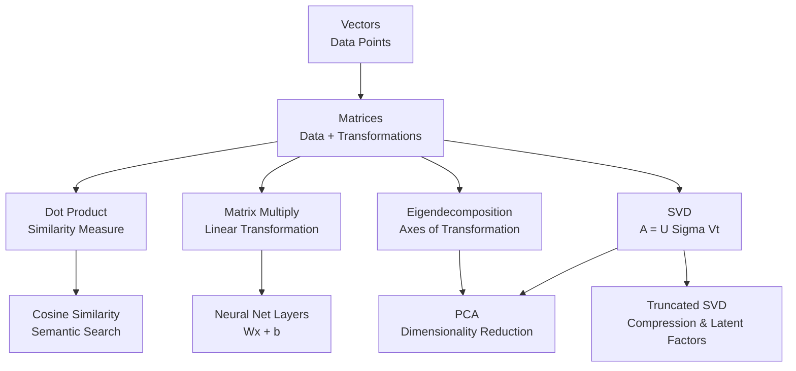

# 🧮 Linear Algebra for ML

> [!abstract] TL;DR
> Linear algebra gives ML its language — vectors represent data points, matrices encode transformations, and operations like dot products and SVD power everything from similarity search to dimensionality reduction.

---

## Intuition

**Analogy:** Think of a spreadsheet. Each row is a data point (a person, an image, a sentence), and each column is a feature (age, pixel intensity, word count). That spreadsheet *is* a matrix. Every ML algorithm is, at its core, doing arithmetic on that spreadsheet — rotating it, scaling it, or extracting its most important rows and columns.

When you multiply a matrix by a vector, you are applying a transformation — stretching, rotating, or projecting the data into a new space. The entire field of deep learning is a sequence of such transformations, stacked one after another.

---

## How It Works

### Core Mechanics

**Vectors** are ordered lists of numbers. In ML, a vector represents a single data point in n-dimensional space.

```
x = [x₁, x₂, ..., xₙ]  ← a point in ℝⁿ
```

**Matrices** are 2D arrays. An (m × n) matrix holds m data points, each with n features. They also encode *linear transformations* — multiplying a vector by a matrix moves it to a new position in space.

**Matrix Multiplication (Ax = b):**
- A is an (m × n) matrix, x is an (n × 1) vector, b is the (m × 1) result.
- Each element of b is a dot product of a row of A with x.
- In ML: A is the weight matrix, x is the input, b is the output of a layer.

**Dot Product as Similarity:**
- `a · b = |a||b|cos(θ)` — the dot product is large when vectors point in the same direction.
- Cosine similarity normalizes this: `cos(θ) = (a·b) / (|a||b|)`.
- Used everywhere: semantic search, attention mechanisms, nearest neighbor lookup.

**Eigenvalues and Eigenvectors:**
- For a square matrix A, the eigenvector v satisfies `Av = λv`.
- Multiplying by A only *scales* v by λ — it does not rotate it.
- Geometric intuition: eigenvectors are the "axes" of a transformation. They point in the directions the matrix stretches (or squishes) space without rotating them.
- In PCA, eigenvectors of the covariance matrix are the principal components.

**Singular Value Decomposition (SVD):**
- Any matrix A (even non-square) decomposes as `A = UΣVᵀ`.
- U: left singular vectors (rotation/reflection in output space).
- Σ: diagonal matrix of singular values (scaling factors, always non-negative).
- Vᵀ: right singular vectors (rotation/reflection in input space).
- Intuition: SVD says "any linear transformation = rotate, then scale, then rotate again."
- Truncated SVD (keep top k singular values) is the mathematical foundation of PCA, LSA, and matrix factorization recommender systems.

### Visual Overview



---

## The Math

**Matrix Multiplication:**
$$C_{ij} = \sum_{k=1}^{n} A_{ik} \cdot B_{kj}$$

Where $A$ is $(m \times n)$, $B$ is $(n \times p)$, and $C$ is $(m \times p)$.

**Eigenvector Equation:**
$$Av = \lambda v$$

- $A$: square matrix (e.g., covariance matrix)
- $v$: eigenvector — a direction that $A$ does not rotate
- $\lambda$: eigenvalue — the scalar by which $v$ is stretched

**Cosine Similarity:**
$$\text{sim}(a, b) = \frac{a \cdot b}{\|a\| \cdot \|b\|} = \frac{\sum_i a_i b_i}{\sqrt{\sum_i a_i^2} \cdot \sqrt{\sum_i b_i^2}}$$

**SVD:**
$$A = U \Sigma V^\top$$

- $A$: any $(m \times n)$ real matrix
- $U$: $(m \times m)$ orthogonal matrix (left singular vectors)
- $\Sigma$: $(m \times n)$ diagonal matrix with singular values $\sigma_1 \geq \sigma_2 \geq \dots \geq 0$
- $V^\top$: $(n \times n)$ orthogonal matrix (right singular vectors transposed)

---

## Code Demo

```python
import numpy as np

# ── 1. Basic matrix operations ──────────────────────────────────────────────
A = np.array([[1, 2, 3],
              [4, 5, 6]])   # shape (2, 3)
B = np.array([[7, 8],
              [9, 10],
              [11, 12]])    # shape (3, 2)

C = A @ B                   # matrix multiply → shape (2, 2)
print("A @ B =\n", C)

# ── 2. Dot product and cosine similarity ────────────────────────────────────
def cosine_similarity(a, b):
    return np.dot(a, b) / (np.linalg.norm(a) * np.linalg.norm(b))

king   = np.array([0.9, 0.1, 0.8])   # fake word embeddings
queen  = np.array([0.85, 0.9, 0.75])
rock   = np.array([0.1, 0.05, 0.2])

print(f"king ↔ queen: {cosine_similarity(king, queen):.3f}")  # high
print(f"king ↔ rock:  {cosine_similarity(king, rock):.3f}")   # low

# ── 3. Eigendecomposition ────────────────────────────────────────────────────
cov = np.cov(np.random.randn(3, 100))   # 3×3 covariance matrix
eigenvalues, eigenvectors = np.linalg.eig(cov)
print("Eigenvalues:", eigenvalues)
print("Eigenvectors (columns):\n", eigenvectors)

# Verify: A @ v = λ @ v
v0 = eigenvectors[:, 0]
lam0 = eigenvalues[0]
assert np.allclose(cov @ v0, lam0 * v0), "Eigenvector equation failed"

# ── 4. SVD and truncated reconstruction ─────────────────────────────────────
X = np.random.randn(50, 10)   # 50 samples, 10 features
U, sigma, Vt = np.linalg.svd(X, full_matrices=False)

# Reconstruct using only top-k=3 singular values (lossy compression)
k = 3
X_approx = U[:, :k] @ np.diag(sigma[:k]) @ Vt[:k, :]
reconstruction_error = np.linalg.norm(X - X_approx, 'fro')
print(f"Frobenius reconstruction error (k={k}): {reconstruction_error:.4f}")

# Variance explained by top-k components
variance_explained = np.sum(sigma[:k]**2) / np.sum(sigma**2)
print(f"Variance explained by top {k} components: {variance_explained:.1%}")
```

---

## Real-World Example

> **Example:** Google's Word2Vec and OpenAI's text embeddings represent every word or sentence as a high-dimensional vector (e.g., 1536 dimensions). When you type a query into a semantic search engine, your query is converted to a vector, and the system finds documents whose vectors have the highest cosine similarity to it. The entire retrieval step is a batched matrix multiply — your query vector against a matrix of document embeddings — making it fast enough to search billions of documents in milliseconds. Spotify uses a similar approach (matrix factorization via truncated SVD) to build user and song embeddings for recommendations.

---

## Trade-offs

| Aspect | Pro | Con |
|--------|-----|-----|
| Expressiveness | Any linear transformation can be represented exactly | Cannot model non-linear relationships without activation functions |
| Computational efficiency | Highly optimized BLAS/CUDA kernels; GPU-native | Large matrices require significant memory (m×n floats) |
| SVD accuracy | Optimal low-rank approximation (Eckart–Young theorem) | Full SVD is O(min(m,n)·m·n) — expensive for huge matrices |
| Eigendecomposition | Gives exact principal axes | Only defined for square matrices; requires real symmetric for real eigenvalues |
| Cosine similarity | Scale-invariant, works well for sparse/high-dim data | Ignores magnitude; two vectors with same direction but very different magnitudes are "identical" |

---

## When to Use vs Avoid

**Use when:**
- Representing and manipulating feature matrices (almost always in ML).
- Computing similarity between embeddings (cosine similarity).
- Reducing dimensionality via PCA or truncated SVD.
- Implementing or understanding neural network layers (Wx + b is a matrix multiply).
- Analyzing variance/covariance structure of your data.

**Avoid when:**
- Your data relationships are inherently non-linear — linear algebra alone cannot capture them (you need kernels or neural nets on top).
- You need exact SVD on a matrix larger than ~10k × 10k — use randomized SVD (`sklearn.utils.extmath.randomized_svd`) instead.

---

## Common Pitfalls

- **Shape mismatch in matrix multiply** — always check dimensions: (m×n) @ (n×p) = (m×p). The inner dimensions must match. NumPy will raise a `ValueError` but PyTorch may silently broadcast.
- **Using `np.linalg.eig` on a non-symmetric matrix** — returns complex eigenvalues. For covariance matrices (always symmetric positive semi-definite), use `np.linalg.eigh` which is faster and guaranteed to return real values.
- **Forgetting to normalize before cosine similarity** — if you compute dot products without normalizing, you get a score biased toward high-magnitude vectors. Pre-normalize embeddings once and store them to avoid recomputing.
- **Confusing row-vectors and column-vectors** — NumPy `shape (n,)` is ambiguous; use `shape (n, 1)` or `shape (1, n)` explicitly in code that multiplies matrices.
- **Treating eigenvalues from SVD and `np.linalg.eig` as interchangeable** — singular values (from SVD) are always non-negative; eigenvalues from `eig` can be negative or complex.

---

## Related Concepts

- [[_MOC_Foundations|↑ Section MOC]]

- [[Probability_and_Statistics]] — covariance matrices link linear algebra to probability; the multivariate Gaussian is parameterized by a covariance matrix
- [[PCA]] — principal component analysis IS eigendecomposition of the covariance matrix, or equivalently truncated SVD of the centered data matrix
- [[Word_Embeddings]] — word2vec, GloVe, and transformer embeddings live in high-dimensional vector spaces; all semantic operations are linear algebra
- [[Gradient_Descent_Variants]] — the gradient of a loss w.r.t. a weight matrix is itself a matrix; the update step is matrix arithmetic
- [[Attention_Mechanism]] — the Q, K, V matrices in self-attention are linear projections; attention scores are scaled dot products

---

## Review Questions

1. **Conceptual:** What does it mean geometrically when a matrix has an eigenvalue of 0? What does that imply about the linear transformation it represents?
2. **Scenario-based:** You have 1M document embeddings (dim=768) stored in a matrix. A user submits a query embedding. Describe the exact linear algebra operation needed to find the top-10 most similar documents, and identify the computational bottleneck.
3. **Trade-off:** When would you prefer randomized SVD over full SVD, and what do you give up in exchange for the speed gain?

---

## Sources

- [3Blue1Brown — Essence of Linear Algebra (YouTube)](https://www.youtube.com/playlist?list=PLZHQObOWTQDPD3MizzM2xVFitgF8hE_ab)
- [Gilbert Strang — Introduction to Linear Algebra (MIT OCW)](https://ocw.mit.edu/courses/18-06-linear-algebra-spring-2010/)
- [NumPy Linear Algebra Docs](https://numpy.org/doc/stable/reference/routines.linalg.html)
- [The Matrix Cookbook](https://www.math.uwaterloo.ca/~hwolkowi/matrixcookbook.pdf)
- [Goodfellow et al. — Deep Learning, Chapter 2](https://www.deeplearningbook.org/contents/linear_algebra.html)

---
#math #linear-algebra #foundations #vectors #matrices #SVD #eigenvalues #ml-math
