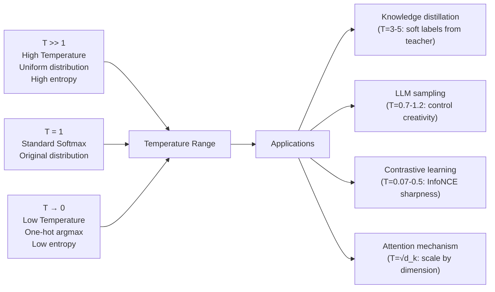

# Softmax and Sigmoid

> [!abstract] TL;DR
> Sigmoid maps any real number to (0, 1) — it is the binary probability function. Softmax generalizes it to $K$ classes, mapping a vector of real-valued scores (logits) to a valid probability distribution that sums to 1. Both are derived from the same exponential family framework. Understanding their numerical stability, gradients, and temperature control is essential for building classification models and attention mechanisms.

---

## Intuition — Analogy First

**Analogy:** Imagine a judge scoring contestants. Each contestant gets a raw score — a number from $-\infty$ to $+\infty$. The judge needs to turn these raw scores into a probability of winning.

**Sigmoid (2 contestants):** Contestant A scores +2, Contestant B scores -2. The sigmoid "converts the gap" into a probability: A wins with probability $\sigma(4) \approx 0.98$. The function squashes any raw advantage into a 0–1 probability.

**Softmax (K contestants):** Five contestants with raw scores `[3, 1, 0, -1, -2]`. Softmax exponentiales each score and normalizes by the total: the winner (score 3) gets most of the probability, the loser (score -2) gets almost none. The probabilities sum to 1 — exactly what you need to interpret them as chances of winning.

The technical translation: raw scores are **logits** (log-odds). Sigmoid/softmax converts them to **probabilities** (credences). The exponential ensures that score differences create exponential probability ratios — large score gaps yield very confident predictions.

---

## How It Works

### Sigmoid

The sigmoid function maps a scalar $z$ to $(0, 1)$:

$$\sigma(z) = \frac{1}{1 + e^{-z}} = \frac{e^z}{1 + e^z}$$

**Key properties:**
- $\sigma(0) = 0.5$ — boundary between classes
- $\sigma(z) \to 1$ as $z \to +\infty$; $\sigma(z) \to 0$ as $z \to -\infty$
- Derivative: $\sigma'(z) = \sigma(z)(1 - \sigma(z))$ — convenient recursive form
- Symmetric: $\sigma(-z) = 1 - \sigma(z)$
- Inverse: $\sigma^{-1}(p) = \log\frac{p}{1-p}$ — the **logit function**

**Derivation from logistic model:**
Assume $P(y=1|z) = p$ satisfies $\log\frac{p}{1-p} = z$ (log-odds are linear in features). Solving:

$$p = \frac{e^z}{1 + e^z} = \sigma(z)$$

### Softmax

Softmax maps a vector $\mathbf{z} \in \mathbb{R}^K$ to a probability simplex $\Delta^{K-1}$:

$$\text{softmax}(\mathbf{z})_k = \frac{e^{z_k}}{\sum_{j=1}^{K} e^{z_j}}$$

**Key properties:**
- Outputs sum to 1: $\sum_k \text{softmax}(\mathbf{z})_k = 1$
- All outputs positive (valid probability distribution)
- **Not invariant to addition**: adding a constant to all $z_k$ changes the outputs (unlike sigmoid)
- **Invariant to constant shift**: $\text{softmax}(\mathbf{z}) = \text{softmax}(\mathbf{z} + c)$ — each $e^{z_k+c} / \sum e^{z_j+c}$ cancels
- Softmax is a smooth approximation of the argmax function

**Relationship to sigmoid (K=2 case):**
For binary classification with logits $[z, 0]$:
$$\text{softmax}([z, 0])_1 = \frac{e^z}{e^z + e^0} = \frac{e^z}{e^z + 1} = \sigma(z)$$

Sigmoid is softmax for the binary case.

### Numerical Stability: The Log-Sum-Exp Trick

Direct computation of $e^{z_k}$ for large $z_k$ overflows float32 (max ~3.4×10^38 ≈ $e^{88}$).

**Unstable:** $\text{softmax}(z)_k = e^{z_k} / \sum_j e^{z_j}$ overflows for $z_k > 88$

**Stable:** subtract the maximum before exponentiating:
$$\text{softmax}(\mathbf{z})_k = \frac{e^{z_k - z_\max}}{\sum_j e^{z_j - z_\max}}$$

This is valid because: $\frac{e^{z_k - c}}{\sum_j e^{z_j - c}} = \frac{e^{z_k} \cdot e^{-c}}{\sum_j e^{z_j} \cdot e^{-c}} = \frac{e^{z_k}}{\sum_j e^{z_j}}$

The log-sum-exp function:
$$\text{LSE}(\mathbf{z}) = \log\!\sum_j e^{z_j} = z_\max + \log\!\sum_j e^{z_j - z_\max}$$

Used in: log-softmax, cross-entropy loss, VAE ELBO, HMM forward-backward algorithm.

### Temperature Softmax

The **temperature** $T$ controls the sharpness of the distribution:

$$\text{softmax}(\mathbf{z} / T)_k = \frac{e^{z_k/T}}{\sum_j e^{z_j/T}}$$



---

## The Math

### Softmax Jacobian

The gradient of softmax with respect to its input is a matrix (Jacobian), not a vector:

$$\frac{\partial \text{softmax}(\mathbf{z})_i}{\partial z_j} = \text{softmax}(\mathbf{z})_i\left(\mathbb{1}_{i=j} - \text{softmax}(\mathbf{z})_j\right) = p_i(\delta_{ij} - p_j)$$

In matrix form: $J = \text{diag}(\mathbf{p}) - \mathbf{p}\mathbf{p}^\top$

This is expensive to compute directly for large $K$ (vocabulary sizes of 32K–128K in LLMs). In practice, the chain rule with cross-entropy loss simplifies to $\hat{p} - y$ (predicted minus one-hot target) — no explicit Jacobian needed.

### Cross-Entropy + Softmax Gradient

The clean gradient is why cross-entropy is the natural pairing for softmax:

$$\mathcal{L}_\text{CE} = -\sum_k y_k \log \hat{p}_k \quad \text{where } \hat{p} = \text{softmax}(\mathbf{z})$$

$$\frac{\partial \mathcal{L}_\text{CE}}{\partial z_k} = \hat{p}_k - y_k$$

This is elegant: the gradient is just (predicted probability - true label). For the correct class $k^*$ where $y_{k^*} = 1$: gradient = $\hat{p}_{k^*} - 1$ (pushes probability up). For all wrong classes: gradient = $\hat{p}_k$ (pushes probability down).

### Sigmoid Gradient: Saturation Region

$$\sigma'(z) = \sigma(z)(1 - \sigma(z))$$

At the extremes: $\sigma'(z) \to 0$ for $|z|$ large. This is the **vanishing gradient** problem for sigmoid activations in deep networks. At $z=5$: $\sigma'(5) \approx 0.0066$ — gradient is 150x smaller than at $z=0$.

This is why sigmoid and tanh were replaced by ReLU in hidden layers. Sigmoid remains appropriate only for **output layers** of binary classifiers (where the input $z$ is a linear combination of features, not a deep stack).

---

## Code Demo

```python
import numpy as np
import torch
import torch.nn.functional as F
import matplotlib.pyplot as plt

# ── Sigmoid ──────────────────────────────────────────────────────────────────
def sigmoid_numpy(z: np.ndarray) -> np.ndarray:
    return 1 / (1 + np.exp(-z))

def sigmoid_stable(z: np.ndarray) -> np.ndarray:
    """Numerically stable: handle positive and negative separately."""
    return np.where(z >= 0,
                    1 / (1 + np.exp(-z)),
                    np.exp(z) / (1 + np.exp(z)))

z = np.array([-10, -2, -1, 0, 1, 2, 5, 10], dtype=float)
print("Sigmoid values:")
for zi, p in zip(z, sigmoid_numpy(z)):
    print(f"  σ({zi:5.1f}) = {p:.6f}")

# ── Softmax (stable) ─────────────────────────────────────────────────────────
def softmax_stable(z: np.ndarray) -> np.ndarray:
    """Log-sum-exp trick for numerical stability."""
    z_shifted = z - z.max()  # subtract max for stability
    exp_z = np.exp(z_shifted)
    return exp_z / exp_z.sum()

logits = np.array([3.0, 1.0, 0.0, -1.0, -2.0])
probs = softmax_stable(logits)
print(f"\nSoftmax of {logits}:")
print(f"  {np.round(probs, 4)}  (sum={probs.sum():.6f})")

# Test numerical stability: large logits
large_logits = np.array([1000.0, 999.0, 998.0])
print(f"\nLarge logits {large_logits}:")
print(f"  Stable softmax: {softmax_stable(large_logits)}")
# Without stability: np.exp([1000, 999, 998]) → overflow!


# ── Temperature Softmax ───────────────────────────────────────────────────────
def temperature_softmax(logits: np.ndarray, T: float) -> np.ndarray:
    return softmax_stable(logits / T)

logits_demo = np.array([2.0, 1.0, 0.5, -0.5])
print("\nTemperature effect:")
for T in [0.1, 0.5, 1.0, 2.0, 10.0]:
    p = temperature_softmax(logits_demo, T)
    print(f"  T={T:4.1f}: {np.round(p, 3)}  entropy={-np.sum(p * np.log(p + 1e-10)):.3f}")


# ── PyTorch: cross-entropy gradient verification ─────────────────────────────
torch.manual_seed(0)
logits_torch = torch.tensor([[2.0, 1.0, 0.5, -0.5]], requires_grad=True)
target = torch.tensor([0])  # correct class is 0

loss = F.cross_entropy(logits_torch, target)
loss.backward()

probs_torch = F.softmax(logits_torch.detach(), dim=-1)
# Gradient should be: predicted_prob - true_label for each class
expected_grad = probs_torch.clone()
expected_grad[0, 0] -= 1.0  # subtract 1 for the correct class

print(f"\nCross-entropy gradient:")
print(f"  Computed:  {logits_torch.grad.numpy().round(6)}")
print(f"  Expected:  {expected_grad.numpy().round(6)}")
print(f"  Match: {np.allclose(logits_torch.grad.numpy(), expected_grad.numpy(), atol=1e-5)}")


# ── Softmax in attention (scaled dot-product) ────────────────────────────────
def scaled_dot_product_attention(Q, K, V):
    """Attention = softmax(Q K^T / sqrt(d_k)) V"""
    d_k = Q.shape[-1]
    scores = torch.matmul(Q, K.transpose(-2, -1)) / (d_k ** 0.5)
    attn_weights = F.softmax(scores, dim=-1)
    return torch.matmul(attn_weights, V), attn_weights

seq_len, d_k, d_v = 5, 64, 64
Q = torch.randn(1, seq_len, d_k)
K = torch.randn(1, seq_len, d_k)
V = torch.randn(1, seq_len, d_v)

output, weights = scaled_dot_product_attention(Q, K, V)
print(f"\nAttention weights shape: {weights.shape}")  # (1, 5, 5)
print(f"Weights sum per query:   {weights.sum(dim=-1)}")  # should be all 1.0
```

---

## Real-World Example

> **GPT-4 next-token generation:** The final layer of a GPT model outputs a logit vector of size 128,000 (vocabulary size). Softmax converts these 128,000 logits into a probability distribution over next tokens. Temperature controls diversity: at $T=1.0$ (default), probabilities reflect the model's training; at $T=0.0$ (argmax/greedy decoding), the highest-probability token is always selected (deterministic but repetitive); at $T=1.5$, the distribution is smoothed to allow more varied continuations at the cost of occasional incoherence. The **temperature** hyperparameter you set when calling `openai.chat.completions.create(temperature=0.7)` is exactly the $T$ in temperature softmax.

---

## Trade-offs

| Aspect | Sigmoid | Softmax |
|--------|---------|---------|
| Use case | Binary classification output | Multi-class classification output |
| Output range | Single scalar in (0, 1) | Vector of K probabilities summing to 1 |
| Multi-label | Yes (each output is independent) | No (probabilities compete; sums to 1) |
| Gradient saturation | Yes (vanishes for large abs(z)) | Less severe for individual classes |
| Numerical stability | Stable for moderate z; use stable version for |z| > 88 | Requires log-sum-exp trick |
| As hidden activation | Poor (vanishing gradients) — use ReLU | Not used in hidden layers |

---

## When to Use vs Avoid

**Use sigmoid when:**
- Binary classification output (one probability)
- Multi-label classification (each label has independent sigmoid output)
- Gates in LSTMs and GRUs (forget gate, input gate)

**Use softmax when:**
- Multi-class classification (exactly one class is correct)
- Attention weight computation (scores must sum to 1 across positions)
- LLM next-token probability distribution

**Avoid both as hidden activations** — use ReLU, GELU, or SiLU in hidden layers to avoid vanishing gradients.

---

## Common Pitfalls

- **Passing softmax output to `nn.CrossEntropyLoss`** — PyTorch's `CrossEntropyLoss` applies `log_softmax` internally. If you pass softmax-processed probabilities, you apply softmax twice. Always pass raw logits to `CrossEntropyLoss`; use `NLLLoss` if you pre-apply `log_softmax`.
- **Sigmoid for multi-class** — sigmoid on a K-class logit vector does NOT produce a valid probability distribution (outputs don't sum to 1). Use softmax for multi-class, sigmoid for multi-label.
- **Not subtracting max before exponentiating** — `np.exp([500, 499])` will overflow. Always use the log-sum-exp trick or rely on framework implementations.
- **Temperature = 0 in LLM sampling** — temperature 0 means argmax, which can cause repetition loops. A small non-zero temperature (e.g., 0.01) is safer than 0.
- **Forgetting to divide by √d_k in attention** — without scaling, the dot products grow as $O(\sqrt{d_k})$, pushing softmax into the saturation region where gradients vanish. The $1/\sqrt{d_k}$ scaling is not optional.

---

## Related Concepts

- [[_MOC_Foundations|↑ Section MOC]]

- [[Logistic_Regression]] — sigmoid is the output function of logistic regression; the model predicts $P(y=1|x) = \sigma(\mathbf{w}^\top\mathbf{x})$
- [[Information_Theory]] — cross-entropy loss connects directly to softmax output; minimizing cross-entropy = MLE under categorical distribution
- [[Activation_Functions]] — sigmoid and softmax are output activations; ReLU, GELU, SiLU are used in hidden layers
- [[Loss_Functions]] — cross-entropy loss is the natural companion to softmax; binary cross-entropy with sigmoid; categorical cross-entropy with softmax
- [[Attention_Mechanism]] — softmax is the core operation in self-attention: converts raw attention scores to normalized weights

---

## Review Questions

1. PyTorch's `nn.CrossEntropyLoss` accepts raw logits, not probabilities. Write out the exact sequence of mathematical operations that `nn.CrossEntropyLoss` applies internally, and explain why this is more numerically stable than first applying `nn.Softmax` then `nn.NLLLoss`.

2. In the transformer's self-attention mechanism, scores are divided by $\sqrt{d_k}$ before softmax. Derive the variance of the dot product $Q_i \cdot K_j$ assuming $Q$ and $K$ have unit-variance components, and explain why this variance motivates the $\sqrt{d_k}$ scaling.

3. A language model uses temperature $T = 0.7$ at inference. Explain what this does to the distribution over next tokens compared to $T = 1.0$. Under what conditions would you increase $T$ above 1.0, and what risk does this introduce?

---

## Sources

- Goodfellow, I., Bengio, Y., & Courville, A. (2016). *Deep Learning*, Chapter 6. [deeplearningbook.org](https://www.deeplearningbook.org/)
- Vaswani, A., et al. (2017). *Attention Is All You Need*. NeurIPS 2017. [arXiv:1706.03762](https://arxiv.org/abs/1706.03762)
- PyTorch CrossEntropyLoss documentation: [pytorch.org/docs/stable/generated/torch.nn.CrossEntropyLoss.html](https://pytorch.org/docs/stable/generated/torch.nn.CrossEntropyLoss.html)
- Hinton, G., Vinyals, O., & Dean, J. (2015). *Distilling the Knowledge in a Neural Network*. [arXiv:1503.02531](https://arxiv.org/abs/1503.02531) — temperature softmax for knowledge distillation

#sigmoid #softmax #activation-functions #classification #attention #temperature #log-sum-exp #foundations
