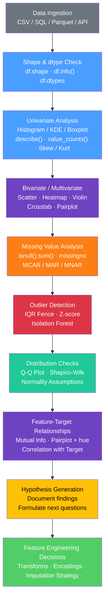

# 🔍 Exploratory Data Analysis (EDA)

> [!abstract] TL;DR
> EDA is the disciplined practice of interrogating a dataset before modeling — profiling distributions, uncovering missing values, spotting outliers, and mapping feature relationships — so every modeling decision is grounded in what the data actually says rather than what you assumed it would say.

---

## Intuition — Analogy First

**Analogy:** Imagine you are a detective arriving at a crime scene. You do not immediately arrest the first suspect you see — you walk the scene, dust for fingerprints, interview witnesses, and build a map of everything that happened before drawing any conclusions.

EDA is exactly that for your dataset. Before you train a single model, you walk the data: inspect its shape, probe its distributions, poke its missing values, and chart the relationships between variables. The goal is not to answer the modeling question yet — it is to understand the terrain well enough to ask the *right* questions, surface the traps (data leakage, outliers, class imbalance), and make deliberate decisions about preprocessing, feature engineering, and model choice.

---

## How It Works — EDA Mechanics

The EDA workflow moves from overview to detail, and from single-variable to multi-variable analysis. Think of it as progressively zooming in.

### Phase 1 — Data Inventory

Before anything else, answer: *what do I actually have?*

```python
df.shape                          # (n_rows, n_cols)
df.dtypes                         # column name → dtype mapping
df.info()                         # non-null counts, dtypes, memory usage
df.head(5)                        # sanity-check first rows
df.describe()                     # count/mean/std/min/25%/50%/75%/max for numerics
df.describe(include='object')     # top/freq/unique for categorical columns
df['target'].value_counts()       # class distribution — first thing to check
```

---

### Phase 2 — Univariate Analysis

Examine each variable in isolation to understand its distribution.

**Numerical features:**

| Plot / Stat | What it reveals |
|---|---|
| Histogram + KDE | Shape: normal, skewed, bimodal, uniform |
| Boxplot | Median, IQR spread, and potential outlier points |
| `df['col'].skew()` | Skewness > 1 or < -1 → consider log transform |
| `df['col'].kurt()` | Excess kurtosis > 3 → heavy tails; more outliers than normal |

**Categorical features:**

| Call | What it reveals |
|---|---|
| `df['col'].value_counts()` | Raw frequency per category |
| `df['col'].value_counts(normalize=True)` | Proportions — spots class imbalance |
| `df['col'].nunique()` | Cardinality — is OHE safe, or do you need target encoding? |

---

### Phase 3 — Missing Value Analysis

Counts alone are insufficient. The *mechanism* of missingness determines the correct treatment.

```python
df.isnull().sum()              # absolute missing count per column
df.isnull().mean() * 100       # missing percentage per column
```

| Pattern | Name | Meaning | Strategy |
|---|---|---|---|
| Missing independently of all observed/unobserved data | **MCAR** — Missing Completely At Random | Safe to drop or impute with mean/median | Simple imputation |
| Missing depends on other *observed* columns | **MAR** — Missing At Random | e.g., age missing more for younger respondents who skipped the field | Multiple imputation (IterativeImputer) |
| Missing depends on the *unobserved value itself* | **MNAR** — Missing Not At Random | e.g., income missing for the highest earners | Model-based imputation; add binary `is_missing` flag |

> [!tip] Use missingno
> The `missingno` library visualizes co-missingness patterns with one call:
> `import missingno as msno; msno.heatmap(df)` — when two columns are consistently missing *together*, that is a structural signal, not random noise.

---

### Phase 4 — Bivariate and Multivariate Analysis

Examine relationships between pairs (and groups) of variables.

**Two numerical features:** scatter plot + regression line (`sns.regplot`)

**Numerical vs categorical:** violin plot or grouped boxplot (`sns.violinplot`)

**Two categoricals:** `pd.crosstab(df['A'], df['B'])` → Chi-squared test (`scipy.stats.chi2_contingency`)

**All numerics together:**

- **Pearson correlation** — `df.corr(method='pearson')` — measures linear relationships; sensitive to outliers
- **Spearman correlation** — `df.corr(method='spearman')` — measures monotonic relationships; robust to outliers and non-normal distributions
- Plot as a **masked heatmap**: upper triangle removed to avoid duplication

> [!warning] Pearson vs Spearman
> A large discrepancy between Pearson and Spearman on the same pair (e.g., Pearson=0.35, Spearman=0.61) signals a **non-linear monotonic relationship** or that outliers are pulling the Pearson estimate. Report both when this gap is significant.

---

### Phase 5 — Outlier Detection

| Method | Mechanism | When to Use |
|---|---|---|
| **IQR Fence** | Lower = Q1 − 1.5×IQR, Upper = Q3 + 1.5×IQR | Univariate; robust; the default behind boxplot whiskers |
| **Z-score** | Flag points where \|z\| > 3 (mean ± 3σ) | Univariate; assumes approximately normal distribution |
| **Visual (boxplot)** | Points plotted beyond whiskers | Quick sanity check; not reproducible for production |
| **Isolation Forest** | `sklearn.ensemble.IsolationForest` — builds random trees that isolate anomalies | Multivariate; captures joint outliers across feature combinations |

> [!caution] Outliers are not always errors
> A fare of $500 on the Titanic is real. An age of 150 is an error. Understand *why* a value is extreme before removing it. Prefer **Winsorizing** (capping at a fence) over deletion when in doubt.

---

### Phase 6 — Distribution Checks

Many models (linear regression, LDA, Gaussian NB) assume or benefit from normality.

- **Q-Q plot** — `scipy.stats.probplot(x, plot=plt)` — if points lie on the diagonal, data follows the reference distribution. Deviations at the tails reveal heavy-tailedness.
- **Shapiro-Wilk test** — `scipy.stats.shapiro(x)` — H₀: data is normal; p < 0.05 → reject normality. Use on samples ≤ 200 (it has near-perfect power on large n and will always reject).
- **Common fixes:** `np.log1p(x)` for right-skewed data; `np.sqrt(x)` for moderate skew; `scipy.stats.boxcox(x)` for automatic power transform.

---

### Phase 7 — Feature-Target Relationships

The highest-value EDA phase for supervised learning — the payoff for all the groundwork above.

| Technique | What it reveals |
|---|---|
| `sns.pairplot(df, hue='target')` | All pairwise feature relationships, colored by target class |
| `sns.FacetGrid(df, col='target')` | Any single plot repeated per target value for comparison |
| `mutual_info_classif` (sklearn) | Model-free measure of statistical dependency between feature and target |
| Point-biserial correlation | Continuous feature vs binary target; equivalent to Pearson on a 0/1 variable |
| `pd.crosstab` + bar chart | Categorical feature vs target; reveals conditional class rates |

---

### Phase 8 — EDA for Time Series

Time series adds temporal structure that standard tabular EDA ignores.

| Tool | Code | What it shows |
|---|---|---|
| Rolling mean | `df['y'].rolling(30).mean()` | Trend — slow drift over time |
| Seasonal boxplot | `sns.boxplot(x='month', y='value', data=df)` | Periodic patterns by calendar unit |
| Lag plot | `pd.plotting.lag_plot(series)` | Circular scatter → strong autocorrelation |
| ACF | `statsmodels.graphics.tsaplots.plot_acf(series)` | How many past values predict the current? |
| PACF | `plot_pacf(series)` | Direct autocorrelation at each lag; drives AR order selection |

---

### Automated EDA Tools

| Tool | One-liner | Best For |
|---|---|---|
| **ydata-profiling** (formerly pandas-profiling) | `ProfileReport(df).to_notebook_iframe()` | Comprehensive HTML report shareable with non-engineers |
| **sweetviz** | `sweetviz.analyze(df, target_feat='y').show_html()` | Target-focused analysis; train vs test comparison side-by-side |
| **dtale** | `dtale.show(df)` | Interactive browser-based exploration with point-and-click charts |

---

### Flow / Architecture



---

## Code Demo

End-to-end EDA on the Titanic dataset — missing value heatmap, univariate distribution plots, correlation heatmap, outlier detection, and feature-target mutual information.

```python
import pandas as pd
import numpy as np
import matplotlib.pyplot as plt
import seaborn as sns
from scipy import stats
from sklearn.feature_selection import mutual_info_classif
from sklearn.ensemble import IsolationForest

# ── 1. Load & Inventory ───────────────────────────────────────────────────
df = sns.load_dataset('titanic')
print(f"Shape: {df.shape}")
print(df.info())
print("\n--- Numeric summary ---")
print(df.describe().round(2))
print("\n--- Categorical summary ---")
print(df.describe(include='object'))

# ── 2. Missing Value Analysis ─────────────────────────────────────────────
missing_pct = df.isnull().mean() * 100
print("\nMissing % per column:")
print(missing_pct[missing_pct > 0].sort_values(ascending=False))
# deck: 77%, age: 20%, embark_town: 0.2% — different mechanisms

# Visual: white = missing, dark = present
plt.figure(figsize=(12, 4))
sns.heatmap(df.isnull(), cbar=False, yticklabels=False,
            cmap='viridis', linewidths=0)
plt.title('Missing Value Heatmap  (yellow = missing)')
plt.tight_layout()
plt.savefig('missing_heatmap.png', dpi=100)
plt.close()

# ── 3. Univariate Analysis ────────────────────────────────────────────────
fig, axes = plt.subplots(2, 2, figsize=(12, 8))

# (a) Age — histogram + KDE overlay
age_clean = df['age'].dropna()
age_clean.plot(kind='hist', bins=30, density=True,
               ax=axes[0, 0], color='steelblue', edgecolor='white', alpha=0.7)
age_clean.plot(kind='kde', ax=axes[0, 0], color='crimson', linewidth=2)
axes[0, 0].set_title(
    f'Age  (skew={df["age"].skew():.2f}, kurt={df["age"].kurt():.2f})')
axes[0, 0].set_xlabel('Age')

# (b) Fare — boxplot to expose right-skew and outliers
sns.boxplot(y=df['fare'], ax=axes[0, 1], color='lightcoral', width=0.5)
axes[0, 1].set_title(f'Fare Boxplot  (skew={df["fare"].skew():.2f})')

# (c) Survived — class distribution (always check target imbalance first)
df['survived'].value_counts().plot(
    kind='bar', ax=axes[1, 0],
    color=['#d62728', '#2ca02c'], edgecolor='black')
axes[1, 0].set_title('Target: Survived (0=No, 1=Yes)')
axes[1, 0].set_xticklabels(['Died', 'Survived'], rotation=0)
for bar in axes[1, 0].patches:
    axes[1, 0].annotate(
        f'{bar.get_height():.0f}',
        (bar.get_x() + bar.get_width() / 2, bar.get_height() + 5),
        ha='center', fontsize=11)

# (d) Pclass — ordinal categorical distribution
df['pclass'].value_counts().sort_index().plot(
    kind='bar', ax=axes[1, 1], color='mediumpurple', edgecolor='black')
axes[1, 1].set_title('Passenger Class')
axes[1, 1].set_xticklabels(['1st', '2nd', '3rd'], rotation=0)

plt.suptitle('Univariate Analysis — Titanic', fontsize=13, y=1.01)
plt.tight_layout()
plt.savefig('univariate_analysis.png', dpi=100)
plt.close()

# Skewness & kurtosis report for all numeric columns
num_cols = df.select_dtypes(include=np.number).columns.tolist()
print("\nSkewness & Kurtosis:")
print(pd.DataFrame({'skewness': df[num_cols].skew(),
                    'kurtosis': df[num_cols].kurt()}).round(3))

# ── 4. Bivariate Analysis: Correlation Heatmap ───────────────────────────
numeric_df = df[num_cols].copy()
corr_pearson  = numeric_df.corr(method='pearson')
corr_spearman = numeric_df.corr(method='spearman')

fig, axes = plt.subplots(1, 2, figsize=(14, 5))
mask = np.triu(np.ones_like(corr_pearson, dtype=bool))
for ax, corr, title in zip(axes,
                            [corr_pearson, corr_spearman],
                            ['Pearson Correlation', 'Spearman Correlation']):
    sns.heatmap(corr, annot=True, fmt='.2f', mask=mask,
                cmap='coolwarm', center=0, vmin=-1, vmax=1,
                linewidths=0.5, square=True, ax=ax)
    ax.set_title(title)
plt.tight_layout()
plt.savefig('correlation_heatmaps.png', dpi=100)
plt.close()

# Violin plot: fare by class, split by survival
plt.figure(figsize=(8, 5))
sns.violinplot(data=df, x='pclass', y='fare', hue='survived',
               split=True, palette='muted', inner='quart')
plt.title('Fare by Passenger Class — split by Survival')
plt.tight_layout()
plt.savefig('violin_plot.png', dpi=100)
plt.close()

# Crosstab: survival rate per class
print("\nSurvival rate by class:")
print(pd.crosstab(df['pclass'], df['survived'],
                  margins=True, normalize='index').round(2))

# ── 5. Outlier Detection ──────────────────────────────────────────────────
def iqr_outlier_mask(series):
    """Return boolean mask flagging IQR fence outliers."""
    q1 = series.quantile(0.25)
    q3 = series.quantile(0.75)
    iqr = q3 - q1
    return (series < q1 - 1.5 * iqr) | (series > q3 + 1.5 * iqr)

fare_outliers = iqr_outlier_mask(df['fare'])
print(f"\nFare IQR outliers: {fare_outliers.sum()} rows "
      f"({fare_outliers.mean() * 100:.1f}%)")

# Z-score method on age
z_scores = np.abs(stats.zscore(age_clean))
print(f"Age Z-score outliers (|z|>3): {(z_scores > 3).sum()} rows")

# Multivariate: Isolation Forest on joint feature space
iso_cols = ['age', 'fare', 'sibsp', 'parch']
iso_df   = df[iso_cols].dropna()
clf      = IsolationForest(contamination=0.05, random_state=42)
iso_pred = clf.fit_predict(iso_df)   # 1=inlier, -1=outlier
print(f"Isolation Forest multivariate outliers: {(iso_pred == -1).sum()} rows")

# ── 6. Distribution Check: Q-Q Plots ─────────────────────────────────────
fig, axes = plt.subplots(1, 2, figsize=(10, 4))

stats.probplot(df['fare'].dropna(), plot=axes[0])
axes[0].set_title('Q-Q Plot: Fare (raw)  — heavy right tail')

stats.probplot(np.log1p(df['fare'].dropna()), plot=axes[1])
axes[1].set_title('Q-Q Plot: log1p(Fare)  — much closer to normal')

plt.tight_layout()
plt.savefig('qq_plots.png', dpi=100)
plt.close()

# Shapiro-Wilk on a sample (large n → test always rejects)
sample = age_clean.sample(min(200, len(age_clean)), random_state=42)
stat, p = stats.shapiro(sample)
print(f"\nShapiro-Wilk (Age, n={len(sample)}): stat={stat:.4f}, p={p:.4f}")
print("Normality:", "REJECTED (p<0.05)" if p < 0.05 else "Not rejected")

# ── 7. Feature-Target Relationships ──────────────────────────────────────
target = 'survived'
feature_cols = ['pclass', 'age', 'sibsp', 'parch', 'fare']
analysis_df  = df[feature_cols + [target]].dropna()

# Mutual Information (model-free dependency measure)
mi_scores = mutual_info_classif(
    analysis_df[feature_cols], analysis_df[target], random_state=42)
mi_series = pd.Series(mi_scores, index=feature_cols).sort_values(ascending=False)
print("\nMutual Information with 'survived':")
print(mi_series.round(4))

# Pairplot colored by target class
pair_df = df[['age', 'fare', 'pclass', 'survived']].dropna()
g = sns.pairplot(pair_df, hue='survived', palette='husl',
                 diag_kind='kde', plot_kws={'alpha': 0.4})
g.fig.suptitle('Pairplot: Age / Fare / Pclass by Survival', y=1.02)
g.savefig('pairplot.png', dpi=100)
plt.close('all')

# ── 8. EDA Summary ───────────────────────────────────────────────────────
print("\n=== EDA Summary ===")
print(f"Target balance: {df[target].value_counts(normalize=True).round(2).to_dict()}")
print(f"Highly missing: {missing_pct[missing_pct > 10].index.tolist()}")
print(f"Right-skewed features: {[c for c in num_cols if df[c].skew() > 1]}")
print(f"Top MI features: {mi_series.index[:3].tolist()}")
print("Recommended transforms: log1p(fare); impute age with median; drop deck (77% missing)")
```

---

## Real-World Example

> **Example: Airbnb dynamic pricing.** Before Airbnb builds a dynamic pricing model for listings, the data science team runs a full EDA on millions of listing records. Univariate analysis reveals that `price` is heavily right-skewed — a handful of luxury properties push the mean far above the median — leading directly to the decision to model `log(price)` rather than `price`. Bivariate violin plots of `price` vs `neighbourhood` show clustering by area. Missing value analysis uncovers that `reviews_per_month` is MNAR: new listings with zero reviews have no monthly rate, not a randomly missing one. This drives the imputation decision — use `0` (the true value) rather than the column mean. The EDA phase takes two weeks; model training takes two hours. That ratio is typical in production ML.

---

## Trade-offs

| Aspect | Manual EDA (pandas / seaborn) | Automated Profiling (ydata-profiling / sweetviz) |
|--------|-------------------------------|--------------------------------------------------|
| **Control** | Full control over which angles to examine | Fixed report structure; customization requires source code |
| **Speed** | Slow — hours for a thorough pass on a new dataset | Fast — one function call generates a shareable report |
| **Depth of insight** | Can go arbitrarily deep; domain surprises emerge | Surface-level; misses domain-specific interactions |
| **Reproducibility** | Code is version-controllable and auditable | Generated artifact; harder to diff across versions |
| **Large data** | Can handle 100M+ rows with chunking and sampling | Profilers struggle beyond ~1M rows due to memory cost |
| **Hypothesis generation** | Forces the analyst to think — surprises register | Risk of passively scrolling without active reasoning |
| **Sharing** | Jupyter notebook requires a live kernel | Self-contained HTML; accessible to non-engineers |

---

## When to Use vs Avoid

**Use thorough EDA when:**
- Starting any new dataset you have not seen before
- Debugging a model that underperforms relative to expectations
- Preparing data for a high-stakes production model (fraud, medical, lending)
- The dataset may have complex missingness, label noise, or covariate shift
- Class imbalance, outlier sensitivity, or distributional assumptions are open questions

**Keep EDA lightweight when:**
- Iterating on a well-understood dataset you have fully profiled in a prior run
- Running ablation experiments where the data pipeline is frozen
- Working with standardized benchmark datasets where community EDA is already documented

---

## Common Pitfalls

- **Confirmation bias in exploration** — exploring only the angles that confirm your prior hypothesis and ignoring contradictory patterns. Fix: write down three specific hypotheses *before* opening the data; then actively try to disprove each one with targeted plots.

- **Peeking at the target before splitting** — computing statistics that involve `y` (e.g., target-conditional imputation means, mutual information scores) on the full dataset, then applying those statistics to held-out folds. The test set has implicitly leaked into your preprocessing. Fix: always split first; derive target-dependent statistics on the training fold only.

- **Over-removing outliers** — treating every IQR-flagged point as erroneous noise to delete. A fare of $500 in 1912 is a real observation; removing it teaches the model nothing about high-fare passengers. Fix: understand *why* a value is extreme (data entry error vs genuine extreme?) before acting; prefer Winsorizing (capping) over deletion.

- **Treating correlation as causation** — `pclass` and `survived` are strongly correlated, but class does not cause survival; it is a proxy for lifeboat access policies, gender distribution, and deck location. Fix: annotate correlations with candidate causal mechanisms; sketch a directed acyclic graph (DAG) to separate causes from confounders.

- **Running Shapiro-Wilk on the full dataset** — Shapiro-Wilk has near-perfect statistical power at n > 5,000, meaning it rejects normality for any tiny real-world deviation from a theoretical normal. Fix: run it on samples of n ≤ 200; use Q-Q plots for visual inspection on large datasets where no real distribution is ever perfectly Gaussian.

- **Ignoring temporal structure in sequential data** — computing `df.corr()` on time series without accounting for trends produces spuriously high correlations between any two growing series. Fix: first-difference the series before correlation; use partial autocorrelation to isolate direct relationships; always plot the raw series first.

---

## Related Concepts

- [[_MOC_Foundations|Foundations MOC]] — section entry point

- [[Pandas]] — the primary EDA tool; `describe()`, `isnull()`, `value_counts()`, `groupby()`, and `corr()` implement most EDA operations. Merge strategy, dtype inspection, and memory management are all pandas concerns.

- [[NumPy_Fundamentals]] — underlies pandas; `np.log1p`, `np.abs`, `np.percentile`, and broadcasting enable fast vectorized transforms during distribution checks and outlier detection.

- [[Probability_and_Statistics]] — the theoretical backbone of EDA; distributions, skewness, kurtosis, hypothesis testing (Shapiro-Wilk, chi-squared), and the concepts of MCAR/MAR/MNAR all originate here.

- [[Scikit_Learn]] — provides `mutual_info_classif` for feature-target dependency, `IsolationForest` for multivariate outlier detection, and `IterativeImputer` for MAR missingness. EDA outputs directly inform which sklearn preprocessing classes to use.

- [[Feature_Engineering]] — EDA outputs are the direct *inputs* to feature engineering decisions: a right-skewed numeric suggests `log1p`; a bimodal distribution suggests binning; high missingness triggers an imputation strategy; high cardinality rules out one-hot encoding.

- [[Feature_Selection]] — mutual information scores and inter-feature correlation matrix computed during EDA are direct inputs to feature selection. High correlation between two features (`corr > 0.95`) flags redundancy that VIF or RFE will later eliminate.

- [[Handling_Imbalanced_Data]] — the target `value_counts()` check in Phase 1 is the EDA step that reveals class imbalance. The degree of imbalance decides whether you need SMOTE, class weights, or stratified sampling.

- [[Data_Quality_and_Validation]] — EDA is the informal predecessor to formal data validation. The constraints discovered during EDA (e.g., "fare is always non-negative", "age is always < 120") become Great Expectations assertions run automatically in production pipelines.

- [[PCA]] — when the bivariate heatmap shows a block of highly correlated features (multicollinearity), PCA is the natural follow-on: it decorrelates features while retaining maximum variance.

- [[ETL_ELT_for_ML]] — EDA findings (missing rates, dtype errors, cardinality, distribution shape) translate directly into ETL cleaning rules and schema contracts applied at ingestion time.

---

## Review Questions

1. **Missing data mechanisms:** You observe that `income` is missing for 30% of rows, and the missing rows are disproportionately from high earners. Which missingness pattern is this — MCAR, MAR, or MNAR? Why does this distinction change your imputation strategy, and what would go wrong if you used column-mean imputation?

2. **Correlation interpretation:** For the same feature pair, Pearson correlation is 0.35 but Spearman is 0.61. What does this discrepancy tell you about the underlying relationship? Which should you report to the stakeholder who wants to know "how related are these two variables," and why?

3. **Outlier handling:** IQR fence detection flags 8% of `fare` values as outliers. Walk through the decision process for whether to delete them, cap them (Winsorize), or leave them as-is — referencing both statistical reasoning and domain knowledge considerations.

4. **EDA automation trade-off:** A team member proposes replacing manual EDA with `ydata-profiling` on every new dataset to save time. Name two scenarios where that is a sound productivity choice and one scenario where it would cause you to miss a critical data issue that manual exploration would have caught.

---

## Sources

- [Tukey, J.W. (1977). *Exploratory Data Analysis*. Addison-Wesley.](https://archive.org/details/exploratorydataa00tuke_0)
- [ydata-profiling documentation](https://docs.profiling.ydata.ai/)
- [missingno — Missing data visualization](https://github.com/ResidentMario/missingno)
- [Seaborn statistical data visualization](https://seaborn.pydata.org/)
- [scikit-learn: Mutual Information for classification](https://scikit-learn.org/stable/modules/generated/sklearn.feature_selection.mutual_info_classif.html)
- [scipy.stats — Statistical functions and tests](https://docs.scipy.org/doc/scipy/reference/stats.html)
- [Geron, A. (2022). *Hands-On Machine Learning*, Ch. 2 — End-to-end ML project with EDA. O'Reilly.](https://www.oreilly.com/library/view/hands-on-machine-learning/9781098125967/)
- [Little, R.J.A. & Rubin, D.B. (2002). *Statistical Analysis with Missing Data*, 2nd ed. Wiley.](https://www.wiley.com/en-us/Statistical+Analysis+with+Missing+Data%2C+2nd+Edition-p-9780471183860)

---

#eda #statistics #data-analysis #python #visualization #intermediate
