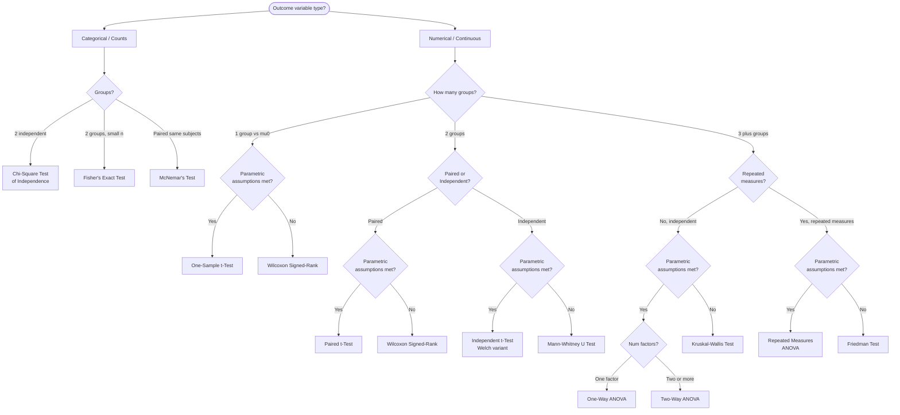

# 📊 Hypothesis Testing

> [!abstract] TL;DR
> Hypothesis testing is the principled framework for deciding whether an observed difference in data is real or just random noise — it underpins A/B testing, model comparison, feature selection, and any experiment where you need to separate signal from chance.

---

## Intuition

**Analogy:** Imagine you flip a coin 100 times and get 60 heads. Is the coin unfair? You would not immediately conclude so — 60 heads *could* happen by chance with a fair coin. Hypothesis testing is the formal procedure to answer this: how *surprised* should you be by 60 heads if the coin were truly fair? If that result would be very rare under a fair-coin assumption (say, probability < 5%), you conclude the coin is likely unfair. If it is not that rare, you shrug and call it random variation.

Every A/B test, every comparison of two ML models, every feature importance study uses this same logic: assume the boring null explanation ("nothing is different"), then ask how surprising your data would be under that assumption.

---

## How It Works

### Core Mechanics

**The Four Players:**

1. **Null Hypothesis (H₀):** The status quo — no effect, no difference. "The two groups have the same mean." "Feature X has zero weight." You try to *reject* H₀; you never "prove" it.
2. **Alternative Hypothesis (H₁):** What you are trying to show. "Model A has higher AUC than Model B." Can be one-sided (H₁: μ_A > μ_B) or two-sided (H₁: μ_A ≠ μ_B).
3. **Test Statistic:** A single number computed from the data that measures how far the observation is from what H₀ predicts. Under H₀, it follows a known distribution (t, F, χ², z).
4. **p-value:** The probability of observing a test statistic *at least as extreme* as the one computed, **assuming H₀ is true**. Small p = data is surprising under H₀.

**Error Types and Power:**

| Decision | H₀ True | H₀ False |
|----------|---------|---------|
| Reject H₀ | **Type I Error (α)** — False Positive | Correct — True Positive |
| Fail to Reject H₀ | Correct — True Negative | **Type II Error (β)** — False Negative |

- **α (significance level):** Probability of falsely rejecting a true H₀. Set *before* running the test. Conventional: 0.05. Lowering α reduces false positives but increases β.
- **β:** Probability of failing to reject a false H₀. Typically tolerated at 0.20.
- **Power (1 − β):** Probability of correctly detecting a real effect. Well-designed studies target ≥ 0.80.

> [!warning] p-value Misconceptions — Read This Carefully
> - p-value is **NOT** P(H₀ is true).
> - p-value is **NOT** the probability the result is due to chance.
> - p < 0.05 does **NOT** mean the effect is large or practically important.
> - p > 0.05 does **NOT** mean H₀ is true — it means you lack sufficient evidence to reject it.
>
> **What it IS:** P(observing data this extreme or more | H₀ is true). A conditional probability about the *data*, not about the *hypothesis*.

Standard significance thresholds: α = 0.05 (conventional), α = 0.01 (stricter), α = 0.005 (recommended by Benjamin et al. 2018 in response to the replication crisis).

### Flow / Architecture — Choosing the Right Test



*Parametric assumptions: approximate normality (guaranteed by CLT for n ≥ 30) and homogeneity of variance (check with Levene's test).*

---

## Parametric Tests

**One-Sample t-Test:** Compare a sample mean to a known reference value μ₀.
- Test statistic: t = (x̄ − μ₀) / (s / √n), df = n − 1.

**Independent Two-Sample t-Test:** Compare means of two unrelated groups.
- Use Welch's variant (`equal_var=False` in scipy) when variance equality is uncertain — this is the safe default.
- Test statistic: t = (x̄₁ − x̄₂) / SE_pooled, df approximated via Welch-Satterthwaite equation.

**Paired t-Test:** Compare two measurements on the *same* subjects (before/after, matched pairs).
- Reduces to a one-sample t-test on the *differences* dᵢ = x_{1i} − x_{2i}. Removes between-subject variance, giving higher power than an independent t-test for the same n.

**One-Way ANOVA:** Test whether means differ across 3+ independent groups with one categorical factor.
- F = (between-group variance) / (within-group variance). A large F means between-group differences dominate noise.
- ANOVA is an omnibus test — a significant F only tells you *some* groups differ. Run post-hoc tests (Tukey HSD, Bonferroni-corrected pairwise t-tests) to identify *which* pairs.

**Two-Way ANOVA:** Two categorical factors and their interaction.
- Tests three things simultaneously: main effect of factor A, main effect of factor B, A×B interaction.
- Interaction: the effect of A depends on the level of B (e.g., a drug's efficacy differs by patient sex). A significant interaction makes main effects hard to interpret in isolation.

---

## Non-Parametric Alternatives

Use when: data is ordinal, n < 30, distribution is non-normal or heavy-tailed, or outliers are severe.

| Parametric Test | Non-Parametric Equivalent | Null Hypothesis |
|-----------------|--------------------------|-----------------|
| One-sample t | Wilcoxon Signed-Rank | Median = reference value |
| Paired t-test | Wilcoxon Signed-Rank | Median of differences = 0 |
| Independent t | Mann-Whitney U | Distributions are equal |
| One-way ANOVA | Kruskal-Wallis | All group distributions are equal |
| Repeated measures ANOVA | Friedman Test | All condition distributions are equal |

Non-parametric tests rank the data and test whether rank distributions differ. They sacrifice a small amount of power when normality holds — Mann-Whitney U has asymptotic relative efficiency of 0.955 vs the t-test under normality, meaning you need ~5% more samples to achieve the same power. For non-normal data, non-parametric tests can be *more* powerful.

---

## Categorical Tests

**Chi-Square Test of Independence:** Do two categorical variables co-vary? Observed vs expected cell counts under the independence assumption; χ² = Σ (O − E)² / E.
- Requires expected count ≥ 5 in every cell. If violated, use Fisher's exact test.

**Fisher's Exact Test:** Computes the exact probability for 2×2 contingency tables with small expected counts. Computationally expensive for larger tables; chi-square is fine when n is large.

**McNemar's Test:** For matched/paired binary data. Example: did the *same* users convert before and after a feature launch?
- Only examines discordant pairs (b = was 0, now 1; c = was 1, now 0).
- McNemar χ² = (b − c)² / (b + c). If b ≈ c, the intervention had no net effect.

---

## Multiple Testing Problem

Running 20 independent tests at α = 0.05 gives an expected false-positive rate of 1 − (0.95)²⁰ ≈ 64%. This is the **Family-Wise Error Rate (FWER)** explosion. Three corrections of increasing practicality:

**1. Bonferroni:** Set α_adjusted = α / m (m = number of tests). Simple but very conservative — inflates Type II errors substantially when m is large. Best when false positives are extremely costly (e.g., clinical trials).

**2. Holm-Bonferroni (step-down):** Sort p-values ascending p₁ ≤ p₂ ≤ … ≤ pₘ. Reject H₀ᵢ if pᵢ ≤ α / (m − i + 1). Uniformly more powerful than Bonferroni while still controlling FWER exactly.

**3. Benjamini-Hochberg (FDR):** Controls the **False Discovery Rate** — the expected proportion of false rejections *among all rejections* — rather than the probability of any false rejection. Sort ascending; reject H₀ᵢ where pᵢ ≤ (i / m) × q (q = desired FDR, typically 0.05 or 0.10). Standard in genomics, large-scale feature selection, and any setting where some false positives are acceptable in exchange for higher power.

| Method | Controls | Power | Best For |
|--------|---------|-------|---------|
| Bonferroni | FWER | Lowest | Clinical trials, small m |
| Holm-Bonferroni | FWER | Medium | General use, moderate m |
| Benjamini-Hochberg | FDR | Highest | Feature selection, genomics, large m |

---

## Effect Size

**A statistically significant result can be practically meaningless.** With n = 1,000,000 observations, a 0.001-point difference in means will be statistically significant. Effect size quantifies the *magnitude* of the difference independent of sample size.

| Measure | Formula | Context | Small / Medium / Large |
|---------|---------|---------|----------------------|
| Cohen's d | (μ₁ − μ₂) / s_pooled | Continuous, two groups | 0.2 / 0.5 / 0.8 |
| Cohen's h | 2 arcsin(√p₁) − 2 arcsin(√p₂) | Proportions | 0.2 / 0.5 / 0.8 |
| eta-squared (η²) | SS_between / SS_total | ANOVA | 0.01 / 0.06 / 0.14 |
| omega-squared (ω²) | Bias-corrected η² | ANOVA (preferred) | same thresholds |

**Rule:** Always report both p-value and effect size. A result can be *statistically significant but practically irrelevant* (d = 0.05 at n = 1M), or *practically important but not yet detected* (d = 0.8 at n = 5 — underpowered). Effect size and confidence intervals carry more information than the binary reject/fail-to-reject decision.

---

## A/B Testing in ML and Product

### Sample Size Calculation

Before launching any test, compute the minimum sample size needed to detect a minimum detectable effect (MDE) with desired power:

```
n = 2 × (z_{α/2} + z_β)² × σ² / δ²
```

Where δ is the minimum effect you care about detecting, σ is the standard deviation, z_{α/2} = 1.96 for α = 0.05 (two-tailed), z_β = 0.84 for 80% power.

Running the test without this calculation is the single most common cause of underpowered, inconclusive experiments.

### The Peeking Problem

Checking results daily and stopping the test the moment p < 0.05 inflates the false positive rate to ~26% even when nominally using α = 0.05. Each peek is an additional test — alpha is spent repeatedly.

**Fixes:**
- **Pre-register** the sample size and stopping criteria before data collection.
- **Sequential testing / Alpha spending:** Pocock, O'Brien-Fleming, or Lan-DeMets alpha-spending functions allow planned interim looks while controlling FWER.
- **Always Valid Inference (e-values):** Johari et al. (2022) framework allows continuous monitoring with valid inference at any point — increasingly common in industry experimentation platforms.

### Bayesian Alternative

Instead of "is there a significant difference?" Bayesian testing asks "what is the probability that variant B is better than A?" — a more directly actionable question.

- Model conversion as Beta distribution; update posterior with each observation.
- Decision criterion: P(θ_B > θ_A) > 0.95 (or business-specific threshold).
- **Advantage:** No peeking problem; posterior is always valid; can incorporate prior business knowledge; outputs a probability stakeholders can act on.
- **Disadvantage:** Results depend on prior; harder to audit; does not guarantee FWER control across many simultaneous experiments.

---

## Code Demo

```python
import numpy as np
from scipy import stats
from statsmodels.stats.power import TTestIndPower, NormalIndPower
from statsmodels.stats.proportion import proportion_effectsize
from statsmodels.stats.multitest import multipletests

rng = np.random.default_rng(42)

# ── 1. One-sample t-test: is the sample mean different from 0? ────────────────
sample = rng.normal(loc=0.3, scale=1.0, size=50)
t_stat, p_val = stats.ttest_1samp(sample, popmean=0)
cohen_d = (sample.mean() - 0) / sample.std(ddof=1)
print(f"One-sample t-test: t={t_stat:.3f}, p={p_val:.4f}, Cohen's d={cohen_d:.3f}")

# ── 2. Independent two-sample t-test (Welch's — safe default) ────────────────
control   = rng.normal(loc=10.0, scale=2.0, size=100)
treatment = rng.normal(loc=10.8, scale=2.2, size=100)
t_stat, p_val = stats.ttest_ind(control, treatment, equal_var=False)
s_pooled = np.sqrt((control.std(ddof=1)**2 + treatment.std(ddof=1)**2) / 2)
cohen_d = (treatment.mean() - control.mean()) / s_pooled
print(f"\nWelch two-sample t-test: t={t_stat:.3f}, p={p_val:.4f}, Cohen's d={cohen_d:.3f}")

# ── 3. Paired t-test: before / after same subjects ────────────────────────────
before = rng.normal(loc=5.0, scale=1.0, size=30)
after  = before + rng.normal(loc=0.5, scale=0.5, size=30)
t_stat, p_val = stats.ttest_rel(before, after)
print(f"\nPaired t-test: t={t_stat:.3f}, p={p_val:.4f}")

# ── 4. Mann-Whitney U (non-parametric, skewed data) ───────────────────────────
skewed_ctrl  = rng.exponential(scale=1.0, size=50)
skewed_treat = rng.exponential(scale=1.4, size=50)
u_stat, p_val = stats.mannwhitneyu(skewed_ctrl, skewed_treat, alternative="two-sided")
print(f"\nMann-Whitney U: U={u_stat:.1f}, p={p_val:.4f}")

# ── 5. Chi-square test of independence ────────────────────────────────────────
# 2x2 contingency: [converted, not_converted] for control vs treatment
observed = np.array([[45, 155],   # control:   45/200 conversions
                     [60, 140]])   # treatment: 60/200 conversions
chi2, p_val, dof, expected = stats.chi2_contingency(observed)
print(f"\nChi-square: chi2={chi2:.3f}, p={p_val:.4f}, dof={dof}")
print(f"Expected cell counts:\n{np.round(expected, 1)}")

# ── 6. Power analysis: sample size before running an experiment ───────────────
# Continuous metric: detect Cohen's d = 0.3 with 80% power at alpha = 0.05
analysis = TTestIndPower()
n_cont = analysis.solve_power(effect_size=0.3, alpha=0.05, power=0.8,
                               ratio=1.0, alternative="two-sided")
print(f"\nRequired n per arm (d=0.3, power=80%, α=0.05): {n_cont:.0f}")

# Proportion metric: baseline 10% conversion, MDE = 2 percentage points (to 12%)
h = proportion_effectsize(0.10, 0.12)
n_prop = NormalIndPower().solve_power(effect_size=h, alpha=0.05, power=0.8)
print(f"Required n per arm (10%→12% CVR, power=80%, α=0.05): {n_prop:.0f}")

# ── 7. Multiple testing correction ────────────────────────────────────────────
p_values = np.array([0.001, 0.008, 0.039, 0.041, 0.210, 0.399, 0.500, 0.950])
print(f"\nRaw p-values: {np.round(p_values, 3)}")

reject_bonf, _, _, _ = multipletests(p_values, alpha=0.05, method="bonferroni")
reject_holm, _, _, _ = multipletests(p_values, alpha=0.05, method="holm")
reject_bh,   _, _, _ = multipletests(p_values, alpha=0.05, method="fdr_bh")

print(f"Bonferroni reject: {reject_bonf}")
print(f"Holm reject:       {reject_holm}")
print(f"BH (FDR) reject:   {reject_bh}")
# BH rejects more hypotheses — it controls FDR rather than FWER
```

---

## Real-World Example

> **Example:** Netflix's experimentation platform runs hundreds of simultaneous A/B tests. When testing a new recommendation algorithm, they use a **Welch two-sample t-test** on watch-time per user across control and treatment groups. They pre-register sample sizes via power analysis targeting δ = 2-minute improvement in daily watch-time (σ ≈ 30 minutes), 80% power, α = 0.05 — yielding roughly 3,500 users per arm. To handle 200+ simultaneous experiments they apply **Benjamini-Hochberg FDR correction**. Critically, they evaluate **Cohen's d** alongside p-values: a test reaching p = 0.003 with d = 0.04 is **rejected** (not shipped) despite statistical significance, because a 1-second improvement in watch-time does not justify engineering cost. Their experimentation platform also implements **always-valid inference** to avoid the peeking problem during extended tests.

---

## Trade-offs

| Aspect | Frequentist | Bayesian |
|--------|-------------|---------|
| **Interpretability** | p-value and CIs are industry-standard; well-understood by statisticians | "P(B > A) = 93%" is directly actionable for product decisions |
| **Stopping rules** | Fixed sample size required; peeking inflates α; needs sequential corrections | No peeking problem — posterior is valid at any sample size |
| **Prior sensitivity** | Prior-free; results are objective and reproducible | Conclusions depend on the prior; a wrong prior can mislead |
| **Prior as business knowledge** | Cannot incorporate prior knowledge formally | Prior encodes historical baseline rates or past experiment results |
| **Multiple testing** | Explicit correction required (Bonferroni, BH) | Natural shrinkage via prior; no explicit correction needed |
| **Computational cost** | Closed-form test statistics; instantaneous | Requires conjugate approximations or MCMC sampling |
| **Null hypothesis** | Can only reject H₀; cannot "accept" it | Can compute P(H₀) directly from the posterior |

---

## When to Use vs Avoid

**Use when:**
- Comparing two model versions with live production traffic (A/B test)
- Determining whether a feature engineering change has a measurable effect on a metric
- Detecting data or concept drift statistically (KS test, chi-square on distribution bins)
- Performing feature selection: testing whether a feature's distribution differs across target classes
- Validating that a refactor has not degraded model performance (paired t-test on cross-validation fold scores)

**Avoid when:**
- Confounding variables are not controlled — you can detect correlation but not establish causation
- You have no estimate of expected effect size and cannot compute a meaningful sample size before starting
- Data violates independence (autocorrelated time series, clustered data with multiple rows per user) — standard errors will be underestimated and p-values misleading
- You need continuous real-time decisions — consider multi-armed bandit algorithms instead

---

## Common Pitfalls

- **p-hacking** — Running many comparisons, applying multiple transformations, or sub-setting data until p < 0.05 appears. Every test at α = 0.05 adds a ~5% false-positive chance. Fix: pre-register your hypothesis, outcome metric, and analysis plan before collecting data; apply multiple testing correction.
- **HARKing (Hypothesizing After Results are Known)** — Formulating the hypothesis to fit the result after seeing data, then presenting it as confirmatory research. Statistically indistinguishable from p-hacking; inflates false discovery rates in published literature. Fix: strict pre-registration or clearly labeling exploratory vs confirmatory analyses.
- **Ignoring practical vs statistical significance** — A model improvement can be statistically significant but economically irrelevant (e.g., +0.0002 AUC at n = 5M). Always report effect size (Cohen's d, Cohen's h, η²) alongside p-values and let business impact drive the final decision.
- **Underpowered studies** — Running a test too short or with too few users means you cannot reliably detect real effects (high β). A non-significant result from an underpowered study is uninformative — it is *not* evidence of no effect. Fix: compute the required sample size via power analysis *before* launching the experiment.
- **Misinterpreting the p-value** — Treating p = 0.049 as strong evidence of an effect, or p = 0.051 as proof of none. p-values do not measure evidence strength continuously; report the full confidence interval and effect size instead.
- **Violating the independence assumption** — Applying a t-test when each user contributes multiple rows (pageviews, sessions). Each independent unit contributes one data point; aggregate to the user level first or use a mixed-effects model.

---

## Related Concepts

- [[_MOC_Foundations|↑ Section MOC]]

- [[Probability_and_Statistics]] — the parent framework: sampling distributions, CLT, and Bayes' theorem are the mathematical foundation of every test statistic and p-value
- [[AB_Testing_for_ML]] — direct engineering application: how hypothesis testing (t-test, chi-square, power analysis) is operationalised to compare production ML model versions
- [[Cross_Validation]] — comparing models across CV folds requires hypothesis testing (paired t-test on fold scores) to determine whether performance differences are statistically reliable
- [[Classification_Metrics]] — AUC, F1, and precision are the test statistics in ML model comparisons; hypothesis testing determines whether differences between two models' metrics are significant
- [[Bias_Variance_Tradeoff]] — underpowered tests exhibit high variance in their reject/fail-to-reject decisions; effect size (Cohen's d) maps directly onto signal-to-noise ratio concepts central to bias-variance
- [[Information_Theory]] — the log-likelihood ratio test and goodness-of-fit tests are grounded in KL divergence; chi-square statistics arise from comparing observed vs expected entropy
- [[Data_Drift]] — statistical tests (Kolmogorov-Smirnov, chi-square, Population Stability Index) are the primary tools used to detect distribution shift between training and serving data

---

## Review Questions

1. **Type I vs Type II Errors:** Your fraud detection team runs an A/B test comparing two models. They set α = 0.001 to be very conservative. How does this choice affect the probability of a Type II error, and what would you need to do to maintain 80% power without sacrificing the strict α?

2. **Test Selection:** You have 25 users — you measured their session duration before and after a UI redesign. The duration data is right-skewed (median 2 min, mean 8 min, max 90 min). Which test would you choose and why? What would change if you had 200 users?

3. **Multiple Testing Correction:** You run 50 statistical tests across 50 different features to identify which ones significantly differ between two user segments. You find 8 with p < 0.05. Why is this result misleading, and how many false positives would you expect? Which correction method would you choose if you want to control the false discovery rate at 10%, and why is it more appropriate than Bonferroni here?

4. **Effect Size vs p-value:** Two teams each run an A/B test on a new recommendation feature. Team A: n = 50 per arm, p = 0.06, Cohen's d = 0.7. Team B: n = 5,000 per arm, p = 0.002, Cohen's d = 0.04. Which team's result is more practically valuable, what does each tell you, and what would you recommend to each team as a next step?

---

## Sources

- [Cohen, J. (1988) — Statistical Power Analysis for the Behavioral Sciences](https://www.taylorfrancis.com/books/mono/10.4324/9780203771587/statistical-power-analysis-behavioral-sciences-jacob-cohen)
- [Benjamin et al. (2018) — Redefine Statistical Significance, Nature Human Behaviour](https://www.nature.com/articles/s41562-017-0189-z)
- [Johari et al. (2022) — Always Valid Inference: Continuous Monitoring of A/B Tests](https://arxiv.org/abs/1512.04922)
- [VanderPlas, J. — Frequentism and Bayesianism: A Practical Introduction](https://jakevdp.github.io/blog/2014/03/11/frequentism-and-bayesianism-a-practical-intro/)
- [scipy.stats documentation](https://docs.scipy.org/doc/scipy/reference/stats.html)
- [statsmodels stats documentation](https://www.statsmodels.org/stable/stats.html)
- [Wasserstein & Lazar (2016) — The ASA Statement on p-values](https://www.tandfonline.com/doi/full/10.1080/00031305.2016.1154108)

---

#statistics #hypothesis-testing #inferential-statistics #ab-testing
