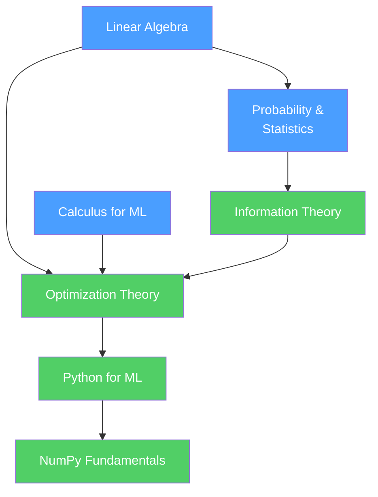

# 🗺️ Foundations — Map of Content

> [!info] How to use this map
> Start with Fundamentals, follow the arrows, and use the Learning Path below as your guide.
> Each node links to a full note. Come back here when you feel lost.

---

## Concept Map

*(Blue = fundamental, Green = intermediate)*

---

## Learning Path

1. [[Linear_Algebra]] — start here; vectors and matrices are the language every ML algorithm speaks. Understand dot products, matrix multiplication, eigenvalues, and SVD before anything else.
2. [[Calculus_for_ML]] — derivatives and the chain rule are what make gradient descent work. Cover partial derivatives and the Jacobian before moving to optimization.
3. [[Probability_and_Statistics]] — ML is fundamentally about uncertainty. Distributions, Bayes' theorem, and MLE/MAP explain *why* loss functions are what they are.
4. [[Information_Theory]] — entropy and KL divergence extend probability into information measurement. Cross-entropy loss and the concept of model surprise live here.
5. [[Optimization_Theory]] — the rigorous theory behind gradient descent: convexity, convergence guarantees, saddle points, and why Adam works better than vanilla SGD in practice.
6. [[Python_for_ML]] — translate all the math above into executable code. Covers the Python ML ecosystem, NumPy broadcasting, and Pandas for data wrangling.
7. [[NumPy_Fundamentals]] — the workhorse of numerical ML in Python. Vectorization, broadcasting, and array operations that underpin every ML framework.

---

## All Notes in This Section

### Math

| Note | Core Idea | Difficulty |
|------|-----------|------------|
| [[Linear_Algebra]] | Vectors, matrices, eigendecomposition, SVD — the language of ML transformations | Intermediate |
| [[Calculus_for_ML]] | Derivatives, partial derivatives, chain rule — the mathematical engine of gradient descent | Intermediate |
| [[Probability_and_Statistics]] | Distributions, Bayes' theorem, MLE, MAP — principled reasoning under uncertainty | Beginner |
| [[Information_Theory]] | Entropy, KL divergence, mutual information — measuring and comparing distributions | Intermediate |
| [[Optimization_Theory]] | Convexity, gradient descent convergence, saddle points — the theory of how models learn | Intermediate |

### CS Fundamentals

| Note | Core Idea | Difficulty |
|------|-----------|------------|
| [[Python_for_ML]] | Python ecosystem, scientific libraries, coding best practices for ML projects | Beginner |
| [[NumPy_Fundamentals]] | N-dimensional arrays, broadcasting, vectorization — Python's matrix computation engine | Beginner |

---

## Key Questions This Section Answers

- What mathematical prerequisites do I need before studying machine learning algorithms?
- How is the chain rule related to training neural networks?
- Why is cross-entropy a better loss function for classification than MSE? (Hint: Information Theory)
- What is the probabilistic interpretation of L1 and L2 regularization? (Hint: MAP estimation with Laplace/Gaussian priors)
- When can a linear system be solved in closed form, and when must you use gradient descent?
- How does the covariance matrix connect linear algebra to probability theory?
- What does it mean for an optimization problem to be "convex," and why does it matter for ML training?

---

## Connections to Other Sections

- [[_MOC_Classical_ML]] — optimization theory (gradient descent) and probability (Naive Bayes, MLE) directly power classical ML algorithms; linear algebra enables PCA and SVM
- [[_MOC_Deep_Learning]] — every neural network layer is a matrix multiply (`Wx + b`); backpropagation is the chain rule applied recursively; weight initialization relies on variance analysis from probability

---

#MOC #AI-ML #Foundations
