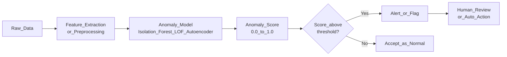

# Anomaly Detection

> [!abstract] TL;DR
> Anomaly detection finds the rare items or events that deviate significantly from expected behavior — without needing labeled examples of "wrong." It powers fraud detection, network intrusion systems, manufacturing quality control, and medical diagnosis by learning the shape of normal, then flagging whatever does not fit.

---

## Intuition

**Analogy:** Imagine a quality control inspector at a bottle factory. She does not memorize every possible defect — she learns what a perfect bottle looks and feels like. When a bottle rolls past that is slightly too light, has a faint crack, or feels asymmetric, she flags it. She never saw that exact defect in training. She just knows it does not match normal.

That is anomaly detection in one sentence: **learn what normal looks like, then flag what does not fit.** The critical insight is that you often have abundant examples of normal behavior and very few — or zero — labeled anomaly examples, so supervised classification cannot be applied directly.

---

## How It Works

### Types of Anomalies

**Point anomaly** — a single data point deviates from the rest of the dataset. The most common type.
- Example: a $50,000 transaction on a card that normally sees $50 purchases.

**Contextual anomaly** — a point is anomalous only given its context, not in isolation.
- Example: 30°C is perfectly normal in summer but anomalous in January in Minnesota. The value is not inherently extreme; the surrounding context makes it so.
- Time series and spatial data are the main sources of contextual anomalies.

**Collective anomaly** — a group of individually normal-looking points is collectively anomalous.
- Example: each individual HTTP request is fine; 10,000 requests from one IP in one second is a DDoS attack. Each small card transaction is plausible; a sequence of them at different merchants in 60 seconds is card-testing fraud.

---

### Anomaly Detection vs Classification

| Aspect | Classification | Anomaly Detection |
|--------|---------------|-------------------|
| Labels required | Both classes labeled | Only "normal" class needed |
| Class ratio | Can be balanced | Anomalies may be 0.01% of data |
| Novel anomaly types | Fails on unseen attack types | Generalizes by design |
| Model goal | Learn boundary between classes | Learn boundary of the normal class |

The critical difference: a supervised fraud classifier trained on historical fraud patterns fails on new fraud tactics it has never seen. An anomaly detector trained only on legitimate transactions flags novel attacks because anything sufficiently far from normal is suspicious — regardless of whether that anomaly type appeared in training.

---

### Core Methods

#### 1. Statistical Methods

**Z-score:**
Flag a point $x$ as anomalous if it lies more than $k$ standard deviations from the mean:
$$z = \frac{x - \mu}{\sigma}, \quad \text{flag if } |z| > 3$$
Fast and interpretable, but assumes Gaussian distribution and evaluates each feature independently. Fails on multimodal, skewed, or multivariate data.

**IQR-based:**
Define bounds using the interquartile range:
$$\text{Lower} = Q_1 - 1.5 \times IQR, \quad \text{Upper} = Q_3 + 1.5 \times IQR$$
More robust than Z-score for skewed distributions. Still univariate — each feature is checked independently. The standard algorithm behind box-plot whiskers.

**Grubbs test:**
A formal hypothesis test for whether the single most extreme deviation in a dataset is statistically significant, under the assumption of normality. Appropriate for batch testing a small sample; not designed for streaming or multivariate data.

**CUSUM (Cumulative Sum):**
Designed for sequential data. Accumulates signed deviations from a target mean $\mu_0$:
$$S_t^+ = \max(0,\; S_{t-1}^+ + (x_t - \mu_0 - k))$$
$$S_t^- = \max(0,\; S_{t-1}^- + (\mu_0 - x_t - k))$$
Raises an alert when $S_t^+$ or $S_t^-$ exceeds threshold $h$. Detects persistent small shifts that Z-score misses entirely — for example, a sensor slowly drifting over hours rather than spiking suddenly.

---

#### 2. Distance-Based Methods

**k-NN Anomaly Score:**
The anomaly score is the distance from a point to its $k$-th nearest neighbor:
$$\text{score}(x) = d(x,\; x^{(k)})$$
Points far from all their neighbors (large $d_k$) are anomalies. No training phase; no assumptions about distribution. Scales poorly to large datasets ($O(n^2)$ without ANN indexing) and degrades in high dimensions due to the curse of dimensionality.

**Local Outlier Factor (LOF):**
LOF compares a point's local density to the local densities of its neighbors. A point in a low-density pocket surrounded by high-density neighbors is anomalous; a point in a uniformly sparse region is not.

$$\text{LOF}_k(p) = \frac{\overline{\text{lrd}_k(o)}\;_{o \in N_k(p)}}{\text{lrd}_k(p)}$$

where $\text{lrd}_k(p)$ is the local reachability density of point $p$.
- LOF $\approx$ 1: same density as neighbors — normal.
- LOF $\gg$ 1: much lower density than neighbors — anomaly.

LOF handles datasets with clusters of varying density, something a flat k-NN score cannot do.

---

#### 3. Isolation Forest

**Core idea:** anomalies are isolated in fewer random splits than normal points.

**Algorithm:**
1. Randomly select a feature, then randomly select a split value between that feature's min and max.
2. Recurse until each point is isolated in its own leaf.
3. Build a forest of `n_estimators` such trees.
4. The anomaly score is based on average path length to isolation — a shorter path means the point was easy to isolate, which means it is anomalous:
$$s(x, n) = 2^{-\,E[h(x)]\,/\,c(n)}$$
where $c(n) = 2H(n-1) - \frac{2(n-1)}{n}$ is the expected path length for a dataset of size $n$.

**Why it works:** anomalies live in sparse regions of feature space. A random cut is far more likely to isolate them than normal points, which are surrounded by similar points and require many cuts to separate.

**Why it dominates in practice:** runs in $O(n \log n)$, works well in high dimensions, requires no distance computation, handles mixed feature types, and is robust to a small fraction of contamination in the training set. Isolation Forest is the most widely deployed unsupervised anomaly detector in production systems.

---

#### 4. One-Class SVM

One-Class SVM learns a decision boundary around the normal training data in kernel space. At inference, points outside the boundary are flagged as anomalies.

The objective: find a hyperplane separating the training data from the origin with the maximum margin. The hyperparameter $\nu$ controls the fraction of training points allowed to fall inside the margin — it is your estimate of the contamination fraction:

$$\min_{w,\,\xi,\,\rho} \;\frac{1}{2}\|w\|^2 - \rho + \frac{1}{\nu n}\sum_i \xi_i$$

Works well when the normal data has a clear, compact structure in kernel space. Sensitive to kernel choice (RBF is the default) and $\nu$. Does not scale beyond roughly $10^5$ training samples — use Isolation Forest for larger datasets.

---

#### 5. Autoencoders for Anomaly Detection

Train an [[Autoencoders|autoencoder]] on normal data only. The network learns to compress and reconstruct the patterns it has seen. At inference:

- **Normal inputs:** the model has internalized their structure and reconstructs them accurately — low reconstruction error.
- **Anomalies:** the model was never trained on their structure — high reconstruction error.

$$\text{score}(x) = \|x - \hat{x}\|^2, \qquad \hat{x} = \text{Decoder}(\text{Encoder}(x))$$

Particularly powerful for high-dimensional inputs (images, vibration spectrograms, multivariate sensor arrays) where statistical or distance methods break down completely. Industrial defect detection (AWS Lookout for Equipment, NVIDIA Metropolis) uses this pattern at scale.

---

#### 6. LSTM Sequence Anomaly Detection

For time series data, train an [[RNN_and_LSTM|LSTM]] to predict the next value given the history. The anomaly score at time $t$ is the prediction residual:

$$\text{score}(t) = |x_t - \hat{x}_t|$$

A large residual means the model could not predict what actually happened — the observation was anomalous given its temporal context. This naturally handles **contextual anomalies**: a value of 30°C is predicted to be normal in July and anomalous in January, because the model has learned the seasonal pattern. Statistical methods with no temporal memory cannot make this distinction.

---

#### 7. Embeddings and Clustering

For unstructured data where raw features are not directly comparable:
1. Embed the data using a pre-trained encoder (sentence transformers for text, vision encoders for images, domain-trained embeddings for logs or events).
2. Fit a clustering model ([[KMeans]], [[DBSCAN]]) on the embeddings from normal training data.
3. At inference, compute each point's distance to its nearest cluster centroid.
4. Points far from all centroids are anomalous.

This approach brings the power of semantic similarity to anomaly detection — two log lines that look lexically different can be near each other in embedding space if they have similar meaning, and a truly unusual log event will be far from all clusters.

---

#### 8. LLM-Based Log Anomaly Detection

For structured or semi-structured text data (system logs, API traces, error messages):
1. Embed log lines using an [[Embedding_Models|embedding model]] (sentence-transformers, OpenAI `text-embedding-3-small`).
2. Build a reference distribution (mean and covariance, or a set of cluster centroids) from normal logs.
3. At inference, flag lines whose embeddings are statistically far from the normal distribution (e.g., Mahalanobis distance above threshold).

Alternatively, zero-shot: prompt an LLM with representative normal log lines and ask whether a candidate line is anomalous. Works surprisingly well at low volume but is not scalable to millions of events per second.

---

### Flow / Architecture



---

## Code Demo

```python
import numpy as np
from sklearn.ensemble import IsolationForest
from sklearn.neighbors import LocalOutlierFactor
from sklearn.preprocessing import StandardScaler
from sklearn.datasets import make_blobs
from sklearn.metrics import classification_report, average_precision_score
from sklearn.metrics import precision_recall_curve

# ============================================================
# 1. Synthetic dataset: dense normal cluster + scattered anomalies
# ============================================================
rng = np.random.RandomState(42)
X_normal, _ = make_blobs(n_samples=1000, centers=1, cluster_std=0.5, random_state=42)
X_anomaly = rng.uniform(low=-6, high=6, size=(20, 2))  # 20 scattered anomalies (~2%)

X_all = np.vstack([X_normal, X_anomaly])
# sklearn convention: 1 = normal, -1 = anomaly
y_true = np.array([1] * 1000 + [-1] * 20)
y_binary = (y_true == -1).astype(int)  # for AUC-PR: 1 = anomaly

scaler = StandardScaler()
X_scaled = scaler.fit_transform(X_all)

# ============================================================
# 2. Isolation Forest
# ============================================================
iso_forest = IsolationForest(
    n_estimators=200,
    contamination=0.02,     # expected fraction of anomalies in data
    max_samples="auto",
    random_state=42,
    n_jobs=-1,
)
iso_forest.fit(X_scaled)

y_pred_iso = iso_forest.predict(X_scaled)       # 1 = normal, -1 = anomaly
iso_scores = iso_forest.decision_function(X_scaled)  # higher = more normal

print("=== Isolation Forest ===")
print(classification_report(y_true, y_pred_iso, target_names=["Anomaly", "Normal"]))
ap_iso = average_precision_score(y_binary, -iso_scores)  # negate: higher = more anomalous
print(f"Average Precision (AUC-PR): {ap_iso:.4f}")

# ============================================================
# 3. Local Outlier Factor
# ============================================================
lof = LocalOutlierFactor(
    n_neighbors=20,
    contamination=0.02,
    novelty=False,   # transductive: scores the training data
    n_jobs=-1,
)
y_pred_lof = lof.fit_predict(X_scaled)
lof_scores = -lof.negative_outlier_factor_  # higher = more anomalous

print("\n=== Local Outlier Factor ===")
print(classification_report(y_true, y_pred_lof, target_names=["Anomaly", "Normal"]))
ap_lof = average_precision_score(y_binary, lof_scores)
print(f"Average Precision (AUC-PR): {ap_lof:.4f}")

# ============================================================
# 4. Statistical baseline: Z-score (per-feature)
# ============================================================
means = X_all.mean(axis=0)
stds = X_all.std(axis=0)
z_scores = np.abs((X_all - means) / stds)
z_max = z_scores.max(axis=1)          # flag if ANY feature exceeds threshold
y_pred_z = np.where(z_max > 3.0, -1, 1)

print("\n=== Z-Score (threshold=3.0) ===")
print(classification_report(y_true, y_pred_z, target_names=["Anomaly", "Normal"]))

# ============================================================
# 5. Threshold tuning: hit a target recall in production
# ============================================================
# In operations: choose the threshold that catches >= 95% of anomalies,
# then accept whatever precision that implies (trade-off decision).
precision_vals, recall_vals, thresholds = precision_recall_curve(
    y_binary, -iso_scores
)
target_recall = 0.95
# Find the index where recall first reaches the target
idx = np.searchsorted(-recall_vals[::-1], -target_recall)
idx = len(recall_vals) - 1 - idx
if idx < len(thresholds):
    print(f"\nOperating point for recall >= {target_recall}:")
    print(f"  Score threshold: {-thresholds[idx]:.4f}  (decision_function scale)")
    print(f"  Precision: {precision_vals[idx]:.4f}")
    print(f"  Recall:    {recall_vals[idx]:.4f}")

# ============================================================
# 6. Novelty detection on new data (Isolation Forest supports this natively)
# ============================================================
X_new = np.array([[0.1, 0.2],   # close to normal cluster center -> normal
                  [5.5, 5.5]])  # far from everything -> anomaly
X_new_scaled = scaler.transform(X_new)
new_preds = iso_forest.predict(X_new_scaled)
new_scores = iso_forest.decision_function(X_new_scaled)
for i, (pred, score) in enumerate(zip(new_preds, new_scores)):
    label = "Normal" if pred == 1 else "ANOMALY"
    print(f"New point {i}: {label} (decision score={score:.3f})")
```

---

## Real-World Example

> **Stripe Radar (Fraud Detection):** Every incoming payment is scored in under 100ms. Anomaly detection forms the first layer — a model trained on normal transaction patterns (amount, merchant category, velocity, device fingerprint, location history) flags transactions whose feature vectors deviate significantly from that cardholder's established baseline. Only flagged transactions escalate to heavier rule-based and ensemble checks. See [[Fraud_Detection_System]] for the full cascade architecture.

> **AWS Lookout for Equipment (Manufacturing):** Trains an autoencoder on months of sensor data from healthy industrial machines — turbines, compressors, pumps. When reconstruction error on a live sensor stream exceeds the threshold, the system predicts equipment failure hours or days before breakdown. No labeled failure data is required, only clean normal-operation data from the training period. This is the defining advantage of anomaly detection over supervised classifiers for rare, costly failure modes.

---

## Trade-offs

| Method | Strengths | Weaknesses | Best For |
|--------|-----------|------------|----------|
| Z-score / IQR | Instant, interpretable, zero training | Assumes Gaussian, univariate only | Simple univariate monitoring |
| k-NN Score | No distributional assumptions | O(n²) inference, breaks in high-D | Small low-dimensional datasets |
| LOF | Handles varying-density clusters | Slow at scale, no easy new-point scoring | Medium-scale tabular data |
| Isolation Forest | Fast, high-D friendly, scalable | Less interpretable, needs contamination estimate | Production tabular/structured data |
| One-Class SVM | Strong theory, kernel flexibility | Slow past 10^5 samples, sensitive to kernel | Medium-scale, compact normal class |
| Autoencoder | Captures complex patterns, high-D data | Requires training, GPU preferred | Images, sensor arrays, spectrograms |
| LSTM Residual | Captures temporal context natively | Requires time series, stateful inference | Time series, sequential logs |
| Embedding + Clustering | Works on unstructured data | Quality depends on embedding model | Text logs, events, images |

---

## When to Use vs Avoid

**Use when:**
- Labeled anomaly examples are scarce or nonexistent.
- You need to detect novel, unseen anomaly types — new fraud tactics, zero-day exploits, new failure modes.
- Anomalies are so rare (<1%) that supervised models collapse to always predicting the majority class.
- The definition of "anomaly" is likely to evolve over time and retraining supervised classifiers is impractical.

**Avoid when:**
- You have abundant labeled examples of both the normal and anomaly class — a supervised classifier will outperform anomaly detection.
- "Anomaly" is a precise, stable, well-scoped category (e.g., a specific known defect type) — use classification.
- Legal or regulatory requirements demand that individual decisions be fully explainable — anomaly scores are harder to defend than rule-based systems or feature-attribution methods.

---

## Evaluation

### Metrics for Rare Anomalies

Standard accuracy is dangerously misleading. If anomalies are 0.1% of data, a model that always predicts "normal" achieves 99.9% accuracy while catching zero anomalies.

**Recommended:**
- **Precision and Recall on the anomaly class** — always report class-level, not macro or weighted averages.
- **Average Precision (AP) / AUC-PR** — area under the precision-recall curve. More informative than ROC-AUC when anomalies are rare, because it focuses on performance in the high-precision operating region where you will actually run the system.
- **ROC-AUC** — useful for ranking competing models, but can be misleadingly high for rare-event problems even when the precision is catastrophically low.
- **F-beta score** ($\beta > 1$) — when missing anomalies is far worse than false alarms (safety systems, medical), upweight recall by choosing $\beta > 1$.

### Handling Extreme Imbalance in Evaluation

When anomalies are 0.1% of data:
1. Never report accuracy. Use precision, recall, F1, and AP.
2. Use stratified splits so every validation fold contains anomaly examples.
3. Tune the decision threshold on a held-out validation set, not on training data. Pick the threshold that achieves your target recall (e.g., catch 95% of anomalies) and accept the resulting precision.
4. Report precision and recall separately — they encode different operational costs: false positives drive investigation costs; false negatives are missed fraud or failures.

See [[Classification_Metrics]] for metric formulas and [[Handling_Imbalanced_Data]] for resampling strategies. See [[ROC_and_AUC]] for AUC-PR interpretation and when it dominates ROC-AUC.

---

## Common Pitfalls

- **Training on contaminated data** — if the "normal" training set contains unlabeled anomalies (common in practice), the model learns a boundary that treats those anomalies as normal and will not flag them at inference. Fix: clean the training data; use a robust method like Isolation Forest that is relatively tolerant of a small contamination fraction.

- **Threshold set on training data** — the anomaly score threshold should be chosen on a held-out validation set. Optimizing it on training data leads to an overly sensitive threshold and excessive false positives in production.

- **Wrong evaluation metric** — reporting accuracy or macro-average F1 makes anomaly detection appear far better than it is. Always report anomaly-class precision and recall separately.

- **Ignoring temporal structure** — for time series data, random train/test splits leak future information into the past, producing optimistic estimates. Always use temporal splits: train on older data, validate/test on newer data. See [[Time_Series_Analysis]].

- **Isolation Forest contamination set too high** — if `contamination` is set higher than the true fraction of anomalies, the model is forced to flag many normal points as anomalies. Estimate contamination from domain knowledge or use `contamination='auto'` and tune the operating threshold separately on a validation set.

- **LOF in transductive mode for production** — `LocalOutlierFactor(novelty=False)` cannot score new data points at inference time; it only scores the training set. Use `novelty=True` if you need to score unseen examples, and train only on clean normal data.

- **Not scaling features for distance-based methods** — k-NN score, LOF, and One-Class SVM all depend on Euclidean distance. Features with large ranges will dominate. Always apply `StandardScaler` before any distance-based anomaly detector.

---

## Related Concepts

- [[_MOC_Classical_ML|Section MOC]]

- [[KNN]] — distance to the k-th nearest neighbor is the simplest anomaly score; LOF extends this concept with local density comparison to handle varying-density data
- [[DBSCAN]] — noise points (label -1) in DBSCAN are effectively anomaly detections; the density-based perspective connects directly to LOF
- [[KMeans]] — clustering normal data and computing distance to the nearest centroid is an embedding-based anomaly approach; far-from-centroid points are flagged
- [[SVM]] — One-Class SVM adapts the SVM margin objective to learn a boundary around normal data only, without a second class
- [[Autoencoders]] — training on normal data and using reconstruction error as the anomaly score; covers standard, denoising, and convolutional variants
- [[RNN_and_LSTM]] — LSTM-based time series anomaly detection uses prediction residuals to capture contextual anomalies that static methods miss
- [[Handling_Imbalanced_Data]] — anomaly evaluation requires imbalance-aware metrics; SMOTE and class-weighting strategies apply when training any downstream classifier on anomaly labels
- [[Classification_Metrics]] — precision, recall, F1, and average precision are the correct metrics for anomaly evaluation; accuracy is not
- [[ROC_and_AUC]] — AUC-PR is more informative than AUC-ROC for rare anomaly classes; the PR curve section explains why
- [[Fraud_Detection_System]] — end-to-end system design showing anomaly detection as a first-layer real-time scorer at production scale
- [[Embedding_Models]] — embeddings enable clustering-based anomaly detection on unstructured text and image data where raw features are not comparable
- [[Time_Series_Analysis]] — contextual and collective anomaly detection are core time series problems; CUSUM and LSTM residuals are the dominant approaches
- [[Scikit_Learn]] — `IsolationForest`, `LocalOutlierFactor`, and `OneClassSVM` are all available in sklearn's `ensemble`, `neighbors`, and `svm` modules respectively

---

## Review Questions

1. You have a dataset of 1 million network connection logs, 0.05% of which are intrusions. You train an Isolation Forest and report 99.95% accuracy. Why is this number meaningless, and what three metrics would you report instead?

2. A product manager asks whether to use a supervised fraud classifier or an anomaly detector. You know that fraud tactics change significantly every six months. Which approach is more appropriate, and what are the specific conditions under which the supervised approach would be the better choice?

3. LOF flags a point as a strong anomaly even though it is only 1.5 standard deviations from the global dataset mean. Explain precisely how this is possible by describing what LOF actually measures and why global statistics miss it.

4. Your autoencoder-based anomaly detector on a manufacturing line has low precision — it flags too many good parts as defective, overwhelming the inspection team. Without retraining the model, describe two concrete actions you can take to reduce false positives, and explain the trade-off each one makes.

---

## Sources

- [Isolation Forest — Liu, Ting & Zhou (2008)](https://ieeexplore.ieee.org/document/4781136)
- [LOF: Identifying Density-Based Local Outliers — Breunig et al. (2000)](https://dl.acm.org/doi/10.1145/335191.335388)
- [A Unified Review of Deep Learning for Anomaly Detection — Pang et al. (2021)](https://arxiv.org/abs/2007.02500)
- [Scikit-learn: Outlier and Novelty Detection](https://scikit-learn.org/stable/modules/outlier_detection.html)
- [CUSUM Control Charts — NIST Engineering Statistics Handbook](https://www.itl.nist.gov/div898/handbook/pmc/section3/pmc323.htm)
- [Anomaly Detection in Time Series: A Comprehensive Evaluation — Schmidl et al. (2022)](https://dl.acm.org/doi/10.14778/3538598.3538602)

---

#anomaly-detection #outlier-detection #isolation-forest #LOF #one-class-svm #unsupervised #classical-ml #fraud-detection #time-series
