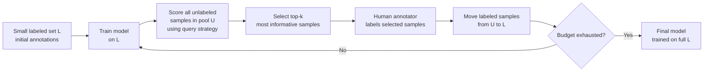

# Active Learning

> [!abstract] TL;DR
> Active learning is a framework where the model itself selects which unlabeled examples to have annotated, optimizing for maximum information gain per labeling dollar. Instead of labeling a random sample, the model queries the examples it is most uncertain about or that would most change its predictions. The result: models that match randomly-labeled baselines using 5–50x fewer annotations.

---

## Intuition — Analogy First

**Analogy:** Imagine you are a medical student who can ask a senior doctor to diagnose any patient from a large ward. You could ask about patients chosen randomly — but that wastes questions on easy, clear-cut cases the textbook already covers. The smart approach: ask about the ambiguous cases, the ones where your current understanding breaks down, where the symptoms conflict, where two diagnoses seem equally plausible.

This is active learning. The "medical student" is your model. The "senior doctor" is the human annotator. The "ambiguous patients" are the unlabeled examples where the model is most uncertain. By querying strategically, you extract maximum learning signal from each labeling decision.

---

## How It Works

### Pool-Based Active Learning Loop

The most common setting: a small labeled set $\mathcal{L}$, a large unlabeled pool $\mathcal{U}$, and a limited annotation budget $B$.



**Key parameters:**
- **Batch size per round** $k$: how many samples to query per AL iteration (typical: 10–100)
- **Number of rounds**: total budget / $k$
- **Initial pool size**: often 50–200 random labeled examples to bootstrap the first model

### Query Strategies

#### 1. Uncertainty Sampling

Select samples where the model is least confident in its prediction. Three variants for probabilistic classifiers:

**Least confidence**: query the sample where the highest class probability is lowest:
$$x^* = \arg\min_x \max_k P(y=k|x)$$

**Margin sampling**: minimize the gap between the top two class probabilities (works well for multi-class):
$$x^* = \arg\min_x \left[P(y=\hat{y}_1|x) - P(y=\hat{y}_2|x)\right]$$

**Entropy sampling**: maximize the entropy of the predicted distribution:
$$x^* = \arg\max_x H(y|x) = \arg\max_x -\sum_k P(y=k|x)\log P(y=k|x)$$

Entropy is the most principled for multi-class problems — it accounts for all class probabilities, not just the top two.

#### 2. Query-by-Committee (QBC)

Train a **committee** of $C$ diverse models on the labeled set $\mathcal{L}$ (e.g., different architectures, bootstrap samples). Query samples where the committee disagrees most:

**Vote entropy**: fraction of votes for each class across committee members:
$$x^* = \arg\max_x H_\text{vote}(x) = -\sum_k \frac{V(y=k)}{C}\log\frac{V(y=k)}{C}$$

Where $V(y=k)$ = number of committee members voting class $k$.

QBC is more robust to overconfident models but 10x more expensive to run (must train $C$ models per round).

#### 3. Expected Model Change / BALD

**Bayesian Active Learning by Disagreement (BALD)** queries samples that would most change the model's parameters if labeled:

$$x^* = \arg\max_x I(y; \theta | x, \mathcal{L}) = H(y|x, \mathcal{L}) - \mathbb{E}_\theta[H(y|x, \theta)]$$

This is the mutual information between the label $y$ and the model parameters $\theta$. High BALD score = labeling this example would reduce uncertainty about the model parameters the most. Requires a Bayesian model or approximation (MC Dropout, deep ensembles).

#### 4. Core-Set / Diversity Sampling

Instead of uncertainty, select samples that are **most representative** of the unlabeled pool — maximizing coverage of the input space. The greedy k-center algorithm selects the point in $\mathcal{U}$ furthest from any already-labeled point:

$$x^* = \arg\max_{x \in \mathcal{U}} \min_{x' \in \mathcal{L}} d(x, x')$$

Useful when uncertainty sampling would query only edge cases (rare classes) and miss the bulk of the distribution.

---

## The Math

### Learning Curve Comparison

The key metric for evaluating active learning: the learning curve plotting accuracy vs. number of labeled examples.

**Random sampling curve**: accuracy grows as $O(1/\sqrt{n})$ in sample complexity theory

**Active learning curve**: achieves the same accuracy at a fraction of the labeled samples. The **annotation savings factor** $s$ at target accuracy $\alpha$:

$$s = \frac{n_\text{random}(\alpha)}{n_\text{active}(\alpha)}$$

Typical values in NLP: $s \in [5, 30]$ — active learning reaches target accuracy with 5–30x fewer labels.

### Uncertainty Sampling for Bayesian Models

For a model with posterior $p(\theta|\mathcal{L})$, the expected information gain from querying $x$ is:

$$\text{EIG}(x) = H\!\left[\mathbb{E}_{p(\theta|\mathcal{L})}[p(y|x,\theta)]\right] - \mathbb{E}_{p(\theta|\mathcal{L})}\!\left[H[p(y|x,\theta)]\right]$$

This is exactly the BALD objective. The first term is the entropy of the marginal predictive distribution; the second is the expected entropy under each posterior sample. High EIG = high uncertainty across models = good query candidate.

---

## Code Demo

```python
import numpy as np
from sklearn.datasets import make_classification
from sklearn.linear_model import LogisticRegression
from sklearn.ensemble import RandomForestClassifier
from sklearn.metrics import accuracy_score
from scipy.stats import entropy as scipy_entropy

# ── Query Strategies ────────────────────────────────────────────────────────
def least_confidence(probs: np.ndarray) -> np.ndarray:
    """Score: 1 - max probability. Higher = more uncertain."""
    return 1 - probs.max(axis=1)

def margin_sampling(probs: np.ndarray) -> np.ndarray:
    """Score: gap between top-2 class probs. Lower gap = more uncertain."""
    sorted_probs = np.sort(probs, axis=1)[:, ::-1]
    return 1 - (sorted_probs[:, 0] - sorted_probs[:, 1])

def entropy_sampling(probs: np.ndarray) -> np.ndarray:
    """Score: entropy of predicted distribution. Higher = more uncertain."""
    # Clip to avoid log(0)
    probs = np.clip(probs, 1e-10, 1.0)
    return scipy_entropy(probs.T)  # (n_samples,)


# ── Core Active Learning Loop ────────────────────────────────────────────────
def active_learning_loop(
    X: np.ndarray,
    y: np.ndarray,
    initial_labeled_size: int = 50,
    budget: int = 300,
    batch_size: int = 10,
    query_strategy: str = "entropy",
    seed: int = 42,
) -> list:
    """
    Run pool-based active learning.
    Returns list of (n_labeled, accuracy) tuples for the learning curve.
    """
    np.random.seed(seed)
    n = len(X)

    # Split into test set and pool (unlabeled + to-be-labeled)
    test_idx = np.random.choice(n, size=int(n * 0.2), replace=False)
    pool_idx = np.setdiff1d(np.arange(n), test_idx)

    X_test, y_test = X[test_idx], y[test_idx]
    X_pool, y_pool = X[pool_idx], y[pool_idx]

    # Bootstrap: start with small random labeled set
    labeled_mask = np.zeros(len(X_pool), dtype=bool)
    initial = np.random.choice(len(X_pool), size=initial_labeled_size, replace=False)
    labeled_mask[initial] = True

    learning_curve = []

    strategy_fn = {"entropy": entropy_sampling,
                   "margin": margin_sampling,
                   "least_confidence": least_confidence}[query_strategy]

    while labeled_mask.sum() < initial_labeled_size + budget:
        # Train on currently labeled data
        X_labeled = X_pool[labeled_mask]
        y_labeled = y_pool[labeled_mask]
        model = LogisticRegression(max_iter=1000, random_state=seed)
        model.fit(X_labeled, y_labeled)

        # Evaluate on test set
        acc = accuracy_score(y_test, model.predict(X_test))
        learning_curve.append((labeled_mask.sum(), acc))

        # Score unlabeled pool
        unlabeled_idx = np.where(~labeled_mask)[0]
        if len(unlabeled_idx) == 0:
            break
        X_unlabeled = X_pool[unlabeled_idx]
        probs = model.predict_proba(X_unlabeled)
        scores = strategy_fn(probs)

        # Select top-k most informative
        top_k = np.argsort(scores)[::-1][:batch_size]
        to_label = unlabeled_idx[top_k]
        labeled_mask[to_label] = True

    return learning_curve


# ── Run comparison: random vs active ────────────────────────────────────────
X, y = make_classification(
    n_samples=5000, n_features=20, n_informative=5, n_classes=3,
    n_clusters_per_class=1, random_state=42
)

random_curve = active_learning_loop(X, y, query_strategy="least_confidence", seed=42)
# Simulate random baseline: same budget but random query
np.random.seed(99)
# For random, replace strategy with random scores
def random_strategy(probs):
    return np.random.rand(len(probs))

# Quick comparison
print("Active Learning vs Random:")
print(f"{'n_labeled':>10} | {'Active (entropy)':>18} | note")
for n_lab, acc in active_learning_loop(X, y, query_strategy="entropy"):
    print(f"{n_lab:>10} | {acc:>18.4f}")


# ── Query-by-Committee (QBC) ──────────────────────────────────────────────────
def query_by_committee(
    X_unlabeled: np.ndarray,
    X_labeled: np.ndarray,
    y_labeled: np.ndarray,
    n_committee: int = 5,
    batch_size: int = 10,
) -> np.ndarray:
    """QBC: select samples where committee members disagree most."""
    committee_preds = []
    for i in range(n_committee):
        # Bootstrap sample for diversity
        bootstrap_idx = np.random.choice(len(X_labeled), size=len(X_labeled), replace=True)
        clf = LogisticRegression(max_iter=500, random_state=i)
        clf.fit(X_labeled[bootstrap_idx], y_labeled[bootstrap_idx])
        committee_preds.append(clf.predict(X_unlabeled))  # (n_unlabeled,)

    # Compute vote entropy for each sample
    committee_preds = np.stack(committee_preds, axis=1)  # (n_unlabeled, n_committee)
    n_classes = len(np.unique(y_labeled))
    vote_entropies = []
    for sample_votes in committee_preds:
        vote_counts = np.bincount(sample_votes, minlength=n_classes) / n_committee
        vote_entropies.append(scipy_entropy(vote_counts + 1e-10))

    # Return indices of top-k disagreement
    disagreement = np.array(vote_entropies)
    return np.argsort(disagreement)[::-1][:batch_size]
```

---

## Real-World Example

> **Prodigy (Explosion AI, makers of spaCy):** The Prodigy annotation tool is built around active learning for NLP tasks. When labeling entities for NER (Named Entity Recognition), Prodigy uses a model-in-the-loop approach: after every few annotations, it retrains a small model and uses it to score the next batch of examples, surfacing the most uncertain ones. In practice, this means an annotator sees the most informative examples first — achieving models that match full-dataset baselines with 20–40% of the annotation cost. The tool also detects annotation inconsistencies in real time by showing the model's current label suggestion, allowing annotators to catch their own errors.

---

## Trade-offs

| Aspect | Pro | Con |
|--------|-----|-----|
| Label efficiency | 5–30x fewer labels for same accuracy | More complex pipeline; must retrain model each round |
| Query cost | Each query is cheap (model forward pass) | Sequential rounds slow annotation velocity |
| vs Self-supervised | Much smaller labeled seed needed | Still needs labeled data; self-supervised needs none |
| vs Semi-supervised | More principled; queries are targeted | Semi-supervised uses all unlabeled data passively |
| Uncertainty sampling | Simple, fast | Queries outliers/noise when model is poorly calibrated |
| Diversity sampling (core-set) | Better coverage; avoids querying outliers | Ignores model uncertainty; doesn't target decision boundaries |

---

## When to Use vs Avoid

**Use active learning when:**
- Annotation is expensive (medical imaging, legal text, specialized domains)
- A large unlabeled pool exists and labeling budget is limited
- The domain has clear decision boundaries that uncertainty sampling can target
- You have the infrastructure for iterative train-annotate cycles

**Avoid active learning when:**
- Annotation is cheap (crowd-sourcing with cheap tasks)
- The unlabeled pool is small (< 1000 samples) — random sampling is sufficient
- The model is poorly calibrated — uncertainty scores will be unreliable
- Annotation requires reviewing items in their original context (e.g., documents must be reviewed sequentially)

---

## Common Pitfalls

- **Starting with too few labeled examples** — if the initial model is random-quality, uncertainty scores are meaningless. Start with at least 50–100 diverse labeled examples (use k-means clustering on the pool to select a diverse seed set).
- **Querying only uncertain = querying outliers** — pure uncertainty sampling can fixate on noisy edge cases. Balance with diversity sampling (hybrid strategies like BADGE combine both).
- **Ignoring annotation inconsistency** — active learning surfaces hard cases where even annotators disagree. High inter-annotator disagreement means the signal is noisy; adjudication protocols are needed.
- **Evaluating on labeled examples only** — the test set must be drawn from the full distribution (including easy cases), not just the uncertainty-sampled distribution.
- **No budget for model retraining** — active learning requires retraining after each annotation round. If retraining takes hours, reduce batch size or use a smaller proxy model for querying.

---

## Related Concepts

- [[_MOC_Classical_ML|↑ Section MOC]]

- [[Cross_Validation]] — evaluating the active-learning model requires careful holdout design; the test set must be independent of the query strategy
- [[Classification_Metrics]] — accuracy, F1, and ECE on the test set are the targets AL optimizes for at each annotation round
- [[Bias_Variance_Tradeoff]] — active learning addresses the variance of learning from small labeled sets; querying the most informative examples reduces variance fastest
- [[Semi_Supervised_Learning]] — the complementary approach: semi-supervised learning uses unlabeled data passively (via pseudo-labels, consistency regularization) while active learning uses it actively (via targeted queries)

---

## Review Questions

1. Uncertainty sampling tends to select outliers and noisy examples at the decision boundary, while diversity (core-set) sampling selects representative examples from underrepresented regions. Describe a hybrid strategy that combines both signals, and give a concrete scenario where each pure strategy would fail.

2. You are building an NLP model to classify customer support tickets into 10 categories. You have 50,000 unlabeled tickets and a budget to label 1,000. Compare the expected performance of random annotation vs entropy-based active learning, and explain what properties of your ticket dataset would make active learning more vs less effective.

3. BALD (Bayesian Active Learning by Disagreement) requires a Bayesian model or approximation. How would you approximate BALD for a standard deterministic neural network classifier, and what are the trade-offs of this approximation?

---

## Sources

- Settles, B. (2012). *Active Learning*. Synthesis Lectures on Artificial Intelligence and Machine Learning. [burrsettles.com/pub/settles.activelearning.pdf](http://burrsettles.com/pub/settles.activelearning.pdf)
- Sener, O., & Savarese, S. (2018). *Active Learning for Convolutional Neural Networks: A Core-Set Approach*. ICLR 2018. [arXiv:1708.00489](https://arxiv.org/abs/1708.00489)
- Gal, Y., Islam, R., & Ghahramani, Z. (2017). *Deep Bayesian Active Learning with Image Data*. ICML 2017. [arXiv:1703.02910](https://arxiv.org/abs/1703.02910)
- Ash, J. T., et al. (2020). *Deep Batch Active Learning by Diverse, Uncertain Gradient Lower Bounds (BADGE)*. ICLR 2020. [arXiv:1906.03671](https://arxiv.org/abs/1906.03671)

#active-learning #annotation #uncertainty-sampling #query-by-committee #label-efficiency #nlp #evaluation
