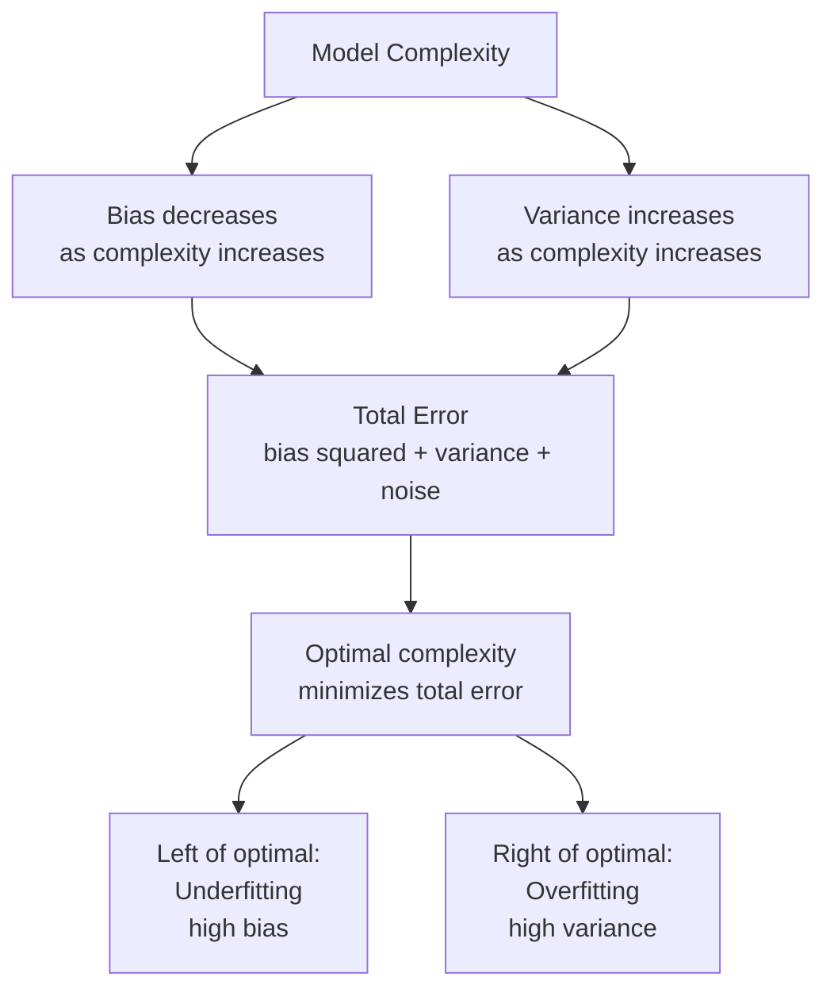

# ⚖️ Bias-Variance Tradeoff

> [!abstract] TL;DR
> Every prediction error decomposes into three irreducible parts: **bias** (systematic wrong assumptions), **variance** (sensitivity to training data noise), and **irreducible noise**. Increasing model complexity reduces bias but increases variance. The optimal model minimizes their sum. Regularization reduces variance; boosting reduces bias. This framework explains underfitting, overfitting, and guides every model selection decision.

## Intuition — Analogy First

Two students are tested on a subject:

- **High-variance student**: memorizes every example from their specific textbook. They ace the same textbook's questions (low training error) but fail when tested on a different edition (high test error). They've overfit to their study materials.

- **High-bias student**: uses one simple rule ("always pick answer C") regardless of the question. They fail on both training and test sets. Their model of the world is too simplistic.

- **Ideal student**: understands underlying principles deeply enough to generalize to new questions without memorizing them.

The bias-variance tradeoff says you cannot simultaneously minimize both: a model flexible enough to capture any pattern (low bias) is also flexible enough to memorize noise (high variance). You have to find the sweet spot.

A key insight: **noise is irreducible**. Even a perfect model cannot predict what is fundamentally random in the data. Every error estimate has a floor you cannot cross.

## How It Works — Mechanics

**Bias:**
- Error from systematic wrong assumptions in the model
- A linear model fitting quadratic data: always wrong in a systematic direction
- High bias → underfitting → poor performance on both training and test sets
- Common causes: model too simple, wrong features, wrong function class

**Variance:**
- Error from sensitivity to fluctuations in training data
- If you retrain the model on a slightly different training set, do you get a very different model?
- High variance → overfitting → great on training, poor on test
- Common causes: too many parameters, too little data, no regularization

**Irreducible error (noise):**
- The inherent randomness in the data generating process
- Even with the perfect model, some error remains (measurement noise, missing predictors)
- Sets a lower bound on achievable error

**Model complexity and the U-curve:**
- Low complexity (e.g., linear model on complex data): high bias, low variance
- Increase complexity (add features, reduce regularization): bias falls, variance rises
- Optimal complexity: minimum total error = bias² + variance + noise
- Beyond optimal: variance growth dominates → error increases (overfitting)

**Practical diagnostics:**
- Train error ≈ Test error ≈ High → High bias (underfitting)
- Train error << Test error → High variance (overfitting)
- Both errors are low and close → Good generalization



## The Math

**Bias-variance decomposition of MSE** for a prediction $\hat{f}(x)$ trained on dataset $D$:

$$\mathbb{E}_D\left[(y - \hat{f}(x))^2\right] = \underbrace{\left(\mathbb{E}_D[\hat{f}(x)] - f(x)\right)^2}_{\text{Bias}^2} + \underbrace{\mathbb{E}_D\left[(\hat{f}(x) - \mathbb{E}_D[\hat{f}(x)])^2\right]}_{\text{Variance}} + \underbrace{\sigma^2}_{\text{Irreducible noise}}$$

where:
- $f(x)$ = true underlying function
- $\hat{f}(x)$ = model trained on dataset $D$
- $\mathbb{E}_D$ = expectation over all possible training datasets from the same distribution
- $\sigma^2$ = variance of the irreducible noise $\epsilon$

**Bias²:** How far is the average prediction from the truth? A consistently wrong model.

**Variance:** How much does the prediction vary across different training sets? An unstable model.

**Key identity:**

$$\text{Total Error} = \text{Bias}^2 + \text{Variance} + \sigma^2$$

This is additive — you cannot reduce noise, but you can trade bias and variance.

**Effect of ensemble methods:**
- **Bagging** (Random Forest): averages $M$ models trained on bootstrap samples.

$$\text{Var}(\bar{f}) = \rho\sigma^2 + \frac{1-\rho}{M}\sigma^2$$

where $\rho$ = pairwise correlation between models. Bagging reduces variance by $\approx M$ but doesn't change bias. Decorrelation (random feature selection) reduces $\rho$.

- **Boosting** (AdaBoost, GBM): builds models sequentially, each correcting the previous. Reduces bias at cost of some variance. Regularization (shrinkage, subsampling) manages the variance.

## Code Demo

```python
import numpy as np
import matplotlib.pyplot as plt
from sklearn.pipeline import make_pipeline
from sklearn.preprocessing import PolynomialFeatures
from sklearn.linear_model import Ridge
from sklearn.tree import DecisionTreeRegressor
from sklearn.model_selection import learning_curve, validation_curve, cross_val_score

np.random.seed(42)

# --- True function: sin curve + noise ---
def true_function(x):
    return np.sin(2 * np.pi * x)

n_train = 100
X_train = np.sort(np.random.rand(n_train, 1), axis=0)
y_train = true_function(X_train).ravel() + np.random.randn(n_train) * 0.3

X_test = np.linspace(0, 1, 300).reshape(-1, 1)
y_test = true_function(X_test).ravel()

# --- Demonstrating bias-variance with polynomial degree ---
degrees = [1, 4, 15]
fig, axes = plt.subplots(1, 3, figsize=(15, 4))

for ax, deg in zip(axes, degrees):
    models_preds = []
    for _ in range(50):  # 50 different training sets
        idx = np.random.choice(n_train, n_train, replace=True)  # bootstrap
        Xb, yb = X_train[idx], y_train[idx]
        model = make_pipeline(PolynomialFeatures(deg), Ridge(alpha=1e-6))
        model.fit(Xb, yb)
        models_preds.append(model.predict(X_test))

    all_preds = np.array(models_preds)
    mean_pred = all_preds.mean(axis=0)
    variance = all_preds.var(axis=0).mean()
    bias_sq = ((mean_pred - y_test) ** 2).mean()

    ax.plot(X_test, y_test, 'k-', lw=2, label="True function")
    for pred in all_preds[:10]:
        ax.plot(X_test, pred, 'b-', alpha=0.15)
    ax.plot(X_test, mean_pred, 'r-', lw=2, label="Mean prediction")
    ax.set_title(f"Degree={deg}\nBias²={bias_sq:.3f}, Var={variance:.3f}")
    ax.set_ylim(-3, 3)
    ax.legend()

plt.suptitle("Bias-Variance Tradeoff Across Model Complexity")
plt.tight_layout(); plt.show()

# --- Learning curves: diagnose bias vs variance ---
from sklearn.svm import SVR

def plot_learning_curve(model, title, X, y, cv=5):
    train_sizes, train_scores, val_scores = learning_curve(
        model, X, y,
        train_sizes=np.linspace(0.1, 1.0, 10),
        cv=cv, scoring="neg_mean_squared_error"
    )
    train_mean = -train_scores.mean(axis=1)
    val_mean   = -val_scores.mean(axis=1)

    plt.figure(figsize=(8, 4))
    plt.plot(train_sizes, train_mean, 'o-', label="Training MSE")
    plt.plot(train_sizes, val_mean,   'o-', label="Validation MSE")
    plt.xlabel("Training set size"); plt.ylabel("MSE")
    plt.title(title); plt.legend(); plt.tight_layout(); plt.show()

# High bias model (underfitting)
plot_learning_curve(
    make_pipeline(PolynomialFeatures(1), Ridge(alpha=1.0)),
    "High Bias (Degree 1)",
    X_train, y_train
)

# High variance model (overfitting)
plot_learning_curve(
    make_pipeline(PolynomialFeatures(15), Ridge(alpha=1e-10)),
    "High Variance (Degree 15, no regularization)",
    X_train, y_train
)

# Optimal model
plot_learning_curve(
    make_pipeline(PolynomialFeatures(4), Ridge(alpha=0.01)),
    "Well-tuned (Degree 4 + regularization)",
    X_train, y_train
)

# --- Validation curve: effect of regularization on bias-variance ---
alphas = np.logspace(-5, 5, 20)
model = make_pipeline(PolynomialFeatures(8), Ridge())
train_scores, val_scores = validation_curve(
    model, X_train, y_train,
    param_name="ridge__alpha", param_range=alphas,
    cv=5, scoring="neg_mean_squared_error"
)

plt.figure(figsize=(8, 4))
plt.semilogx(alphas, -train_scores.mean(axis=1), label="Training MSE")
plt.semilogx(alphas, -val_scores.mean(axis=1),   label="Validation MSE")
plt.xlabel("Ridge alpha (regularization)"); plt.ylabel("MSE")
plt.title("Validation Curve: Regularization vs Bias-Variance")
plt.legend(); plt.tight_layout(); plt.show()
```

## Real-World Example

**Regularization in production models (L1/L2 reduce variance):**
At Netflix, recommendation models have millions of parameters (user embeddings × item embeddings). Without L2 regularization, the model memorizes training user behavior perfectly (low training loss) but generalizes poorly to the test period (high variance). Adding $\lambda\|w\|^2$ constrains the embedding magnitudes, reducing variance while accepting slightly higher bias. The regularization strength $\lambda$ is tuned by cross-validation.

**Boosting reduces bias (GBM/XGBoost):**
A single shallow decision tree (depth=2) is a high-bias model — it can only create a few decision regions. Gradient boosting sequentially fits each new tree to the residuals of the previous ensemble. Each tree reduces the remaining bias. After 500 trees, the ensemble approximates complex nonlinear functions. The learning rate (shrinkage) controls how much each tree reduces bias vs introduces variance.

**Random Forest reduces variance (bagging):**
A single deep decision tree has near-zero training error (low bias) but high variance — it memorizes noise. Random Forest averages 500 such trees, each trained on a random bootstrap sample with random feature selection. Averaging reduces variance while maintaining low bias.

## Trade-offs

| Strategy | Effect on Bias | Effect on Variance | Example |
|---|---|---|---|
| More training data | Slightly decreases | Decreases | Collect more labeled data |
| Stronger regularization | Increases | Decreases | Larger L2 weight |
| Feature engineering | Decreases (if relevant) | May increase | Add polynomial features |
| Bagging (Random Forest) | Neutral | Decreases | Bootstrap + averaging |
| Boosting | Decreases | Slight increase | GBM, XGBoost |
| Deeper trees | Decreases | Increases | max_depth in decision trees |
| Dropout (neural nets) | Slight increase | Decreases | Approximates ensemble |
| Early stopping | Increases | Decreases | Stop training before convergence |

## When to Use vs Avoid

**Diagnose high bias when:**
- Training error is high (comparable to test error)
- Learning curve shows both curves converging at a high error floor
- Fix: more complex model, additional features, less regularization

**Diagnose high variance when:**
- Training error is much lower than test error
- Learning curve shows a large gap that shrinks slowly with more data
- Fix: regularization, more training data, ensemble methods, dropout, feature selection

**The decomposition doesn't apply directly when:**
- You are using a Bayesian model (bias/variance replaced by prior/posterior)
- Loss function is not MSE (decomposition has different form for 0-1 loss, etc.)

## Common Pitfalls

1. **Using the same dataset for model selection and evaluation**: If you tune hyperparameters using test set performance, you're measuring variance on that specific test set — not true generalization. Use nested CV.
2. **Confusing "the model is complex" with "high variance"**: A deep neural network with strong regularization (dropout, weight decay, early stopping) can have lower variance than a shallow tree with no regularization.
3. **Thinking more data always fixes overfitting**: More data primarily reduces variance. If your model is too simple (high bias), more data will not help much — the learning curve for training and validation will converge at a high error.
4. **Applying the MSE decomposition to classification**: The clean additive decomposition holds for squared loss. For classification loss (0-1), the decomposition is more complex and bias/variance can interact non-additively.
5. **Ignoring irreducible noise**: If your features cannot contain enough information to predict the target (e.g., predicting stock prices from yesterday's prices alone), no model complexity or regularization change will help. Measure noise floor with a Bayes error estimate or domain knowledge.

## Related Concepts

- [[_MOC_Classical_ML|↑ Section MOC]]

- [[Regularization]] — L1/L2 are the primary tools for managing variance
- [[Cross_Validation]] — measures the combined effect of bias and variance on generalization
- [[Decision_Trees]] — canonical example of high-variance models
- [[Ensemble_Methods]] — bagging reduces variance; boosting reduces bias
- [[Overfitting]] — the practical manifestation of high variance
- [[Learning_Rate_Scheduling]] — affects bias-variance balance in iterative training

## Review Questions

1. The bias-variance decomposition states $\text{MSE} = \text{Bias}^2 + \text{Variance} + \sigma^2$. A Random Forest reduces variance by averaging many trees. If the trees are perfectly correlated ($\rho = 1$), does averaging help? What does Random Forest do to reduce correlation between trees?
2. Your model has training accuracy = 99% and test accuracy = 72%. Identify whether this is primarily a bias or variance problem, and list three specific techniques you would try to fix it.
3. You double your training set size. For a high-bias model (underfitting), what happens to training error and test error? For a high-variance model (overfitting), what happens? Sketch both learning curves.

## Sources

- Geman, S., Bienenstock, E., & Doursat, R. (1992). *Neural Networks and the Bias/Variance Dilemma*. Neural Computation, 4(1), 1–58.
- Hastie, T., Tibshirani, R., & Friedman, J. (2009). *The Elements of Statistical Learning*, Ch. 7. https://hastie.su.domains/ElemStatLearn/
- Bishop, C. M. (2006). *Pattern Recognition and Machine Learning*, Ch. 3.2. Springer.

#bias-variance #overfitting #underfitting #model-complexity #generalization #regularization #theory
