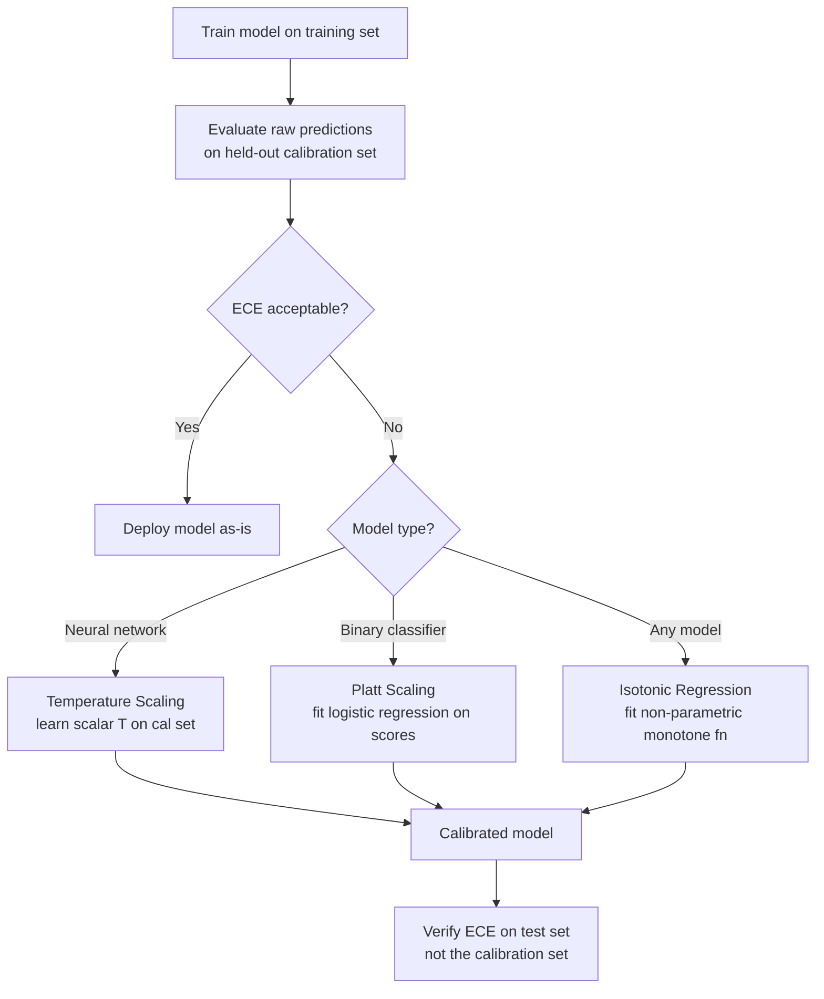

# Calibration

> [!abstract] TL;DR
> A model is **well-calibrated** if its predicted probabilities match observed frequencies: when the model says "80% chance of rain," it should rain about 80% of the time. High AUC does not imply good calibration. Calibration is measured with reliability diagrams and Expected Calibration Error (ECE). Post-hoc fixes include Platt scaling, isotonic regression, and temperature scaling — the last being the standard for neural networks.

---

## Intuition — Analogy First

**Analogy:** A weather forecaster can be ranked as "accurate" because they correctly order which days are most likely to rain. But if they say "70% chance of rain" and it only rains 30% of those days, their probabilities are wrong even if their ranking is good. Calibration is the difference between a good ranker and a trustworthy probabilist.

In ML: a fraud detection model with AUC = 0.92 correctly identifies fraudulent transactions as higher-risk than legitimate ones. But if it assigns "95% fraud probability" to cases that are only 40% fraudulent, downstream systems (humans reviewing flagged cases, risk-based routing, automated decisions) will be miscalibrated in their own decisions. **Ranking quality (AUC) and probability reliability (calibration) are independent properties.**

---

## How It Works

### Reliability Diagrams

A reliability diagram bins predictions by predicted probability and plots the actual fraction of positives in each bin:

- **X-axis**: mean predicted probability in the bin (e.g., 0.0–0.1, 0.1–0.2, ..., 0.9–1.0)
- **Y-axis**: fraction of samples in that bin that are actually positive (empirical frequency)
- **Perfectly calibrated line**: the diagonal $y = x$

Points above the diagonal → **underconfident** (model says 40%, reality is 60%)
Points below the diagonal → **overconfident** (model says 80%, reality is 50%)

### Expected Calibration Error (ECE)

ECE is the weighted average absolute gap between confidence and accuracy across bins:

$$\text{ECE} = \sum_{m=1}^{M} \frac{|B_m|}{n} \left| \text{acc}(B_m) - \text{conf}(B_m) \right|$$

Where:
- $M$ = number of bins (typically 10 or 15)
- $B_m$ = set of predictions in bin $m$
- $|B_m|$ = number of predictions in bin $m$
- $n$ = total number of predictions
- $\text{acc}(B_m)$ = fraction of positives in bin $m$
- $\text{conf}(B_m)$ = mean predicted probability in bin $m$

**Typical ECE values:**
- Well-calibrated model: ECE < 0.02
- Acceptable: ECE 0.02–0.05
- Poorly calibrated: ECE > 0.05

**Maximum Calibration Error (MCE)**: the worst bin gap, important for high-stakes applications where even a single confidence region must be reliable.

### Calibration Patterns by Model Type

| Model | Typical Calibration Behavior |
|-------|------------------------------|
| Logistic Regression | Well-calibrated by design (MLE on cross-entropy) |
| Random Forest | Overconfident — probabilities cluster near 0 and 1 |
| Gradient Boosting (XGBoost, LightGBM) | Overconfident, especially at extremes |
| Neural Networks | Overconfident, worsens with depth and width |
| Naive Bayes | Severely miscalibrated — independence assumption distorts probabilities |
| SVM | Not calibrated at all (Platt scaling required) |

**Neural networks get worse with scale:** Guo et al. (2017) showed that modern deep neural networks are significantly more overconfident than older, smaller networks — the gap between confidence and accuracy has grown as models got larger.

### Architecture of the Calibration Pipeline



---

## Calibration Methods

### 1. Temperature Scaling (Neural Networks)

The simplest post-hoc calibration for neural networks. Divide all logits by a scalar temperature $T$ before softmax:

$$\hat{p}_i = \text{softmax}(z_i / T)$$

- $T > 1$: softens the distribution → reduces overconfidence
- $T < 1$: sharpens the distribution → increases confidence
- Fit $T$ by minimizing cross-entropy on a held-out **calibration set** (separate from test set)

**Key property:** Temperature scaling does not change the argmax — it preserves accuracy and AUC while adjusting confidence levels.

### 2. Platt Scaling

Fit a logistic regression on the raw model scores $f(x)$:

$$p(y=1 | x) = \sigma(A \cdot f(x) + B)$$

Parameters $A$ and $B$ are fit on a held-out calibration set via maximum likelihood. Works best for binary classifiers. Can fix both over/under-confidence and non-monotone probability distortions (unlike temperature scaling).

### 3. Isotonic Regression

A non-parametric, monotone function that maps raw scores to calibrated probabilities:

$$m^* = \arg\min_m \sum_i (y_i - m(f_i))^2 \quad \text{subject to } m \text{ being non-decreasing}$$

More flexible than Platt scaling but requires more calibration data to avoid overfitting. Standard choice when the calibration set is large (> 1000 samples).

---

## The Math

### Why Neural Networks Are Overconfident

Modern neural networks are trained with regularization (weight decay, dropout) and data augmentation — which systematically reduces training loss but makes the network's confidence artificially high relative to held-out data. The maximum likelihood objective with cross-entropy loss minimizes:

$$\mathcal{L} = -\sum_i \log p_\theta(y_i | x_i)$$

After training, a network with high capacity can drive the loss to near-zero by pushing softmax probabilities toward 1.0 for the correct class. On a test set, the accuracy is lower but the confidence remains high — overconfidence.

### Temperature Scaling Derivation

Starting from logits $z$, the softmax output is:
$$p_k = \frac{e^{z_k}}{\sum_j e^{z_j}}$$

With temperature $T$:
$$p_k^T = \frac{e^{z_k/T}}{\sum_j e^{z_j/T}}$$

As $T \to \infty$: all $p_k^T \to 1/K$ (uniform distribution — maximum uncertainty)
As $T \to 0$: $p_k^T \to$ one-hot on argmax (maximum confidence)
At $T = 1$: original predictions

We find $T^*$ by minimizing cross-entropy on the calibration set:
$$T^* = \arg\min_T \mathcal{L}_\text{NLL}(T) = -\sum_i \log p_{y_i}^T(x_i)$$

This is a 1D convex optimization — solvable in milliseconds with L-BFGS.

---

## Code Demo

```python
import numpy as np
from sklearn.calibration import (
    CalibratedClassifierCV,
    calibration_curve,
    CalibrationDisplay,
)
from sklearn.ensemble import GradientBoostingClassifier, RandomForestClassifier
from sklearn.linear_model import LogisticRegression
from sklearn.model_selection import train_test_split
from sklearn.datasets import make_classification
import torch
import torch.nn.functional as F
import matplotlib.pyplot as plt

# ── Generate dataset ──────────────────────────────────────────────────────────
X, y = make_classification(n_samples=10000, n_features=20, n_informative=5, random_state=42)
X_train, X_temp, y_train, y_temp = train_test_split(X, y, test_size=0.4, random_state=42)
X_cal, X_test, y_cal, y_test = train_test_split(X_temp, y_temp, test_size=0.5, random_state=42)


# ── ECE Calculation ───────────────────────────────────────────────────────────
def compute_ece(y_true: np.ndarray, y_prob: np.ndarray, n_bins: int = 10) -> float:
    """Expected Calibration Error: weighted average |acc - conf| per bin."""
    bins = np.linspace(0, 1, n_bins + 1)
    ece = 0.0
    for lo, hi in zip(bins[:-1], bins[1:]):
        mask = (y_prob >= lo) & (y_prob < hi)
        if mask.sum() == 0:
            continue
        bin_acc = y_true[mask].mean()
        bin_conf = y_prob[mask].mean()
        ece += (mask.sum() / len(y_true)) * abs(bin_acc - bin_conf)
    return ece


# ── Train and evaluate calibration ───────────────────────────────────────────
gbm = GradientBoostingClassifier(n_estimators=200, random_state=42)
gbm.fit(X_train, y_train)
probs_raw = gbm.predict_proba(X_test)[:, 1]
ece_raw = compute_ece(y_test, probs_raw)
print(f"GBM (uncalibrated) ECE: {ece_raw:.4f}")

# Platt scaling (sigmoid calibration)
gbm_platt = CalibratedClassifierCV(gbm, method="sigmoid", cv="prefit")
gbm_platt.fit(X_cal, y_cal)
probs_platt = gbm_platt.predict_proba(X_test)[:, 1]
ece_platt = compute_ece(y_test, probs_platt)
print(f"GBM + Platt Scaling ECE: {ece_platt:.4f}")

# Isotonic regression calibration
gbm_iso = CalibratedClassifierCV(gbm, method="isotonic", cv="prefit")
gbm_iso.fit(X_cal, y_cal)
probs_iso = gbm_iso.predict_proba(X_test)[:, 1]
ece_iso = compute_ece(y_test, probs_iso)
print(f"GBM + Isotonic Regression ECE: {ece_iso:.4f}")


# ── Temperature Scaling for Neural Networks (PyTorch) ─────────────────────────
class TemperatureScaling(torch.nn.Module):
    """Post-hoc temperature scaling calibration for neural network logits."""
    def __init__(self):
        super().__init__()
        self.temperature = torch.nn.Parameter(torch.tensor(1.5))  # start above 1

    def forward(self, logits: torch.Tensor) -> torch.Tensor:
        return logits / self.temperature

    def calibrate(self, logits: torch.Tensor, labels: torch.Tensor, lr: float = 0.01, n_steps: int = 1000):
        """Find optimal temperature on calibration set."""
        optimizer = torch.optim.LBFGS([self.temperature], lr=lr, max_iter=n_steps)

        def closure():
            optimizer.zero_grad()
            scaled_logits = self.forward(logits)
            loss = F.cross_entropy(scaled_logits, labels)
            loss.backward()
            return loss

        optimizer.step(closure)
        print(f"Optimal temperature: T = {self.temperature.item():.4f}")
        return self.temperature.item()


# Simulated logits from a neural network (overconfident)
torch.manual_seed(42)
n_cal, n_classes = 1000, 5
logits_cal = torch.randn(n_cal, n_classes) * 3   # high variance → overconfident
labels_cal = torch.randint(0, n_classes, (n_cal,))

ts = TemperatureScaling()
T_optimal = ts.calibrate(logits_cal, labels_cal)

# Before calibration: ECE
probs_before = F.softmax(logits_cal, dim=1).detach().numpy()
max_prob_before = probs_before.max(axis=1)

# After calibration: ECE
probs_after = F.softmax(logits_cal / T_optimal, dim=1).detach().numpy()
max_prob_after = probs_after.max(axis=1)

print(f"\nMean max confidence before T-scaling: {max_prob_before.mean():.3f}")
print(f"Mean max confidence after  T-scaling: {max_prob_after.mean():.3f}")


# ── Reliability diagram ───────────────────────────────────────────────────────
fig, ax = plt.subplots(figsize=(6, 6))
for probs, label in [(probs_raw, "GBM raw"), (probs_platt, "GBM + Platt"),
                     (probs_iso, "GBM + Isotonic")]:
    fraction_pos, mean_pred = calibration_curve(y_test, probs, n_bins=10)
    ax.plot(mean_pred, fraction_pos, marker="o", label=label)

ax.plot([0, 1], [0, 1], "k--", label="Perfect calibration")
ax.set_xlabel("Mean Predicted Probability")
ax.set_ylabel("Fraction of Positives")
ax.set_title("Reliability Diagram")
ax.legend()
plt.tight_layout()
plt.savefig("calibration_diagram.png", dpi=100)
```

---

## Real-World Example

> **LLM confidence calibration:** GPT-4 and similar LLMs exhibit severe overconfidence when generating factual answers. When asked "How confident are you?", models consistently overstate confidence on questions they get wrong. This matters for downstream applications: a RAG system routing based on LLM confidence should not treat a 90%-confidence LLM answer as equivalent to a 90%-calibrated classifier. Kadavath et al. (2022) showed that asking models "Is the following statement true/false?" about their own answers and using the resulting probabilities gives better-calibrated uncertainty estimates than asking for verbalized confidence.

---

## Trade-offs

| Aspect | Pro | Con |
|--------|-----|-----|
| AUC vs Calibration | Can fix calibration post-hoc without retraining | Calibration improvement does not improve AUC/ranking |
| Temperature scaling | 1 parameter; fast to fit; preserves accuracy | Only rescales uniformly — cannot fix non-monotone distortions |
| Isotonic regression | Non-parametric; fixes any monotone distortion | Overfits with small calibration sets (< 500 samples) |
| Platt scaling | Simple; works well for binary problems | Assumes logistic form of distortion; less flexible |
| Calibration set size | Larger cal set → better calibrated | Must hold out data specifically for calibration, reducing training data |

---

## When to Use vs Avoid

**Calibration is critical when:**
- Probabilities are used directly in downstream decisions (clinical risk scores, insurance pricing, fraud thresholds)
- Multiple models' outputs are compared or combined (ensembles, model routing)
- Users or regulators must interpret confidence levels as frequencies

**Calibration matters less when:**
- Only the ranking (not absolute probability) matters — use AUC
- A fixed threshold is used and the threshold is tuned on held-out data
- The model is used purely for argmax predictions (hard classification)

---

## Common Pitfalls

- **Calibrating on the test set** — the test set must never be used for fitting calibration parameters. Hold out a separate calibration set or use cross-validated calibration (`CalibratedClassifierCV` with `cv=5`).
- **Assuming AUC implies calibration** — a model can rank perfectly (AUC=1.0) while being completely miscalibrated (every probability is wrong). These are independent properties.
- **Using too few bins for ECE** — 5 bins with 10K samples is too coarse; 20 bins with 100 samples is too fine. Default to 10–15 bins with adequate data per bin.
- **Not recalibrating after fine-tuning** — even minor fine-tuning shifts the logit distribution, invalidating a previously fit temperature. Recalibrate whenever the model changes.
- **Treating ECE as the only calibration metric** — ECE averages over bins; a model can have low ECE but terrible calibration in the high-confidence region (where decisions matter most). Also report MCE (maximum calibration error) for high-stakes applications.

---

## Related Concepts

- [[_MOC_Classical_ML|↑ Section MOC]]

- [[ROC_and_AUC]] — AUC measures ranking quality; calibration measures probability reliability; both are needed for a complete picture
- [[Classification_Metrics]] — accuracy, precision, recall operate at a fixed threshold; calibration ensures that threshold corresponds to the intended probability
- [[Logistic_Regression]] — naturally calibrated because it minimizes cross-entropy (maximum likelihood for Bernoulli distributions)
- [[Cross_Validation]] — calibration must be measured and fit on held-out data; CV-based calibration avoids overfitting the calibration mapping
- [[Regularization]] — over-regularization causes underconfidence; under-regularization causes overconfidence; calibration diagnosis reveals this

---

## Review Questions

1. A model achieves AUC = 0.95 on a fraud detection dataset but has ECE = 0.18. Describe exactly what ECE = 0.18 means for a fraud analyst who reviews alerts flagged with confidence > 80%.

2. You have a deep neural network trained on CIFAR-10 that achieves 92% accuracy but ECE = 0.12. You have 1,000 samples reserved for calibration. Walk through the process of temperature scaling: what you fit, on what data, and how you verify the calibration improved.

3. Temperature scaling preserves accuracy and AUC. Isotonic regression does not always preserve this. Explain why temperature scaling is rank-preserving while isotonic regression can change rankings.

---

## Sources

- Guo, C., Pleiss, G., Sun, Y., & Weinberger, K. Q. (2017). *On Calibration of Modern Neural Networks*. ICML 2017. [arXiv:1706.04599](https://arxiv.org/abs/1706.04599)
- Niculescu-Mizil, A., & Caruana, R. (2005). *Predicting Good Probabilities with Supervised Learning*. ICML 2005.
- Platt, J. (1999). *Probabilistic Outputs for Support Vector Machines*. Advances in Large Margin Classifiers.
- Zadrozny, B., & Elkan, C. (2002). *Transforming Classifier Scores into Accurate Multiclass Probability Estimates*. KDD 2002.

#calibration #probability-calibration #ece #temperature-scaling #platt-scaling #isotonic-regression #evaluation
