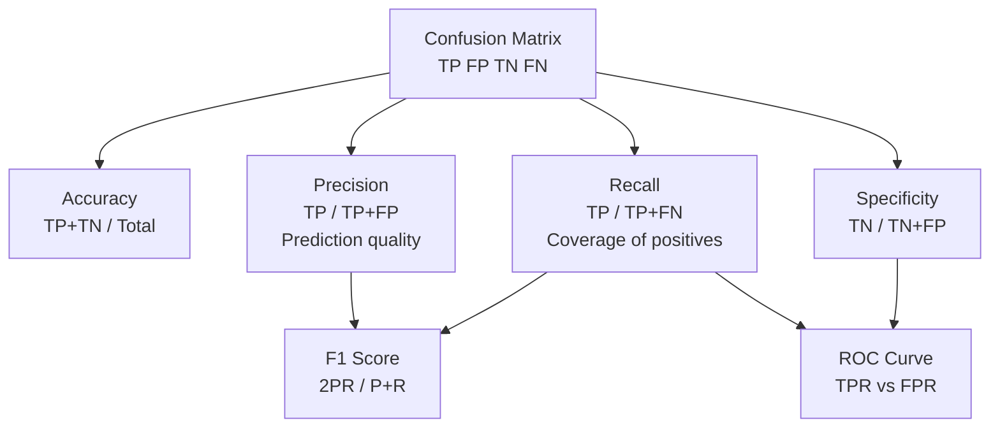

# 📊 Classification Metrics

> [!abstract] TL;DR
> Accuracy is misleading on imbalanced datasets. The confusion matrix breaks predictions into four cells (TP, FP, TN, FN) from which precision (quality of positive predictions), recall (coverage of actual positives), and F1 (their harmonic mean) are derived. The key design decision: **do you pay more for missing a real positive (optimize recall) or for false alarms (optimize precision)?** The answer determines which metric to optimize.

## Intuition — Analogy First

**Cancer screening analogy:**

A test that says "everyone has cancer" has 100% recall (catches every real case) but terrible precision (99% false alarms). A test that says "only extremely obvious cases" has high precision but misses most real cases (poor recall).

The right trade-off depends on consequences:
- **Medical diagnosis**: prefer high recall. Missing a cancer case (false negative) is worse than an unnecessary biopsy (false positive).
- **Content moderation**: might prefer high precision. Wrongly removing legitimate content (false positive) damages trust, while leaving some bad content (false negative) is manageable.
- **Fraud detection**: prefer high recall. Missing fraud (false negative) costs real money.

F1 score is the harmonic mean of precision and recall — it punishes extreme imbalance between the two, forcing you to be good at both.

## How It Works — Mechanics

**Confusion Matrix (binary classification):**

|  | Predicted Positive | Predicted Negative |
|---|---|---|
| **Actual Positive** | TP (True Positive) | FN (False Negative) — missed! |
| **Actual Negative** | FP (False Positive) — false alarm | TN (True Negative) |

**Derived metrics:**

| Metric | Formula | Intuition |
|---|---|---|
| **Accuracy** | $(TP+TN)/(TP+TN+FP+FN)$ | % predictions correct |
| **Precision** | $TP/(TP+FP)$ | Of positives predicted, how many were real? |
| **Recall (Sensitivity)** | $TP/(TP+FN)$ | Of actual positives, how many did we catch? |
| **Specificity** | $TN/(TN+FP)$ | Of actual negatives, how many correctly rejected? |
| **F1 Score** | $2 \cdot P \cdot R / (P+R)$ | Harmonic mean of precision and recall |
| **F-beta** | $(1+\beta^2) \cdot P \cdot R / (\beta^2 P + R)$ | $\beta > 1$: emphasize recall; $\beta < 1$: emphasize precision |



## The Math

**Precision** — "when you cry wolf, are you right?":

$$\text{Precision} = \frac{TP}{TP + FP}$$

**Recall (Sensitivity, True Positive Rate)** — "do you catch all the wolves?":

$$\text{Recall} = \frac{TP}{TP + FN}$$

**F1 Score** — harmonic mean, penalizes extreme imbalance between P and R:

$$F_1 = \frac{2 \cdot \text{Precision} \cdot \text{Recall}}{\text{Precision} + \text{Recall}} = \frac{2TP}{2TP + FP + FN}$$

Note: harmonic mean $\leq$ arithmetic mean. A model with precision=1.0, recall=0.1 gets $F_1 = 0.18$, not 0.55. The harmonic mean heavily penalizes the worse of the two.

**F-beta** (generalizes F1):

$$F_\beta = (1 + \beta^2) \cdot \frac{\text{Precision} \cdot \text{Recall}}{\beta^2 \cdot \text{Precision} + \text{Recall}}$$

$\beta = 2$: recall weighted twice as heavily (used in information retrieval evaluation). $\beta = 0.5$: precision weighted twice as heavily.

**Macro vs micro vs weighted averaging** (multiclass):

- **Macro**: compute metric per class, average equally — treats small classes equally.
- **Micro**: aggregate TP/FP/FN across all classes, then compute — dominated by large classes.
- **Weighted**: weighted by class support — good when class imbalance is present.

**Why accuracy fails on imbalanced data:**

Dataset: 990 negatives, 10 positives. A model that always predicts negative achieves:
$$\text{Accuracy} = \frac{990}{1000} = 99\%$$
But recall = 0, precision = undefined, F1 = 0. Accuracy told you nothing useful.

## Code Demo

```python
from sklearn.metrics import (
    classification_report, confusion_matrix,
    precision_score, recall_score, f1_score,
    ConfusionMatrixDisplay
)
from sklearn.datasets import make_classification
from sklearn.ensemble import RandomForestClassifier
from sklearn.model_selection import train_test_split
import numpy as np
import matplotlib.pyplot as plt

# --- Imbalanced dataset ---
X, y = make_classification(
    n_samples=10000, n_features=20,
    weights=[0.95, 0.05],  # 95% negative, 5% positive
    random_state=42
)
X_train, X_test, y_train, y_test = train_test_split(
    X, y, test_size=0.2, random_state=42, stratify=y
)

# Naive baseline: always predict majority class
from sklearn.dummy import DummyClassifier
dummy = DummyClassifier(strategy="most_frequent")
dummy.fit(X_train, y_train)
dummy_preds = dummy.predict(X_test)
print("Naive baseline (always negative):")
print(f"  Accuracy: {(dummy_preds == y_test).mean():.4f}")
print(f"  F1:       {f1_score(y_test, dummy_preds, zero_division=0):.4f}")

# Real model
rf = RandomForestClassifier(n_estimators=100, class_weight="balanced", random_state=42)
rf.fit(X_train, y_train)
preds = rf.predict(X_test)

print("\nRandom Forest:")
print(classification_report(y_test, preds, target_names=["Negative", "Positive"]))

# --- Confusion matrix visualization ---
fig, axes = plt.subplots(1, 2, figsize=(12, 4))

ConfusionMatrixDisplay.from_predictions(
    y_test, dummy_preds, display_labels=["Neg", "Pos"],
    ax=axes[0], colorbar=False
)
axes[0].set_title("Naive Baseline")

ConfusionMatrixDisplay.from_predictions(
    y_test, preds, display_labels=["Neg", "Pos"],
    ax=axes[1], colorbar=False
)
axes[1].set_title("Random Forest")
plt.tight_layout(); plt.show()

# --- Precision-Recall trade-off by adjusting threshold ---
from sklearn.metrics import precision_recall_curve
probs = rf.predict_proba(X_test)[:, 1]
precisions, recalls, thresholds = precision_recall_curve(y_test, probs)

plt.figure(figsize=(8, 4))
plt.plot(thresholds, precisions[:-1], label="Precision")
plt.plot(thresholds, recalls[:-1], label="Recall")
plt.axvline(0.5, color="gray", linestyle="--", label="Default threshold=0.5")
plt.xlabel("Classification Threshold")
plt.ylabel("Score")
plt.title("Precision-Recall vs Threshold")
plt.legend(); plt.tight_layout(); plt.show()

# Manually set threshold to maximize recall while maintaining precision >= 0.7
high_recall_idx = np.where(precisions >= 0.7)[0]
if len(high_recall_idx) > 0:
    best_threshold = thresholds[high_recall_idx[np.argmax(recalls[high_recall_idx])]]
    custom_preds = (probs >= best_threshold).astype(int)
    print(f"\nCustom threshold={best_threshold:.3f}:")
    print(f"  Precision: {precision_score(y_test, custom_preds):.3f}")
    print(f"  Recall:    {recall_score(y_test, custom_preds):.3f}")
```

## Real-World Example

**Fraud detection at a bank**: A transaction fraud model produces a probability score. The operations team has capacity to manually review 200 flagged transactions per day. Setting the threshold at 0.5 might flag 1000 transactions (too many). The right question is not "maximize accuracy" but:

- What is the **recall at a fixed precision budget**? (e.g., "Flag transactions until we hit precision=0.80, then stop")
- Or: "What precision can we achieve if we must catch 95% of all fraudulent transactions?" (fixed recall, find precision)

The confusion matrix makes this explicit: each threshold setting is one operating point. The team chooses the threshold that matches their operational constraint — not the default 0.5.

**Content moderation**: YouTube uses precision-heavy thresholds for takedowns (high precision: don't remove legitimate content) and recall-heavy thresholds for demonetization (catch most policy violations even at cost of false flags on borderline content).

## Trade-offs

| Metric | Sensitive to class imbalance? | Requires probability scores? | When to use |
|---|---|---|---|
| Accuracy | Yes (misleading) | No | Only balanced classes |
| Precision | No (measures positive predictions) | No | When FP cost is high |
| Recall | No (measures positive coverage) | No | When FN cost is high |
| F1 | No | No | When FP and FN costs are roughly equal |
| F-beta | No | No | When FP/FN costs differ |
| AUC-ROC | No | Yes | Threshold-independent ranking metric |
| AUC-PR | No (better for imbalance) | Yes | Imbalanced classification |

## When to Use vs Avoid

**Use precision when:**
- False positives are costly (spam filter sending real emails to spam)
- You have limited capacity to act on positives

**Use recall when:**
- False negatives are costly (missing a cancer diagnosis, missing fraud)
- It's cheap to investigate false positives

**Use F1 when:**
- You need a single-number summary and FP/FN costs are symmetric

**Avoid accuracy when:**
- Class imbalance exists (use F1, AUC, or Matthews Correlation Coefficient instead)

## Common Pitfalls

1. **Reporting accuracy on imbalanced data**: A 95% accuracy on a 95/5 split is meaningless — even the trivial model achieves it. Always report F1, precision, recall, or AUC on imbalanced problems.
2. **Not adjusting the decision threshold**: Default threshold is 0.5, but optimal threshold depends on your FP/FN cost ratio. Always plot precision-recall vs threshold and pick deliberately.
3. **Micro-averaging on imbalanced multiclass**: Micro-averaging is dominated by the largest class. Use macro or weighted averaging to see performance on rare classes.
4. **Optimizing F1 when costs are asymmetric**: If a false negative costs 100x a false positive, optimize for recall (or use F-beta with β=10), not F1.
5. **Ignoring the confidence of predictions**: Two models with identical F1 can have very different reliability. One might be right 90% of the time confidently (useful for automation) and the other 90% overall but with miscalibrated confidence (unreliable for automation).

## Related Concepts

- [[_MOC_Classical_ML|↑ Section MOC]]

- [[ROC_and_AUC]] — threshold-independent evaluation using TPR vs FPR
- [[Handling_Imbalanced_Data]] — SMOTE, class weights, undersampling strategies
- [[Logistic_Regression]] — produces probability scores that drive threshold selection
- [[Regression_Metrics]] — parallel set of metrics for continuous targets
- [[Cross_Validation]] — always compute metrics inside CV, not on a single split

## Review Questions

1. A fraud detection model achieves 99.5% accuracy on a dataset where 0.5% of transactions are fraudulent. Why is this metric misleading? What metric(s) should you report instead?
2. Precision is 0.8 and recall is 0.4 for a cancer screening model. Calculate F1. Should you trust this model for screening? What would you change about the threshold, and in which direction?
3. Your team is building an email spam filter. Describe the cost of a false positive and a false negative from the user's perspective. Based on these costs, should you optimize for precision or recall, and what F-beta value would capture this trade-off?

## Sources

- Powers, D. M. W. (2011). *Evaluation: From Precision, Recall and F-Factor to ROC, Informedness, Markedness & Correlation*. Journal of Machine Learning Technologies.
- Saito, T., & Rehmsmeier, M. (2015). *The Precision-Recall Plot Is More Informative than the ROC Plot When Evaluating Binary Classifiers on Imbalanced Datasets*. PLOS ONE.
- scikit-learn metrics documentation: https://scikit-learn.org/stable/modules/model_evaluation.html

#classification-metrics #precision #recall #f1-score #confusion-matrix #imbalanced-data #evaluation
