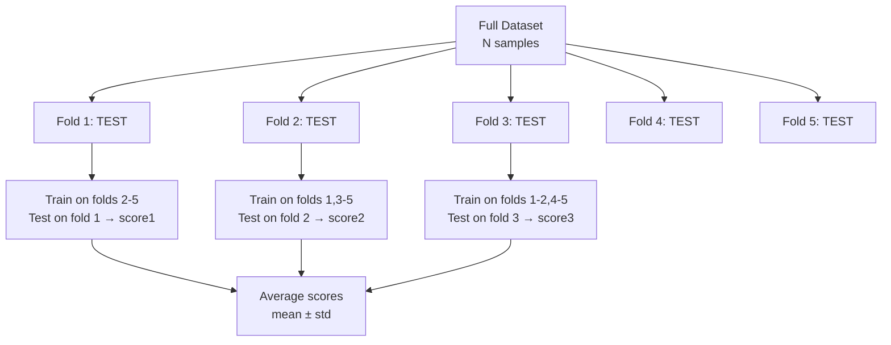

# 🔄 Cross Validation

> [!abstract] TL;DR
> Cross-validation (CV) gives a **reliable estimate of how well a model generalizes** to unseen data by systematically rotating which part of the data is used for testing. A single train/test split is noisy and wasteful. K-fold CV trains K models, each tested on a different 1/K slice of data, then averages the results. For time series, special splits that respect temporal order prevent future data leakage.

## Intuition — Analogy First

A student studying for an exam shouldn't use the same practice questions to both study and test themselves — that's a biased measure of readiness. A good strategy: get 10 sets of past exam papers, study from 9 and test on the 10th, rotate which set is the "test," and average your scores. That average score is a reliable prediction of how you'll do on the real exam.

That's k-fold cross-validation. Each fold is a different "past exam" used for testing once. The key insight: every example is used for **both training and testing**, just never at the same time — so you waste no data, and the estimate is stable.

For time-series data, there's a critical constraint: you cannot study from questions that are chronologically **after** the test. That's data leakage. `TimeSeriesSplit` enforces that test folds are always in the future relative to their training set.

## How It Works — Mechanics

**Standard k-fold CV:**
1. Shuffle data randomly (unless temporal).
2. Split into $k$ equal folds.
3. For fold $i = 1 \ldots k$: train on all folds except fold $i$, evaluate on fold $i$.
4. Report mean ± std of the $k$ evaluation scores.

**Stratified k-fold (for classification):**
- Each fold preserves the original class distribution.
- Critical for imbalanced datasets: without stratification, a fold might have 0 positive examples.

**Leave-One-Out CV (LOOCV):**
- $k = n$: each fold tests on exactly 1 sample.
- Lowest bias (trains on max data each time), highest variance (each score is 0 or 1).
- Computationally expensive: fits $n$ models.
- Only practical for tiny datasets or fast models.

**Time-Series CV (no future leakage):**
- Always train on past, test on future.
- Expanding window: training set grows as folds progress.
- Sliding window: fixed training window, shifts forward.
- Gap between train and test: prevents target leakage from feature autocorrelation.

**Nested CV (for hyperparameter tuning + evaluation):**
- Outer loop: evaluate model performance.
- Inner loop: tune hyperparameters.
- Prevents overfitting to the validation set when selecting hyperparameters.
- Expensive ($k_{outer} \times k_{inner}$ fits) but unbiased.



## The Math

**CV score estimate:**

$$\hat{E}_{CV} = \frac{1}{k}\sum_{i=1}^{k} L(M_{-i}, D_i)$$

where $M_{-i}$ is the model trained on all data except fold $i$, and $D_i$ is fold $i$.

**Variance of CV estimate:**

The variance of the CV estimate across runs is approximately:

$$\text{Var}(\hat{E}_{CV}) \approx \frac{1}{k}\text{Var}(L_i) + \text{Cov}(L_i, L_j) \quad (i \neq j)$$

The covariance term is positive (models share training data) — this means k-fold CV systematically **underestimates** the variance of the estimator. The true standard error is higher than the observed std of fold scores.

**Why k=5 or k=10 empirically?**

- Breiman & Spector (1992) and Kohavi (1995) found k=10 gives the best bias-variance trade-off for CV score estimation.
- k=5 is good enough when training is expensive.
- k=3 underestimates generalization (less training data per fold).

**Nested CV unbiasedness:**

If you select hyperparameters using an inner CV loop, the outer CV loop provides an unbiased estimate because: the test fold in the outer loop was **never seen** during hyperparameter selection in the inner loop.

## Code Demo

```python
from sklearn.model_selection import (
    KFold, StratifiedKFold, LeaveOneOut,
    TimeSeriesSplit, cross_val_score,
    GridSearchCV
)
from sklearn.ensemble import RandomForestClassifier
from sklearn.datasets import load_breast_cancer, make_classification
import numpy as np
import pandas as pd

X, y = load_breast_cancer(return_X_y=True)

# --- Standard 5-fold CV ---
scores = cross_val_score(
    RandomForestClassifier(n_estimators=100, random_state=42),
    X, y,
    cv=KFold(n_splits=5, shuffle=True, random_state=42),
    scoring="roc_auc",
)
print(f"5-Fold CV AUC: {scores.mean():.4f} ± {scores.std():.4f}")

# --- Stratified k-fold: preserves class ratios ---
skf_scores = cross_val_score(
    RandomForestClassifier(n_estimators=100, random_state=42),
    X, y,
    cv=StratifiedKFold(n_splits=5, shuffle=True, random_state=42),
    scoring="roc_auc",
)
print(f"Stratified 5-Fold CV AUC: {skf_scores.mean():.4f} ± {skf_scores.std():.4f}")

# --- Time-series CV: no future leakage ---
n = 1000
X_ts = np.random.randn(n, 5)
y_ts = (X_ts[:, 0] + np.random.randn(n) * 0.1 > 0).astype(int)  # simple time series

tscv = TimeSeriesSplit(n_splits=5, gap=10)  # gap=10 prevents leakage from autocorrelation
for fold, (train_idx, test_idx) in enumerate(tscv.split(X_ts)):
    print(f"Fold {fold+1}: train [{train_idx[0]}-{train_idx[-1]}] "
          f"test [{test_idx[0]}-{test_idx[-1]}]")

ts_scores = cross_val_score(
    RandomForestClassifier(n_estimators=50, random_state=42),
    X_ts, y_ts,
    cv=TimeSeriesSplit(n_splits=5, gap=10),
    scoring="roc_auc",
)
print(f"Time-series CV AUC: {ts_scores.mean():.4f} ± {ts_scores.std():.4f}")

# --- Nested CV: unbiased estimate with hyperparameter tuning ---
from sklearn.svm import SVC
from sklearn.preprocessing import StandardScaler
from sklearn.pipeline import Pipeline

inner_cv = StratifiedKFold(n_splits=3, shuffle=True, random_state=42)
outer_cv = StratifiedKFold(n_splits=5, shuffle=True, random_state=42)

pipe = Pipeline([("scaler", StandardScaler()), ("svc", SVC())])
param_grid = {"svc__C": [0.1, 1, 10], "svc__gamma": ["scale", 0.01]}

# Inner: finds best hyperparams; outer: evaluates the selection process
clf = GridSearchCV(pipe, param_grid, cv=inner_cv, scoring="roc_auc")
nested_scores = cross_val_score(clf, X, y, cv=outer_cv, scoring="roc_auc")
print(f"Nested CV AUC: {nested_scores.mean():.4f} ± {nested_scores.std():.4f}")

# Non-nested CV (optimistic): fit GridSearchCV directly and score it
non_nested = cross_val_score(
    GridSearchCV(pipe, param_grid, cv=inner_cv, scoring="roc_auc"),
    X, y, cv=outer_cv, scoring="roc_auc"
)
print(f"Non-nested (optimistic) AUC: {non_nested.mean():.4f}")
print(f"Selection bias: {non_nested.mean() - nested_scores.mean():.4f}")
```

## Real-World Example

**Any production ML pipeline** uses cross-validation as the gating mechanism for model selection. Example: a credit scoring model team at a bank might use:
- **Outer 5-fold stratified CV** to estimate the AUC of a gradient boosting model on the holdout (regulatory requirement: model must demonstrate out-of-sample AUC > 0.75).
- **Inner 3-fold CV** inside each outer fold to tune `learning_rate`, `n_estimators`, `max_depth`.
- **TimeSeriesSplit** when the features include time-lagged payment history (preventing forward-looking leakage).

Without CV, the team has no reliable signal to distinguish a model that genuinely generalizes from one that happens to fit a lucky train/test split.

## Trade-offs

| Strategy | Bias | Variance | Cost | Best for |
|---|---|---|---|---|
| Single train/test split | High | High | Low | Quick prototyping |
| 5-fold CV | Low | Medium | 5x fits | Standard recommendation |
| 10-fold CV | Very low | Lower | 10x fits | Final model evaluation |
| LOOCV | Lowest | High | N×fits | Tiny datasets |
| Stratified k-fold | Low | Medium | 5-10x fits | Imbalanced classification |
| TimeSeriesSplit | Low | Medium | k×fits | Time-series data |
| Nested CV | Lowest | Medium | k_out×k_in×fits | Honest HP tuning estimate |

## When to Use vs Avoid

**Use when:**
- Estimating true generalization performance of a model
- Selecting between models or hyperparameters
- Dataset is too small for a dedicated holdout set
- Final model evaluation before deployment

**Avoid when:**
- Dataset is extremely large (100M+ rows) — a 5% holdout is plenty; CV is overkill
- Each model fit takes hours — use cheaper model selection strategies
- You have true held-out test data you've never touched — CV is for development, not final reporting

## Common Pitfalls

1. **Data leakage through preprocessing**: Fitting a `StandardScaler` or `TFIDFVectorizer` on the full dataset *before* splitting, then cross-validating. The scaler has seen the test data. Always put preprocessing inside the fold via `Pipeline`.
2. **Time-series leakage**: Using random shuffle splits for time-series data. The model trains on future data to predict the past. Use `TimeSeriesSplit`.
3. **Reporting CV score as test score**: Cross-validation estimates generalization on the *training distribution*. A held-out test set from a different time period or data source may show different performance.
4. **Comparing models with different CV seeds**: A model with AUC 0.823 ± 0.015 vs 0.819 ± 0.012 is not meaningfully different. Use the same folds (same `random_state`) when comparing models.
5. **Using CV score when selecting final hyperparameters without nested CV**: If you run 100 hyperparameter configs and pick the best CV score, you've overfit to the CV folds. Use nested CV or a separate validation set.

## Related Concepts

- [[_MOC_Classical_ML|↑ Section MOC]]

- [[Bias_Variance_Tradeoff]] — CV measures the bias-variance balance for a given model
- [[Hyperparameter_Tuning]] — nested CV gives unbiased estimates during tuning
- [[Regularization]] — CV selects the right regularization strength
- [[Classification_Metrics]] — the `scoring` parameter in `cross_val_score`
- [[Data_Leakage]] — the most dangerous pitfall when constructing CV pipelines

## Review Questions

1. Why is a single train/test split an unreliable estimate of model performance, and how does k-fold CV address this? What is the one downside of k-fold CV compared to a single split?
2. You have a dataset of 500K customer transactions ordered by date. You want to predict churn. Why is standard k-fold CV inappropriate here, and what cross-validation strategy would you use instead?
3. You run a GridSearchCV over 50 hyperparameter combinations using 5-fold inner CV, then report the best CV score as your model performance. Why is this estimate optimistic, and how would you get an unbiased estimate?

## Sources

- Kohavi, R. (1995). *A study of cross-validation and bootstrap for accuracy estimation and model selection*. IJCAI 1995.
- Arlot, S., & Celisse, A. (2010). *A survey of cross-validation procedures for model selection*. Statistics Surveys, 4, 40–79.
- scikit-learn cross-validation guide: https://scikit-learn.org/stable/modules/cross_validation.html

#cross-validation #model-evaluation #model-selection #k-fold #time-series #overfitting
