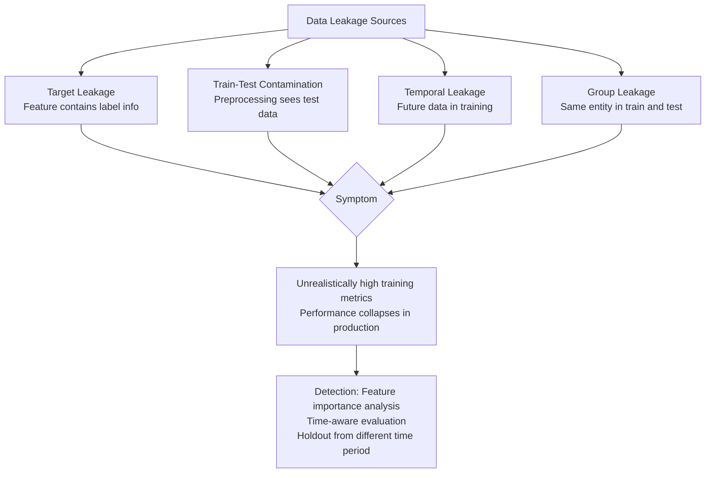

# Data Leakage

> [!abstract] TL;DR
> Data leakage occurs when information from outside the training set — typically from the test set or the future — is used to build a model, creating an artificially optimistic evaluation. It is one of the most dangerous and subtle ML pitfalls because the model appears to work perfectly until deployed. Leakage manifests as target leakage (features derived from the target), train-test contamination (preprocessing sees test data), and temporal leakage (future data in training).

---

## Intuition — Analogy First

**Analogy:** Imagine a student who studies for a math exam by reviewing the actual exam paper the night before (without realizing it was the real exam). They score 100% — but this tells us nothing about whether they've learned math. On the next exam (the real test: deployment), they fail.

Data leakage is this scenario in ML. The model "studies from the exam paper" during training or preprocessing — information flows backward from the outcome (label) or forward from the future into the features. The model learns to detect this leakage signal rather than genuine patterns. Evaluation looks spectacular; production performance is poor.

The insidious part: **leakage rarely causes obvious errors**. The pipeline runs cleanly, metrics look great, and nothing fails until the model hits real-world data where the leakage signal doesn't exist.

---

## How It Works

### Types of Data Leakage

#### 1. Target Leakage

Features are derived from — or are a proxy for — the target variable, but in a way that would not be available at prediction time.

**Classic examples:**
- Predicting loan default: including `credit_recovery_sent` (only exists after a default) as a feature
- Predicting disease onset: including `medication_dosage_for_that_disease` as a feature
- Predicting customer churn: including `account_closure_date` as a feature

The model achieves near-perfect training accuracy because the leaky feature is almost the answer. Deployed on new data where the leaky feature doesn't exist yet, performance collapses.

#### 2. Train-Test Contamination

Preprocessing that sees the test set during fitting — the test data's distribution leaks into the preprocessing parameters.

**Classic examples:**
- Fitting a `StandardScaler` on the full dataset, then splitting into train/test
- Fitting `TFIDFVectorizer` on all text before the train/test split
- Computing target encoding (mean target per category) using the full dataset
- Imputing missing values with the global mean (including test samples)

**Why it's subtle:** The preprocessing step seems innocent — you're just scaling numbers. But the scaler's mean and standard deviation have been influenced by test samples. The model is being evaluated on data that influenced its own preprocessing.

#### 3. Temporal Leakage

Using future data to predict past events — violating the causal arrow of time.

**Classic examples:**
- Predicting tomorrow's stock price using tomorrow's trading volume as a feature
- Predicting fraud using a feature computed from the next 30 days of transaction history
- Cross-validating a time series model with random folds instead of time-ordered folds

#### 4. Group Leakage

Test samples share a grouping variable with training samples, allowing the model to "memorize" group-level patterns.

**Classic examples:**
- Medical imaging: multiple scans from the same patient in both train and test
- Recommender systems: same user's interactions in both splits
- NLP: paraphrases of the same sentence in both splits



---

## How Cross-Validation Prevents Leakage (and How It Doesn't)

**CV prevents it correctly when:**
- All preprocessing is inside a `Pipeline` that is fit only on training folds
- `TimeSeriesSplit` is used for temporal data
- Group-aware splits are used when entities span multiple samples

**CV fails to prevent it when:**
- Any preprocessing step is fit before `cross_val_score` is called
- The split is random for time-series data
- Leaky features were computed using the entire dataset during feature engineering

---

## Detection Checklist

1. **Suspiciously high AUC (> 0.99) on a hard problem** — real fraud detection is hard; perfect AUC means leakage or trivial features
2. **A feature with very high importance that "shouldn't" exist at prediction time** — investigate its temporal and causal relationship to the target
3. **Model performance drops sharply when tested on data from a later time period** — temporal leakage
4. **Perfect recall at very high precision** — models rarely achieve this without leakage
5. **Removing the "obvious" top feature barely hurts performance** — the information was already encoded elsewhere (indirect leakage)

---

## The Math

### Why Contamination Inflates Metrics

Let $\mu_\text{train}$ and $\sigma_\text{train}$ be the mean/std computed on the **training set only**, and $\mu_\text{all}$ and $\sigma_\text{all}$ computed on the **full dataset** (including test).

Standard scaling: $x' = (x - \mu) / \sigma$

If we use $\mu_\text{all}$, then for test sample $x_\text{test}$:
$$x'_\text{test} = \frac{x_\text{test} - \mu_\text{all}}{\sigma_\text{all}}$$

$\mu_\text{all}$ is shifted toward the test distribution, so $x'_\text{test}$ is systematically "more familiar" to the model than it should be. The model has effectively seen the distribution of test features, giving it an unfair advantage.

### Target Leakage and Mutual Information

A leaky feature $f$ has high mutual information with the target $y$ that would be zero at deployment time:

$$I(f; y) \gg 0 \quad \text{(in historical data)}$$
$$I(f; y) = 0 \quad \text{(at prediction time — feature doesn't exist yet)}$$

The model trains to use this mutual information and achieves low training loss. At deployment, the feature either doesn't exist, is set to a default, or reveals nothing about $y$ → catastrophic performance drop.

---

## Code Demo

```python
import numpy as np
import pandas as pd
from sklearn.pipeline import Pipeline
from sklearn.preprocessing import StandardScaler
from sklearn.linear_model import LogisticRegression
from sklearn.ensemble import RandomForestClassifier
from sklearn.model_selection import (
    cross_val_score, StratifiedKFold, TimeSeriesSplit, train_test_split
)
from sklearn.metrics import roc_auc_score

# ─── Example 1: Train-test contamination ───────────────────────────────────
np.random.seed(42)
n = 1000
X = np.random.randn(n, 10)
y = (X[:, 0] + np.random.randn(n) * 0.5 > 0).astype(int)

# WRONG: fit scaler on ALL data before splitting
scaler_contaminated = StandardScaler()
X_scaled_bad = scaler_contaminated.fit_transform(X)  # sees test data!
X_train_bad, X_test_bad, y_train, y_test = train_test_split(
    X_scaled_bad, y, test_size=0.3, random_state=42
)
model_bad = LogisticRegression()
model_bad.fit(X_train_bad, y_train)
auc_bad = roc_auc_score(y_test, model_bad.predict_proba(X_test_bad)[:, 1])
print(f"Contaminated AUC (wrong): {auc_bad:.4f}")

# RIGHT: put scaler inside Pipeline; scaler only sees training data in each fold
pipeline_correct = Pipeline([
    ("scaler", StandardScaler()),   # fit_transform only on train fold
    ("clf", LogisticRegression()),
])
cv = StratifiedKFold(n_splits=5, shuffle=True, random_state=42)
scores_correct = cross_val_score(pipeline_correct, X, y, cv=cv, scoring="roc_auc")
print(f"Pipeline CV AUC (correct): {scores_correct.mean():.4f} ± {scores_correct.std():.4f}")

# ─── Example 2: Target leakage detection ────────────────────────────────────
# Simulate a loan default prediction dataset with a leaky feature
n_loans = 5000
np.random.seed(0)
df = pd.DataFrame({
    "credit_score": np.random.randint(300, 850, n_loans),
    "income": np.random.exponential(50000, n_loans),
    "loan_amount": np.random.randint(1000, 50000, n_loans),
})
df["defaulted"] = (
    (df["credit_score"] < 600) & (df["loan_amount"] / df["income"] > 0.5)
).astype(int)

# Leaky feature: collection_call_received is derived from the default outcome
# (in real life this only exists AFTER default)
df["collection_call_received"] = df["defaulted"] * np.random.binomial(1, 0.9, n_loans)

# Model WITH leaky feature
X_leaked = df[["credit_score", "income", "loan_amount", "collection_call_received"]]
X_clean  = df[["credit_score", "income", "loan_amount"]]
y_loans = df["defaulted"]

auc_with_leak = cross_val_score(
    RandomForestClassifier(n_estimators=100, random_state=42),
    X_leaked, y_loans,
    cv=StratifiedKFold(5, shuffle=True, random_state=42),
    scoring="roc_auc",
).mean()

auc_without_leak = cross_val_score(
    RandomForestClassifier(n_estimators=100, random_state=42),
    X_clean, y_loans,
    cv=StratifiedKFold(5, shuffle=True, random_state=42),
    scoring="roc_auc",
).mean()

print(f"\nLoan default AUC with leaky feature:    {auc_with_leak:.4f}")
print(f"Loan default AUC without leaky feature: {auc_without_leak:.4f}")
# Large gap reveals leakage

# ─── Example 3: Temporal leakage in time series ──────────────────────────────
# WRONG: random split for time series data
X_ts = np.random.randn(1000, 5)
y_ts = np.roll(X_ts[:, 0], shift=-1)  # next-step prediction (y depends on future)
y_ts[-1] = 0  # fill boundary

auc_wrong_split = cross_val_score(
    RandomForestClassifier(n_estimators=50, random_state=42),
    X_ts, (y_ts > 0).astype(int),
    cv=StratifiedKFold(5, shuffle=True, random_state=42),
    scoring="roc_auc",
).mean()

# RIGHT: time-ordered splits
auc_correct_split = cross_val_score(
    RandomForestClassifier(n_estimators=50, random_state=42),
    X_ts, (y_ts > 0).astype(int),
    cv=TimeSeriesSplit(n_splits=5, gap=10),
    scoring="roc_auc",
).mean()

print(f"\nTime series AUC with random split (leaky): {auc_wrong_split:.4f}")
print(f"Time series AUC with TimeSeriesSplit:       {auc_correct_split:.4f}")


# ─── Feature importance leak detection ──────────────────────────────────────
rf = RandomForestClassifier(n_estimators=100, random_state=42)
rf.fit(X_leaked, y_loans)
feature_names = X_leaked.columns.tolist()
importances = dict(zip(feature_names, rf.feature_importances_))
print("\nFeature importances (leak detection):")
for feat, imp in sorted(importances.items(), key=lambda x: -x[1]):
    flag = " <-- SUSPICIOUS LEAKY FEATURE" if feat == "collection_call_received" else ""
    print(f"  {feat}: {imp:.4f}{flag}")
```

---

## Real-World Example

> **Kaggle Credit Default Competition (2019):** One of the top-ranked submissions used a feature that was essentially the answer: the number of days until the loan entered collection — a value that doesn't exist until after the default occurs. The submission had near-perfect cross-validation AUC. When the organizers re-evaluated on a time-ordered holdout from a later month, the AUC dropped from 0.98 to 0.61 — barely better than random. The lesson: whenever your model's performance seems too good, look for temporal or causal violations in the feature set.

---

## Trade-offs

| Leakage Prevention | Protection | Cost |
|--------------------|-----------|------|
| Pipeline (sklearn) | Prevents preprocessing contamination | Requires restructuring code; small overhead |
| TimeSeriesSplit | Prevents temporal leakage | Smaller effective training set per fold |
| Group-aware splits | Prevents group leakage | Requires knowing entity IDs; unequal fold sizes |
| Causal feature audit | Prevents target leakage | Manual time investment; domain expertise needed |
| Time-based holdout | Catches temporal drift | Requires long data history |

---

## When to Use vs Avoid

**Always check for leakage when:**
- AUC > 0.97 on a problem that domain experts say is hard
- A single feature dominates importance by a large margin
- Model performance degrades sharply on data from a different time period
- Preprocessing steps were applied before train/test splitting

**Leakage is less of a concern when:**
- Data is pure i.i.d. with no temporal structure and no proxy features
- You are using time-series CV with appropriate gaps
- All preprocessing is inside a Pipeline

---

## Common Pitfalls

- **Global preprocessing before split** — the single most common cause. Always use `Pipeline` so preprocessing is fit only on training data.
- **Target-derived features** — "number of days in arrears before default" is the default. Audit every feature for causal relationships to the target.
- **Random CV for time series** — standard `KFold` allows training on future data to predict the past. Use `TimeSeriesSplit` and add a gap between train and test windows.
- **Leaking through group membership** — multiple samples from the same entity should stay in the same fold. Use `GroupKFold`.
- **Leaking through feature selection** — running feature selection (e.g., mutual information, correlation) on the full dataset before splitting gives the model knowledge of which features correlate with the test labels.
- **Indirect leakage** — not the label itself, but a feature that is a deterministic function of the label at training time but not at deployment (e.g., event timestamps, status codes, administrative flags).

---

## Related Concepts

- [[_MOC_Classical_ML|↑ Section MOC]]

- [[Cross_Validation]] — the primary defense against preprocessing contamination; must use `Pipeline` to be effective
- [[Feature_Engineering]] — where target leakage most commonly originates; every derived feature must be validated for temporal and causal correctness
- [[Bias_Variance_Tradeoff]] — leakage artificially reduces apparent bias without reducing true bias; the variance of leakage-inflated estimates is near zero (the model is just memorizing)
- [[ROC_and_AUC]] — suspiciously high AUC is the primary signal that leakage has occurred
- [[Classification_Metrics]] — leakage inflates all classification metrics; compare performance on time-ordered held-out data to detect it

---

## Review Questions

1. A preprocessing pipeline fits a `StandardScaler` on the full dataset before calling `cross_val_score`. Explain precisely which statistical property of the test folds has been violated and quantify how this could inflate AUC.

2. You are building a model to predict hospital readmission within 30 days. Your dataset has 50 features. List three features that would constitute target leakage and explain why each one would not be available at prediction time (admission time).

3. You notice that your time-series churn model achieves AUC = 0.88 with random k-fold but AUC = 0.71 with `TimeSeriesSplit`. The gap is 0.17. What does this gap tell you about the nature of the temporal leakage? Is the gap concerning, and how would you investigate whether it stems from leakage or genuine temporal distribution shift?

---

## Sources

- Kaufman, S., et al. (2012). *Leakage in Data Mining: Formulation, Detection, and Avoidance*. TKDD, 6(4). [doi:10.1145/2382577.2382579](https://doi.org/10.1145/2382577.2382579)
- Sklearn Pipeline documentation: [scikit-learn.org/stable/modules/pipeline.html](https://scikit-learn.org/stable/modules/pipeline.html)
- Sklearn TimeSeriesSplit: [scikit-learn.org/stable/modules/generated/sklearn.model_selection.TimeSeriesSplit.html](https://scikit-learn.org/stable/modules/generated/sklearn.model_selection.TimeSeriesSplit.html)

#data-leakage #target-leakage #train-test-contamination #evaluation #pitfalls #time-series #feature-engineering
