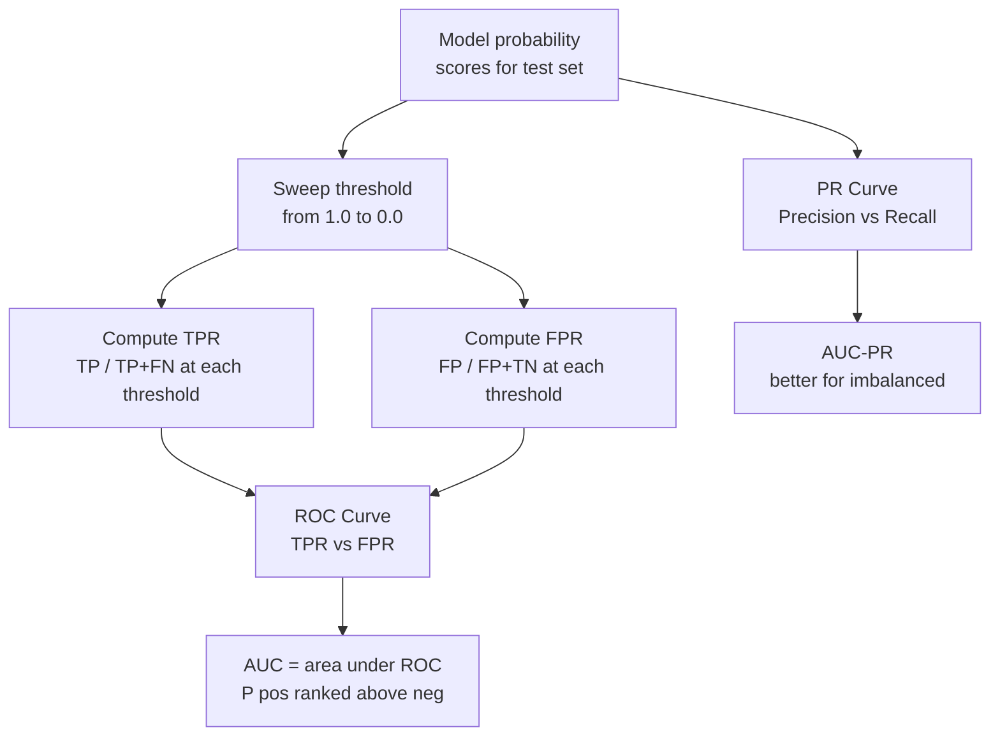

# 📈 ROC Curve and AUC

> [!abstract] TL;DR
> The ROC curve plots **True Positive Rate vs False Positive Rate** at every possible classification threshold, showing all operating points simultaneously. AUC (area under ROC) summarizes this as one number: the probability that a model ranks a random positive above a random negative. AUC=1 is perfect; AUC=0.5 is random. For **imbalanced datasets**, the Precision-Recall (PR) curve is more informative — AUC-PR is harder to inflate with a good negative rate.

## Intuition — Analogy First

Imagine a **security checkpoint** that screens passengers. The checkpoint operator can adjust strictness:
- **Very strict**: almost no one gets through → catches most real threats (high TPR) but also blocks many innocents (high FPR).
- **Very loose**: everyone passes → no false alarms (FPR=0) but misses all real threats (TPR=0).

The ROC curve traces **every operating point** as you slide from "block everyone" to "pass everyone." AUC is the overall quality of the system, independent of any specific strictness setting. A random screening (coin flip) traces the diagonal — AUC=0.5. A perfect system goes straight up to TPR=1 at FPR=0 — AUC=1.0.

The insight: AUC measures **ranking quality**. A model with AUC=0.9 correctly ranks a random positive above a random negative 90% of the time — regardless of what threshold you choose.

## How It Works — Mechanics

**Computing the ROC curve:**
1. Get predicted probabilities $\hat{p}_i$ for each test sample.
2. For every possible threshold $\tau$ from 1.0 to 0.0:
   - Classify: $\hat{y}_i = \mathbb{1}[\hat{p}_i \geq \tau]$
   - Compute TPR (recall) = TP/(TP+FN)
   - Compute FPR = FP/(FP+TN)
   - Plot point (FPR, TPR).
3. Connect the points → ROC curve.
4. AUC = area under this curve (trapezoid rule).

**Key interpretations of AUC:**
- **Probabilistic**: AUC = $P(\hat{p}_{pos} > \hat{p}_{neg})$ for a random (positive, negative) pair.
- **Ranking**: AUC measures how often the model assigns a higher score to a positive than a negative.
- AUC is **threshold-independent**: it summarizes all possible operating points.

**PR Curve (Precision-Recall):**
- X-axis: Recall (TPR), Y-axis: Precision.
- AUC-PR = average precision across thresholds.
- More sensitive to performance on positives — negatives don't appear directly.
- For imbalanced data (rare positives), AUC-PR is harder to game: the denominator of precision includes false positives, so a good negative rate alone won't inflate it.

**Calibration:**
- A model can have high AUC but poor calibration.
- Calibration: predicted probability 0.8 should mean 80% of such cases are positive.
- Isotonic regression or Platt scaling can post-hoc calibrate a well-ranking but poorly-calibrated model.



## The Math

**True Positive Rate (Sensitivity, Recall):**

$$\text{TPR}(\tau) = \frac{TP(\tau)}{TP(\tau) + FN(\tau)} = P(\hat{p} \geq \tau \mid y = 1)$$

**False Positive Rate (1 - Specificity):**

$$\text{FPR}(\tau) = \frac{FP(\tau)}{FP(\tau) + TN(\tau)} = P(\hat{p} \geq \tau \mid y = 0)$$

**AUC as a probability (Wilcoxon-Mann-Whitney statistic):**

$$\text{AUC} = P(\hat{p}_{\text{pos}} > \hat{p}_{\text{neg}}) = \frac{\sum_{i: y_i=1}\sum_{j: y_j=0} \mathbb{1}[\hat{p}_i > \hat{p}_j]}{n_{\text{pos}} \cdot n_{\text{neg}}}$$

This is exactly the Wilcoxon rank-sum test statistic, connecting AUC to non-parametric statistics.

**AUC via trapezoid rule:**

$$\text{AUC} = \int_0^1 \text{TPR}(\text{FPR}^{-1}(t)) \, dt \approx \sum_{k} (\text{FPR}_{k+1} - \text{FPR}_k) \cdot \frac{\text{TPR}_{k+1} + \text{TPR}_k}{2}$$

**Average Precision (AP, approximates AUC-PR):**

$$\text{AP} = \sum_n (R_n - R_{n-1}) P_n$$

where $P_n$ and $R_n$ are precision and recall at the $n$th threshold.

**Partial AUC:** when you only care about a specific FPR range (e.g., FPR < 0.1 for a high-stakes application), compute AUC only over that range.

## Code Demo

```python
from sklearn.metrics import (
    roc_curve, auc, roc_auc_score,
    precision_recall_curve, average_precision_score,
    RocCurveDisplay, PrecisionRecallDisplay
)
from sklearn.datasets import make_classification
from sklearn.ensemble import GradientBoostingClassifier, RandomForestClassifier
from sklearn.linear_model import LogisticRegression
from sklearn.model_selection import train_test_split
from sklearn.preprocessing import StandardScaler
from sklearn.pipeline import Pipeline
import numpy as np
import matplotlib.pyplot as plt

# --- Imbalanced binary classification ---
X, y = make_classification(
    n_samples=5000, n_features=20,
    weights=[0.9, 0.1],   # 10% positives
    random_state=42
)
X_train, X_test, y_train, y_test = train_test_split(
    X, y, test_size=0.2, stratify=y, random_state=42
)

models = {
    "Logistic Regression": Pipeline([
        ("scaler", StandardScaler()),
        ("lr", LogisticRegression(random_state=42)),
    ]),
    "Random Forest": RandomForestClassifier(n_estimators=100, random_state=42),
    "Gradient Boosting": GradientBoostingClassifier(n_estimators=200, random_state=42),
}

fig, axes = plt.subplots(1, 2, figsize=(14, 5))

for name, model in models.items():
    model.fit(X_train, y_train)
    probs = model.predict_proba(X_test)[:, 1]

    # ROC
    fpr, tpr, thresholds = roc_curve(y_test, probs)
    roc_auc = auc(fpr, tpr)
    axes[0].plot(fpr, tpr, label=f"{name} (AUC={roc_auc:.3f})")

    # PR
    precision, recall, _ = precision_recall_curve(y_test, probs)
    ap = average_precision_score(y_test, probs)
    axes[1].plot(recall, precision, label=f"{name} (AP={ap:.3f})")

    print(f"{name}: AUC-ROC={roc_auc:.4f}, AUC-PR={ap:.4f}")

# Random classifier baseline
axes[0].plot([0, 1], [0, 1], 'k--', label="Random (AUC=0.5)")
axes[0].set_xlabel("False Positive Rate"); axes[0].set_ylabel("True Positive Rate")
axes[0].set_title("ROC Curves"); axes[0].legend()

# No-skill PR baseline
no_skill_precision = y_test.sum() / len(y_test)
axes[1].axhline(no_skill_precision, color='k', linestyle='--',
                label=f"No skill (AP={no_skill_precision:.3f})")
axes[1].set_xlabel("Recall"); axes[1].set_ylabel("Precision")
axes[1].set_title("Precision-Recall Curves"); axes[1].legend()
plt.tight_layout(); plt.show()

# --- Operating point selection ---
gbm = models["Gradient Boosting"]
probs = gbm.predict_proba(X_test)[:, 1]
fpr, tpr, thresholds = roc_curve(y_test, probs)

# Youden's J statistic: maximize TPR - FPR
j_scores = tpr - fpr
best_idx = np.argmax(j_scores)
best_threshold = thresholds[best_idx]
print(f"\nOptimal threshold (Youden's J): {best_threshold:.3f}")
print(f"At this threshold: TPR={tpr[best_idx]:.3f}, FPR={fpr[best_idx]:.3f}")

# Custom operating point: require TPR >= 0.90
high_recall_idx = np.where(tpr >= 0.90)[0]
if len(high_recall_idx) > 0:
    conservative_idx = high_recall_idx[0]  # lowest FPR that achieves TPR>=0.90
    print(f"\nThreshold for TPR≥0.90: {thresholds[conservative_idx]:.3f}, "
          f"FPR={fpr[conservative_idx]:.3f}")
```

## Real-World Example

**Ad click-through rate prediction (Google, Facebook):** Online advertising models are evaluated primarily on AUC-ROC because the goal is **ranking** — show the highest-CTR ads at the top, not binary classify "will click" vs "won't click." A model with AUC=0.75 correctly ranks 75% of (ad, not-ad) click pairs. The actual threshold is set by the auction mechanism, not the model.

**Medical diagnostics:** The FDA often requires ROC analysis for diagnostic tests. A test for sepsis screening might specify: "must achieve TPR ≥ 0.95 at FPR ≤ 0.20." The ROC curve shows whether the test can achieve this operating point. The choice of operating point is a clinical decision (doctors decide acceptable FPR), while the model improves the entire curve.

## Trade-offs

| Metric | Imbalance sensitivity | Threshold-free | Interpretation | When to use |
|---|---|---|---|---|
| AUC-ROC | Low (TN affects FPR) | Yes | Ranking probability | Balanced classes, ranking tasks |
| AUC-PR | High (ignores TN) | Yes | Positive class quality | Rare positives (fraud, disease) |
| F1 at threshold | Medium | No | Fixed operating point | When threshold is known |
| Accuracy | High (misleading) | No | Overall correctness | Only balanced classes |

**AUC-ROC can be misleading for imbalanced data:**
With 99% negatives, even a mediocre model achieves good FPR because there are so many true negatives. AUC-PR exposes this: precision drops sharply when the positive class is rare.

## When to Use vs Avoid

**Use AUC-ROC when:**
- Evaluating ranking quality across all thresholds
- Classes are roughly balanced
- Comparing models without committing to a threshold
- Standard benchmark reporting (medical literature, Kaggle)

**Use AUC-PR when:**
- Positive class is rare (< 10% of data)
- False negatives are more costly and you want to focus on positive recall
- Fraud detection, rare disease detection, information retrieval

**Avoid threshold-independent metrics when:**
- You already know your operating threshold (e.g., fixed FPR budget for regulatory compliance) — just report precision/recall at that threshold

## Common Pitfalls

1. **Using AUC-ROC for highly imbalanced problems**: A fraud detection model with 0.1% fraud rate can achieve AUC=0.95 while still having terrible precision at any reasonable operating point. Use AUC-PR.
2. **Interpreting AUC as accuracy**: AUC=0.9 does not mean 90% accuracy. It means 90% pairwise ranking correctness. These are very different.
3. **Not calibrating probabilities after computing AUC**: AUC only requires correct ranking. A model with perfect AUC could have terribly miscalibrated probabilities (e.g., all predictions between 0.48 and 0.52). If you need calibrated probabilities for decision making, apply `CalibratedClassifierCV`.
4. **Comparing AUC across different test sets**: AUC is sensitive to the class ratio in the test set. Always compare models on the same test set.
5. **Using AUC as a loss function**: AUC is not differentiable. You cannot directly optimize AUC; you optimize a surrogate (log-loss, hinge loss) and measure AUC post-hoc. There are AUC-approximating losses (LambdaRank) but they are more complex.

## Related Concepts

- [[_MOC_Classical_ML|↑ Section MOC]]

- [[Classification_Metrics]] — precision, recall, F1 at a fixed threshold
- [[Handling_Imbalanced_Data]] — when to use AUC-PR vs AUC-ROC
- [[Logistic_Regression]] — produces calibrated probabilities for ROC analysis
- [[Calibration]] — post-hoc probability calibration after training
- [[Cross_Validation]] — always compute AUC inside CV, not on a single split

## Review Questions

1. AUC-ROC = 0.85 means "the model correctly ranks a random positive above a random negative 85% of the time." Derive this probabilistic interpretation from the definition of AUC as the area under the ROC curve.
2. You have a fraud detection model with AUC-ROC = 0.92 and AUC-PR = 0.31 on a dataset where 0.5% of transactions are fraudulent. Which metric should drive your model selection decisions, and why is there such a large gap between them?
3. A medical screening model for a rare disease (1% prevalence) must achieve 95% sensitivity (TPR). Using the ROC curve, describe the process of selecting the operating threshold and explain what specificity you can expect at that sensitivity.

## Sources

- Hanley, J. A., & McNeil, B. J. (1982). *The Meaning and Use of the Area under a Receiver Operating Characteristic (ROC) Curve*. Radiology, 143(1), 29–36.
- Davis, J., & Goadrich, M. (2006). *The Relationship Between Precision-Recall and ROC Curves*. ICML 2006.
- scikit-learn ROC documentation: https://scikit-learn.org/stable/modules/generated/sklearn.metrics.roc_auc_score.html

#roc #auc #precision-recall #imbalanced-data #ranking #evaluation #threshold
