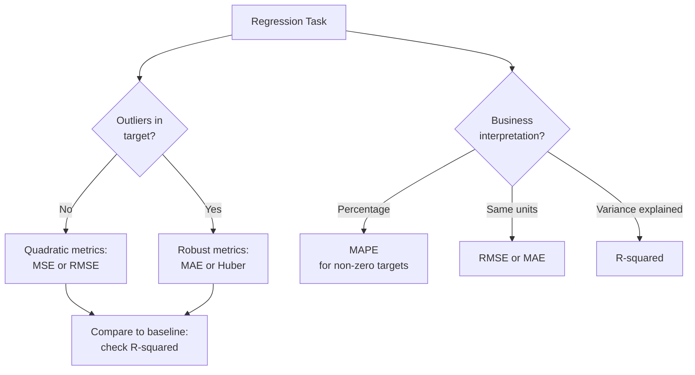

# 📏 Regression Metrics

> [!abstract] TL;DR
> Regression metrics measure how close predictions are to ground truth. **MAE** is robust to outliers (penalizes proportionally); **MSE/RMSE** punish large errors heavily (useful when big misses are costly); **R²** measures variance explained (0 to 1, but can go negative); **MAPE** gives percentage errors (useful for business reporting but breaks near zero). **Huber loss** combines MAE and MSE — quadratic for small errors, linear for large ones.

## Intuition — Analogy First

You're shooting arrows at a target. Three archers have these patterns:
- **MAE archer**: measures how far each arrow landed and averages those distances. One wild arrow doesn't dominate the score.
- **MSE archer**: squares the distance of each arrow. One arrow that lands 10 units away counts as much as 100 arrows landing 1 unit away. Wild shots are brutally penalized.
- **R² archer**: compares their own scatter to the scatter of someone who just aims at the center (mean). 1.0 means perfect, 0.0 means no better than always predicting the average, negative means actively worse than the average prediction.

The choice depends on whether **outlier errors matter more**: house prices where a $500K miss is catastrophic → use RMSE. Demand forecasting across 10,000 SKUs where a few weird SKUs shouldn't dominate the metric → use MAE or MAPE.

## How It Works — Mechanics

**Mean Absolute Error (MAE):**
- Average of absolute residuals: $|y_i - \hat{y}_i|$
- Robust to outliers (linear penalty, no amplification)
- Same units as target variable
- Optimal prediction is the **median** of the target distribution

**Mean Squared Error (MSE):**
- Average of squared residuals: $(y_i - \hat{y}_i)^2$
- Heavily penalizes large errors (quadratic)
- Not same units as target (units²); harder to interpret
- Optimal prediction is the **mean** of the target distribution
- Gradient is smooth, making it popular as a loss function

**Root Mean Squared Error (RMSE):**
- $\sqrt{\text{MSE}}$: same units as target
- Easier to interpret than MSE
- Still penalizes large errors more than MAE

**R² (Coefficient of Determination):**
- Fraction of variance explained by the model
- R²=1: perfect predictions; R²=0: no better than predicting the mean; R²<0: worse than mean
- Sensitive to outliers in $y$; can be misleading for nonlinear models

**MAPE (Mean Absolute Percentage Error):**
- Mean of $|y_i - \hat{y}_i| / |y_i|$ × 100%
- Scale-independent, business-friendly ("off by X%")
- **Fails when $y_i \approx 0$**: division by near-zero inflates the metric catastrophically
- Asymmetric: penalizes over-predictions differently from under-predictions

**Huber Loss:**
- Quadratic for $|e| \leq \delta$, linear for $|e| > \delta$
- Best of both: smooth gradients near zero like MSE, robustness to outliers like MAE
- $\delta$ is a hyperparameter controlling the transition point



## The Math

**MAE:**

$$\text{MAE} = \frac{1}{n}\sum_{i=1}^{n}|y_i - \hat{y}_i|$$

**MSE and RMSE:**

$$\text{MSE} = \frac{1}{n}\sum_{i=1}^{n}(y_i - \hat{y}_i)^2, \quad \text{RMSE} = \sqrt{\text{MSE}}$$

**R² (Coefficient of Determination):**

$$R^2 = 1 - \frac{SS_{res}}{SS_{tot}} = 1 - \frac{\sum_i(y_i - \hat{y}_i)^2}{\sum_i(y_i - \bar{y})^2}$$

where $SS_{res}$ = residual sum of squares, $SS_{tot}$ = total variance in $y$.

**MAPE:**

$$\text{MAPE} = \frac{100\%}{n}\sum_{i=1}^{n}\left|\frac{y_i - \hat{y}_i}{y_i}\right|$$

**sMAPE** (symmetric MAPE, avoids asymmetry):

$$\text{sMAPE} = \frac{100\%}{n}\sum_{i=1}^{n}\frac{|y_i - \hat{y}_i|}{(|y_i| + |\hat{y}_i|)/2}$$

**Huber Loss:**

$$L_\delta(y, \hat{y}) = \begin{cases} \frac{1}{2}(y - \hat{y})^2 & \text{if } |y - \hat{y}| \leq \delta \\ \delta\left(|y - \hat{y}| - \frac{\delta}{2}\right) & \text{otherwise} \end{cases}$$

**Adjusted R²** (penalizes for number of predictors $p$):

$$\bar{R}^2 = 1 - (1 - R^2)\frac{n-1}{n-p-1}$$

Useful when comparing models with different numbers of features, since $R^2$ always increases (or stays equal) when you add features.

## Code Demo

```python
from sklearn.metrics import (
    mean_absolute_error, mean_squared_error,
    r2_score, mean_absolute_percentage_error
)
from sklearn.datasets import fetch_california_housing
from sklearn.ensemble import GradientBoostingRegressor, RandomForestRegressor
from sklearn.linear_model import Ridge
from sklearn.model_selection import train_test_split
from sklearn.preprocessing import StandardScaler
import numpy as np
import matplotlib.pyplot as plt

X, y = fetch_california_housing(return_X_y=True)
X_train, X_test, y_train, y_test = train_test_split(
    X, y, test_size=0.2, random_state=42
)

models = {
    "Ridge": Ridge(alpha=1.0),
    "GBM": GradientBoostingRegressor(n_estimators=200, random_state=42),
    "RF": RandomForestRegressor(n_estimators=100, random_state=42),
}

def evaluate(name, y_true, y_pred):
    mae  = mean_absolute_error(y_true, y_pred)
    mse  = mean_squared_error(y_true, y_pred)
    rmse = np.sqrt(mse)
    r2   = r2_score(y_true, y_pred)
    mape = mean_absolute_percentage_error(y_true, y_pred) * 100
    print(f"{name:8s}: MAE={mae:.3f}  RMSE={rmse:.3f}  R²={r2:.4f}  MAPE={mape:.1f}%")

baseline_pred = np.full(len(y_test), y_train.mean())
print("\n--- Regression Metrics Comparison ---")
evaluate("Baseline", y_test, baseline_pred)

for name, model in models.items():
    model.fit(X_train, y_train)
    preds = model.predict(X_test)
    evaluate(name, y_test, preds)

# --- Huber Loss as a training objective ---
from sklearn.linear_model import HuberRegressor
huber = HuberRegressor(epsilon=1.35, max_iter=200)  # epsilon: controls transition point
huber.fit(X_train, y_train)
evaluate("Huber", y_test, huber.predict(X_test))

# --- Visualize residuals ---
gbm_preds = models["GBM"].predict(X_test)
residuals = y_test - gbm_preds

fig, axes = plt.subplots(1, 3, figsize=(15, 4))

axes[0].scatter(gbm_preds, y_test, alpha=0.3, s=5)
axes[0].plot([y_test.min(), y_test.max()], [y_test.min(), y_test.max()], 'r--')
axes[0].set_xlabel("Predicted"); axes[0].set_ylabel("Actual")
axes[0].set_title("Predicted vs Actual")

axes[1].scatter(gbm_preds, residuals, alpha=0.3, s=5)
axes[1].axhline(0, color='r', linestyle='--')
axes[1].set_xlabel("Predicted"); axes[1].set_ylabel("Residual")
axes[1].set_title("Residual Plot")

axes[2].hist(residuals, bins=50, edgecolor='black')
axes[2].set_xlabel("Residual"); axes[2].set_title("Residual Distribution")
plt.tight_layout(); plt.show()

# --- R² can be negative: demonstrate ---
terrible_preds = np.full(len(y_test), y_test.max() * 2)  # always predict double the max
print(f"\nTerrible model R²: {r2_score(y_test, terrible_preds):.4f}")  # strongly negative
```

## Real-World Example

**House price prediction (Zillow Zestimate):** Zillow reports their "Zestimate" accuracy using **median absolute percentage error** across millions of home valuations. They use median (not mean) MAPE because the distribution of percentage errors is skewed — a few extreme luxury/distressed properties can inflate the mean. Their public benchmark: <2% median absolute percentage error in data-rich metro areas.

**Demand forecasting (retail, supply chain):** Amazon/Walmart use MAPE for demand forecasts across SKUs because it normalizes by sales volume — a 1,000-unit error on a 100K-unit SKU is 1% MAPE, while the same error on a 2K-unit SKU is 50% MAPE. RMSE would be dominated by high-volume SKUs. However, for SKUs with near-zero baseline sales (long-tail products), MAPE is replaced by RMSE or MAE to avoid division-by-zero.

**Robust regression (Huber):** In computer vision, pose estimation errors across a dataset include a few catastrophic outliers (completely wrong detections). Training with MSE loss forces the model to chase outliers. Huber loss limits the gradient from outlier samples, making the model focus on fitting the bulk of the distribution.

## Trade-offs

| Metric | Outlier robustness | Units | Range | Interpretability | Optimal predictor |
|---|---|---|---|---|---|
| MAE | High | Same as y | [0, ∞) | Easy | Median of y |
| MSE | Low | y² | [0, ∞) | Harder | Mean of y |
| RMSE | Low | Same as y | [0, ∞) | Good | Mean of y |
| R² | Low | Unitless | (-∞, 1] | Good for comparison | N/A |
| MAPE | Medium | Percentage | [0, ∞) | Business-friendly | Geometric mean |
| Huber | High (tunable) | Same as y | [0, ∞) | Moderate | Tuned by δ |

## When to Use vs Avoid

**Use MAE when:**
- Outliers exist and should not dominate the metric
- You want predictions to be interpretable in target units
- Demand forecasting across heterogeneous SKUs (absolute errors matter, not squared)

**Use RMSE when:**
- Large errors are disproportionately costly (e.g., structural engineering tolerances)
- Comparing models to literature (RMSE is most commonly reported)
- As a training loss (smooth gradients)

**Use R² when:**
- You want to contextualize error against a naive baseline
- Presenting to non-technical stakeholders ("explains 87% of variance")

**Use MAPE when:**
- Scale-independent comparison across different products/regions
- Business reporting requiring percentage framing
- Target values are never near zero

**Avoid MAPE when:** target values can be zero or near-zero.

## Common Pitfalls

1. **Using MAPE with near-zero targets**: A true value of 0.01 with prediction 0.05 gives 400% MAPE from a single sample. Use sMAPE or MAE when targets can be zero.
2. **Reporting R² alone**: R² can be high even with a terrible model if you have the right features but wrong functional form. Always visualize residuals.
3. **Not checking for heteroscedasticity**: If residuals increase with predicted value, your model is systematically worse on large values. RMSE is dominated by these cases. Check with a residual plot.
4. **Using MSE as evaluation metric when MAE is the true business cost**: Optimizing MSE pushes the model to fit outliers (because the gradient from outlier errors is large). If the business metric is MAE, use Huber or MAE directly as the training loss.
5. **Ignoring negative R²**: A negative R² means your model is worse than just predicting the mean. This is a major warning sign — check for data leakage, wrong splits, or feature bugs.

## Related Concepts

- [[_MOC_Classical_ML|↑ Section MOC]]

- [[Linear_Regression]] — closed-form solution minimizes MSE; LAD regression minimizes MAE
- [[Loss_Functions]] — MSE, MAE, Huber as training objectives
- [[Gradient_Boosting]] — can use any differentiable loss; Huber is common for robust regression
- [[Classification_Metrics]] — parallel metrics for discrete targets
- [[Cross_Validation]] — always compute metrics inside CV for stable estimates

## Review Questions

1. A house price prediction model has RMSE=$50,000 and MAE=$30,000. The gap between RMSE and MAE is large. What does this tell you about the error distribution, and how would you investigate further?
2. You are forecasting demand for 10,000 products. 50 products have near-zero historical sales (< 5 units/month). You want a single metric to track model performance across all products. Why is MAPE problematic, and what would you use instead?
3. Explain why R² can be negative for a regression model, and construct a simple example (predict a constant, different from the mean) that demonstrates this.

## Sources

- Hyndman, R. J., & Koehler, A. B. (2006). *Another look at measures of forecast accuracy*. International Journal of Forecasting, 22(4), 679–688.
- Chai, T., & Draxler, R. R. (2014). *Root mean square error (RMSE) or mean absolute error (MAE)?* Geoscientific Model Development, 7(3), 1247–1250.
- scikit-learn regression metrics: https://scikit-learn.org/stable/modules/model_evaluation.html#regression-metrics

#regression-metrics #mae #mse #rmse #r-squared #mape #huber-loss #evaluation
