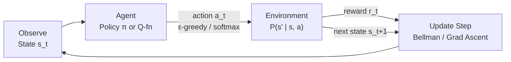
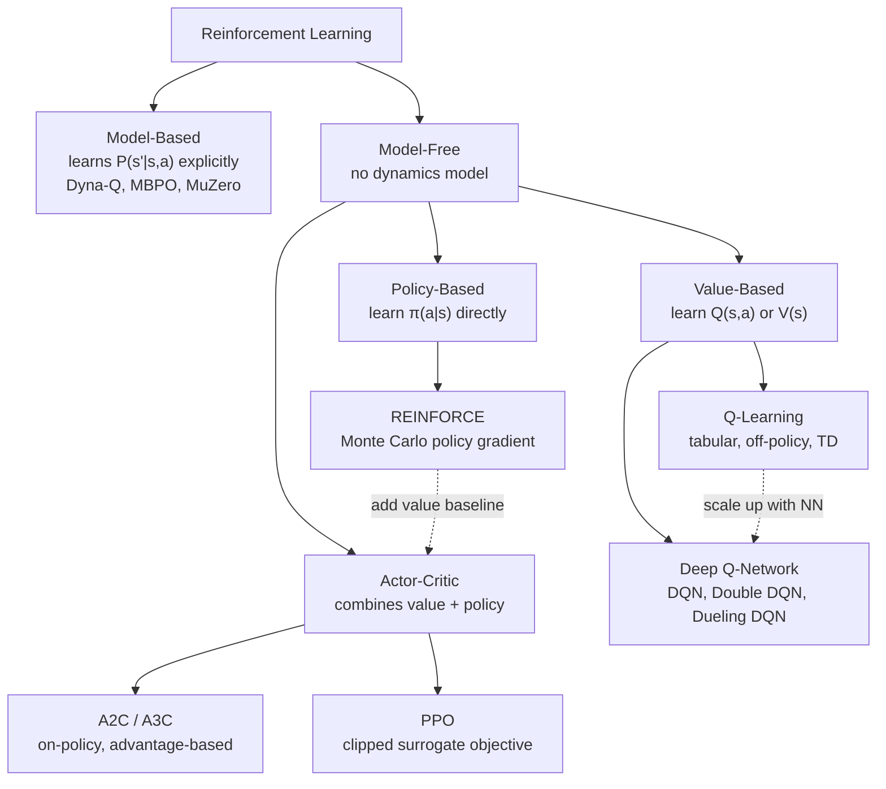

# Reinforcement Learning

> [!abstract] TL;DR
> Reinforcement Learning is the paradigm where an agent learns to make sequences of decisions by interacting with an environment — receiving rewards for good actions and penalties for bad ones — with no labeled training data. It powers AlphaGo, robotic control, and the RLHF alignment pipeline that turned GPT-3 into ChatGPT.

---

## Intuition

**Analogy:** Teaching a dog new tricks. You do not hand the dog a textbook on "Fetch" — instead, you watch it try things, reward it with a treat when it does the right thing, and ignore or correct it when it does not. Over thousands of repetitions, the dog discovers which actions in which situations produce the most treats. The dog has no labeled dataset; it learns by doing.

The RL agent is the dog, the environment is the world it interacts with, the reward signal is the treat, and the policy is the learned behavior: "when I see situation X, I should do Y." The key difficulty is that rewards are often *delayed* — the treat comes at the end of a multi-step sequence, so the agent must figure out which earlier actions caused the eventual success.

---

## How It Works

### Core Components

| Component | Description | Example (Chess) |
|-----------|-------------|-----------------|
| **Agent** | The decision-maker | The chess engine |
| **Environment** | Everything outside the agent | The chess board |
| **State s** | Current situation | Board position |
| **Action a** | Choice the agent makes | Moving a piece |
| **Reward r** | Scalar feedback signal | +1 for win, -1 for loss, 0 otherwise |
| **Policy π(a\|s)** | Strategy: maps states to actions | "In this position, move the queen" |
| **Value function V(s)** | Expected cumulative future reward from state s | "This board position is 70% winning" |
| **Q-function Q(s,a)** | Expected return from taking action a in state s, then following policy | "Moving the knight here leads to +0.4 value" |

**Return G_t:** The discounted sum of future rewards from time t:

$$G_t = r_t + \gamma r_{t+1} + \gamma^2 r_{t+2} + \cdots = \sum_{k=0}^{\infty} \gamma^k r_{t+k}$$

The discount factor **γ ∈ [0, 1]** controls how much the agent values immediate vs future rewards. γ = 0 means purely myopic (only care about next reward). γ = 0.99 means the agent plans far ahead.

---

### The RL Loop



1. **Observe** — agent receives the current state s_t from the environment.
2. **Act** — agent selects action a_t according to its policy π(a|s) or Q-function.
3. **Receive** — environment transitions to s_{t+1} and emits reward r_t.
4. **Update** — agent uses the (s_t, a_t, r_t, s_{t+1}) tuple to improve its policy or Q-function.
5. **Repeat** — until a terminal state (game over, goal reached) or time limit.

---

### Markov Decision Processes (MDPs)

RL is formalized as an **MDP**, a 5-tuple (S, A, P, R, γ):

- **S** — finite set of states
- **A** — finite set of actions
- **P(s' | s, a)** — transition probability: probability of reaching s' from s when taking action a
- **R(s, a, s')** — reward function: scalar feedback received
- **γ** — discount factor ∈ [0, 1)

**Markov Property:** The future depends only on the current state, not on the history of how we got there. P(s_{t+1} | s_t, a_t) = P(s_{t+1} | s_0, a_0, ..., s_t, a_t). This is what makes Q-learning and dynamic programming tractable — you do not need to remember the entire history.

**Bellman Equations** — the recursive relationship at the heart of value-based RL:

$$V^\pi(s) = \sum_a \pi(a|s) \sum_{s'} P(s'|s,a) \left[ R(s,a,s') + \gamma V^\pi(s') \right]$$

$$Q^\pi(s,a) = \sum_{s'} P(s'|s,a) \left[ R(s,a,s') + \gamma \sum_{a'} \pi(a'|s') Q^\pi(s',a') \right]$$

The **optimal** Q-function satisfies the Bellman optimality equation:

$$Q^*(s,a) = \sum_{s'} P(s'|s,a) \left[ R(s,a,s') + \gamma \max_{a'} Q^*(s',a') \right]$$

---

### Taxonomy of RL Algorithms



**Three key dichotomies:**

| Axis | Option A | Option B |
|------|----------|----------|
| **Model** | Model-based (learns env dynamics) | Model-free (treats env as black box) |
| **On/Off-policy** | On-policy: learns from own actions (SARSA, PPO) | Off-policy: learns from any data (Q-Learning, DQN) |
| **Value vs Policy** | Value-based: derive policy from Q/V (Q-Learning, DQN) | Policy-based: parameterize policy directly (REINFORCE, PPO) |

---

### Q-Learning

**Q-Learning** is a model-free, off-policy algorithm that directly learns the optimal Q-function Q*(s,a) using temporal-difference (TD) updates.

**Algorithm:**
1. Initialize Q-table Q(s,a) = 0 for all s, a
2. For each episode:
   - Observe state s
   - Select action a using **ε-greedy**: with probability ε choose random action (explore), else choose argmax_a Q(s,a) (exploit)
   - Execute a, observe reward r and next state s'
   - **Bellman update:** Q(s,a) ← Q(s,a) + α[r + γ · max_{a'} Q(s',a') − Q(s,a)]
   - s ← s'; repeat
3. Decay ε over time (more exploitation as learning matures)

**Why it works:** The TD target `r + γ · max Q(s',a')` is a bootstrap estimate of the true Q-value. Each update nudges Q(s,a) toward this target with step size α. Under mild conditions, the Q-table provably converges to Q* (Watkins & Dayan, 1992).

**Limitation:** Q-table scales as |S| × |A|. For Atari games with pixel states, |S| is astronomically large — this is where DQN comes in.

---

### Deep Q-Networks (DQN)

DQN (Mnih et al., 2015) replaces the Q-table with a neural network Qθ(s,a) that takes a state s and outputs Q-values for all actions simultaneously.

**Two critical innovations:**

**1. Experience Replay:** Instead of learning from each (s, a, r, s') transition immediately (which is highly correlated and leads to instability), store transitions in a replay buffer D. At each update step, sample a random mini-batch from D. This breaks temporal correlations and allows data reuse.

**2. Target Network:** A second, frozen copy of the Q-network Qθ− is used to compute the TD target:

$$\text{Loss} = \mathbb{E}_{(s,a,r,s') \sim D} \left[ \left( r + \gamma \max_{a'} Q_{\theta^-}(s', a') - Q_\theta(s, a) \right)^2 \right]$$

The target network parameters θ− are updated to match θ only every N steps (hard update) or with a slow polyak average (soft update). Without this, the target moves every step, creating a "chasing your own tail" instability.

**DQN variants:**
- **Double DQN** — decouple action selection (use online net) from value estimation (use target net) to reduce overestimation bias.
- **Dueling DQN** — split Q(s,a) = V(s) + A(s,a) so the network separately learns state value and action advantage.
- **Prioritized Experience Replay** — sample transitions with high TD error more often (they have the most to learn).

---

### Policy Gradient / REINFORCE

Instead of learning Q(s,a) and deriving a policy, policy gradient methods directly parameterize the policy πθ(a|s) and optimize the expected return J(θ) = E[G_0]:

$$\nabla_\theta J(\theta) = \mathbb{E}_{\tau \sim \pi_\theta} \left[ \sum_{t=0}^{T} \nabla_\theta \log \pi_\theta(a_t | s_t) \cdot G_t \right]$$

**The log-probability trick:** We cannot differentiate through sampling. The trick rewrites the gradient of an expectation over π into an expectation of the gradient of log π (the score function / REINFORCE trick):

$$\nabla_\theta \mathbb{E}[f(x)] = \mathbb{E}[f(x) \nabla_\theta \log \pi_\theta(x)]$$

This is computable via Monte Carlo: run episodes, collect returns G_t, then gradient-ascent on Σ log π(a_t|s_t) · G_t.

**Baseline variance reduction:** The raw return G_t has high variance — a single episode tells you very little because G_t depends on random future events. Subtracting a baseline b(s_t) that does not depend on a_t reduces variance without introducing bias:

$$\nabla_\theta J(\theta) = \mathbb{E} \left[ \nabla_\theta \log \pi_\theta(a_t|s_t) \cdot (G_t - b(s_t)) \right]$$

The optimal baseline is the value function V(s_t), which leads directly to the Actor-Critic framework.

---

### Actor-Critic Methods

Actor-Critic combines a **policy network (actor)** with a **value network (critic)**:

- **Actor** πθ(a|s) — the policy that selects actions. Updated via policy gradient.
- **Critic** Vφ(s) — estimates the value of each state. Used to compute the **advantage** A(s,a) = Q(s,a) − V(s): "how much better is this action than what I'd do on average?"

**Advantage Actor-Critic (A2C) update:**

$$\nabla_\theta J(\theta) \approx \nabla_\theta \log \pi_\theta(a_t|s_t) \cdot A_t$$

$$A_t = r_t + \gamma V_\phi(s_{t+1}) - V_\phi(s_t) \quad \text{(TD advantage)}$$

**A3C (Asynchronous Advantage Actor-Critic):** Run multiple agent-environment instances in parallel on CPU threads, each computing gradients and asynchronously updating shared global parameters. This provides diverse experience and reduces correlation, replacing experience replay for on-policy methods.

**A2C:** Synchronous version of A3C — collect experience from N parallel workers, aggregate updates, apply. More stable and reproducible than A3C; the current default.

---

### Proximal Policy Optimization (PPO)

PPO (Schulman et al., 2017) is the dominant on-policy RL algorithm. It solves a core instability in policy gradient: if you take too large a gradient step, the new policy can be catastrophically worse than the old one, and there is no way to recover.

**Key idea: Clipped Surrogate Objective.** Define the probability ratio:

$$r_t(\theta) = \frac{\pi_\theta(a_t | s_t)}{\pi_{\theta_\text{old}}(a_t | s_t)}$$

The clipped objective prevents the ratio from moving too far from 1:

$$\mathcal{L}^{\text{CLIP}}(\theta) = \mathbb{E}_t \left[ \min\left( r_t(\theta) A_t,\ \text{clip}(r_t(\theta),\ 1{-}\epsilon,\ 1{+}\epsilon) \cdot A_t \right) \right]$$

- If A_t > 0 (action was better than expected): the ratio is clipped at 1+ε, preventing the policy from over-updating on lucky outcomes.
- If A_t < 0 (action was worse than expected): the ratio is clipped at 1−ε, preventing the policy from over-punishing.

**KL penalty variant:** Alternatively, PPO can use an adaptive KL divergence penalty instead of clipping: maximize E[r_t(θ) · A_t] − β · KL[π_old || π_θ], where β is adapted based on whether KL is too high or too low.

PPO is the algorithm used inside RLHF pipelines to fine-tune language models from reward model signals.

---

### RL vs Supervised Learning

| Dimension | Supervised Learning | Reinforcement Learning |
|-----------|--------------------|-----------------------|
| **Labels** | Ground-truth labels for every example | No labels — only scalar reward signals |
| **Feedback timing** | Immediate — loss on every prediction | Delayed — reward may come many steps later |
| **Data distribution** | Fixed train set | Dynamic — agent generates its own data by interacting |
| **Credit assignment** | Direct — loss tells exactly what was wrong | Hard — which past action caused the later reward? |
| **Exploration** | Not needed | Essential — must try new actions to find better ones |
| **Stability** | Generally stable | Notoriously unstable — policy changes distribution |

**The exploration-exploitation tradeoff** is RL's central challenge: to get reward, you must exploit known good actions; to discover better actions, you must explore unknown ones. Pure exploitation = stuck at local optimum. Pure exploration = never converge.

---

## Code Demo

```python
import numpy as np
import random

# ── 4×4 Grid World ────────────────────────────────────────────────────────────
# State = row * 4 + col (0..15). Agent starts at state 0 (top-left).
# Goal = state 15 (bottom-right). Obstacle = state 5 (gives negative reward).
# Actions: 0=up, 1=right, 2=down, 3=left

GRID_SIZE   = 4
N_STATES    = GRID_SIZE * GRID_SIZE
N_ACTIONS   = 4
GOAL_STATE  = 15
OBSTACLE    = 5

def env_step(state: int, action: int) -> tuple:
    """Transition function for the grid world."""
    row, col = divmod(state, GRID_SIZE)
    if action == 0:   row = max(row - 1, 0)
    elif action == 1: col = min(col + 1, GRID_SIZE - 1)
    elif action == 2: row = min(row + 1, GRID_SIZE - 1)
    elif action == 3: col = max(col - 1, 0)
    next_state = row * GRID_SIZE + col
    if next_state == GOAL_STATE:
        return next_state, +10.0, True   # large positive reward, episode ends
    elif next_state == OBSTACLE:
        return next_state, -5.0, False   # penalty, but episode continues
    else:
        return next_state, -0.1, False   # small step penalty encourages efficiency


# ── Q-Learning ────────────────────────────────────────────────────────────────
def q_learning(
    n_episodes: int = 3000,
    alpha: float = 0.1,        # learning rate
    gamma: float = 0.99,       # discount factor — agent is forward-looking
    epsilon_start: float = 1.0,
    epsilon_end: float = 0.05,
    epsilon_decay: float = 0.995,
) -> np.ndarray:
    """
    Q-Learning: off-policy TD control.
    Bellman update: Q(s,a) <- Q(s,a) + alpha * [r + gamma * max Q(s',a') - Q(s,a)]
    """
    Q = np.zeros((N_STATES, N_ACTIONS))  # Q-table: state x action -> value
    epsilon = epsilon_start
    episode_rewards = []

    for ep in range(n_episodes):
        state = 0           # always start at top-left corner
        total_reward = 0.0
        done = False

        for _ in range(100):   # max steps per episode to prevent infinite loops
            # ε-greedy action selection
            if random.random() < epsilon:
                action = random.randint(0, N_ACTIONS - 1)  # explore
            else:
                action = int(np.argmax(Q[state]))          # exploit

            next_state, reward, done = env_step(state, action)
            total_reward += reward

            # Bellman update (core of Q-learning)
            td_target = reward + gamma * np.max(Q[next_state]) * (1 - int(done))
            td_error  = td_target - Q[state, action]
            Q[state, action] += alpha * td_error

            state = next_state
            if done:
                break

        # Decay epsilon: shift from exploration toward exploitation
        epsilon = max(epsilon_end, epsilon * epsilon_decay)
        episode_rewards.append(total_reward)

        if (ep + 1) % 1000 == 0:
            avg = np.mean(episode_rewards[-1000:])
            print(f"Episode {ep+1:5d} | ε={epsilon:.4f} | Avg reward (last 1000): {avg:.2f}")

    return Q


# ── Train ──────────────────────────────────────────────────────────────────────
np.random.seed(42)
random.seed(42)
Q_table = q_learning()

# ── Display learned greedy policy ─────────────────────────────────────────────
action_symbols = {0: "^", 1: ">", 2: "v", 3: "<"}
print("\nLearned greedy policy (G=Goal, X=Obstacle):")
for row in range(GRID_SIZE):
    cells = []
    for col in range(GRID_SIZE):
        s = row * GRID_SIZE + col
        if s == GOAL_STATE:
            cells.append(" G ")
        elif s == OBSTACLE:
            cells.append(" X ")
        else:
            cells.append(f" {action_symbols[int(np.argmax(Q_table[s]))]} ")
    print("".join(cells))

# ── Evaluate greedy policy (single rollout) ───────────────────────────────────
state, done, steps, total_r = 0, False, 0, 0.0
path = [0]
while not done and steps < 20:
    action = int(np.argmax(Q_table[state]))
    state, r, done = env_step(state, action)
    path.append(state)
    total_r += r
    steps += 1

print(f"\nGreedy rollout: {path}")
print(f"Reached goal: {done} | Steps: {steps} | Total reward: {total_r:.2f}")

# Expected output after training:
# Learned greedy policy:
#  >   >   >   v
#  >   X   >   v
#  >   >   >   v
#  >   >   >   G
# Greedy rollout: [0, 1, 2, 3, 7, 11, 15]
# Reached goal: True | Steps: 6 | Total reward: 9.40
```

---

## Real-World Examples

> **AlphaGo / AlphaZero (DeepMind, 2016–2017):** AlphaGo used a combination of supervised learning (from human expert games) and RL (self-play policy gradient) to master the game of Go. AlphaZero extended this — learning from scratch using only self-play Monte Carlo Tree Search guided by an actor-critic network. The value network (critic) estimates board position value; the policy network (actor) proposes moves. This achieved superhuman performance in Go, Chess, and Shogi without any human game data.

> **Robotics (OpenAI Dactyl, 2019):** A robot hand learned to manipulate a Rubik's Cube using PPO trained entirely in simulation, then transferred to the real world (sim-to-real transfer). The simulation used domain randomization — varying physics parameters — so the policy learned to be robust to uncertainty. PPO's stable, on-policy updates were key for the complex, high-dimensional continuous action space.

> **RLHF for LLMs (InstructGPT / ChatGPT, 2022):** PPO is used as the RL optimizer inside RLHF. The LLM is the actor (policy), the reward model trained on human preference rankings is the environment, and each generated token sequence is an "episode." PPO's clipped objective prevents the LLM from collapsing to reward-hacked, degenerate outputs. See [[RLHF]] for the full pipeline.

---

## Trade-offs

| Algorithm | Sample Efficiency | Stability | Scalability | Action Spaces | Key Weakness |
|-----------|------------------|-----------|-------------|---------------|--------------|
| **Q-Learning** | Low | High | Tabular only | Discrete (small) | Cannot scale to large state spaces |
| **DQN** | Moderate (replay) | Moderate | Large discrete | Discrete | Overestimates Q-values; brittle hyperparams |
| **REINFORCE** | Very Low | Low | Scales with NN | Discrete + Continuous | Extreme variance; slow convergence |
| **A2C / A3C** | Moderate | Moderate | Scales with NN | Discrete + Continuous | On-policy — cannot reuse old data |
| **PPO** | Moderate-High | High | Scales with NN | Discrete + Continuous | Complex implementation; many hyperparams |
| **Model-Based** | High | Variable | Limited by model accuracy | Both | Model errors compound; hard to learn good dynamics |

---

## When to Use vs Avoid

**Use RL when:**
- The task involves sequential decisions with delayed feedback (games, robotics, navigation).
- No labeled dataset exists, but a reward signal can be defined (or simulated).
- The agent can safely explore in a simulator before deployment.
- Fine-tuning an LLM from human preferences (RLHF pipeline with PPO).

**Avoid RL when:**
- A good labeled dataset exists — supervised learning will be faster and more stable.
- Exploration is unsafe or expensive (e.g., real-world robotics without a good simulator).
- The reward function is hard to define — RL will optimize the proxy reward, not the true objective (reward hacking).
- You need interpretability — RL policies are black boxes, harder to audit than rule-based systems.
- Compute budget is limited — RL typically requires orders of magnitude more training steps than supervised learning.

---

## Common Pitfalls

- **Reward hacking** — the agent finds unexpected ways to maximize the reward signal that do not match the true intent. Example: a cleaning robot learns to close its eyes to avoid seeing dirt (reward = 0 dirt visible). Mitigation: carefully design dense, multi-objective rewards; use human feedback (RLHF).

- **Sparse rewards** — if the agent only receives reward at the very end (e.g., win/loss), early exploration is essentially random and training is glacially slow. Mitigation: reward shaping (add intermediate rewards), curriculum learning (start with easier tasks), hindsight experience replay (HER).

- **Catastrophic forgetting in policy updates** — large gradient steps can destroy a previously learned policy. PPO's clipped objective and trust-region methods exist precisely for this. Monitoring KL divergence between old and new policy at each update is critical.

- **Hyperparameter sensitivity** — RL algorithms are notoriously fragile to hyperparameters: learning rate, ε-decay schedule, replay buffer size, target network update frequency. A configuration that works on one environment often fails on another. Always tune with multiple random seeds.

- **Off-policy vs on-policy confusion** — Q-learning and DQN are off-policy (can learn from any experience in the replay buffer). PPO and A2C are on-policy (the experience used for updates must come from the *current* policy). Mixing up the two (e.g., updating PPO on old replay buffer data) destroys correctness.

- **Not accounting for non-stationarity** — the distribution of states the agent visits changes as the policy improves. This invalidates fixed replay buffers and makes convergence analysis hard. Periodically refresh the replay buffer and monitor state visitation distributions.

- **Overestimation bias in Q-learning** — the max operator in `max_a' Q(s',a')` systematically overestimates Q-values (Jensen's inequality). Double DQN decouples action selection from evaluation to reduce this bias.

---

## Related Concepts

- [[_MOC_Classical_ML]] — parent section map of content

- [[RLHF]] — the production deployment of RL (specifically PPO) to align language models with human preferences; the RL loop covered here is exactly what runs inside RLHF training
- [[DPO]] — Direct Preference Optimization replaces the PPO RL loop in RLHF with a stable supervised objective, trading online exploration for training simplicity
- [[Constitutional_AI]] — Anthropic's variant of RLHF using AI-generated preference feedback; relies on the same RL foundations covered here
- [[InstructGPT_RLHF]] — the seminal paper that applied PPO-based RL to align GPT-3; the most important real-world RL application in NLP
- [[Neural_Network_Basics]] — DQN and all actor-critic methods use neural networks as function approximators for Q(s,a) and π(a|s); understanding forward pass and layers is prerequisite
- [[Backpropagation]] — the same gradient-based update that trains supervised models is used to update Q-networks and policy networks in DQN, REINFORCE, and PPO
- [[Optimization_Theory]] — RL policy optimization is non-convex, faces the same saddle-point and local-minima challenges as deep learning, plus additional non-stationarity
- [[Probability_and_Statistics]] — MDPs are fundamentally probabilistic objects (P(s'|s,a)); expected return E[G_t], policy gradient expectations, and Bellman equations all rely on probability theory

---

## Review Questions

1. The Bellman equation defines Q*(s,a) recursively in terms of Q*(s',a'). Explain why this recursive definition does not cause infinite regress, and under what conditions Q-learning provably converges to Q* in the tabular setting.

2. DQN uses both experience replay and a target network. If you removed *only* the target network (keeping experience replay), what failure mode would you observe during training and why? Now consider removing *only* experience replay (keeping the target network) — what different failure mode would you observe?

3. REINFORCE is high-variance and slow; PPO is more stable and sample-efficient. Yet both are policy gradient methods optimizing the same objective J(θ). Explain what PPO adds over REINFORCE in terms of (a) variance reduction, (b) step-size safety, and (c) data efficiency — and what trade-offs PPO introduces.

---

## Sources

- Sutton, R.S. & Barto, A.G. (2018). *Reinforcement Learning: An Introduction (2nd ed.)*. [incompleteideas.net](http://incompleteideas.net/book/the-book-2nd.html)
- Mnih, V., et al. (2015). Human-level control through deep reinforcement learning (DQN). *Nature*. [arxiv.org/abs/1312.5602](https://arxiv.org/abs/1312.5602)
- Williams, R.J. (1992). Simple statistical gradient-following algorithms for connectionist reinforcement learning (REINFORCE). *Machine Learning*. [doi.org/10.1007/BF00992696](https://doi.org/10.1007/BF00992696)
- Schulman, J., et al. (2017). Proximal Policy Optimization Algorithms (PPO). [arxiv.org/abs/1707.06347](https://arxiv.org/abs/1707.06347)
- Mnih, V., et al. (2016). Asynchronous Methods for Deep Reinforcement Learning (A3C). [arxiv.org/abs/1602.01783](https://arxiv.org/abs/1602.01783)
- Silver, D., et al. (2016). Mastering the game of Go with deep neural networks and tree search (AlphaGo). *Nature*. [doi.org/10.1038/nature16961](https://doi.org/10.1038/nature16961)
- Watkins, C.J.C.H. & Dayan, P. (1992). Q-learning. *Machine Learning*. [doi.org/10.1007/BF00992698](https://doi.org/10.1007/BF00992698)
- Spinning Up in Deep RL (OpenAI). [spinningup.openai.com](https://spinningup.openai.com)

---

#reinforcement-learning #q-learning #dqn #policy-gradient #actor-critic #ppo #mdp #AI-ML #advanced
