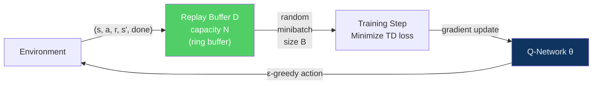
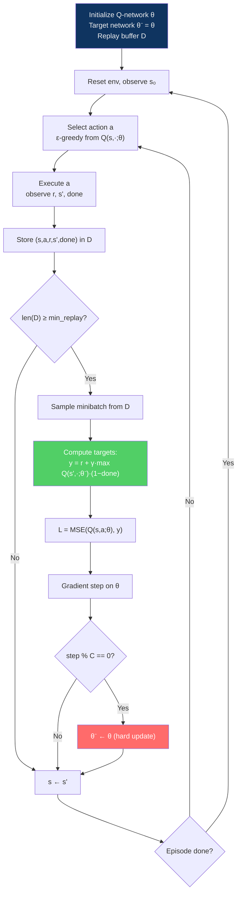

---
title: "Deep Q-Networks (DQN)"
aliases: ["DQN", "Deep Q-Learning"]
tags: [AI-ML, Reinforcement-Learning, Deep-Learning]
domain: AI-ML
difficulty: Advanced
created: 2026-07-29
related:
  - Q_Learning_and_SARSA
  - Policy_Gradient_Methods
  - RL_Fundamentals
status: complete
---

# Deep Q-Networks (DQN)

> [!abstract] TL;DR
> DQN (Mnih et al., 2015) bridges tabular Q-learning and deep learning by replacing the Q-table with a neural network Q(s,a;θ) that takes raw states as input and outputs Q-values for every action. Two innovations make training stable: an **experience replay buffer** that breaks temporal correlations by sampling random minibatches, and a **target network** (a frozen copy of the Q-network updated periodically) that prevents the "moving target" problem. DQN achieved human-level performance on 49 Atari games from raw pixels — the first demonstration of a single RL algorithm mastering diverse tasks. Extensions (Double DQN, Dueling DQN, PER, Rainbow) each address a specific failure mode of vanilla DQN.

---

## Intuition

In tabular Q-learning the Q-table breaks at scale: Atari's 84×84×4 pixel state space has more possible states than atoms in the observable universe. The solution: **function approximation**. Instead of storing Q(s,a) for every (s,a) pair, use a neural network parameterised by θ that *generalises* across similar states.

But naively combining Q-learning with neural networks fails catastrophically. Two problems arise:

1. **Correlated samples**: consecutive transitions (s_t, s_{t+1}, s_{t+2}…) are highly correlated. Gradient descent on correlated mini-batches causes the loss landscape to oscillate.
2. **Moving target**: every update to θ changes Q(s',a';θ) used in the TD target, so the target itself keeps shifting. It is like trying to hit a bullseye that moves every time you shoot.

Experience replay and target networks are surgical fixes for each of these problems.

---

## How It Works

### From Q-Table to Q-Network

| | Tabular Q-Learning | DQN |
|--|-------------------|-----|
| **Q-function** | Q-table: array of size |S|x|A| | Neural net Q(s,a;θ): maps state → Q-value per action |
| **Update** | Direct cell assignment | Gradient descent on TD loss |
| **State input** | Integer index | Raw pixels, vectors, etc. |
| **Generalization** | None (each entry independent) | Shares weights across similar states |
| **Scale** | Fails above ~10k states | Handles continuous/high-dim spaces |

The network takes a state s as input and outputs **one Q-value per action** — more efficient than computing Q(s,a) separately for each action.

---

### Innovation 1: Experience Replay Buffer

Instead of training on consecutive transitions, the agent stores every transition in a replay buffer D and samples random minibatches for training:



**Benefits of replay:**
- **Breaks temporal correlations** — random sampling ensures each gradient step sees diverse transitions
- **Data efficiency** — each transition can be replayed multiple times (not discarded after one use)
- **Stabilises training** — the data distribution seen by the optimizer is more stationary

```python
from collections import deque
import random
import numpy as np

class ReplayBuffer:
    """Fixed-capacity circular replay buffer storing (s, a, r, s', done) tuples."""

    def __init__(self, capacity: int = 100_000):
        self.buffer = deque(maxlen=capacity)

    def push(self, state, action: int, reward: float,
             next_state, done: bool) -> None:
        self.buffer.append((state, action, reward, next_state, done))

    def sample(self, batch_size: int):
        batch = random.sample(self.buffer, batch_size)
        states, actions, rewards, next_states, dones = zip(*batch)
        return (
            np.array(states,      dtype=np.float32),
            np.array(actions,     dtype=np.int64),
            np.array(rewards,     dtype=np.float32),
            np.array(next_states, dtype=np.float32),
            np.array(dones,       dtype=np.float32),
        )

    def __len__(self) -> int:
        return len(self.buffer)
```

---

### Innovation 2: Target Network

The TD target uses a **separate, frozen copy** of the Q-network (θ⁻) updated only every C steps:

$$\text{TD target} = r + \gamma \cdot \max_{a'} Q(s', a'; \theta^-)$$

$$\mathcal{L}(\theta) = \mathbb{E}_{\mathcal{D}} \left[ \left( r + \gamma \max_{a'} Q(s', a'; \theta^-) - Q(s, a; \theta) \right)^2 \right]$$

Without the target network: every gradient update to θ immediately changes the TD target, creating a feedback loop. The target network breaks this loop — for C steps, the "goal post" stays fixed while the Q-network chases it.

**Hard update** (original DQN): copy θ → θ⁻ exactly every C = 1000–10000 steps.  
**Soft update** (TD3, SAC): θ⁻ ← τ·θ + (1-τ)·θ⁻ every step (τ = 0.005 typical).

---

### DQN Training Loop



---

### Full DQN Implementation (PyTorch)

```python
import torch
import torch.nn as nn
import torch.optim as optim
import gymnasium as gym
import numpy as np
import random
from collections import deque

class QNetwork(nn.Module):
    def __init__(self, obs_dim: int, n_actions: int, hidden: int = 128):
        super().__init__()
        self.net = nn.Sequential(
            nn.Linear(obs_dim, hidden), nn.ReLU(),
            nn.Linear(hidden, hidden),  nn.ReLU(),
            nn.Linear(hidden, n_actions),
        )
    def forward(self, x):
        return self.net(x)

class ReplayBuffer:
    def __init__(self, capacity):
        self.buf = deque(maxlen=capacity)
    def push(self, *t):
        self.buf.append(t)
    def sample(self, bs):
        batch = random.sample(self.buf, bs)
        s, a, r, s2, d = zip(*batch)
        return (torch.tensor(np.array(s),  dtype=torch.float32),
                torch.tensor(a,            dtype=torch.long),
                torch.tensor(r,            dtype=torch.float32),
                torch.tensor(np.array(s2), dtype=torch.float32),
                torch.tensor(d,            dtype=torch.float32))
    def __len__(self): return len(self.buf)

def train_dqn(env_name="CartPole-v1", n_episodes=500, gamma=0.99, lr=1e-3,
              batch_size=64, buffer_capacity=10_000, min_replay=1_000,
              target_update_freq=100, eps_start=1.0, eps_end=0.02, eps_decay=0.995):
    env = gym.make(env_name)
    obs_dim  = env.observation_space.shape[0]
    n_actions = env.action_space.n

    q_net      = QNetwork(obs_dim, n_actions)
    target_net = QNetwork(obs_dim, n_actions)
    target_net.load_state_dict(q_net.state_dict())
    target_net.eval()

    optimizer = optim.Adam(q_net.parameters(), lr=lr)
    buffer    = ReplayBuffer(buffer_capacity)
    eps       = eps_start
    total_steps = 0
    returns = []

    for ep in range(n_episodes):
        obs, _ = env.reset()
        total_r, done = 0.0, False

        while not done:
            if random.random() < eps:
                action = env.action_space.sample()
            else:
                with torch.no_grad():
                    action = int(q_net(torch.tensor(obs, dtype=torch.float32).unsqueeze(0)).argmax(1))
            next_obs, reward, terminated, truncated, _ = env.step(action)
            done = terminated or truncated
            buffer.push(obs, action, reward, next_obs, float(done))
            obs = next_obs; total_r += reward; total_steps += 1

            if len(buffer) >= min_replay:
                s, a, r, s2, d = buffer.sample(batch_size)
                q_curr = q_net(s).gather(1, a.unsqueeze(1)).squeeze(1)
                with torch.no_grad():
                    # Double DQN: online selects action, target evaluates
                    best_a = q_net(s2).argmax(1, keepdim=True)
                    q_next = target_net(s2).gather(1, best_a).squeeze(1)
                    td_target = r + gamma * q_next * (1.0 - d)
                loss = nn.functional.huber_loss(q_curr, td_target)
                optimizer.zero_grad(); loss.backward()
                nn.utils.clip_grad_norm_(q_net.parameters(), 10.0)
                optimizer.step()
                if total_steps % target_update_freq == 0:
                    target_net.load_state_dict(q_net.state_dict())

        eps = max(eps_end, eps * eps_decay)
        returns.append(total_r)
        if ep % 50 == 0:
            print(f"Ep {ep:4d} | Avg(50): {np.mean(returns[-50:]):6.1f} | ε={eps:.3f}")

    env.close()
    return q_net
```

---

### DQN Variants

#### Double DQN

Vanilla DQN overestimates Q-values because `max Q(s',·;θ⁻)` picks the noisiest action. Fix: decouple *selection* from *evaluation*:

$$y_{\text{DDQN}} = r + \gamma \cdot Q\!\left(s',\ \arg\max_{a'} Q(s', a'; \theta);\ \theta^-\right)$$

The online network selects which action; the target network evaluates how good it is.

#### Dueling DQN

Split the network into two streams recombined as:

$$Q(s, a;\theta) = V(s;\theta_V) + A(s,a;\theta_A) - \frac{1}{|\mathcal{A}|}\sum_{a'} A(s,a';\theta_A)$$

- **V(s)**: how good is this state regardless of action?  
- **A(s,a)**: advantage of action a over average?  
- Mean subtraction ensures identifiability.

Benefit: for states where action choice doesn't matter, V(s) can be learned from any transition — faster learning.

#### Prioritized Experience Replay (PER)

Sample transitions with probability proportional to TD error magnitude:

$$P(i) \propto |\delta_i|^\alpha$$

Large TD errors = transitions where the network was most surprised = most informative. Corrected with importance sampling weights to maintain unbiased gradients.

#### Rainbow DQN

Combines Double + Dueling + PER + n-step returns + Noisy Nets + Distributional RL. SOTA on Atari 57 games at the time of publication (2018).

---

### DQN Variants Summary Table

| Variant | Problem solved | Mechanism |
|---------|--------------|-----------|
| Vanilla DQN | Tabular RL doesn't scale | NN + experience replay + target network |
| Double DQN | Q overestimation | Decouple selection (online) from evaluation (target) |
| Dueling DQN | Slow value learning | Separate V(s) and A(s,a) streams |
| Prioritized Replay | Uniform sampling inefficient | Sample ∝ TD error magnitude |
| n-step DQN | Single-step bootstrap too myopic | n-step return target |
| Noisy Nets | Undirected ε-greedy exploration | Learnable noise in weights |
| Distributional RL | Point estimate loses uncertainty | Model full distribution of Z(s,a) |
| Rainbow | All of the above | Combined; SOTA Atari |

---

## Trade-offs

| Design choice | Option A | Option B | When to prefer A |
|--------------|----------|----------|-----------------|
| **Replay buffer size** | Small (10K) | Large (1M) | Memory constrained / fast environment |
| **Target update** | Hard (copy every C steps) | Soft (τ=0.005 each step) | Simpler environments |
| **Architecture** | MLP for vector states | CNN for image states | State is a feature vector |
| **Double vs Vanilla** | Double DQN | Vanilla | Almost always — minimal overhead |
| **Dueling vs standard** | Dueling | Standard | Many states where action doesn't matter |
| **DQN vs Policy Gradient** | DQN / off-policy | PPO / SAC | Discrete actions; data reuse critical |

---

## Common Pitfalls

1. **Training before replay buffer is warm** — if gradient updates start with only 32 transitions in the buffer, every minibatch is nearly identical. Always require `len(buffer) >= min_replay` before the first training step.
2. **Forgetting to detach the TD target** — `r + γ·max Q(s';θ⁻)` must be wrapped in `torch.no_grad()`. Propagating gradients through the target network creates a circular loss and training diverges.
3. **Target network updated too frequently** — updating every step (C=1) defeats the purpose. The target should be stable for hundreds to thousands of steps. If divergence occurs, increase C or use soft updates.
4. **No gradient clipping** — DQN losses can have large outliers. Clip gradients to norm 10 (or use Huber loss) to prevent explosions.

---

## Related Concepts

- [[Q_Learning_and_SARSA|← Q-Learning & SARSA]] — tabular foundation that DQN extends
- [[Policy_Gradient_Methods|→ Policy Gradient Methods]] — alternative family (PPO, A2C) that avoids Q-function entirely
- [[RL_Fundamentals|← RL Fundamentals]] — MDP, Bellman equations, exploration-exploitation
- [[Neural_Networks|← Neural Networks]] — function approximator inside DQN
- [[Backpropagation|← Backpropagation]] — gradient descent updates Q-network weights

---

## Review Questions

1. Why does vanilla Q-learning diverge when a neural network approximates the Q-function without experience replay or a target network? Explain the role of each component in fixing one specific instability.
2. Double DQN uses the online network to select the action and the target network to evaluate it. Walk through a concrete example where vanilla DQN overestimates and show how Double DQN corrects it.
3. You are training DQN on a sparse-reward environment (reward only at the very end of a long episode). Which DQN variants would you prioritise and why?
4. Compare hard target update (copy every C=1000 steps) to soft update (τ=0.005 each step). Under what conditions is each preferable?

---

## Sources

- Mnih, V. et al. (2015). Human-level control through deep reinforcement learning. *Nature*, 518, 529–533.
- van Hasselt, H., Guez, A., & Silver, D. (2016). Deep Reinforcement Learning with Double Q-Learning. *AAAI 2016*.
- Wang, Z. et al. (2016). Dueling Network Architectures for Deep Reinforcement Learning. *ICML 2016*.
- Schaul, T. et al. (2016). Prioritized Experience Replay. *ICLR 2016*.
- Hessel, M. et al. (2018). Rainbow: Combining Improvements in Deep Reinforcement Learning. *AAAI 2018*.

#AI-ML #Reinforcement-Learning #DQN #DeepQLearning #ExperienceReplay #TargetNetwork #DoubleDQN #DuelingDQN
