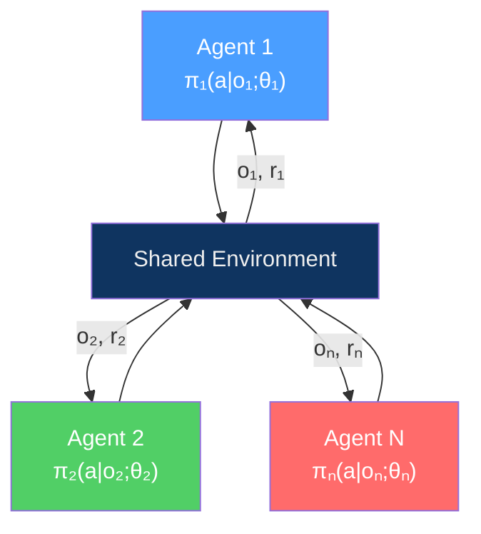
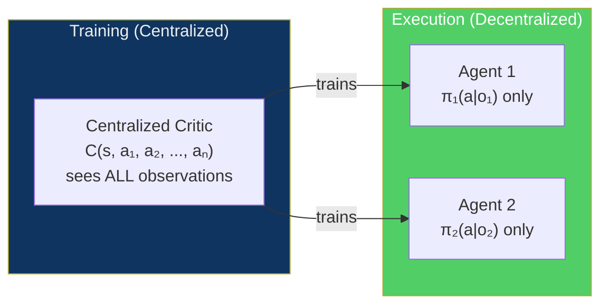
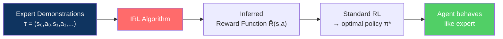
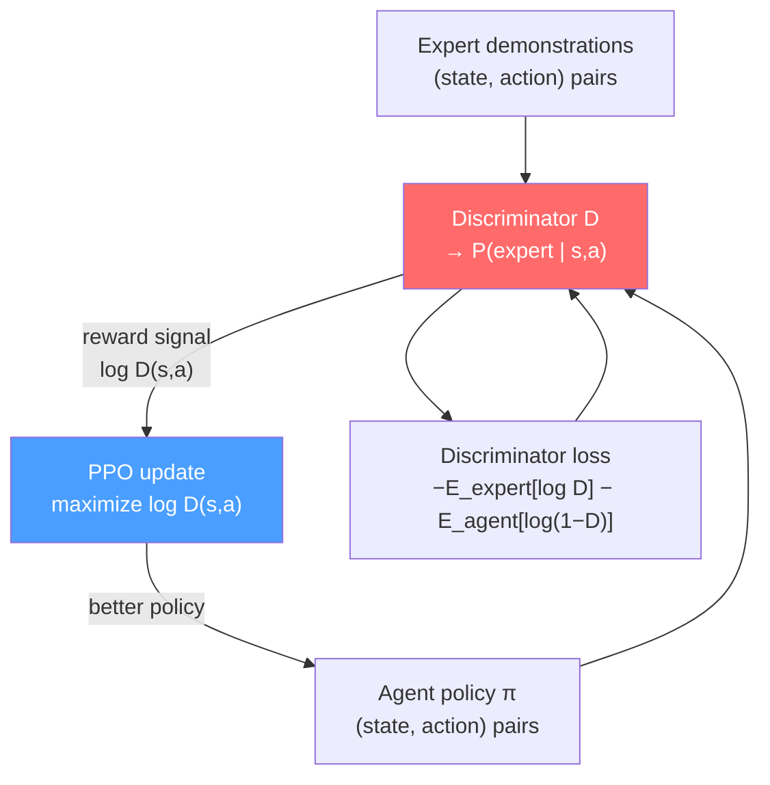

---
title: "Multi-Agent and Inverse RL"
aliases: ["MARL", "IRL", "GAIL", "Multi-Agent Reinforcement Learning"]
tags: [AI-ML, Reinforcement-Learning, MARL]
domain: AI-ML
difficulty: Advanced
created: 2026-07-29
related:
  - Policy_Gradient_Methods
  - Deep_Q_Networks
  - RL_Fundamentals
status: complete
---

# Multi-Agent and Inverse RL

> [!abstract] TL;DR
> **Multi-Agent RL (MARL)** extends single-agent RL to environments with multiple interacting agents — cooperative (shared reward), competitive (zero-sum), or mixed. The core challenge is **non-stationarity**: each agent's environment changes as others learn, breaking standard RL convergence guarantees. **Centralized Training, Decentralized Execution (CTDE)** is the dominant paradigm: share information at training time (centralized critic sees all observations) but act independently at deployment. **Inverse RL (IRL)** flips the RL problem: given expert demonstrations, infer the reward function. **GAIL** achieves the same goal without explicitly recovering rewards by using a GAN-style discriminator to match agent and expert trajectory distributions — a key technique underlying modern RLHF.

---

## Intuition

### Multi-Agent RL

Single-agent RL has one agent facing a stationary environment. Once you add a second agent, both are changing simultaneously — what looked like a fixed environment (from agent A's perspective) is actually another adaptive agent. This is the non-stationarity problem.

Consider two self-driving cars at an uncontrolled intersection:
- Both need to navigate safely (cooperative goal: avoid crashes)
- Both want to reach their destination quickly (competitive goal: priority)
- Neither can rely on the other following a fixed policy

This mixed-motive structure appears in traffic, financial markets, multi-robot warehouses, and competitive games.

### Inverse RL

Reward specification is notoriously hard. How do you define the reward function for "drive like a good human driver"? You could try to enumerate rules, but human driving intuition — knowing when to yield, when to merge aggressively — is implicit. Inverse RL says: **show me expert demonstrations, and I will infer what reward function would make those demonstrations optimal.**

---

## How It Works

### MARL Problem Setting



Each agent i has:
- **Observation** o_i (partial view of global state s in partially observed settings)
- **Policy** π_i(a|o_i;θ_i)
- **Reward** r_i (may depend on joint actions of all agents)

| Environment type | Reward structure | Example |
|----------------|-----------------|---------|
| **Cooperative** | All agents share the same reward | Multi-robot warehouse: maximize throughput |
| **Competitive (zero-sum)** | r_1 + r_2 = 0 | Chess, Go, StarCraft 1v1 |
| **Mixed** | Individual rewards, partially aligned | Self-driving cars, trading bots |

---

### MARL Challenges

#### Non-Stationarity

From agent i's perspective, the other agents' policies are part of the environment. But those policies change as others learn — the environment appears non-stationary. Standard RL convergence proofs assume a stationary MDP; MARL violates this.

**Consequence**: Q-learning can oscillate or diverge in multi-agent settings even for simple tasks.

#### Credit Assignment

In a cooperative task with a team reward, which agent's action was responsible for the reward? If robots 1, 2, and 3 collaboratively place an object and get +10, who deserves credit?

**Approaches:**
- **CTDE with joint critic** (sees all observations/actions → can attribute credit)
- **Difference rewards** (counterfactual: what would the reward have been without agent i?)
- **QMIX monotonic decomposition** (factorises joint Q into per-agent Q values)

#### Communication

Should agents communicate? What should they share? When?

| Communication regime | Description | Example |
|---------------------|-------------|---------|
| **No communication** | Fully decentralised; agents infer others from observation | Most deployed settings |
| **Broadcast** | All agents share their observations/actions | Research: emergent communication |
| **Structured** | Learned communication protocols via differentiable channels | CommNet, DIAL |

---

### Centralized Training, Decentralized Execution (CTDE)

CTDE is the dominant paradigm for cooperative MARL:



**Why CTDE works:**
- **Training**: share full state information, communication bandwidth, others' policies — enables better credit assignment
- **Execution**: each agent acts only on local observation — realistic deployment, no communication overhead

**Key algorithms:**

| Algorithm | Type | Core idea |
|-----------|------|-----------|
| **MADDPG** | Cooperative/competitive | Centralized critic per agent; decentralized actor. Extends DDPG to N agents |
| **QMIX** | Cooperative | Monotonic mixing network: Q_tot = f(Q_1, Q_2, ..., Q_n) where f is monotone — ensures each agent's greedy action maximises joint Q |
| **MAPPO** | Cooperative | PPO with centralized critic; simplest effective CTDE method |
| **COMA** | Cooperative | Counterfactual baseline for credit assignment |

---

### MADDPG Implementation Sketch

```python
class MADDPGAgent:
    """Single agent in a MADDPG system — centralized critic, decentralized actor."""
    
    def __init__(self, obs_dim: int, action_dim: int,
                 total_obs_dim: int, total_action_dim: int):
        # Actor: only sees own observation → own action
        self.actor = nn.Sequential(
            nn.Linear(obs_dim, 64), nn.ReLU(),
            nn.Linear(64, action_dim), nn.Tanh(),  # continuous actions ∈ [−1, 1]
        )
        # Critic: sees ALL observations AND all actions (centralized)
        self.critic = nn.Sequential(
            nn.Linear(total_obs_dim + total_action_dim, 64), nn.ReLU(),
            nn.Linear(64, 1),
        )
    
    def act(self, obs: torch.Tensor) -> torch.Tensor:
        """Decentralized: only uses own observation."""
        return self.actor(obs)
    
    def evaluate(self, all_obs: torch.Tensor,
                 all_actions: torch.Tensor) -> torch.Tensor:
        """Centralized: uses all observations and all actions."""
        return self.critic(torch.cat([all_obs, all_actions], dim=-1))
```

---

### Emergent Behaviour

MARL training can produce unexpected strategies not designed by the engineer:

**OpenAI hide-and-seek experiment:**
- Seekers try to find hiders in a physically simulated environment
- Over training: hiders learned to block doors, then seekers learned to use ramps to get over walls, then hiders learned to lock ramps, then seekers learned to use boxes…
- Six emergent strategies discovered sequentially — none were programmed

**Emergent communication:**
- Agents given a differentiable communication channel (vector of real numbers sent before acting)
- Grounding-free: no supervision on what symbols mean
- Agents spontaneously develop compositional communication protocols

---

### Inverse Reinforcement Learning (IRL)

#### Problem Formulation

Standard RL: given reward R, find optimal policy π*.  
IRL: given expert demonstrations D = {τ_1, τ_2, …}, find reward R* such that the expert appears optimal.



#### Maximum Entropy IRL

MaxEnt IRL (Ziebart et al., 2008) finds a reward function R_θ(s,a) such that expert trajectories appear near-optimal under a **maximum entropy** distribution over trajectories:

$$P(\tau; \theta) \propto \exp\!\left( \sum_t R_\theta(s_t, a_t) \right)$$

This is equivalent to: among all reward functions consistent with the demonstrations, choose the one that assigns maximum entropy to the trajectory distribution (least additional assumptions about expert reasoning).

**Training objective**: match feature expectations between expert and agent:

$$\nabla_\theta \mathcal{L} = \mathbb{E}_{\text{expert}}[\phi(s,a)] - \mathbb{E}_{\pi_\theta}[\phi(s,a)]$$

The gradient pulls the reward function to increase the likelihood of expert trajectories relative to what the current optimal policy would produce.

---

### GAIL (Generative Adversarial Imitation Learning)

GAIL (Ho & Ermon, 2016) bypasses explicit reward recovery entirely. It uses a **discriminator** to distinguish expert from agent trajectories:



The agent is rewarded for "fooling" the discriminator (making its trajectories look expert-like). The discriminator is updated to distinguish agent from expert. This is a minimax game identical in structure to a GAN.

**GAIL objective:**

$$\min_\pi \max_D \mathbb{E}_\pi[\log D(s,a)] + \mathbb{E}_{\pi_E}[\log(1 - D(s,a))]$$

---

### Behavioral Cloning vs IRL vs GAIL

| Method | Approach | Reward function | Pros | Cons |
|--------|----------|----------------|------|------|
| **Behavioral Cloning (BC)** | Supervised learning: mimic π_E directly | Not needed | Simple, fast, no RL loop | Distribution shift: errors compound at test time |
| **IRL (MaxEnt)** | Recover R, then solve RL | Explicit | Recovers generalizable reward | Two-loop algorithm, slow; requires RL inner loop |
| **GAIL** | Adversarial matching of trajectories | Implicit (discriminator) | More sample-efficient than IRL; generalizes better than BC | GAN instability; on-policy (needs many env interactions) |

**When to use each:**

- **BC**: abundant demonstrations, controlled deployment environment, quick iteration needed
- **IRL**: need the reward function for transfer to new scenarios; sample efficiency not critical
- **GAIL**: want generalization beyond BC but don't need explicit reward; environment is simulatable

---

### RLHF Connection

Reinforcement Learning from Human Feedback (RLHF) — used to align ChatGPT and other LLMs — is conceptually IRL:

1. **Reward model training** (= IRL): human raters compare two outputs and indicate which is better; a reward model R_θ is trained to predict these preferences → this is learning a reward function from human "demonstrations" of preferences
2. **PPO fine-tuning**: the language model policy π is fine-tuned via PPO to maximize R_θ (minus a KL penalty against the base model to prevent reward hacking)

The connection: MaxEnt IRL with pairwise preferences = reward model training. The learned R_θ plays the role of the inferred reward in IRL; PPO plays the role of the RL inner loop.

---

### Practical Notes

```python
# Useful libraries for MARL research
import pettingzoo          # Multi-agent gym environments (50+ envs)
# from pettingzoo.classic import chess_v6, connect_four_v3
# from pettingzoo.butterfly import cooperative_pong_v5

# PettingZoo API
env = pettingzoo.make("simple_spread_v3")  # cooperative particle env
env.reset()
for agent in env.agent_iter():
    obs, reward, term, trunc, info = env.last()
    if term or trunc:
        action = None
    else:
        action = env.action_space(agent).sample()
    env.step(action)

# For GAIL: imitation library
# pip install imitation
from imitation.algorithms.adversarial.gail import GAIL
from imitation.data import rollout
from stable_baselines3 import PPO
```

| Concern | Recommendation |
|---------|---------------|
| MARL non-stationarity | Use CTDE (MAPPO / MADDPG) over independent learners |
| Credit assignment in cooperative tasks | Use QMIX or MAPPO with centralized critic |
| Reward is hard to specify | Use GAIL or BC + fine-tuning |
| Need transferable reward | Use MaxEnt IRL |
| LLM alignment | RLHF = IRL (preference model) + PPO |
| Debugging MARL | Log per-agent returns separately; check if agents are converging together |

---

## Trade-offs

| Dimension | Independent RL (no coordination) | CTDE (MADDPG / MAPPO) |
|-----------|----------------------------------|----------------------|
| **Non-stationarity** | High (each agent sees non-stationary env) | Reduced (centralized critic stabilizes) |
| **Credit assignment** | Poor | Good |
| **Communication** | None needed | Information shared during training |
| **Scalability** | Better (no joint Q-table) | Worse for very large N agents |
| **Deployment** | Simple (each agent runs own policy) | Same (decentralized at execution) |

| Dimension | Behavioral Cloning | GAIL |
|-----------|-------------------|------|
| **Simplicity** | Very simple | Complex (adversarial training) |
| **Distribution shift** | Problematic | Handles it (RL correction) |
| **Environment required** | No | Yes (on-policy RL) |
| **Demonstrations needed** | More | Fewer |

---

## Common Pitfalls

1. **Independent Q-learning in cooperative MARL** — treating all other agents as part of the environment and applying standard DQN to each agent independently appears tempting but causes oscillation. As one agent updates its policy, the optimal policy for all others changes, creating a moving-target problem without any convergence guarantees.
2. **Reward hacking in IRL / RLHF** — the learned reward function R_θ is an approximation of human preferences. If PPO over-optimises R_θ without a KL penalty against the base policy, the agent will find degenerate strategies that score high on R_θ but are clearly wrong (reward hacking). Always include a KL divergence penalty.
3. **GAIL GAN instability** — the discriminator can saturate (always outputs 0 or 1), giving the agent a zero gradient. Use gradient penalty regularization or Wasserstein distance to stabilise training.
4. **Emergent behaviours in deployment** — MARL agents can develop coordination strategies during training that are brittle to partner changes at deployment. If agents A and B train together and B is replaced, A's policy may fail completely. Test with partner perturbations.

---

## Related Concepts

- [[RL_Fundamentals|← RL Fundamentals]] — MDP, value functions, policy types
- [[Policy_Gradient_Methods|← Policy Gradients]] — PPO / A2C are building blocks of MADDPG and MAPPO
- [[Deep_Q_Networks|← DQN]] — MADDPG extends DDPG (off-policy actor-critic, related to DQN) to multi-agent
- [[Game_Theory|← Game Theory]] — MARL in competitive settings is intimately related to Nash equilibria

---

## Review Questions

1. Explain why multi-agent Q-learning (each agent independently running DQN) fails in a two-agent cooperative task, even when each individual agent would converge in a single-agent setting. What specific assumption of tabular Q-learning convergence is violated?
2. CTDE (Centralized Training, Decentralized Execution) is the dominant MARL paradigm. Describe what information the centralized critic sees at training time that a decentralized critic could not, and why this information must be hidden at execution time.
3. Compare Behavioral Cloning, MaxEnt IRL, and GAIL on three axes: whether an environment simulator is required, how they handle distribution shift, and computational cost. For each, give one real-world application where it is the preferred approach.
4. In RLHF for language models, where does the IRL connection appear? Identify the component that corresponds to "demonstrations," the component that corresponds to the "inferred reward," and explain why a KL penalty is added to the PPO objective.

---

## Sources

- Lowe, R. et al. (2017). Multi-Agent Actor-Critic for Mixed Cooperative-Competitive Environments (MADDPG). *NeurIPS 2017*.
- Rashid, T. et al. (2018). QMIX: Monotonic Value Function Factorisation for Deep Multi-Agent Reinforcement Learning. *ICML 2018*.
- Baker, B. et al. (2019). Emergent Tool Use From Multi-Agent Autocurricula. *ICLR 2020*.
- Ziebart, B.D. et al. (2008). Maximum Entropy Inverse Reinforcement Learning. *AAAI 2008*.
- Ho, J. & Ermon, S. (2016). Generative Adversarial Imitation Learning. *NeurIPS 2016*.
- Christiano, P. et al. (2017). Deep Reinforcement Learning from Human Preferences. *NeurIPS 2017*.

#AI-ML #Reinforcement-Learning #MARL #InverseRL #GAIL #RLHF #MultiAgentRL #IRL #CTDE
