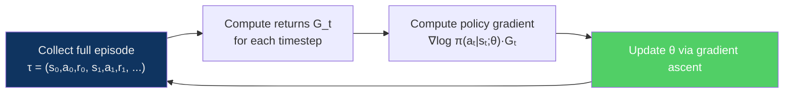
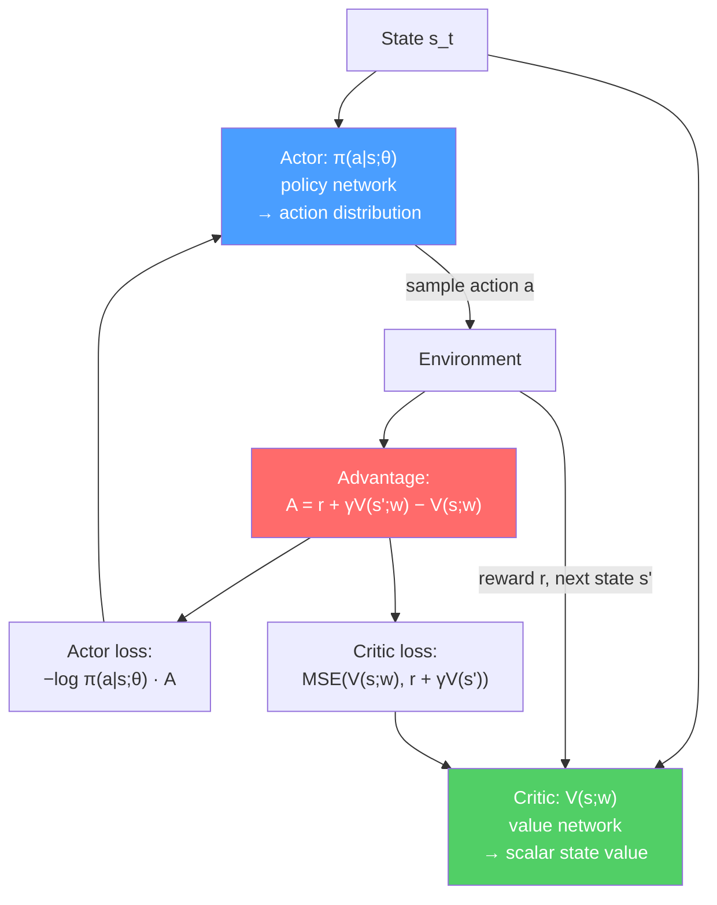

---
title: "Policy Gradient Methods"
aliases: ["REINFORCE", "PPO", "Actor-Critic", "A2C", "A3C"]
tags: [AI-ML, Reinforcement-Learning]
domain: AI-ML
difficulty: Advanced
created: 2026-07-29
related:
  - Q_Learning_and_SARSA
  - Deep_Q_Networks
  - RL_Fundamentals
status: complete
---

# Policy Gradient Methods

> [!abstract] TL;DR
> Policy gradient methods directly optimise the policy π(a|s;θ) by gradient ascent on expected return J(θ), bypassing the Q-function entirely. The **policy gradient theorem** provides the gradient: ∇J(θ) = E[∇log π(a|s;θ) · Q(s,a)]. **REINFORCE** is the pure Monte Carlo variant — high variance, unbiased. **Actor-Critic** reduces variance by replacing the return with an advantage estimate A(s,a) = Q(s,a) − V(s). **PPO** (Proximal Policy Optimization) adds a clipped surrogate objective that prevents catastrophically large policy updates, making it the dominant practical algorithm for continuous-action robotics, game AI, and RLHF fine-tuning of language models.

---

## Intuition

Q-learning asks: "What is the value of taking action a in state s?" Policy gradients ask a different question: "How should I adjust my policy parameters so that good actions become more likely?"

Think of the policy as a probability distribution over actions. After an episode, we know which trajectory occurred and what reward it earned. The REINFORCE idea: **increase the probability of actions that led to high reward; decrease probability of actions that led to low reward**. The mathematical tool that makes this tractable is the **log-derivative trick**, which converts a gradient through a distribution into an expectation.

Why not just use Q-learning everywhere? Three reasons:
1. **Continuous action spaces** — Q-learning requires argmax over actions, which is intractable when actions are continuous (robot joint torques, motor commands)
2. **Stochastic policies** — some tasks require randomness (poker, partially observed environments), and deterministic policies are strictly suboptimal
3. **End-to-end differentiability** — policy networks can be part of a larger differentiable system

---

## How It Works

### Policy Gradient Theorem

For a parameterised stochastic policy π(a|s;θ), the gradient of expected return J(θ) = E[G_0] is:

$$\nabla_\theta J(\theta) = \mathbb{E}_{\pi} \left[ \sum_t \nabla_\theta \log \pi(a_t | s_t; \theta) \cdot Q^\pi(s_t, a_t) \right]$$

**Derivation sketch (log-derivative trick):**

$$\nabla_\theta \mathbb{E}[G] = \nabla_\theta \sum_\tau P(\tau;\theta) G(\tau)$$
$$= \sum_\tau P(\tau;\theta) \nabla_\theta \log P(\tau;\theta) \cdot G(\tau)$$
$$= \mathbb{E}_\pi \left[ \nabla_\theta \log \pi(a|s;\theta) \cdot G \right]$$

The key identity: ∇P = P · ∇log P converts the gradient *through* a probability into an *expectation*, which can be estimated by sampling trajectories.

---

### REINFORCE (Monte Carlo Policy Gradient)

REINFORCE collects full episodes, computes returns G_t = Σ γ^k r_{t+k}, and updates the policy parameters:

$$\theta \leftarrow \theta + \alpha \sum_t \nabla_\theta \log \pi(a_t | s_t; \theta) \cdot G_t$$



**Problems with REINFORCE:**
- **High variance** — G_t is a sum of many noisy rewards; small changes in timing can produce wildly different returns for similar trajectories
- **Sample inefficiency** — must complete a full episode before any update; on-policy so cannot reuse old data
- **Slow convergence** — variance slows learning; many episodes needed to get a reliable gradient signal

---

### Baseline Subtraction and Advantage

The key insight: subtracting any baseline b(s) from G_t leaves the gradient *unbiased* but can dramatically reduce variance:

$$\nabla_\theta J(\theta) = \mathbb{E}_\pi \left[ \nabla_\theta \log \pi(a|s;\theta) \cdot \left( Q(s,a) - b(s) \right) \right]$$

The best baseline is V(s) — the expected return from state s. This gives the **advantage function**:

$$A(s, a) = Q(s, a) - V(s)$$

A(s,a) measures "how much better is action a than the average action from state s?" This is centred at zero, dramatically reducing variance.

In practice: estimate A using a TD residual:

$$\hat{A}(s_t, a_t) = r_t + \gamma V(s_{t+1}) - V(s_t) \quad \text{(TD advantage)}$$

---

### Actor-Critic Architecture

Actor-Critic combines policy gradient with value function estimation:



| Component | Role | Loss |
|-----------|------|------|
| **Actor** π(a|s;θ) | Decides which action to take | Policy gradient: −log π(a|s) · A |
| **Critic** V(s;w) | Estimates state value to compute advantage | MSE: (V(s;w) − y)² where y = r + γV(s') |

**A2C (Advantage Actor-Critic)**: synchronous — collect rollouts from multiple parallel environments, compute advantages, update in one batch.

**A3C (Asynchronous Advantage Actor-Critic)**: each worker has its own copy of the environment and network; workers asynchronously push gradients to a shared model (Hogwild! updates). Historically significant (first scalable deep RL), but A2C with GPUs usually matches performance.

---

### PPO (Proximal Policy Optimization)

#### Motivation

Vanilla policy gradient updates can be too large, causing a performance collapse from which training never recovers. TRPO (Trust Region Policy Optimization) constrains updates to stay within a trust region (KL-divergence constraint), but requires expensive second-order optimization. **PPO approximates TRPO with a simple first-order clip**.

#### PPO Clipped Objective

Define the probability ratio:

$$r_t(\theta) = \frac{\pi(a_t | s_t; \theta)}{\pi(a_t | s_t; \theta_{\text{old}})}$$

PPO's clipped surrogate objective:

$$L^{\text{CLIP}}(\theta) = \mathbb{E}_t \left[ \min\!\left( r_t(\theta)\,\hat{A}_t,\ \text{clip}(r_t(\theta), 1-\varepsilon, 1+\varepsilon)\,\hat{A}_t \right) \right]$$

The clip prevents r_t from going too far from 1 (i.e., the new policy from diverging too far from the old policy). ε = 0.2 is the standard setting.

**Intuition for the clip:**
- When A > 0 (action was good): we want to increase π(a|s), so r_t > 1. The clip caps it at 1+ε — don't increase probability by more than 20%.
- When A < 0 (action was bad): we want to decrease π(a|s), so r_t < 1. The clip floors it at 1−ε — don't decrease probability by more than 20%.

#### PPO Full Objective

$$L^{\text{PPO}}(\theta) = L^{\text{CLIP}} - c_1 L^{\text{VF}} + c_2 H[\pi]$$

where L^VF is the value function loss (MSE) and H is an entropy bonus to maintain exploration.

#### PPO Training Loop

```python
import torch
import torch.nn as nn
import gymnasium as gym
import numpy as np

class ActorCritic(nn.Module):
    """Shared-backbone Actor-Critic for PPO."""
    def __init__(self, obs_dim: int, n_actions: int):
        super().__init__()
        self.shared = nn.Sequential(
            nn.Linear(obs_dim, 64), nn.Tanh(),
            nn.Linear(64, 64),      nn.Tanh(),
        )
        self.actor  = nn.Linear(64, n_actions)   # logits → action distribution
        self.critic = nn.Linear(64, 1)            # → V(s)

    def forward(self, x):
        h = self.shared(x)
        logits = self.actor(h)
        value  = self.critic(h).squeeze(-1)
        return logits, value

    def get_action(self, obs):
        logits, value = self.forward(obs)
        dist   = torch.distributions.Categorical(logits=logits)
        action = dist.sample()
        log_prob = dist.log_prob(action)
        return action, log_prob, value


def ppo_update(model, optimizer, rollout, clip_eps=0.2, vf_coef=0.5,
               ent_coef=0.01, n_epochs=4):
    """Run multiple PPO gradient steps on a collected rollout."""
    obs, actions, old_log_probs, returns, advantages = rollout

    for _ in range(n_epochs):
        logits, values = model(obs)
        dist = torch.distributions.Categorical(logits=logits)
        new_log_probs = dist.log_prob(actions)
        entropy = dist.entropy().mean()

        # Probability ratio r_t = π_new / π_old
        ratio = (new_log_probs - old_log_probs).exp()

        # Clipped surrogate loss (note: we minimise the NEGATIVE)
        surr1 = ratio * advantages
        surr2 = ratio.clamp(1 - clip_eps, 1 + clip_eps) * advantages
        actor_loss  = -torch.min(surr1, surr2).mean()

        # Value function loss
        value_loss = nn.functional.mse_loss(values, returns)

        loss = actor_loss + vf_coef * value_loss - ent_coef * entropy
        optimizer.zero_grad()
        loss.backward()
        nn.utils.clip_grad_norm_(model.parameters(), 0.5)
        optimizer.step()
```

#### Why PPO Dominates in Practice

| Property | PPO | DQN | A3C |
|----------|-----|-----|-----|
| **Continuous actions** | Yes (Gaussian policy) | No (requires argmax) | Yes |
| **Discrete actions** | Yes | Yes | Yes |
| **Stability** | Very high (clip constraint) | Moderate | Lower |
| **Sample efficiency** | Moderate (on-policy, multiple epochs) | High (off-policy replay) | Low |
| **Implementation simplicity** | Simple (first-order) | Moderate | Complex (async) |
| **RLHF / LLM fine-tuning** | Standard choice | No | No |

PPO is used in: OpenAI Five (Dota 2), ChatGPT RLHF stage, DeepMind locomotion tasks, most robotics benchmarks.

---

### Generalized Advantage Estimation (GAE)

GAE computes a λ-weighted blend of n-step advantage estimates:

$$\hat{A}_t^{\text{GAE}(\gamma,\lambda)} = \sum_{l=0}^{\infty} (\gamma\lambda)^l \delta_{t+l}$$

where δ_t = r_t + γV(s_{t+1}) − V(s_t) is the TD residual at step t.

| λ value | Result | Bias | Variance |
|---------|--------|------|----------|
| λ = 0 | Pure TD advantage: A = r + γV(s') − V(s) | Higher bias | Low variance |
| λ = 1 | Monte Carlo returns | Unbiased | High variance |
| λ = 0.95 | Weighted blend — standard choice | Low bias | Low variance |

```python
def compute_gae(rewards, values, dones, gamma=0.99, lam=0.95):
    """Compute GAE advantages from a rollout."""
    advantages = np.zeros_like(rewards)
    gae = 0.0
    for t in reversed(range(len(rewards))):
        next_val = values[t + 1] if t + 1 < len(values) else 0.0
        delta = rewards[t] + gamma * next_val * (1 - dones[t]) - values[t]
        gae = delta + gamma * lam * (1 - dones[t]) * gae
        advantages[t] = gae
    returns = advantages + values[:len(rewards)]
    return advantages, returns
```

---

### PPO vs TRPO

| | PPO | TRPO |
|--|-----|------|
| **Trust region** | Clipped ratio (first-order) | KL-divergence constraint (second-order) |
| **Optimization** | Standard gradient descent | Conjugate gradient + line search |
| **Complexity** | Simple | Complex |
| **Performance** | Similar in practice | Marginally more principled |
| **When to use** | Default choice | When you need stronger guarantees |

---

## Trade-offs

| Dimension | Policy Gradient (REINFORCE/PPO) | Q-Learning (DQN) |
|-----------|--------------------------------|------------------|
| **Action space** | Continuous or discrete | Discrete only (without extensions) |
| **Stochastic policies** | Natural — parameterises π directly | Awkward — need explicit exploration |
| **Sample efficiency** | Lower (on-policy, can't replay) | Higher (off-policy replay) |
| **Stability** | High with PPO clipping | Moderate — sensitive to hyperparams |
| **Convergence** | Local optima risk; no global guarantees | Converges to Q* (tabular) |
| **Implementation** | Clean, end-to-end | More components (replay, target net) |

---

## Common Pitfalls

1. **Not normalizing advantages** — advantage values can vary widely across rollouts. Normalising to zero mean and unit std per batch (advantage = (A − mean(A)) / (std(A) + 1e-8)) stabilises training significantly.
2. **Using too many PPO update epochs** — PPO allows multiple gradient epochs on the same rollout (typically 4–10). Too many epochs violate the trust region assumption (the ratio r_t drifts far from 1), causing performance collapse. Monitor the ratio and stop early if it exceeds [1−2ε, 1+2ε] for many actions.
3. **Entropy coefficient too low** — without an entropy bonus, the policy collapses to a deterministic one prematurely (gets stuck at a local optimum). Start with ent_coef=0.01 and tune.
4. **Confusing returns with advantages** — the actor loss uses advantages (centred); the critic loss uses returns (absolute). Mixing them up — e.g., training the critic on advantages — is a common bug that causes the value function to converge to zero.

---

## Related Concepts

- [[Q_Learning_and_SARSA|← Q-Learning & SARSA]] — value-based alternative; DQN is the deep variant
- [[Deep_Q_Networks|← DQN]] — off-policy deep RL; compare with on-policy PPO
- [[RL_Fundamentals|← RL Fundamentals]] — MDP, value functions, exploration-exploitation
- [[Multi_Agent_and_Inverse_RL|→ Multi-Agent & Inverse RL]] — MAPPO extends PPO to multi-agent settings; RLHF uses PPO
- [[Optimization_Theory|← Optimization]] — policy gradient = first-order stochastic gradient ascent

---

## Review Questions

1. Derive the policy gradient theorem starting from ∇J(θ) = ∇E[G_0]. Where exactly does the log-derivative trick appear, and why is it necessary?
2. REINFORCE has high variance. Explain mechanistically why subtracting the baseline V(s) reduces variance without introducing bias. Prove that E[∇log π(a|s;θ) · V(s)] = 0.
3. Walk through the PPO clipped objective for a transition where the advantage A = +2 and the probability ratio r_t = 1.35, with ε = 0.2. What does the clip produce, and why does this prevent a performance-collapsing update?
4. A colleague argues "PPO is just TRPO with a worse constraint." How would you respond? What practical evidence supports PPO being the preferred algorithm?

---

## Sources

- Sutton, R.S. & Barto, A.G. (2018). *Reinforcement Learning: An Introduction*, Chapter 13.
- Williams, R.J. (1992). Simple statistical gradient-following algorithms for connectionist reinforcement learning. *Machine Learning*, 8(3), 229–256.
- Mnih, V. et al. (2016). Asynchronous Methods for Deep Reinforcement Learning (A3C). *ICML 2016*.
- Schulman, J. et al. (2017). Proximal Policy Optimization Algorithms. arXiv:1707.06347.
- Schulman, J. et al. (2015). High-Dimensional Continuous Control Using Generalized Advantage Estimation. *ICLR 2016*.

#AI-ML #Reinforcement-Learning #PolicyGradient #REINFORCE #PPO #ActorCritic #A2C #A3C #GAE
