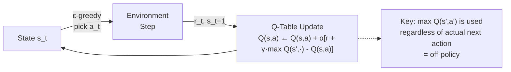

# Q-Learning and SARSA

> [!abstract] TL;DR
> **Q-Learning** is the foundational off-policy TD algorithm: it directly learns Q*(s,a) by bootstrapping from `r + γ · max Q(s',a')` regardless of which action was actually taken next. **SARSA** is the on-policy counterpart: it updates from `r + γ · Q(s', a')` where a' is the *actual next action* taken, making it more conservative on dangerous terrain (the "cliff walking" example). Both are tabular — they store a Q-table of size |S| × |A| — and both converge provably under GLIE conditions. The **curse of dimensionality** limits them to small state spaces, motivating Deep Q-Networks.

---

## Intuition

Both Q-Learning and SARSA are **Temporal Difference (TD) learning** algorithms — they update estimates of Q(s,a) based on the difference between the current estimate and a bootstrapped target, without waiting for an episode to end (unlike Monte Carlo).

Think of TD learning as updating your estimate of a long journey's time *at each milestone*, rather than only updating after you arrive. You're in a car 3 hours into a 6-hour trip. You pass a milestone and update your estimate: "Current segment took 30 minutes; remaining estimate = 3.5 hours." You don't wait to arrive to update.

The key difference between Q-Learning and SARSA: **Q-Learning** assumes you'll always take the best action in the future (optimistic, off-policy); **SARSA** assumes you'll continue behaving as you currently do, including exploration (conservative, on-policy).

---

## How It Works

### Temporal Difference Learning

The **TD error** (δ) is the difference between the target estimate and the current estimate:

$$\delta_t = \underbrace{r_t + \gamma \cdot V(s_{t+1})}_{\text{TD target}} - \underbrace{V(s_t)}_{\text{current estimate}}$$

The update rule nudges V(s_t) toward the TD target:

$$V(s_t) \leftarrow V(s_t) + \alpha \cdot \delta_t$$

**Why TD and not Monte Carlo?** Monte Carlo waits until the end of an episode to update. TD updates at every step, using a bootstrap estimate of future value. TD has lower variance (shorter update horizon) but introduces bias (bootstrap estimate is not exact). For long-horizon problems, TD is far more sample efficient.

---

### Q-Learning

**Q-Learning update rule:**

$$Q(s_t, a_t) \leftarrow Q(s_t, a_t) + \alpha \left[ r_t + \gamma \cdot \max_{a'} Q(s_{t+1}, a') - Q(s_t, a_t) \right]$$



**Algorithm:**

```python
import numpy as np
import random

def q_learning(
    n_states: int,
    n_actions: int,
    env_step,           # function: (state, action) -> (next_state, reward, done)
    n_episodes: int = 5000,
    alpha: float = 0.1,        # learning rate
    gamma: float = 0.99,       # discount factor
    eps_start: float = 1.0,
    eps_end: float = 0.05,
    eps_decay: float = 0.998,
) -> np.ndarray:
    """Off-policy Q-Learning."""
    Q = np.zeros((n_states, n_actions))
    eps = eps_start
    episode_returns = []

    for ep in range(n_episodes):
        state = 0  # reset
        total_r = 0.0
        done = False

        while not done:
            # ε-greedy action selection
            if random.random() < eps:
                action = random.randint(0, n_actions - 1)  # explore
            else:
                action = int(np.argmax(Q[state]))           # exploit

            next_state, reward, done = env_step(state, action)
            total_r += reward

            # ─── Q-Learning Bellman update ───────────────────────────────────
            # off-policy: use max Q(s', ·) NOT the actual next action
            td_target = reward + gamma * np.max(Q[next_state]) * (1 - int(done))
            td_error  = td_target - Q[state, action]
            Q[state, action] += alpha * td_error
            # ────────────────────────────────────────────────────────────────

            state = next_state

        eps = max(eps_end, eps * eps_decay)
        episode_returns.append(total_r)

    return Q
```

---

### SARSA (State-Action-Reward-State-Action)

**SARSA update rule:**

$$Q(s_t, a_t) \leftarrow Q(s_t, a_t) + \alpha \left[ r_t + \gamma \cdot Q(s_{t+1}, a_{t+1}) - Q(s_t, a_t) \right]$$

The critical difference: `Q(s', a')` where `a'` is the *actual next action* the agent will take under the current policy (ε-greedy), not the greedy maximum.

```python
def sarsa(
    n_states: int,
    n_actions: int,
    env_step,
    n_episodes: int = 5000,
    alpha: float = 0.1,
    gamma: float = 0.99,
    eps_start: float = 1.0,
    eps_end: float = 0.05,
    eps_decay: float = 0.998,
) -> np.ndarray:
    """On-policy SARSA."""
    Q = np.zeros((n_states, n_actions))
    eps = eps_start

    def eps_greedy(state: int) -> int:
        if random.random() < eps:
            return random.randint(0, n_actions - 1)
        return int(np.argmax(Q[state]))

    for ep in range(n_episodes):
        state = 0
        action = eps_greedy(state)   # ← choose BEFORE the loop (SARSA needs a_t+1)
        done = False

        while not done:
            next_state, reward, done = env_step(state, action)
            next_action = eps_greedy(next_state)  # ← choose next action NOW

            # ─── SARSA update ────────────────────────────────────────────────
            # on-policy: use Q(s', a') with ACTUAL next action (ε-greedy)
            td_target = reward + gamma * Q[next_state, next_action] * (1 - int(done))
            td_error  = td_target - Q[state, action]
            Q[state, action] += alpha * td_error
            # ────────────────────────────────────────────────────────────────

            state, action = next_state, next_action

        eps = max(eps_end, eps * eps_decay)

    return Q
```

---

### The Cliff Walking Example — Why SARSA ≠ Q-Learning

```
Grid:   S = start (row 3, col 0)   G = goal (row 3, col 11)
        C = cliff (row 3, cols 1-10)  → stepping on C gives reward -100 and resets

  . . . . . . . . . . . . 
  . . . . . . . . . . . . 
  . . . . . . . . . . . . 
  S C C C C C C C C C C G   (row 3 = danger zone)

Rewards: -1 per step, -100 for cliff, 0 at goal
```

- **Q-Learning** (off-policy) learns the optimal policy: walk along the cliff edge (row 3) for the shortest path, because the Bellman update uses `max Q(s',a')` — it assumes the agent will *not* explore at test time. At test time with ε=0, this is correct.
- **SARSA** (on-policy) learns a safer policy: walk along row 2 (one row above the cliff), because during training ε > 0 means the agent *sometimes* takes random actions, including stepping onto the cliff. SARSA accounts for its own exploration noise — it avoids the risky edge.

**Verdict:**
- At test time with greedy policy: Q-Learning achieves higher reward (shorter path)
- During training with ε > 0: SARSA achieves higher total reward (doesn't fall off cliff)
- In safety-critical applications (real robots, AV): SARSA/on-policy preferred

---

### ε-greedy Exploration in Depth

```python
class EpsilonGreedy:
    """ε-greedy exploration with configurable decay."""
    
    def __init__(self, n_actions: int, eps_start: float = 1.0, 
                 eps_end: float = 0.05, decay_type: str = "exponential"):
        self.n_actions = n_actions
        self.eps = eps_start
        self.eps_end = eps_end
        self.eps_start = eps_start
        self.decay_type = decay_type
        self.step = 0

    def select_action(self, q_values: np.ndarray) -> int:
        if random.random() < self.eps:
            return random.randint(0, self.n_actions - 1)  # explore
        return int(np.argmax(q_values))                    # exploit

    def decay(self, total_steps: int = None):
        self.step += 1
        if self.decay_type == "exponential":
            self.eps = max(self.eps_end, self.eps * 0.998)
        elif self.decay_type == "linear":
            # Linearly decay over total_steps
            self.eps = max(self.eps_end,
                           self.eps_start - (self.eps_start - self.eps_end) * 
                           (self.step / total_steps))
```

---

### Tabular RL Limitations — The Curse of Dimensionality

Q-table memory = |S| × |A| entries.

| State Space | Example | Q-table Size |
|------------|---------|-------------|
| 4×4 grid | Toy problem | 16 × 4 = 64 entries |
| Atari Pong (210×160 RGB) | 1 frame | 256^(210×160×3) ≈ 10^(123,000) entries |
| Go board | 19×19 grid | ~10^170 states |
| Robotic arm (6 joints) | Continuous | Infinite states |

The exponential growth of state space with dimensionality is the **curse of dimensionality**. Tabular Q-learning is limited to small, discrete state spaces. The solution: **function approximation** — replace the Q-table with a neural network Q_θ(s,a). This is Deep Q-Networks.

---

### Multi-Armed Bandit Problem

The bandit problem is the simplest RL setting — no state transitions, only explore-exploit:

```python
import numpy as np
from typing import Callable

class MultiarmedBandit:
    """k-armed bandit with Gaussian reward distributions."""
    
    def __init__(self, k: int = 10, seed: int = 42):
        rng = np.random.default_rng(seed)
        self.true_means = rng.normal(0, 1, k)   # true reward means (unknown to agent)
        self.k = k

    def pull(self, arm: int) -> float:
        """Pull arm, receive noisy reward."""
        return float(np.random.normal(self.true_means[arm], 1.0))


def epsilon_greedy_bandit(bandit: MultiarmedBandit, n_steps: int = 1000,
                           epsilon: float = 0.1) -> np.ndarray:
    """ε-greedy agent for k-armed bandit."""
    k = bandit.k
    Q = np.zeros(k)          # estimated arm values
    N = np.zeros(k)          # arm pull counts
    rewards = np.zeros(n_steps)

    for t in range(n_steps):
        if np.random.random() < epsilon:
            arm = np.random.randint(k)  # explore
        else:
            arm = np.argmax(Q)          # exploit

        reward = bandit.pull(arm)
        N[arm] += 1
        # Incremental mean update (equivalent to alpha = 1/N[arm])
        Q[arm] += (reward - Q[arm]) / N[arm]
        rewards[t] = reward

    return rewards


bandit = MultiarmedBandit(k=10)
rewards_01  = epsilon_greedy_bandit(bandit, epsilon=0.1)
rewards_001 = epsilon_greedy_bandit(bandit, epsilon=0.01)
rewards_00  = epsilon_greedy_bandit(bandit, epsilon=0.0)   # greedy

print(f"ε=0.10: avg reward = {rewards_01.mean():.3f}")
print(f"ε=0.01: avg reward = {rewards_001.mean():.3f}")
print(f"ε=0.00: avg reward = {rewards_00.mean():.3f}")
# ε=0.10 typically wins over long horizon; ε=0.01 wins short-term
```

---

## Trade-offs

| Dimension | Q-Learning | SARSA |
|-----------|-----------|-------|
| **On/Off-policy** | Off-policy | On-policy |
| **TD target** | `r + γ · max Q(s', ·)` | `r + γ · Q(s', a')` |
| **Exploration behaviour** | Assumes greedy at test time | Accounts for ε-greedy during learning |
| **Optimal path (cliff)** | Riskier but shorter (optimal) | Safer, longer path |
| **Safety-critical tasks** | Less suitable | More suitable |
| **Convergence** | To Q* (optimal) | To Q^π (current policy) |
| **Data reuse** | Can use old experience (replay) | Cannot safely use old experience |
| **DQN extension** | Yes (DQN is Q-learning + NN) | Expected SARSA with NN |

---

## Common Pitfalls

1. **α (learning rate) too high** — Q values oscillate and never converge. Start with α = 0.1; decay it or use α = 1/N(s,a) (optimal theoretically).
2. **ε decays too fast** — If ε reaches 0 before all states are visited, Q-learning doesn't converge to Q*. GLIE requires infinite exploration.
3. **Not discounting terminal states** — The Bellman target for terminal states should be `r` only (no future value). Forgetting `(1 - done)` multiplier causes incorrect Q-values at episode boundaries.
4. **Using Q-learning in safety-critical on-policy settings** — In a real robot task where exploration is dangerous, Q-learning's off-policy "assume greedy" bootstrap learns unsafe behaviour during training. Use SARSA or constrained RL.
5. **Confusing SARSA and Expected SARSA** — **Expected SARSA** uses `E_{a'}[Q(s', a')]` (expectation over ε-greedy) rather than the actual a'. It reduces variance and is strictly better than SARSA in most settings.

---

## Related Concepts

- [[RL_Fundamentals|← RL Fundamentals]] — MDP, Bellman equation, value functions
- [[Deep_Q_Networks|→ Deep Q-Networks]] — scale Q-learning to large state spaces with NNs
- [[Reinforcement_Learning|↑ RL Overview]] — parent note with algorithm taxonomy
- [[Probability_and_Statistics|← Probability & Stats]] — TD learning relies on expected value and convergence theory

---

## Review Questions

1. Explain why Q-Learning is called "off-policy" and SARSA is called "on-policy." Draw the specific update equation for each and highlight the line that creates the difference.
2. In the cliff walking environment, Q-Learning learns to walk along the cliff edge while SARSA takes the safer upper path. After training is complete and ε = 0, which algorithm's final policy achieves higher reward per episode? Why might you choose SARSA's policy over Q-Learning's despite lower optimality?
3. The convergence proof for tabular Q-Learning requires GLIE (Greedy in the Limit with Infinite Exploration). Describe two practical ε-decay schedules and explain which one satisfies GLIE conditions and why. What happens if GLIE conditions are violated?

---

## Sources

- Sutton & Barto (2018). *Reinforcement Learning: An Introduction*, Chapter 6.4–6.5. [incompleteideas.net](http://incompleteideas.net/book/the-book-2nd.html)
- Watkins, C.J.C.H. & Dayan, P. (1992). Q-learning. *Machine Learning* 8(3–4), 279–292.
- Rummery, G.A. & Niranjan, M. (1994). On-line Q-learning using connectionist systems (SARSA). *Technical Report CUED/F-INFENG/TR 166*.

#AI-ML #Reinforcement-Learning #Q-Learning #SARSA #TemporalDifference #TabularRL #MultiarmedBandit
