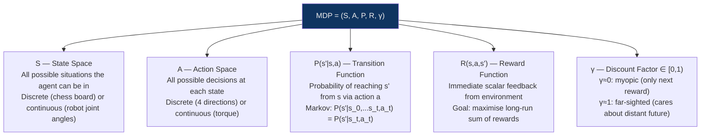
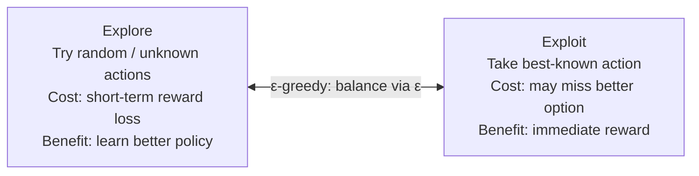

# RL Fundamentals

> [!abstract] TL;DR
> The mathematical foundation of RL is the **Markov Decision Process (MDP)**: a 5-tuple (S, A, P, R, γ) defining states, actions, transition probabilities, rewards, and a discount factor. The **Bellman equation** expresses the recursive relationship between state values. Two value functions — **V(s)** (state value) and **Q(s,a)** (action-value) — capture expected future return. Policies can be deterministic or stochastic; the core challenge is the **exploration-exploitation tradeoff** managed via ε-greedy or softmax. On-policy methods learn from the current policy's experience; off-policy methods learn from any past experience.

---

## Intuition

The MDP is the formal language for "decision-making under uncertainty." Imagine a robot navigating a maze:
- **State** = current grid position
- **Actions** = {up, down, left, right}
- **Transition** = moving up from (2,3) takes you to (1,3) with 90% probability (slippery floor might push you sideways)
- **Reward** = −0.1 per step, +10 at goal, −5 at trap
- **Discount γ** = 0.99, meaning the robot values future rewards almost as much as immediate ones

The robot's goal is to find the **policy** π — the rule "in state s, take action a" — that maximises its expected cumulative discounted reward. This is what all RL algorithms are solving.

---

## How It Works

### The MDP Formal Definition



**The Markov Property** — the defining assumption: the future depends only on the current state, not the history. Formally:

$$P(s_{t+1} \mid s_0, a_0, s_1, a_1, \ldots, s_t, a_t) = P(s_{t+1} \mid s_t, a_t)$$

This is what makes the MDP tractable — the Q-function only needs (s, a) as input, not the full trajectory.

---

### Return and Discount Factor

The **return** G_t is the total discounted reward from time step t:

$$G_t = r_t + \gamma r_{t+1} + \gamma^2 r_{t+2} + \cdots = \sum_{k=0}^{\infty} \gamma^k r_{t+k}$$

**Why discount?**
1. **Mathematical convergence** — without γ < 1, the sum may be infinite for non-episodic tasks
2. **Temporal preference** — reward now is more certain than reward later (uncertainty of the future)
3. **Mimics human and animal behaviour** — empirically, animals discount future rewards hyperbolically

| γ value | Agent behaviour | Use case |
|---------|----------------|----------|
| 0.0 | Pure myopic: only cares about next reward | Simple single-step decisions |
| 0.9 | Moderate planning horizon (~10 steps effective) | Most tabular problems |
| 0.99 | Long-horizon planning (~100 steps effective) | Atari games, robotics |
| 1.0 | No discounting (only works for episodic tasks) | Board games with clear terminal states |

---

### Value Functions

**State-value function V^π(s)** — expected return when starting in state s and following policy π:

$$V^\pi(s) = \mathbb{E}_\pi \left[ G_t \mid s_t = s \right] = \mathbb{E}_\pi \left[ \sum_{k=0}^{\infty} \gamma^k r_{t+k} \mid s_t = s \right]$$

**Action-value function Q^π(s, a)** — expected return when taking action a in state s, then following π:

$$Q^\pi(s, a) = \mathbb{E}_\pi \left[ G_t \mid s_t = s, a_t = a \right]$$

**Relationship:**

$$V^\pi(s) = \sum_a \pi(a \mid s) \cdot Q^\pi(s, a)$$

$$Q^\pi(s, a) = \sum_{s'} P(s' \mid s, a) \left[ R(s,a,s') + \gamma V^\pi(s') \right]$$

Q(s,a) is more useful for control than V(s) — it tells the agent which *action* to take, not just how good a state is.

---

### Bellman Equations

The **Bellman expectation equation** expresses V and Q recursively:

$$V^\pi(s) = \sum_a \pi(a|s) \sum_{s'} P(s'|s,a) \left[ R(s,a,s') + \gamma V^\pi(s') \right]$$

$$Q^\pi(s,a) = \sum_{s'} P(s'|s,a) \left[ R(s,a,s') + \gamma \sum_{a'} \pi(a'|s') Q^\pi(s',a') \right]$$

The **Bellman optimality equation** for the optimal policy π*:

$$V^*(s) = \max_a \sum_{s'} P(s'|s,a) \left[ R(s,a,s') + \gamma V^*(s') \right]$$

$$Q^*(s,a) = \sum_{s'} P(s'|s,a) \left[ R(s,a,s') + \gamma \max_{a'} Q^*(s',a') \right]$$

The key insight: **the Bellman equation is a contraction mapping**. Repeatedly applying the Bellman operator converges to the unique fixed point V* (or Q*). This is the theoretical foundation for Q-learning convergence.

---

### Policy Types

| Policy Type | Definition | Example |
|------------|------------|---------|
| **Deterministic** | π: S → A (maps state to single action) | Chess engine: "in this position, move the queen" |
| **Stochastic** | π: S × A → [0,1] (probability distribution over actions) | Poker player mixes strategies |
| **Greedy** | Always take argmax_a Q(s,a) | Exploit only; risk of local optima |
| **ε-greedy** | Greedy with probability 1-ε; random with probability ε | Balance explore/exploit |
| **Softmax** | π(a\|s) ∝ exp(Q(s,a)/τ); temperature τ controls randomness | Smoother exploration distribution |

---

### Exploration vs Exploitation

The core dilemma: you need to **exploit** known good actions to get reward, but you need to **explore** unknown actions to find possibly better ones.



**ε-greedy schedule:**

```python
epsilon_start = 1.0  # 100% exploration at start
epsilon_end   = 0.05 # 5% exploration at end (mostly exploit)
epsilon_decay = 0.995  # multiply each episode

epsilon = max(epsilon_end, epsilon * epsilon_decay)
```

**Multi-armed bandit** — the simplest RL problem with no state transitions, only the explore-exploit trade-off. N slot machines (arms) with unknown reward distributions — which arm to pull to maximise total reward over T trials?

Strategies: ε-greedy, UCB (Upper Confidence Bound), Thompson Sampling (Bayesian approach).

---

### On-Policy vs Off-Policy

| Dimension | On-Policy | Off-Policy |
|-----------|----------|------------|
| **Definition** | Learns the value of the policy currently being followed | Learns the optimal policy regardless of which policy generated the data |
| **Data requirement** | Must come from the current policy | Can come from any past experience (replay buffer) |
| **Algorithms** | SARSA, PPO, A2C | Q-Learning, DQN, TD3, SAC |
| **Data efficiency** | Lower (old data discarded) | Higher (can reuse old experience) |
| **Stability** | More stable (data matches current policy) | Can be unstable if distribution mismatch is large |

### Model-Based vs Model-Free

| | Model-Based | Model-Free |
|--|-------------|-----------|
| **Learns** | P(s'\|s,a) and R(s,a) explicitly | Policy/value function without dynamics model |
| **Planning** | Uses learned model for lookahead | No explicit planning |
| **Sample efficiency** | Higher (can simulate from model) | Lower |
| **Weakness** | Model errors compound; hard to learn accurate dynamics | Needs many real environment samples |
| **Examples** | Dyna-Q, MBPO, MuZero | Q-Learning, DQN, PPO |

---

### OpenAI Gymnasium Introduction

```python
import gymnasium as gym
import numpy as np

# Standard gymnasium interface
env = gym.make("CartPole-v1", render_mode=None)  # Discrete action space
# env = gym.make("Pendulum-v1")                 # Continuous action space

# Inspect spaces
print(f"Observation space: {env.observation_space}")   # Box(4,) for CartPole
print(f"Action space: {env.action_space}")             # Discrete(2) for CartPole

# Standard RL loop
obs, info = env.reset(seed=42)
total_reward = 0

for step in range(200):
    # Random policy (baseline)
    action = env.action_space.sample()
    
    # Step: returns (observation, reward, terminated, truncated, info)
    obs, reward, terminated, truncated, info = env.step(action)
    total_reward += reward
    
    if terminated or truncated:
        print(f"Episode ended at step {step} | Total reward: {total_reward}")
        obs, info = env.reset()
        total_reward = 0
        break

env.close()

# CartPole-v1: random policy typically lasts ~22 steps
# A trained PPO policy achieves the maximum 500 steps
```

---

## Trade-offs

| Design Choice | Option A | Option B | When to Prefer A |
|--------------|----------|----------|------------------|
| **Value function** | V(s) | Q(s,a) | When you want policy evaluation only |
| **Policy** | Deterministic | Stochastic | When environment is deterministic |
| **Exploration** | ε-greedy | UCB / Thompson | When action space > ~20 arms |
| **On vs Off-policy** | On-policy (SARSA, PPO) | Off-policy (Q, DQN) | When environment interactions are cheap |
| **Model** | Model-free | Model-based | When simulation is more expensive than real interaction |
| **Discount** | γ = 0.99 | γ = 1.0 | Always prefer γ < 1 for infinite horizons |

---

## Common Pitfalls

1. **Forgetting the Markov assumption** — many real-world problems are partially observable (POMDP). If the state doesn't capture all relevant history, Q-learning will fail to converge to the true optimum.
2. **Reward design errors** — wrong γ makes the agent myopic or misbehave with infinite loops. Reward shaping can introduce unintended behaviours.
3. **Conflating V and Q** — V(s) tells you how good a state is; Q(s,a) tells you how good an action is. You need Q to derive a policy.
4. **Not normalizing rewards** — RL is sensitive to reward scale. Rewards of ±1000 vs ±1 require different learning rates. Always normalize or clip rewards.
5. **Ignoring convergence conditions** — tabular Q-learning converges under GLIE (Greedy in the Limit with Infinite Exploration) — every state-action pair must be visited infinitely often. If ε decays too fast, convergence fails.

---

## Related Concepts

- [[Reinforcement_Learning|↑ RL Overview (parent note)]]
- [[Q_Learning_and_SARSA|→ Q-Learning & SARSA]] — tabular RL algorithms
- [[Deep_Q_Networks|→ DQN]] — scaling with neural networks
- [[Policy_Gradient_Methods|→ Policy Gradients]] — optimizing policies directly
- [[Probability_and_Statistics|← Probability & Statistics]] — MDPs are probabilistic; Bellman equations use expectations
- [[Optimization_Theory|← Optimization]] — finding optimal policy = solving a non-convex optimization problem

---

## Review Questions

1. The Bellman optimality equation defines Q*(s,a) recursively. Explain why this recursive definition converges to a unique solution rather than causing circular reasoning or infinite regression.
2. You're designing an RL agent for a stock trading task. Explain how you would set the state space, action space, reward function, and discount factor γ. What property of financial markets violates the Markov assumption?
3. Describe the exploration-exploitation tradeoff for a 10-armed bandit with non-stationary reward distributions (the arm means drift over time). Why does pure ε-greedy with decaying ε fail here, and what strategy would you use instead?

---

## Sources

- Sutton, R.S. & Barto, A.G. (2018). *Reinforcement Learning: An Introduction (2nd ed.)*, Chapters 3–4. [incompleteideas.net](http://incompleteideas.net/book/the-book-2nd.html)
- OpenAI Gymnasium: https://gymnasium.farama.org/
- Bellman, R. (1957). Dynamic Programming. Princeton University Press.

#AI-ML #Reinforcement-Learning #MDP #BellmanEquation #ValueFunction #Policy #ExplorationExploitation
