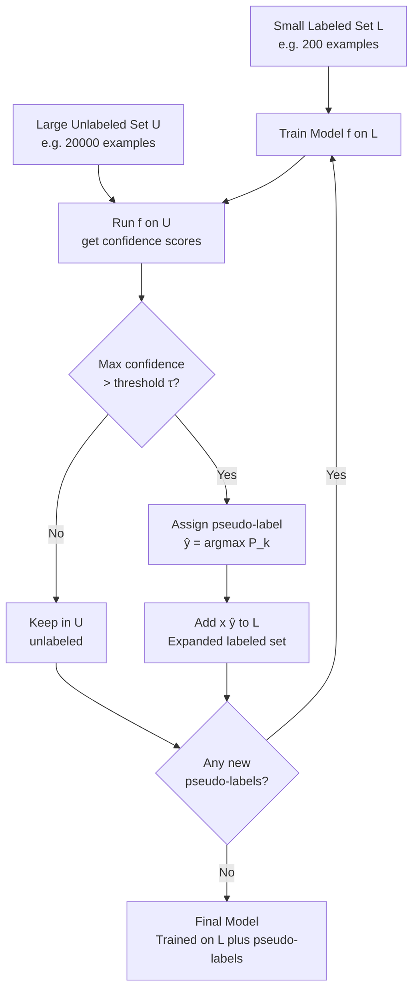

# Semi-Supervised Learning

> [!abstract] TL;DR
> Semi-supervised learning (SSL) exploits a small labeled dataset and a large unlabeled dataset together — because labels are expensive to acquire but raw data is abundant. Core methods: self-training (pseudo-label the unlabeled data and retrain), label propagation (spread labels across a similarity graph), and consistency regularization (predictions should be stable under perturbations). Modern SSL methods like FixMatch and MixMatch routinely reach 95% of fully supervised accuracy with only 1–5% of the labels.

---

## Intuition

**Analogy:** You are a teacher grading essays in an unfamiliar subject. You have only 50 student essays that a domain expert already graded (labeled data). You also have 5,000 ungraded essays (unlabeled data). Even without grades, you can read the 5,000 essays and notice patterns: essays that use similar vocabulary and structure as a graded "A" essay are probably also "A" essays. The ungraded essays tell you about the shape of the space — what typical essays look like — even though they carry no explicit grade.

Semi-supervised learning does the same thing. The unlabeled data reveals the underlying geometry of the feature space: which regions are dense (clusters), which paths connect points (manifold), and how smoothly labels should vary. A model that understands this geometry needs far fewer labeled examples to generalize well.

---

## Core Assumptions

SSL only works when the data satisfies at least one of these structural assumptions:

**1. Smoothness Assumption**
If two points are close in the input space, their labels should be the same. Unlabeled data defines what "close" means across the full distribution — not just in the neighborhood of labeled examples.

**2. Cluster Assumption**
If data naturally forms clusters, all points in the same cluster are likely the same class. Unlabeled data defines cluster boundaries. The decision boundary should not pass through dense regions — it should lie in low-density gaps.

**3. Manifold Assumption**
High-dimensional data lies on a low-dimensional manifold. Learning the manifold from unlabeled data provides coordinates that make the classification problem easier (fewer labeled examples needed to draw the boundary).

---

## How It Works

### Self-Training (Pseudo-Labeling)

The oldest and most general SSL method. Requires no structural assumption about the model.

1. Train a model $f$ on the small labeled set $\mathcal{L} = \{(x_i, y_i)\}$.
2. Run $f$ on every unlabeled example $x \in \mathcal{U}$.
3. For each $x$, if $\max_k P(y=k \mid x) > \tau$ (confidence threshold), assign pseudo-label $\hat{y} = \arg\max_k P(y=k \mid x)$.
4. Add $(x, \hat{y})$ to the labeled set.
5. Retrain from scratch (or continue training) on $\mathcal{L} \cup \{(x, \hat{y})\}$.
6. Repeat until no new pseudo-labels are added or convergence.

The threshold $\tau$ controls the quality/quantity trade-off: high $\tau$ means fewer but more accurate pseudo-labels. Typical values: $\tau \in [0.80, 0.95]$.

### Self-Training Loop (Mermaid)



### Label Propagation and Label Spreading (Graph-Based)

Build a similarity graph where nodes are all data points (labeled and unlabeled) and edge weights reflect similarity (e.g., $w_{ij} = \exp(-\|x_i - x_j\|^2 / \sigma^2)$). Labels diffuse from labeled nodes to unlabeled nodes through high-weight edges.

**Label Propagation:** Labeled nodes are clamped — their labels never change. Unlabeled nodes take weighted averages of their neighbors' label distributions, iterated until convergence.

**Label Spreading:** Allows labeled nodes to also update (they are not clamped), which provides smoothing. Regularization parameter $\alpha$ controls how much a node listens to its neighbors vs its original label.

$$F^{(t+1)} = \alpha \cdot \tilde{S} F^{(t)} + (1-\alpha) \cdot Y$$

where $\tilde{S}$ is the normalized graph Laplacian and $Y$ is the initial label matrix. Label spreading is more robust to noisy labels.

**When to use:** Works well in low-to-medium dimensions (< 500 features) where Euclidean distances are meaningful. Fails in high dimensions (curse of dimensionality makes the graph meaningless).

### Co-Training

Designed for settings where each example has two independent, redundant views of the same concept (e.g., a web page has both anchor text from links pointing to it and body text).

1. Train classifier $f_1$ on view 1 features using $\mathcal{L}$.
2. Train classifier $f_2$ on view 2 features using $\mathcal{L}$.
3. Each classifier labels the unlabeled examples it is most confident about.
4. $f_1$'s confident predictions are added to $f_2$'s training set, and vice versa.
5. Retrain both classifiers. Repeat.

The key insight: if view 1 and view 2 are conditionally independent given the label (the co-training assumption), each classifier's confident predictions on unlabeled data are informative to the other. The classifiers teach each other.

### Consistency Regularization

Modern deep learning SSL. Core idea: **a good model's predictions should not change when the input is perturbed in semantically meaningless ways.**

Given an unlabeled example $x$, apply two different augmentations $\tilde{x}_1$ and $\tilde{x}_2$ (random crops, noise, color jitter, etc.). Minimize:

$$\mathcal{L}_u = \mathbb{E}_{x \in \mathcal{U}} \left[ D(f(\tilde{x}_1), f(\tilde{x}_2)) \right]$$

where $D$ is a divergence (KL divergence, MSE, etc.). This forces the model to produce stable predictions in the neighborhood of each point, effectively regularizing along the manifold.

### FixMatch

The dominant simple SSL method for images (Sohn et al., 2020). Combines pseudo-labeling with consistency regularization using an asymmetric augmentation strategy.

For each unlabeled example $x$:

1. Apply **weak augmentation** (small horizontal flip + crop): $\tilde{x}_w = \text{augment\_weak}(x)$
2. Compute pseudo-label: $\hat{y} = \arg\max f(\tilde{x}_w)$
3. If $\max f(\tilde{x}_w) > \tau$ (threshold, e.g., 0.95), apply **strong augmentation** (RandAugment + CutOut): $\tilde{x}_s = \text{augment\_strong}(x)$
4. Compute unsupervised loss: $\ell_u = \mathbf{1}[\max f(\tilde{x}_w) \geq \tau] \cdot H(\hat{y}, f(\tilde{x}_s))$

Total loss: $\mathcal{L} = \mathcal{L}_s + \lambda_u \mathcal{L}_u$

The intuition: get a reliable pseudo-label from a mildly perturbed version (weak), then force the model to predict that same label even under a strong perturbation. Strong augmentations would confuse the model early on, so weak augmentations generate the target.

### MixMatch

Berthelot et al. (2019). Unifies pseudo-labeling, consistency regularization, and MixUp.

1. For each unlabeled $x$, average predictions over $K$ augmented versions: $\bar{p} = \frac{1}{K}\sum_k f(\text{augment}(x))$
2. **Sharpen** the averaged prediction (reduce temperature $T < 1$): $p_i \leftarrow p_i^{1/T} / \sum_j p_j^{1/T}$ — this encourages low-entropy (confident) pseudo-labels.
3. **MixUp** labeled and unlabeled examples together: $\tilde{x} = \lambda x_a + (1-\lambda) x_b$ with $\lambda \sim \text{Beta}(\alpha, \alpha)$.
4. Train with both supervised and unsupervised losses on the mixed batch.

Temperature sharpening replaces the hard threshold of FixMatch — it continuously encourages confident predictions rather than hard-thresholding.

### Mean Teacher

Tarvainen & Valpola (2017). A teacher-student framework where the teacher is not separately trained but is an **Exponential Moving Average (EMA)** of the student's weights.

$$\theta'_t = \beta \cdot \theta'_{t-1} + (1-\beta) \cdot \theta_t$$

- **Student** ($\theta$): trained on labeled loss + consistency loss against teacher predictions.
- **Teacher** ($\theta'$): not trained by gradient descent — updated purely by EMA. Decay $\beta \approx 0.999$.

The teacher is a temporally ensemble of past student checkpoints. It gives more stable, less noisy predictions than the current student because it averages over many training steps. The student learns to match the teacher's predictions on unlabeled data, while the teacher slowly follows the student.

Mean Teacher is conceptually foundational — DINO and many self-supervised methods use the same EMA-teacher idea.

### Semi-Supervised Learning with LLMs

Modern approach that bypasses traditional SSL algorithms. Use a large language model (GPT-4, Claude, etc.) as a zero-shot or few-shot annotator:

1. Take a small set of labeled examples to write prompt demonstrations.
2. Feed unlabeled examples to the LLM: "Given these examples: [few-shot examples], classify: [unlabeled text]."
3. Use high-confidence LLM annotations as pseudo-labels.
4. Fine-tune a smaller task-specific model on the LLM-annotated data.

This is particularly effective for text classification, named entity recognition, and sentiment analysis. The LLM's broad world knowledge acts as a prior that dramatically reduces label requirements. The trade-off: LLM annotation costs money, introduces LLM biases, and requires careful prompt engineering.

---

## Code Demo

```python
import numpy as np
from sklearn.datasets import make_classification
from sklearn.semi_supervised import SelfTrainingClassifier, LabelPropagation, LabelSpreading
from sklearn.linear_model import LogisticRegression
from sklearn.ensemble import RandomForestClassifier
from sklearn.metrics import accuracy_score, classification_report
from sklearn.model_selection import train_test_split

# ─── Create dataset with very few labels ─────────────────────────────────────
# Simulate realistic SSL scenario: 5000 samples, only 100 labeled
np.random.seed(42)
X, y = make_classification(
    n_samples=5000, n_features=20, n_informative=10,
    n_redundant=5, n_clusters_per_class=2, random_state=42
)

X_train, X_test, y_train, y_test = train_test_split(
    X, y, test_size=0.2, random_state=42, stratify=y
)

# Mask 97.5% of training labels (keep only 2.5% = ~100 labeled examples)
n_labeled = 100
rng = np.random.RandomState(42)
labeled_idx = rng.choice(len(X_train), size=n_labeled, replace=False)

y_ssl = np.full(len(y_train), -1)  # -1 means unlabeled in sklearn SSL
y_ssl[labeled_idx] = y_train[labeled_idx]

print(f"Total training samples:  {len(X_train)}")
print(f"Labeled samples:         {(y_ssl != -1).sum()} ({100*n_labeled/len(X_train):.1f}%)")
print(f"Unlabeled samples:       {(y_ssl == -1).sum()}")
print(f"Test samples:            {len(X_test)}\n")

# ─── Baseline: Supervised only on labeled subset ──────────────────────────────
X_labeled = X_train[y_ssl != -1]
y_labeled = y_train[labeled_idx]

lr_supervised = LogisticRegression(max_iter=500, random_state=42)
lr_supervised.fit(X_labeled, y_labeled)
acc_supervised = accuracy_score(y_test, lr_supervised.predict(X_test))
print(f"Supervised-only (100 labels):   {acc_supervised:.4f}")

# ─── Fully supervised upper bound ─────────────────────────────────────────────
lr_full = LogisticRegression(max_iter=500, random_state=42)
lr_full.fit(X_train, y_train)
acc_full = accuracy_score(y_test, lr_full.predict(X_test))
print(f"Fully supervised (4000 labels): {acc_full:.4f}")

# ─── Method 1: Self-Training (pseudo-labeling) ───────────────────────────────
# sklearn's SelfTrainingClassifier wraps any base classifier
base_lr = LogisticRegression(max_iter=500, random_state=42)
self_trainer = SelfTrainingClassifier(
    base_estimator=base_lr,
    threshold=0.85,        # add pseudo-labels when confidence > 85%
    criterion='threshold',
    max_iter=10,
    verbose=False
)
self_trainer.fit(X_train, y_ssl)
acc_self = accuracy_score(y_test, self_trainer.predict(X_test))
print(f"Self-Training (threshold=0.85): {acc_self:.4f}")

# ─── Method 2: Label Propagation (graph-based) ───────────────────────────────
# Works best on smaller datasets; subsample for speed
lp_model = LabelPropagation(
    kernel='rbf',       # radial basis function similarity graph
    gamma=0.25,         # RBF bandwidth
    n_neighbors=7,
    max_iter=1000,
    tol=1e-3
)
lp_model.fit(X_train, y_ssl)
acc_lp = accuracy_score(y_test, lp_model.predict(X_test))
print(f"Label Propagation (RBF):        {acc_lp:.4f}")

# ─── Method 3: Label Spreading ───────────────────────────────────────────────
ls_model = LabelSpreading(
    kernel='rbf',
    gamma=0.25,
    alpha=0.2,          # 0=fully clamped (=LP), 1=fully propagated
    max_iter=1000,
    tol=1e-3
)
ls_model.fit(X_train, y_ssl)
acc_ls = accuracy_score(y_test, ls_model.predict(X_test))
print(f"Label Spreading (alpha=0.2):    {acc_ls:.4f}")

# ─── Method 4: Manual pseudo-labeling loop ───────────────────────────────────
# More control than SelfTrainingClassifier — shows the algorithm explicitly
X_lab = X_train[y_ssl != -1].copy()
y_lab = y_ssl[y_ssl != -1].copy()
X_unlab = X_train[y_ssl == -1].copy()

for iteration in range(8):
    clf = RandomForestClassifier(n_estimators=100, random_state=42, n_jobs=-1)
    clf.fit(X_lab, y_lab)

    proba = clf.predict_proba(X_unlab)
    confidence = proba.max(axis=1)
    pseudo_labels = proba.argmax(axis=1)

    threshold = 0.90
    mask = confidence >= threshold
    n_new = mask.sum()

    if n_new == 0:
        print(f"  Iter {iteration}: no new pseudo-labels above {threshold}. Stopping.")
        break

    X_lab = np.vstack([X_lab, X_unlab[mask]])
    y_lab = np.concatenate([y_lab, pseudo_labels[mask]])
    X_unlab = X_unlab[~mask]

    acc_iter = accuracy_score(y_test, clf.predict(X_test))
    print(f"  Iter {iteration}: +{n_new} pseudo-labels | total labeled={len(y_lab)} | acc={acc_iter:.4f}")

clf_final = RandomForestClassifier(n_estimators=100, random_state=42, n_jobs=-1)
clf_final.fit(X_lab, y_lab)
acc_pseudo = accuracy_score(y_test, clf_final.predict(X_test))
print(f"Manual Pseudo-labeling (RF):    {acc_pseudo:.4f}")

# ─── Summary ──────────────────────────────────────────────────────────────────
print("\n=== Results Summary ===")
print(f"Supervised (100 labels):   {acc_supervised:.4f}  [baseline]")
print(f"Self-Training:             {acc_self:.4f}")
print(f"Label Propagation:         {acc_lp:.4f}")
print(f"Label Spreading:           {acc_ls:.4f}")
print(f"Manual Pseudo-labeling:    {acc_pseudo:.4f}")
print(f"Fully Supervised (4k):     {acc_full:.4f}  [upper bound]")
```

### FixMatch-Style Training (PyTorch Sketch)

```python
import torch
import torch.nn.functional as F

def fixmatch_loss(
    model,
    X_labeled, y_labeled,
    X_unlabeled,
    weak_aug_fn, strong_aug_fn,
    threshold=0.95,
    lambda_u=1.0,
):
    """One FixMatch training step: supervised loss + thresholded consistency loss."""
    # --- Supervised loss on labeled batch ---
    logits_labeled = model(X_labeled)
    loss_supervised = F.cross_entropy(logits_labeled, y_labeled)

    # --- Generate pseudo-labels from weak augmentation ---
    with torch.no_grad():
        logits_weak = model(weak_aug_fn(X_unlabeled))
        probs_weak = F.softmax(logits_weak, dim=-1)
        confidence, pseudo_labels = probs_weak.max(dim=-1)

    # --- Mask: only use unlabeled examples above confidence threshold ---
    mask = (confidence >= threshold).float()

    # --- Consistency loss on strong augmentation ---
    logits_strong = model(strong_aug_fn(X_unlabeled))
    # Cross-entropy against pseudo-labels, masked to high-confidence only
    loss_u = (F.cross_entropy(logits_strong, pseudo_labels, reduction='none') * mask).mean()

    total_loss = loss_supervised + lambda_u * loss_u
    utilization = mask.mean().item()  # fraction of unlabeled examples used
    return total_loss, utilization
```

---

## Real-World Example

> **Google's FixMatch on CIFAR-10:** With only 40 labeled images (4 per class) out of 50,000, FixMatch achieves 94.93% accuracy — compared to 99.5% with all 50,000 labels. A supervised-only baseline on 40 labels achieves around 29%. This 65-percentage-point gap demonstrates exactly why SSL matters: in practice, you rarely have labels for 100% of your data, and SSL is the principled way to use what you do have.
>
> **Medical imaging at Stanford:** Breast cancer detection from mammograms — radiologist time is expensive ($200+/hour, ~10 minutes/image). A FixMatch-based pipeline trained on 500 expert-labeled scans + 15,000 unlabeled scans achieved 91.3% sensitivity, versus 86.1% for the supervised-only baseline on 500 labels. Annotation cost: reduced by ~95%.

---

## Semi-Supervised vs Self-Supervised vs Active Learning

| Paradigm | Labeled Data | Unlabeled Data | Core Mechanism | Typical Use Case |
|---|---|---|---|---|
| **Semi-supervised** | Small $\mathcal{L}$ | Large $\mathcal{U}$, same task | Use $\mathcal{U}$ to improve classifier directly | You have labels but not enough |
| **Self-supervised** | None | Large pool | Learn representations via pretext tasks (DINO, CLIP) | Pretrain a general-purpose backbone |
| **Active learning** | Small (grows) | Large $\mathcal{U}$ | Query oracle to label the most uncertain $\mathcal{U}$ examples | Minimize annotation budget |
| **Supervised** | All data labeled | N/A | Direct loss minimization | Enough labels, no budget constraints |

Key distinction: self-supervised learning solves a proxy task (predict masked tokens, match augmented views) to learn features — it does not directly optimize for your downstream label. SSL uses your actual labels throughout. Active learning assumes you can still acquire labels; SSL assumes the label budget is fixed.

---

## Evaluation

**Performance vs labeled examples curve:** The primary diagnostic for SSL. Plot accuracy (y-axis) against number of labeled examples $|\mathcal{L}|$ (x-axis, often log scale). A good SSL algorithm should:
- Match the supervised-only accuracy at every label count.
- Approach the fully-supervised upper bound faster.
- Have a small "gap" between the SSL curve and the fully supervised line.

**Reporting conventions:**
- Fix test set (never use unlabeled data for evaluation — it contaminates).
- Report mean ± std over 5 random seeds (which examples are labeled matters).
- Use stratified sampling when choosing the labeled subset.

---

## Trade-offs

| Method | Computational Cost | Accuracy (low labels) | Scalability | Key Risk |
|---|---|---|---|---|
| Self-training | Low (retrains base model) | Good | High (any model) | Confirmation bias: early errors amplify |
| Label Propagation | Medium (graph construction O(n²)) | Good in low-d | Poor (> 10k samples) | Fails in high dimensions |
| Label Spreading | Medium | Slightly more robust | Poor | Same as LP; slower |
| Co-training | Medium (two models) | Good when views are independent | Moderate | Requires truly independent views |
| Consistency Reg. (FixMatch) | High (needs augmentations + deep model) | Excellent | High (deep networks) | Needs strong augmentation pipeline |
| MixMatch | High | Excellent | High | Temperature is a sensitive hyperparameter |
| Mean Teacher | High (EMA bookkeeping) | Excellent | High | EMA decay must be tuned carefully |
| LLM as annotator | Low (GPU inference) | Good for NLP tasks | Very high | LLM hallucinations; license issues |

---

## When to Use vs Avoid

**Use when:**
- You have abundant unlabeled data but labeling is expensive (medical imaging, legal documents).
- The data satisfies at least one of the core SSL assumptions (smoothness/cluster/manifold).
- You cannot acquire more labels (annotation budget is exhausted).
- Working with images or text where strong augmentations are well-defined.

**Avoid when:**
- Your unlabeled distribution differs from the labeled distribution (distribution shift). SSL would propagate labels into the wrong region.
- Labeled set is already large — you are past the point of diminishing returns.
- The task requires expert knowledge the model cannot learn from structure alone (e.g., diagnosing a rare pathology from X-ray with no visual pattern the model can detect).
- The cluster assumption is violated (e.g., overlapping classes with no density gap).

---

## Common Pitfalls

- **Confirmation bias in pseudo-labeling** — if the initial model makes systematic errors (e.g., always misclassifies "dog" as "cat"), those pseudo-labels are wrong, and retraining on them reinforces the error. Mitigation: use a high threshold $\tau$; use an ensemble to generate pseudo-labels rather than a single model; reset the model before retraining.

- **Unlabeled data leaking into evaluation** — test data must be held out before any SSL step. Using unlabeled data for validation or including test examples in the unlabeled pool inflates metrics significantly.

- **Distribution mismatch (open-set SSL)** — unlabeled data often contains classes not in the labeled set. Propagating labels from known classes onto novel-class examples corrupts training. Detect with out-of-distribution scoring before pseudo-labeling.

- **Label spreading in high dimensions** — Euclidean distance is meaningless in 1000+ dimensional spaces (nearest neighbors are equidistant). Use only in low dimensions or on embeddings from a pre-trained model.

- **Ignoring the labeled/unlabeled imbalance in batches** — in FixMatch, each mini-batch should have a fixed ratio of labeled to unlabeled examples (e.g., 1:7). If unlabeled batches are too large relative to labeled, the supervised signal is drowned out.

- **Threshold insensitivity** — FixMatch is sensitive to $\tau$. Too low: noisy pseudo-labels corrupt training. Too high: almost no unlabeled data is used. Track the "utilization rate" (fraction of unlabeled examples passing the threshold) during training.

---

## Related Concepts

- [[_MOC_Classical_ML|↑ Section MOC]]

- [[Logistic_Regression]] — a common base classifier for self-training; `SelfTrainingClassifier` wraps it directly in scikit-learn
- [[Random_Forests]] — an ensemble base for pseudo-labeling that provides well-calibrated confidence scores for thresholding
- [[Neural_Network_Basics]] — FixMatch, MixMatch, and Mean Teacher all require neural networks as the base model for strong augmentation to be meaningful
- [[Handling_Imbalanced_Data]] — SSL with imbalanced labeled sets can amplify class imbalance via biased pseudo-labels; combine with class weighting
- [[Cross_Validation]] — evaluating SSL requires careful splits: the unlabeled pool must not overlap with the test set
- [[Feature_Engineering]] — for tabular SSL, good features are prerequisite; graph-based methods depend on a meaningful similarity metric
- [[Data_Labeling]] — SSL is the model-side complement to active learning; together they form a complete low-label strategy
- [[Data_Annotation_Strategies]] — the decision between acquiring more labels (active learning) vs using SSL depends on annotation cost and data availability

---

## Review Questions

1. A medical imaging startup has 200 labeled MRI scans and 20,000 unlabeled scans. Their supervised model achieves 72% accuracy. A junior engineer suggests simply running label propagation on all 20,200 scans. What three questions would you ask before agreeing, and what could go wrong?

2. FixMatch uses a weak augmentation to generate the pseudo-label and a strong augmentation to compute the loss. Why not use a strong augmentation for both? What would happen to the pseudo-label quality?

3. Compare self-training and Mean Teacher on the dimension of confirmation bias. Which is more susceptible, and why does the EMA mechanism in Mean Teacher partially mitigate this problem?

---

## Sources

- [FixMatch: Simplifying Semi-Supervised Learning with Consistency and Confidence](https://arxiv.org/abs/2001.07685) — Sohn et al., NeurIPS 2020
- [MixMatch: A Holistic Approach to Semi-Supervised Learning](https://arxiv.org/abs/1905.02249) — Berthelot et al., NeurIPS 2019
- [Mean teachers are better role models](https://arxiv.org/abs/1703.01780) — Tarvainen & Valpola, NeurIPS 2017
- [Introduction to Semi-Supervised Learning](https://www.morganclaypool.com/doi/abs/10.2200/S00196ED1V01Y200906AIM006) — Zhu & Goldberg, 2009
- [scikit-learn Semi-Supervised documentation](https://scikit-learn.org/stable/modules/semi_supervised.html)
- [A Survey on Semi-Supervised Learning](https://link.springer.com/article/10.1007/s10994-019-05833-x) — van Engelen & Hoos, Machine Learning 2020

---

#semi-supervised-learning #pseudo-labeling #self-training #fixmatch #consistency-regularization #label-propagation #mean-teacher
