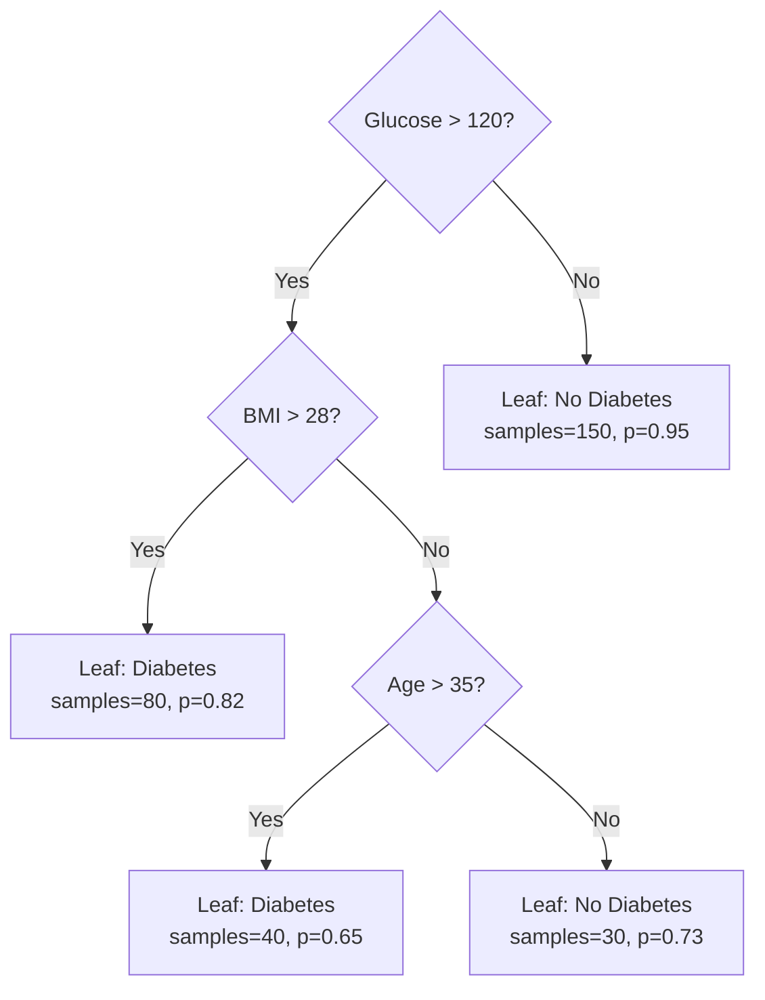

# 🌳 Decision Trees

> [!abstract] TL;DR
> A decision tree recursively splits data by the feature threshold that most reduces impurity (Gini or entropy), creating an interpretable if-then rule structure that can perfectly memorize training data but generalizes poorly without pruning.

---

## Intuition — Analogy First

A decision tree is a structured game of **20 questions**. In 20 questions, you narrow down a hidden answer by asking yes/no questions — each question eliminates roughly half the remaining possibilities. A good player asks questions that divide the remaining space as evenly as possible: "Is it alive?" beats "Is it a specific species of Antarctic beetle?"

A decision tree does exactly this, but instead of human intuition, it uses math to find the question (feature split) that best separates the classes at each step. It keeps asking questions until every leaf contains only one class (or a stopping criterion is met).

The "best question" is whichever split most reduces the **impurity** — a measure of how mixed the classes are in a group. Pure = one class = not mixed = low impurity = good split.

---

## How It Works — Mechanics

The algorithm is **recursive binary splitting**:

1. At each node, try every feature and every threshold.
2. Choose the split that minimizes the weighted impurity of the two child nodes.
3. Recurse on each child node.
4. Stop when: max depth reached, node has fewer than `min_samples_split`, or further splits give no improvement.

### Sample Tree Structure



### Splitting Criteria

| Criterion | Formula | Used For | Notes |
|---|---|---|---|
| Gini impurity | $1 - \sum_k p_k^2$ | Classification | Faster to compute |
| Entropy | $-\sum_k p_k \log_2 p_k$ | Classification (info gain) | Slightly more granular |
| MSE / Variance | $\text{Var}(y)$ | Regression | Mean prediction at leaf |

### Stopping Criteria (Hyperparameters)

| Parameter | Effect | Default (sklearn) |
|---|---|---|
| `max_depth` | Max levels in tree | None (unlimited) |
| `min_samples_split` | Min samples to split a node | 2 |
| `min_samples_leaf` | Min samples in any leaf | 1 |
| `max_features` | Max features to consider per split | All features |
| `min_impurity_decrease` | Min gain needed to split | 0.0 |

---

## The Math

### Gini Impurity

For a node with $K$ classes, where $p_k$ is the fraction of samples in class $k$:

$$G = 1 - \sum_{k=1}^{K} p_k^2$$

- $G = 0$: pure node (only one class)
- $G = 0.5$: maximally impure binary node (50/50 split)

### Entropy

$$H = -\sum_{k=1}^{K} p_k \log_2 p_k$$

- $H = 0$: pure node
- $H = 1$: maximally impure binary node

### Information Gain

The gain of a split that divides a parent node $P$ into children $L$ (left) and $R$ (right):

$$IG = H(P) - \frac{n_L}{n_P} H(L) - \frac{n_R}{n_P} H(R)$$

The algorithm greedily maximizes $IG$ at each step.

### Example Calculation

Node with 100 samples: 60 class A, 40 class B.

$$G_\text{parent} = 1 - (0.6^2 + 0.4^2) = 1 - (0.36 + 0.16) = 0.48$$

After split: Left has 50 A, 5 B. Right has 10 A, 35 B.

$$G_L = 1 - \left(\frac{50}{55}\right)^2 - \left(\frac{5}{55}\right)^2 \approx 0.165$$

$$G_R = 1 - \left(\frac{10}{45}\right)^2 - \left(\frac{35}{45}\right)^2 \approx 0.346$$

$$G_\text{weighted} = \frac{55}{100}(0.165) + \frac{45}{100}(0.346) = 0.091 + 0.156 = 0.247$$

Gini reduction = $0.48 - 0.247 = 0.233$ — a significant improvement.

---

## Code Demo

### Training and Visualizing a Decision Tree

```python
import numpy as np
import matplotlib.pyplot as plt
from sklearn.tree import DecisionTreeClassifier, plot_tree, export_text
from sklearn.datasets import load_breast_cancer
from sklearn.model_selection import train_test_split
from sklearn.metrics import classification_report

# Load data
data = load_breast_cancer()
X, y = data.data, data.target

X_train, X_test, y_train, y_test = train_test_split(
    X, y, test_size=0.2, random_state=42
)

# Shallow tree (less overfit)
clf = DecisionTreeClassifier(
    criterion='gini',
    max_depth=4,
    min_samples_leaf=10,
    random_state=42
)
clf.fit(X_train, y_train)
y_pred = clf.predict(X_test)

print(classification_report(y_test, y_pred, target_names=data.target_names))
print(f"Test accuracy:  {clf.score(X_test, y_test):.4f}")
print(f"Train accuracy: {clf.score(X_train, y_train):.4f}")

# Visualize the tree
plt.figure(figsize=(20, 8))
plot_tree(
    clf, feature_names=data.feature_names,
    class_names=data.target_names, filled=True, rounded=True
)
plt.title("Decision Tree (max_depth=4)")
plt.tight_layout()
plt.savefig("decision_tree.png", dpi=150)
```

### Feature Importance

```python
import pandas as pd

# Feature importances = mean decrease in Gini impurity across all splits
importances = pd.Series(
    clf.feature_importances_,
    index=data.feature_names
).sort_values(ascending=False)

print("Top 10 features:")
print(importances.head(10))
```

### Overfitting Demonstration

```python
# Fully grown tree — memorizes training data
overfit_tree = DecisionTreeClassifier(max_depth=None, random_state=42)
overfit_tree.fit(X_train, y_train)

print(f"Overfit train acc: {overfit_tree.score(X_train, y_train):.4f}")  # ~1.0
print(f"Overfit test  acc: {overfit_tree.score(X_test, y_test):.4f}")    # ~0.88

# Shallow tree — better generalization
shallow_tree = DecisionTreeClassifier(max_depth=4, random_state=42)
shallow_tree.fit(X_train, y_train)

print(f"Shallow train acc: {shallow_tree.score(X_train, y_train):.4f}")  # ~0.95
print(f"Shallow test  acc: {shallow_tree.score(X_test, y_test):.4f}")    # ~0.93
```

### Depth vs Accuracy (Bias-Variance)

```python
depths = range(1, 20)
train_accs, test_accs = [], []

for d in depths:
    t = DecisionTreeClassifier(max_depth=d, random_state=42)
    t.fit(X_train, y_train)
    train_accs.append(t.score(X_train, y_train))
    test_accs.append(t.score(X_test, y_test))

# Plot: training acc rises monotonically; test acc peaks then declines
```

---

## Real-World Example

**Fraud Detection Rules at Banks.** Decision trees (sometimes manually encoded as rule trees) are heavily used in financial fraud detection. A single decision tree at depth 5–6 might encode rules like:

- "If transaction amount > $500 AND country != home country AND time is 2–4 AM → high risk"

These rules are explicitly auditable, can be hard-coded in decision engines, and can be explained to regulators and customers. JP Morgan and HSBC both deploy tree-based rule systems alongside more complex models, using the trees for the "explainable tier" of their fraud stack.

**Medical Diagnosis Systems.** In clinical decision support, decision trees are valuable because they can be printed as flowcharts. CART-derived diagnostic trees for conditions like sepsis or appendicitis give doctors a step-by-step questionnaire, matching the natural flow of a clinical exam.

---

## Trade-offs

| Aspect | Pro | Con |
|---|---|---|
| Interpretability | Very high — literal if-then rules | Unstable (small data change → different tree) |
| Training speed | Fast $O(n \cdot d \cdot \log n)$ | — |
| No feature scaling needed | Yes | — |
| Handles mixed types | Yes (categorical + continuous) | Categorical requires encoding in sklearn |
| Overfitting | Easy to visualize and prune | Deep trees memorize noise |
| Non-linear boundaries | Yes (axis-aligned splits) | No smooth decision boundaries |
| Extrapolation | — | Cannot extrapolate beyond training range |

---

## When to Use vs Avoid

**Use when:**
- Interpretability and rule extraction are required
- Quick baseline before ensemble methods
- Mixed feature types (categorical + continuous)
- Features have complex, non-linear interactions (unlike linear models)

**Avoid when:**
- Prediction accuracy is the primary goal (use Random Forest or Gradient Boosting)
- Dataset is noisy — trees will overfit without careful tuning
- Continuous smooth decision boundaries are needed (SVM or neural nets)

---

## Common Pitfalls

1. **Growing trees to full depth without validation.** A fully-grown tree on 10,000 samples can reach 100% training accuracy and 60% test accuracy. Always use `max_depth` or cross-validate `min_samples_leaf`.

2. **Ignoring class imbalance.** Default splitting criteria don't account for imbalanced classes. Use `class_weight='balanced'` or oversample before fitting.

3. **Assuming feature importance = causality.** Tree feature importance measures how much each feature reduces impurity — highly correlated features split that importance unpredictably. Use permutation importance for a more robust estimate.

4. **Not visualizing the tree.** Decision trees are literally meant to be looked at. A confusing tree (100+ nodes) is a signal the model is overfitting or needs pruning.

5. **Using entropy vs Gini interchangeably without benchmarking.** They usually produce similar results, but entropy is slightly slower due to log computation. On large datasets with many classes, Gini is the pragmatic default.

---

## Related Concepts

- [[_MOC_Classical_ML|↑ Section MOC]]

- [[Random_Forests]] — bagging of many trees to reduce variance
- [[Gradient_Boosting]] — sequential boosting of trees to reduce bias
- [[Ensemble_Methods]] — general framework for combining weak learners
- [[Bias_Variance_Tradeoff]] — deep trees = high variance; shallow trees = high bias

---

## Review Questions

1. **Scenario:** You train a decision tree to classify medical diagnoses and achieve 99% training accuracy but 72% test accuracy. A colleague says "just prune the tree." Explain what pruning means (both pre- and post-pruning), and describe two other strategies beyond pruning that would improve generalization.

2. **Scenario:** You have a dataset where Feature A perfectly separates Class 1 from Class 2 in your training set, but this is due to data leakage. Your trained tree uses Feature A as the root node with 100% purity after the split. Why is this dangerous, and how does decision tree feature importance help you detect it?

3. **Scenario:** A business stakeholder asks you to explain why a loan application was denied by your ML model. You have a logistic regression and a decision tree with similar accuracy. Which would you use to explain individual decisions, and how would you generate the explanation?

---

## Sources

- Breiman, L. et al. — *Classification and Regression Trees* (Wadsworth, 1984)
- Géron, A. — *Hands-On Machine Learning with Scikit-Learn, Keras & TensorFlow*, Chapter 6 (3rd ed., O'Reilly, 2022)
- scikit-learn documentation — [DecisionTreeClassifier](https://scikit-learn.org/stable/modules/generated/sklearn.tree.DecisionTreeClassifier.html)
- James et al. — *An Introduction to Statistical Learning*, Chapter 8 (2nd ed., Springer, 2021)

---

#decision-trees #gini-impurity #information-gain #supervised-learning #classification #beginner
