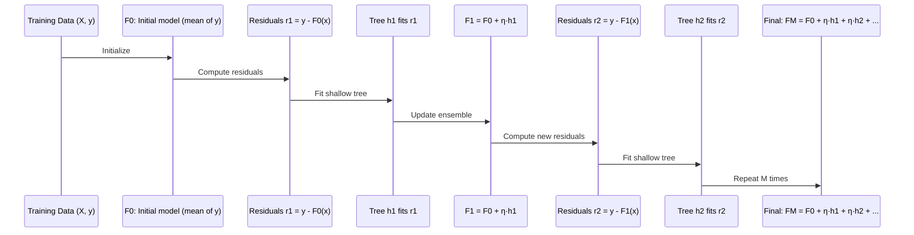

# ⚡ Gradient Boosting

> [!abstract] TL;DR
> Gradient Boosting builds an ensemble sequentially — each new tree fits the residual errors of all previous trees — using a learning rate (shrinkage) to prevent overfitting, producing one of the most powerful algorithms for tabular data.

---

## Intuition — Analogy First

Imagine a team of specialists called in to investigate a complex system failure. The first specialist analyses the problem and provides an initial diagnosis — imperfect, but a reasonable starting point. The second specialist is shown only the *mistakes* from the first diagnosis and focuses entirely on correcting those errors. The third specialist corrects the residual mistakes left by the combined first and second. Each specialist is a **focused corrector**, and the final answer is the sum of all their contributions.

This is gradient boosting: each new tree is trained on the **residual errors** of the current ensemble. The ensemble starts with a rough estimate, and each subsequent tree nudges it closer to the truth. The learning rate (shrinkage) ensures no single tree overcorrects — like a team leader saying "don't be too drastic, just partially fix it."

The contrast with Random Forest (bagging): **bagging reduces variance** by averaging independent trees; **boosting reduces bias** by sequentially correcting systematic errors.

---

## How It Works — Mechanics

### Sequential Tree Building



### Key Components

| Component | Role | Typical value |
|---|---|---|
| Initial model $F_0$ | Starting prediction (mean for regression) | mean($y$) |
| Weak learner $h_m$ | Shallow decision tree fitted to residuals | max_depth 3–8 |
| Learning rate $\eta$ | Shrinkage — scales each tree's contribution | 0.01–0.3 |
| $M$ (n_estimators) | Number of trees | 100–5000 |
| Loss function | Defines what "error" means | MSE, LogLoss, etc. |

### Gradient Connection

The "gradient" in gradient boosting refers to fitting each tree to the **negative gradient of the loss** with respect to predictions. For MSE, this is simply the residual:

$$-\frac{\partial \mathcal{L}}{\partial F(x_i)} = y_i - F_{m-1}(x_i)$$

For other losses (log loss, MAE), the pseudo-residuals are different but the algorithm is identical — hence the name "gradient" boosting: it performs gradient descent in function space.

---

## The Math

### General Algorithm (Friedman, 1999)

Given loss function $\mathcal{L}(y, F(x))$:

**Step 0:** Initialize with the best constant:

$$F_0(x) = \arg\min_\gamma \sum_{i=1}^n \mathcal{L}(y_i, \gamma)$$

For MSE: $F_0 = \bar{y}$ (mean of targets).

**Step m** (for $m = 1, \ldots, M$):

1. Compute pseudo-residuals (negative gradient):

$$r_{im} = -\left[\frac{\partial \mathcal{L}(y_i, F(x_i))}{\partial F(x_i)}\right]_{F=F_{m-1}}$$

2. Fit a decision tree $h_m$ to the pseudo-residuals $\{(x_i, r_{im})\}_{i=1}^n$.

3. Update the ensemble with shrinkage:

$$F_m(x) = F_{m-1}(x) + \eta \cdot h_m(x)$$

**Final prediction:** $F_M(x)$

### Pseudo-Residuals for Different Losses

| Loss | $r_{im}$ (pseudo-residual) | Use case |
|---|---|---|
| MSE $\frac{1}{2}(y-F)^2$ | $y_i - F_{m-1}(x_i)$ | Regression |
| MAE $|y - F|$ | $\text{sign}(y_i - F_{m-1}(x_i))$ | Robust regression |
| Log-loss $y\log p + (1-y)\log(1-p)$ | $y_i - \sigma(F_{m-1}(x_i))$ | Binary classification |

### Shrinkage (Learning Rate) and n_estimators Trade-off

With learning rate $\eta$ and $M$ trees, total complexity is roughly $\eta \cdot M$. The canonical trade-off:

- **Large $\eta$, small $M$**: fast training, worse generalization
- **Small $\eta$, large $M$**: slow training, better generalization

Rule of thumb: $\eta \leq 0.1$ with early stopping achieves good performance.

---

## Code Demo

### sklearn GradientBoostingClassifier

```python
import numpy as np
from sklearn.ensemble import GradientBoostingClassifier
from sklearn.datasets import make_classification
from sklearn.model_selection import train_test_split
from sklearn.metrics import classification_report, roc_auc_score
import matplotlib.pyplot as plt

X, y = make_classification(
    n_samples=5000, n_features=20, n_informative=10,
    n_redundant=5, random_state=42
)
X_train, X_test, y_train, y_test = train_test_split(
    X, y, test_size=0.2, random_state=42
)

gb = GradientBoostingClassifier(
    n_estimators=300,
    learning_rate=0.1,
    max_depth=4,
    min_samples_leaf=10,
    subsample=0.8,           # stochastic GBM: use 80% of data per tree
    random_state=42
)
gb.fit(X_train, y_train)

y_pred  = gb.predict(X_test)
y_proba = gb.predict_proba(X_test)[:, 1]

print(classification_report(y_test, y_pred))
print(f"Test ROC-AUC: {roc_auc_score(y_test, y_proba):.4f}")
```

### Staged Prediction: Watching Boosting Learn

```python
# staged_predict_proba shows ensemble prediction after each tree is added
train_scores, test_scores = [], []

for i, y_pred_staged in enumerate(gb.staged_predict_proba(X_train)):
    train_scores.append(roc_auc_score(y_train, y_pred_staged[:, 1]))

for i, y_pred_staged in enumerate(gb.staged_predict_proba(X_test)):
    test_scores.append(roc_auc_score(y_test, y_pred_staged[:, 1]))

plt.figure(figsize=(10, 5))
plt.plot(train_scores, label='Train ROC-AUC')
plt.plot(test_scores,  label='Test ROC-AUC')
plt.xlabel('Number of Trees')
plt.ylabel('ROC-AUC')
plt.title('Boosting: Train vs Test as trees are added')
plt.legend()
plt.tight_layout()
plt.savefig("boosting_staged.png")
# Test score peaks then flattens/dips — early stopping at peak
```

### Early Stopping with Validation

```python
from sklearn.ensemble import GradientBoostingClassifier

X_train_fit, X_val, y_train_fit, y_val = train_test_split(
    X_train, y_train, test_size=0.1, random_state=42
)

gb_es = GradientBoostingClassifier(
    n_estimators=2000,
    learning_rate=0.05,
    max_depth=4,
    validation_fraction=0.1,
    n_iter_no_change=20,     # stop if no improvement for 20 rounds
    tol=1e-4,
    random_state=42
)
gb_es.fit(X_train, y_train)
print(f"Trees used (early stop): {gb_es.n_estimators_}")
print(f"Test ROC-AUC: {roc_auc_score(y_test, gb_es.predict_proba(X_test)[:,1]):.4f}")
```

### Comparing Bagging vs Boosting (bias-variance)

```python
from sklearn.ensemble import RandomForestClassifier

rf = RandomForestClassifier(n_estimators=300, n_jobs=-1, random_state=42)
rf.fit(X_train, y_train)

gb_strong = GradientBoostingClassifier(
    n_estimators=300, learning_rate=0.1, max_depth=4, random_state=42
)
gb_strong.fit(X_train, y_train)

for name, model in [("Random Forest", rf), ("Gradient Boosting", gb_strong)]:
    train_auc = roc_auc_score(y_train, model.predict_proba(X_train)[:, 1])
    test_auc  = roc_auc_score(y_test,  model.predict_proba(X_test)[:, 1])
    print(f"{name}: Train AUC={train_auc:.4f}, Test AUC={test_auc:.4f}")
```

---

## Real-World Example

**Kaggle Tabular Competitions (XGBoost era, 2014–2022).** Gradient boosting variants (XGBoost, LightGBM, CatBoost) won the majority of Kaggle tabular competitions from 2016 onward. The pattern is now so established that "start with LightGBM" is an accepted baseline strategy. The key advantages over neural networks on tabular data: no need for feature normalization, handles mixed types natively, robust to outliers with MAE loss, and interpretable feature importances.

**Amazon Product Ranking.** Amazon's A9 search ranking algorithm uses gradient boosting to score product-query relevance. Features include query-product TF-IDF similarity, conversion rates, click-through rates, price rank, and review statistics. The sequential residual-fitting means the model iteratively improves its ranking signal — each tree catching ranking errors the previous combination missed.

---

## Trade-offs

| Aspect | Gradient Boosting | Random Forest | Notes |
|---|---|---|---|
| Accuracy (tabular) | Highest | High | GB typically wins on structured data |
| Variance sensitivity | High | Low | GB overfits if $\eta$ or depth too large |
| Training speed | Slow (sequential) | Fast (parallel) | LightGBM 10–100× faster than sklearn GBM |
| Hyperparameter tuning | Required | Robust | GB needs careful tuning of $\eta$, depth, $M$ |
| Inference speed | Moderate | Moderate | Similar — both evaluate $M$ trees |
| Handling noisy data | Sensitive | Robust | Boosting memorizes noise; RF averages it away |
| Early stopping | Supported | Not applicable | Essential for GB; RF simply add more trees |

---

## When to Use vs Avoid

**Use when:**
- Maximum predictive accuracy on tabular data is the goal
- Enough data to support careful cross-validation and hyperparameter tuning
- Feature interactions are complex and non-linear
- Prefer a single well-tuned model over an ensemble of ensembles

**Avoid when:**
- Dataset is small (<1000 rows) — RF or logistic regression generalize better
- Noisy labels — boosting will fit the noise aggressively
- Need very fast retraining in online learning pipelines (RF or online SGD models are simpler)
- Interpretability per-prediction needed (use SHAP values as a post-hoc layer)

---

## Common Pitfalls

1. **Learning rate too high.** A learning rate of 0.3+ with many trees often leads to aggressive overfitting. Start at 0.1 and decrease if needed. Always pair small $\eta$ with early stopping.

2. **Not using early stopping.** Without early stopping, the model will eventually overfit — the test loss U-curves as trees are added. Monitor validation loss and stop at the minimum.

3. **Trees too deep.** Unlike Random Forest (which needs deep trees to reduce bias), gradient boosting benefits from **shallow trees** (depth 3–6). Shallow trees are weak enough to benefit from boosting; deep trees overfit early.

4. **Skipping subsampling.** Using `subsample < 1.0` (stochastic gradient boosting) both speeds up training and reduces overfitting by introducing randomness — similar in spirit to dropout. Don't skip it.

5. **Using sklearn's `GradientBoostingClassifier` in production.** It is Python-native and slow. For production or large datasets, use **XGBoost**, **LightGBM**, or **CatBoost** — 10–100× faster, with better regularization and native categorical support.

6. **Ignoring feature scaling requirements.** Gradient boosting is tree-based and invariant to monotone feature transformations — no scaling needed. But highly skewed features (power-law distributed) may still benefit from log-transformation to improve split quality.

---

## Related Concepts

- [[_MOC_Classical_ML|↑ Section MOC]]

- [[Decision_Trees]] — the weak learner used at each boosting stage
- [[Random_Forests]] — competing ensemble approach; bagging reduces variance vs boosting reducing bias
- [[XGBoost]] — regularized, second-order gradient boosting with column/row subsampling
- [[LightGBM]] — leaf-wise (vs level-wise) GB with histogram binning for large-scale data
- [[Ensemble_Methods]] — taxonomy of ensemble strategies

---

## Review Questions

1. **Scenario:** You train a gradient boosting model with `learning_rate=0.3`, `n_estimators=500`, `max_depth=8` on a dataset of 2000 rows. Your training AUC is 0.999 and your test AUC is 0.71. Using the bias-variance framework and the specific hyperparameters above, explain what is wrong and give three concrete changes to fix it.

2. **Scenario:** A teammate argues "Random Forest is better than Gradient Boosting because it is parallel and therefore faster." Under what conditions is this argument correct, and under what conditions would Gradient Boosting be a better choice despite being sequential? (Consider dataset size, noise level, accuracy requirements, and time budget.)

3. **Scenario:** You are iterating on a Kaggle competition. You have a LightGBM model with 3000 trees at learning rate 0.01. Training takes 2 hours per run. Describe two strategies to reduce training time without significantly sacrificing model quality, and explain the underlying mechanism behind each.

---

## Sources

- Friedman, J. H. — *Greedy Function Approximation: A Gradient Boosting Machine*, Annals of Statistics 29 (2001) 1189–1232
- Géron, A. — *Hands-On Machine Learning with Scikit-Learn, Keras & TensorFlow*, Chapter 7 (3rd ed., O'Reilly, 2022)
- Chen, T. & Guestrin, C. — *XGBoost: A Scalable Tree Boosting System*, KDD 2016
- Ke, G. et al. — *LightGBM: A Highly Efficient Gradient Boosting Decision Tree*, NeurIPS 2017
- scikit-learn documentation — [GradientBoostingClassifier](https://scikit-learn.org/stable/modules/generated/sklearn.ensemble.GradientBoostingClassifier.html)

---

#gradient-boosting #gbdt #boosting #ensemble #supervised-learning #xgboost #lightgbm #intermediate
