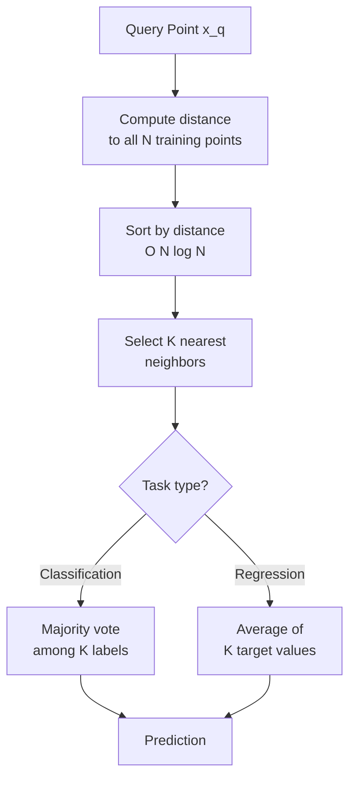

# 🏘️ K-Nearest Neighbors

> [!abstract] TL;DR
> KNN is the laziest ML algorithm: it memorizes the training set and at prediction time finds the K closest training points to the query, then returns the majority class (classification) or average (regression). There is no training phase. The cost is all paid at inference. KNN is intuitive, non-parametric, and surprisingly effective on small datasets, but breaks down in high dimensions (curse of dimensionality) and at large scale.

## Intuition — Analogy First

You move to a new city and want to know if a neighborhood restaurant is good. You don't read a guidebook — you just **ask the nearest neighbors** who live closest to you. If 4 out of 5 of your closest neighbors say it's great, you go. If you ask 50 neighbors instead of 5, you get a more stable opinion but may include people who live far away and have different tastes.

That's KNN:
- **K=1**: trust only your single closest neighbor — very noisy, can be wrong if that neighbor is unusual.
- **K=large**: average over many neighbors — smoother, but starts including irrelevant far-away examples.
- **Curse of dimensionality**: if your neighbors are defined by 1000 features (dimensions), "nearest" becomes meaningless — in high dimensions, everyone is roughly the same distance from everyone else.

## How It Works — Mechanics

**Training (offline):** Simply store all training examples $(x_i, y_i)$. No model fitting.

**Prediction (online):**
1. Compute distance from query point $x_q$ to every training point.
2. Select the $K$ points with smallest distance — these are the neighbors.
3. **Classification**: return the majority class among the $K$ neighbors (optionally weighted by $1/d$).
4. **Regression**: return the (weighted) average of the $K$ neighbors' target values.

**Distance metrics:**
- **Euclidean** (L2): $d = \sqrt{\sum(x_i - x_j)^2}$ — sensitive to scale, most common
- **Manhattan** (L1): $d = \sum|x_i - x_j|$ — more robust to outliers
- **Cosine**: $d = 1 - \frac{x \cdot y}{\|x\|\|y\|}$ — good for text/embeddings (direction matters, not magnitude)
- **Minkowski**: generalizes L1 and L2 with parameter $p$

**Choosing K:**
- Odd K for binary classification to break ties.
- Small K → high variance, complex boundary, can overfit.
- Large K → high bias, smooth boundary, underfits.
- Use cross-validation to select optimal K.

**Approximate Nearest Neighbor (ANN):**
For large-scale KNN (embeddings search, recommender systems), exact KNN is too slow. ANN algorithms (FAISS, HNSW, Annoy) trade a small accuracy loss for orders-of-magnitude speedup. See [[ANN_Algorithms]].



## The Math

**Euclidean distance** between points $x$ and $x'$ in $d$ dimensions:

$$d(x, x') = \sqrt{\sum_{j=1}^{d}(x_j - x'_j)^2}$$

**Weighted KNN prediction** (distance-weighted — closer neighbors vote more):

$$\hat{y} = \frac{\sum_{i \in N_K(x)} w_i y_i}{\sum_{i \in N_K(x)} w_i}, \quad w_i = \frac{1}{d(x, x_i)^2}$$

**Curse of dimensionality — volume intuition:**

In $d$ dimensions, the volume of a unit hypersphere is:
$$V_d = \frac{\pi^{d/2}}{\Gamma(d/2 + 1)}$$

As $d \to \infty$, almost all volume is concentrated near the surface. The fraction of data within any fixed radius $r$ of a query point shrinks exponentially — you need exponentially more data to maintain the same density. This is why KNN degrades as dimensionality grows.

**Bias-variance of K:**

$$\text{Bias} \propto K, \quad \text{Variance} \propto \frac{1}{K}$$

Optimal $K$ minimizes the total generalization error — found empirically via cross-validation.

## Code Demo

```python
from sklearn.neighbors import KNeighborsClassifier, KNeighborsRegressor
from sklearn.datasets import load_iris, load_diabetes
from sklearn.preprocessing import StandardScaler
from sklearn.model_selection import cross_val_score, StratifiedKFold
from sklearn.pipeline import Pipeline
import numpy as np
import matplotlib.pyplot as plt

# --- Classification: choosing K with cross-validation ---
X, y = load_iris(return_X_y=True)

# KNN requires feature scaling (Euclidean distance is scale-sensitive)
k_values = range(1, 31)
cv_scores = []

for k in k_values:
    pipe = Pipeline([
        ("scaler", StandardScaler()),
        ("knn", KNeighborsClassifier(n_neighbors=k, metric="euclidean")),
    ])
    scores = cross_val_score(
        pipe, X, y,
        cv=StratifiedKFold(n_splits=5, shuffle=True, random_state=42),
        scoring="accuracy",
    )
    cv_scores.append(scores.mean())

optimal_k = k_values[np.argmax(cv_scores)]
print(f"Optimal K: {optimal_k}, CV accuracy: {max(cv_scores):.4f}")

plt.plot(k_values, cv_scores, marker="o")
plt.axvline(optimal_k, color="r", linestyle="--", label=f"K={optimal_k}")
plt.xlabel("K"); plt.ylabel("CV Accuracy"); plt.title("KNN: K vs Accuracy")
plt.legend(); plt.show()

# --- Classification with best K ---
from sklearn.model_selection import train_test_split
X_train, X_test, y_train, y_test = train_test_split(
    X, y, test_size=0.2, random_state=42, stratify=y
)
best_pipe = Pipeline([
    ("scaler", StandardScaler()),
    ("knn", KNeighborsClassifier(
        n_neighbors=optimal_k,
        weights="distance",  # weight by inverse distance
        metric="euclidean",
    )),
])
best_pipe.fit(X_train, y_train)
print(f"Test accuracy: {best_pipe.score(X_test, y_test):.4f}")

# --- Regression ---
Xr, yr = load_diabetes(return_X_y=True)
reg_pipe = Pipeline([
    ("scaler", StandardScaler()),
    ("knn", KNeighborsRegressor(n_neighbors=10, weights="distance")),
])
from sklearn.model_selection import cross_val_score
r2_scores = cross_val_score(reg_pipe, Xr, yr, cv=5, scoring="r2")
print(f"KNN Regression R²: {r2_scores.mean():.3f} ± {r2_scores.std():.3f}")

# --- Demonstrating curse of dimensionality ---
for n_dims in [2, 10, 50, 100, 500]:
    data = np.random.randn(1000, n_dims)
    dists = np.sqrt(((data[0] - data[1:])**2).sum(axis=1))
    print(f"Dims={n_dims:4d}: mean dist={dists.mean():.2f}, std={dists.std():.2f}, "
          f"CV={dists.std()/dists.mean():.3f}")
# CV (coefficient of variation) shrinks → neighbors become indistinct
```

## Real-World Example

**User-user collaborative filtering** (early recommendation systems): Netflix's original recommender used a KNN-based approach — to recommend movies to user A, find the K most similar users (by cosine similarity on rating vectors), then recommend movies they rated highly that A hasn't seen. This was the dominant approach before matrix factorization and deep learning.

**Anomaly detection**: KNN distance to the Kth nearest neighbor is a simple but effective anomaly score. Points that are far from all their neighbors (large $d_K$) are anomalies. Used in fraud detection and network intrusion detection.

**Modern scale with ANN**: Semantic search (find the 5 most similar documents to this query) is KNN on embedding vectors. At production scale (millions of documents), FAISS (Facebook AI Similarity Search) uses inverted file indices and product quantization to answer KNN queries in milliseconds on 100M+ vectors.

## Trade-offs

| Dimension | KNN | Notes |
|---|---|---|
| Training time | O(1) — none | Just store the data |
| Inference time | O(N × d) | Scales linearly with training set size |
| Memory | O(N × d) | Must store entire training set |
| Accuracy on small data | Good | Non-parametric, adapts to data shape |
| High-dimensional data | Poor | Curse of dimensionality |
| Interpretability | High | Can show which neighbors drove prediction |
| Feature scaling | Required | Euclidean/Manhattan are scale-sensitive |
| Missing values | Manual handling | Distance undefined for missing features |

## When to Use vs Avoid

**Use when:**
- Small dataset (< 50K samples) where inference speed is acceptable
- Baseline model or sanity check before complex models
- Anomaly detection (KNN distance as anomaly score)
- Recommendation systems (with ANN for scale)
- The decision boundary is highly non-linear and irregular

**Avoid when:**
- Large datasets (inference is too slow without ANN indexing)
- High-dimensional features (> 50 dims) without dimensionality reduction first
- Real-time low-latency inference without ANN infrastructure
- Features have many missing values (distance computation breaks)

## Common Pitfalls

1. **Forgetting to scale features**: Euclidean distance is dominated by features with large ranges. `StandardScaler` is mandatory unless you know all features are on the same scale.
2. **Even K for binary classification**: Even K can cause ties. Use odd K for binary problems.
3. **Not tuning K**: K=5 is a default, not a rule. Always cross-validate K on your specific dataset.
4. **Using Euclidean distance on text/embeddings**: For high-dimensional embeddings, cosine similarity is more meaningful than Euclidean distance. Set `metric='cosine'` in sklearn.
5. **Applying KNN to raw high-dimensional data**: Apply PCA or UMAP to reduce dimensions before KNN in high-dimensional settings (images, text as bag-of-words).
6. **Ignoring inference latency**: KNN on 1M training points means 1M distance computations per query. Profile your inference budget before deploying.

## Related Concepts

- [[_MOC_Classical_ML|↑ Section MOC]]

- [[Bias_Variance_Tradeoff]] — K directly controls the bias-variance trade-off
- [[Cross_Validation]] — essential for choosing K
- [[ANN_Algorithms]] — FAISS, HNSW for production-scale KNN
- [[Feature_Engineering]] — dimensionality reduction is often a prerequisite
- [[Curse_of_Dimensionality]] — the fundamental limitation of KNN

## Review Questions

1. Why must you scale features before applying KNN, but you do not need to scale features for a decision tree? Connect the answer to the distance metric.
2. As you increase K from 1 to N (all training points), how does bias change? How does variance change? What prediction does K=N produce for binary classification?
3. You have a semantic search system that must find the 10 most similar documents (from 50M) to any query in under 50ms. Plain KNN takes 30 seconds. What class of algorithms solves this, and what accuracy trade-off do they make?

## Sources

- Cover, T., & Hart, P. (1967). *Nearest neighbor pattern classification*. IEEE Transactions on Information Theory, 13(1), 21–27.
- Hastie, T., Tibshirani, R., & Friedman, J. (2009). *The Elements of Statistical Learning*, Ch. 13. https://hastie.su.domains/ElemStatLearn/
- scikit-learn KNN documentation: https://scikit-learn.org/stable/modules/neighbors.html

#knn #k-nearest-neighbors #instance-based #lazy-learning #supervised-learning #recommendation
