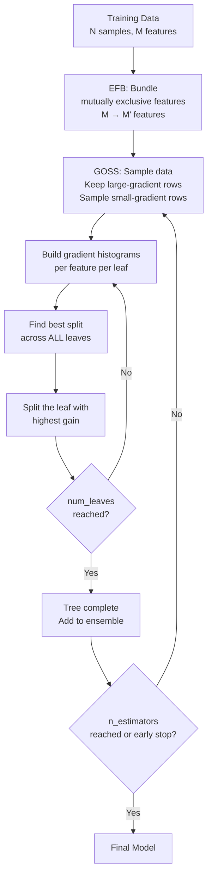

# 🚀 LightGBM

> [!abstract] TL;DR
> LightGBM is Microsoft's gradient boosting framework that achieves dramatically faster training than XGBoost through two innovations: **GOSS** (samples only high-gradient data points) and **EFB** (bundles mutually exclusive sparse features). It grows trees **leaf-wise** instead of level-wise, achieving lower loss faster but requiring careful depth control to avoid overfitting.

## Intuition — Analogy First

Imagine two gardeners trimming a hedge:

- **XGBoost** is methodical — it trims the *entire* hedge level by level, making sure every branch at the same height gets attention before moving deeper.
- **LightGBM** is opportunistic — it finds the *single leaf with the most untrimmed growth* and attacks that first, then the next worst leaf, and so on. It gets the shape right faster, but can create a lopsided hedge if left unchecked (hence `num_leaves` and `min_data_in_leaf` constraints).

For the data side: instead of sweating over every training sample equally, LightGBM focuses on the "hard" samples — those with large gradients (high residual error) — and only uses a random fraction of the "easy" ones. This is GOSS. For features: if feature A and feature B are never both non-zero at the same time (mutually exclusive in a sparse dataset), LightGBM bundles them into one feature slot. This is EFB. Together, these tricks let LightGBM train 10–20x faster than XGBoost on large datasets.

## How It Works — Mechanics

**Leaf-wise tree growth:**
- At each split step, find the leaf with the highest gain across the *entire* current tree.
- Expand only that leaf (as opposed to all leaves at the same depth).
- Control complexity via `num_leaves` (max leaves across the whole tree), not `max_depth`.

**GOSS (Gradient-based One-Side Sampling):**
- Sort samples by absolute gradient magnitude.
- Keep all top-a% (large gradient) samples.
- Randomly sample b% from the remaining small-gradient samples.
- Reweight the small-gradient samples by factor `(1-a)/b` to correct for sampling bias.
- Net effect: trains on ~20-40% of data but approximates the full gradient statistics.

**EFB (Exclusive Feature Bundling):**
- Build a conflict graph: two features conflict if they are non-zero simultaneously.
- Find near-optimal bundles (greedy graph coloring) of non-conflicting features.
- Merge each bundle into a single feature by offsetting value ranges.
- Reduces effective feature count, speeding up histogram construction.

**Histogram-based split finding:**
- Bin continuous features into discrete buckets (default 255 bins).
- Build histograms of gradient/hessian sums per bin — O(data) once, then O(bins) per split.
- For a child node, compute its histogram as: parent histogram − sibling histogram (saves half the work).



## The Math

**GOSS corrected gradient for split gain:**

Let $A$ = large-gradient sample set, $B$ = sampled small-gradient set, $n$ = total samples.

The estimated split gain becomes:

$$\tilde{V}_j(d) = \frac{1}{n}\left(\frac{\left(\sum_{x_i \in A_L} g_i + \frac{1-a}{b}\sum_{x_i \in B_L} g_i\right)^2}{n_l^j} + \frac{\left(\sum_{x_i \in A_R} g_i + \frac{1-a}{b}\sum_{x_i \in B_R} g_i\right)^2}{n_r^j}\right)$$

The reweighting factor $\frac{1-a}{b}$ inflates the sampled small-gradient contributions to approximate the full data distribution.

**Leaf-wise vs level-wise complexity:**

For a model with $L$ leaves, level-wise requires depth $d = \lceil\log_2 L\rceil$, forcing a complete binary tree at each level. Leaf-wise can reach $L$ leaves with an asymmetric tree that concentrates capacity where it matters most, achieving lower training loss with the same number of leaves.

## Code Demo

```python
import lightgbm as lgb
from sklearn.datasets import load_breast_cancer
from sklearn.model_selection import train_test_split
from sklearn.metrics import roc_auc_score
import pandas as pd
import numpy as np

# --- Basic classification ---
X, y = load_breast_cancer(return_X_y=True)
X_train, X_test, y_train, y_test = train_test_split(
    X, y, test_size=0.2, random_state=42, stratify=y
)
X_tr, X_val, y_tr, y_val = train_test_split(
    X_train, y_train, test_size=0.15, random_state=42, stratify=y_train
)

model = lgb.LGBMClassifier(
    n_estimators=2000,
    learning_rate=0.05,
    num_leaves=31,          # PRIMARY complexity knob — not max_depth
    min_data_in_leaf=20,    # min samples per leaf — prevents overfitting
    feature_fraction=0.8,   # colsample equivalent
    bagging_fraction=0.8,   # row subsampling
    bagging_freq=5,
    reg_alpha=0.1,          # L1
    reg_lambda=0.1,         # L2
    random_state=42,
)

callbacks = [lgb.early_stopping(50), lgb.log_evaluation(0)]
model.fit(
    X_tr, y_tr,
    eval_set=[(X_val, y_val)],
    callbacks=callbacks,
)
print(f"Test AUC: {roc_auc_score(y_test, model.predict_proba(X_test)[:,1]):.4f}")
print(f"Best iteration: {model.best_iteration_}")

# --- Native categorical feature handling ---
# LightGBM handles categoricals without OHE when using Dataset API
df = pd.DataFrame(X_train, columns=[f"f{i}" for i in range(X_train.shape[1])])
df["cat_feature"] = np.random.choice(["A", "B", "C"], size=len(df))
df["cat_feature"] = df["cat_feature"].astype("category")

dtrain = lgb.Dataset(df, label=y_train, categorical_feature=["cat_feature"])
dval   = lgb.Dataset(
    pd.DataFrame(X_val, columns=[f"f{i}" for i in range(X_val.shape[1])]),
    label=y_val, reference=dtrain
)

params = {
    "objective": "binary", "metric": "auc",
    "learning_rate": 0.05, "num_leaves": 31,
    "verbose": -1,
}
bst = lgb.train(
    params, dtrain,
    num_boost_round=2000,
    valid_sets=[dval],
    callbacks=[lgb.early_stopping(50), lgb.log_evaluation(0)],
)

# Feature importance
lgb.plot_importance(bst, max_num_features=10, importance_type="gain")
```

## Real-World Example

**Microsoft Bing search ranking**: LightGBM was designed at Microsoft Research explicitly for Bing's ranking problem — billions of query-document pairs, hundreds of features, needing daily retraining. XGBoost was taking hours; LightGBM reduced that to minutes.

In public benchmarks (Higgs boson dataset, 10M rows, 28 features), LightGBM trains roughly **10x faster** than XGBoost with comparable or better accuracy. For datasets above ~500K rows, LightGBM is almost universally preferred over XGBoost due to training time alone.

## Trade-offs

| Dimension | LightGBM | vs XGBoost |
|---|---|---|
| Training speed | Fastest (GOSS + EFB + histograms) | ~10x faster on large data |
| Memory usage | Low (histogram-based) | Lower than XGBoost |
| Accuracy | Comparable or better | Often slightly better on large data |
| Small datasets | Can overfit | XGBoost safer with small N |
| Categorical features | Native support | XGBoost requires encoding |
| Interpretability | Good (SHAP built-in) | Comparable |
| Hyperparameter sensitivity | High (num_leaves is critical) | Different but comparable |
| GPU support | Yes | Yes |

## When to Use vs Avoid

**Use when:**
- Dataset has 500K+ rows (training speed payoff dominates)
- You have high-cardinality categorical features (native handling)
- Memory is constrained (histogram binning reduces memory)
- Competitive benchmarking or production ML pipelines requiring fast iteration

**Avoid when:**
- Dataset is small (< 10K rows) — leaf-wise growth overfits aggressively; use XGBoost or CatBoost
- You need exact reproducibility across platforms — GOSS sampling adds randomness
- You are not careful about `num_leaves` and `min_data_in_leaf` — the model will memorize

## Common Pitfalls

1. **Treating `num_leaves` like `max_depth`**: In level-wise (XGBoost), `max_depth=6` gives at most 64 leaves. In LightGBM, `num_leaves=64` is the direct control. Setting `num_leaves` too high (e.g., 255) with small data guarantees overfitting.
2. **Ignoring `min_data_in_leaf`**: Default is 20, which is reasonable, but on small datasets you want this higher (100+) to prevent single-sample leaves.
3. **Wrong `categorical_feature` specification**: Passing column indices vs names inconsistently. Always verify with `model.dump_model()` or check encoding in the Dataset object.
4. **Not setting `bagging_freq`**: `bagging_fraction < 1.0` has no effect unless `bagging_freq > 0`. Always set them together.
5. **Skipping GOSS tuning**: Default GOSS settings work well, but for very noisy data increasing the large-gradient fraction (`top_rate`) improves stability.

## Related Concepts

- [[_MOC_Classical_ML|↑ Section MOC]]

- [[XGBoost]] — level-wise alternative; better for small datasets
- [[Gradient_Boosting]] — the foundational algorithm
- [[Feature_Engineering]] — LightGBM's native categoricals reduce FE burden
- [[Hyperparameter_Tuning]] — `num_leaves`, `min_data_in_leaf`, `learning_rate` are the key knobs
- [[Bias_Variance_Tradeoff]] — leaf-wise growth has higher variance; `num_leaves` controls it

## Review Questions

1. Why does leaf-wise tree growth find lower training loss faster than level-wise growth given the same number of leaves, and what risk does this create?
2. Explain GOSS: which samples does it keep vs sample, and why is the reweighting factor `(1-a)/b` necessary for unbiased gradient estimation?
3. You have a dataset with 10 million rows and 50 features, 8 of which are high-cardinality categoricals. Make the case for LightGBM over XGBoost and list the key hyperparameters you would tune first.

## Sources

- Ke, G., et al. (2017). *LightGBM: A Highly Efficient Gradient Boosting Decision Tree*. NeurIPS 2017. https://papers.nips.cc/paper/2017/hash/6449f44a102fde848669bdd9eb6b76fa-Abstract.html
- LightGBM Documentation: https://lightgbm.readthedocs.io
- Microsoft Research Blog: https://www.microsoft.com/en-us/research/project/lightgbm/

#lightgbm #boosting #ensemble #gradient-boosting #tabular-data #supervised-learning #microsoft
