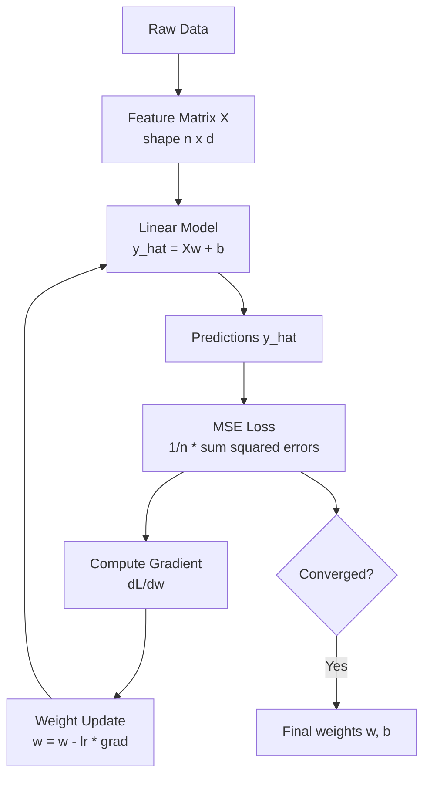

# 📈 Linear Regression

> [!abstract] TL;DR
> Linear regression finds the straight line (or hyperplane) that best fits a set of data points by minimizing the mean squared error between predictions and true values, solvable in closed form or iteratively with gradient descent.

---

## Intuition — Analogy First

Imagine stretching a rubber band across a scatter plot of points on graph paper. The rubber band wants to minimize its total tension — it snaps to the position that is, on average, as close as possible to all the points at once. That is linear regression: the line is the rubber band, and the tension at each point is the squared distance from the line to that point. The model finds the position where the total tension (total squared error) is minimized.

Adding more features (square footage, number of rooms, neighborhood) is like upgrading from a 2-D scatter plot to a high-dimensional space — the "line" becomes a hyperplane, but the rubber-band intuition holds.

---

## How It Works — Mechanics

The model predicts a continuous value as a weighted sum of input features plus a bias:

$$\hat{y} = w_1 x_1 + w_2 x_2 + \cdots + w_d x_d + b = \mathbf{w}^\top \mathbf{x} + b$$

Training means finding the weights $\mathbf{w}$ and bias $b$ that minimize the **Mean Squared Error (MSE)** over all $n$ training examples.

Two solution strategies:

| Strategy | When to use | Complexity |
|---|---|---|
| **Normal Equation** | Small datasets ($n < 10^4$, $d < 10^3$) | $O(d^3)$ one-shot |
| **Gradient Descent** | Large datasets, online learning | $O(n \cdot d)$ per epoch |

### Full Pipeline



### Key Assumptions

1. **Linearity** — relationship between features and target is linear.
2. **Independence** — residuals are uncorrelated (no autocorrelation).
3. **Homoscedasticity** — variance of residuals is constant across all levels of predictors.
4. **No multicollinearity** — features are not near-perfectly correlated with each other.
5. **Normally distributed residuals** — required for valid confidence intervals (not for point estimates).

---

## The Math

### MSE Loss

$$\mathcal{L}(\mathbf{w}, b) = \frac{1}{n} \sum_{i=1}^{n} (\hat{y}_i - y_i)^2 = \frac{1}{n} \|\mathbf{X}\mathbf{w} - \mathbf{y}\|^2$$

where $\mathbf{X} \in \mathbb{R}^{n \times (d+1)}$ includes the bias column of ones.

### Normal Equation (Closed-Form Solution)

Setting the gradient to zero and solving directly:

$$\nabla_\mathbf{w} \mathcal{L} = \frac{2}{n}\mathbf{X}^\top(\mathbf{X}\mathbf{w} - \mathbf{y}) = 0$$

$$\Rightarrow \quad \hat{\mathbf{w}} = (\mathbf{X}^\top \mathbf{X})^{-1} \mathbf{X}^\top \mathbf{y}$$

This is the **Normal Equation**. It requires $\mathbf{X}^\top\mathbf{X}$ to be invertible (full column rank — hence the no-multicollinearity assumption). In practice, `np.linalg.lstsq` solves this via SVD, which is numerically more stable than direct inversion.

### Gradient Descent Update

$$\mathbf{w} \leftarrow \mathbf{w} - \eta \cdot \nabla_\mathbf{w} \mathcal{L} = \mathbf{w} - \frac{2\eta}{n} \mathbf{X}^\top (\mathbf{X}\mathbf{w} - \mathbf{y})$$

where $\eta$ is the **learning rate**.

### Evaluation Metrics

$$R^2 = 1 - \frac{\text{SS}_\text{res}}{\text{SS}_\text{tot}} = 1 - \frac{\sum(y_i - \hat{y}_i)^2}{\sum(y_i - \bar{y})^2}$$

$$\text{Adjusted } R^2 = 1 - (1 - R^2)\frac{n-1}{n-d-1}$$

$R^2$ measures the proportion of variance explained. Adjusted $R^2$ penalizes for adding useless features.

---

## Code Demo

### scikit-learn: Fit and Evaluate

```python
import numpy as np
from sklearn.linear_model import LinearRegression
from sklearn.model_selection import train_test_split
from sklearn.metrics import mean_squared_error, r2_score

# Synthetic data: house price ~ size + rooms + noise
np.random.seed(42)
n = 500
size   = np.random.uniform(500, 3000, n)
rooms  = np.random.randint(1, 6, n).astype(float)
price  = 150 * size + 20000 * rooms + np.random.normal(0, 15000, n)

X = np.column_stack([size, rooms])
y = price

X_train, X_test, y_train, y_test = train_test_split(
    X, y, test_size=0.2, random_state=42
)

model = LinearRegression()
model.fit(X_train, y_train)
y_pred = model.predict(X_test)

print(f"Coefficients:  {model.coef_}")       # [~150, ~20000]
print(f"Intercept:     {model.intercept_:.0f}")
print(f"MSE:           {mean_squared_error(y_test, y_pred):.0f}")
print(f"RMSE:          {mean_squared_error(y_test, y_pred, squared=False):.0f}")
print(f"R²:            {r2_score(y_test, y_pred):.4f}")
```

### Manual Gradient Descent

```python
import numpy as np

def mse_loss(X: np.ndarray, y: np.ndarray, w: np.ndarray) -> float:
    """MSE loss given design matrix X (includes bias col), targets y, weights w."""
    residuals = X @ w - y
    return (residuals ** 2).mean()

def gradient(X: np.ndarray, y: np.ndarray, w: np.ndarray) -> np.ndarray:
    """Gradient of MSE w.r.t. weights."""
    residuals = X @ w - y
    return (2 / len(y)) * (X.T @ residuals)

def linear_regression_gd(
    X: np.ndarray,
    y: np.ndarray,
    lr: float = 1e-7,
    epochs: int = 1000,
) -> np.ndarray:
    # Add bias column
    X_b = np.column_stack([np.ones(len(X)), X])
    w = np.zeros(X_b.shape[1])

    for epoch in range(epochs):
        w -= lr * gradient(X_b, y, w)
        if epoch % 100 == 0:
            print(f"Epoch {epoch:4d}  Loss: {mse_loss(X_b, y, w):.2f}")

    return w

# Run
np.random.seed(0)
X_raw = np.random.randn(200, 2)
true_w = np.array([3.0, -1.5])
y_raw  = X_raw @ true_w + 2.0 + np.random.randn(200) * 0.5

w_fitted = linear_regression_gd(X_raw, y_raw, lr=1e-2, epochs=500)
print(f"Learned weights: {w_fitted}")  # close to [2.0, 3.0, -1.5]
```

### Normal Equation (NumPy)

```python
def normal_equation(X: np.ndarray, y: np.ndarray) -> np.ndarray:
    """Closed-form solution via pseudoinverse (numerically stable)."""
    X_b = np.column_stack([np.ones(len(X)), X])
    # lstsq uses SVD — more stable than direct inversion
    w, residuals, rank, sv = np.linalg.lstsq(X_b, y, rcond=None)
    return w

w_exact = normal_equation(X_raw, y_raw)
print(f"Normal equation weights: {w_exact}")  # [~2.0, ~3.0, ~-1.5]
```

---

## Real-World Example

**Ad Revenue Forecasting at Google.** Linear regression (and its regularized variants, Ridge and Lasso) underlies many production revenue-forecasting systems. The feature matrix includes seasonality indicators, historical CTR, advertiser budget signals, and macro-economic features. Linear models are preferred for interpretability (regulators and finance teams can audit coefficients directly), speed of retraining, and robustness under distribution shift — the model degrades gracefully rather than catastrophically when a feature drifts.

Similarly, Zillow's early **Zestimate** home-pricing model was built on linear regression over engineered features (size, zip code dummies, year built, recent sales). The interpretable coefficients — "each additional square foot adds $X" — were a product requirement, not just a technical choice.

---

## Trade-offs

| Aspect | Linear Regression | Pros | Cons |
|---|---|---|---|
| Interpretability | Very high | Coefficients are meaningful | — |
| Training speed | Very fast (closed form) | Scales to $10^6$ features with SGD | $O(d^3)$ for Normal Equation |
| Prediction speed | Very fast ($O(d)$) | Production-friendly | — |
| Expressiveness | Low | — | Cannot model non-linear patterns |
| Robustness to outliers | Low | — | MSE heavily penalizes outliers |
| Assumptions | Strict | — | Violated → biased/unreliable estimates |

---

## When to Use vs Avoid

**Use when:**
- Target is continuous and the relationship is approximately linear
- Interpretability is required (finance, healthcare, legal)
- Baseline model — always start here before complex models
- Features are already well-engineered and normalized

**Avoid when:**
- Target-feature relationship is clearly non-linear
- Features have high multicollinearity without regularization (use Ridge)
- Dataset has many outliers and robustness matters (use Huber loss)
- Target is categorical (use Logistic Regression or tree models)

---

## Common Pitfalls

1. **Not scaling features.** Gradient descent will converge extremely slowly (or not at all) if features are on different scales. Always standardize (`StandardScaler`) before fitting.

2. **Ignoring multicollinearity.** Correlated features make coefficients unstable and uninterpretable. Check the Variance Inflation Factor (VIF) and use Ridge regression if needed.

3. **Using $R^2$ alone.** A high $R^2$ can coexist with terrible out-of-sample performance. Always report test-set RMSE or use cross-validation.

4. **Forgetting the bias term.** Fitting without an intercept forces the hyperplane through the origin — almost never correct.

5. **Assuming residuals are normally distributed without checking.** Plot residuals vs fitted values; if there's a pattern (funnel shape, curve), the linear model is misspecified.

6. **Treating the Normal Equation as always better.** For $d > 10^4$ features, inverting $\mathbf{X}^\top\mathbf{X}$ is prohibitively expensive — use gradient descent.

---

## Related Concepts

- [[_MOC_Classical_ML|↑ Section MOC]]

- [[Logistic_Regression]] — classification counterpart using a sigmoid output
- [[Regularization]] — Ridge (L2) and Lasso (L1) prevent overfitting
- [[Feature_Engineering]] — polynomial features extend linear models
- [[Calculus_for_ML]] — the gradient derivation in depth
- [[Gradient_Descent]] — optimization algorithm used when Normal Equation is too costly

---

## Review Questions

1. **Scenario:** You train a linear regression model on housing data and get a training $R^2$ of 0.97 but a test $R^2$ of 0.42. The feature matrix includes `price_per_sqft` which is computed directly from `price` (the target). What went wrong, and how would you fix it?

2. **Scenario:** A colleague argues that since the Normal Equation gives the exact optimal solution, there is never a reason to use gradient descent for linear regression. Under what conditions is gradient descent preferable, and why?

3. **Scenario:** You are predicting loan default amounts (a continuous value). Your residual plot shows that errors are much larger for large loans than small ones (funnel shape). Which assumption of linear regression is violated, and what transformations or model changes would you consider?

---

## Sources

- Bishop, C. M. — *Pattern Recognition and Machine Learning*, Chapter 3 (Springer, 2006)
- Géron, A. — *Hands-On Machine Learning with Scikit-Learn, Keras & TensorFlow*, Chapter 4 (3rd ed., O'Reilly, 2022)
- scikit-learn documentation — [LinearRegression](https://scikit-learn.org/stable/modules/generated/sklearn.linear_model.LinearRegression.html)
- James et al. — *An Introduction to Statistical Learning*, Chapter 3 (2nd ed., Springer, 2021)

---

#linear-regression #supervised-learning #regression #gradient-descent #mse #normal-equation #beginner
