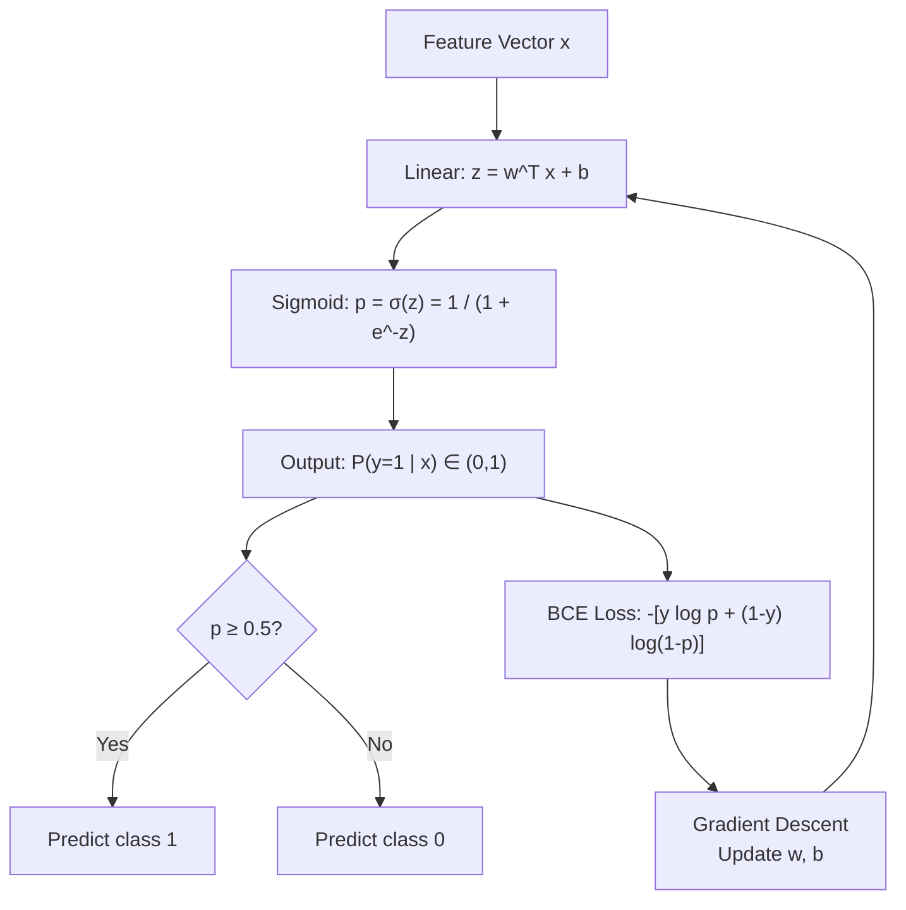

# 🚦 Logistic Regression

> [!abstract] TL;DR
> Logistic regression squashes a linear combination of features through a sigmoid function to output a probability, then trains by minimizing binary cross-entropy — making it the canonical baseline for binary classification.

---

## Intuition — Analogy First

Imagine a nightclub bouncer with a scoring sheet. For every person in the queue, the bouncer adds up a weighted score: +5 for wearing the right shoes, -3 for being too young, +2 for being on the VIP list. The raw score could be anything from $-\infty$ to $+\infty$.

But the bouncer's answer is a probability — "70% chance they get in" — not a raw number. The **sigmoid function** is the bouncer's mental transformation: it takes the raw score, no matter how extreme, and squashes it into the range $(0, 1)$. Below some threshold probability (e.g., 0.5), the person is turned away; above it, they get in.

The decision boundary — the exact combination of features where probability equals 0.5 — is a straight line (or hyperplane in higher dimensions). This is why logistic regression is a **linear classifier**, even though it uses a nonlinear output function.

---

## How It Works — Mechanics

### Pipeline



### Key Concepts

| Concept | Description |
|---|---|
| Sigmoid $\sigma(z)$ | Squashes $z \in \mathbb{R}$ → probability $\in (0,1)$ |
| Logit | Inverse sigmoid: $\log \frac{p}{1-p}$ — the log-odds |
| Decision boundary | Hyperplane where $z = 0$ (i.e., $p = 0.5$) |
| BCE Loss | Convex loss function with nice gradient properties |
| Multi-class extension | Softmax replaces sigmoid; Categorical Cross-Entropy replaces BCE |

### Multi-Class with Softmax

For $K$ classes, replace sigmoid with softmax:

$$P(y = k \mid \mathbf{x}) = \frac{e^{z_k}}{\sum_{j=1}^{K} e^{z_j}}$$

Outputs sum to 1 and represent a probability distribution over classes.

---

## The Math

### Sigmoid Function

$$\sigma(z) = \frac{1}{1 + e^{-z}}$$

**Key properties:**
- $\sigma(0) = 0.5$
- $\sigma(-\infty) = 0$, $\sigma(+\infty) = 1$
- Derivative: $\sigma'(z) = \sigma(z)(1 - \sigma(z))$ — elegant and useful for backprop

### Probability Model

$$P(y = 1 \mid \mathbf{x}) = \sigma(\mathbf{w}^\top\mathbf{x} + b)$$

$$P(y = 0 \mid \mathbf{x}) = 1 - \sigma(\mathbf{w}^\top\mathbf{x} + b)$$

### Binary Cross-Entropy (BCE) Loss

For $n$ examples, the log-likelihood of the data under the model is:

$$\mathcal{L}(\mathbf{w}, b) = -\frac{1}{n}\sum_{i=1}^{n}\left[y_i \log(\hat{p}_i) + (1-y_i)\log(1-\hat{p}_i)\right]$$

where $\hat{p}_i = \sigma(\mathbf{w}^\top \mathbf{x}_i + b)$.

**Why BCE and not MSE?** With MSE + sigmoid, the loss surface has many saddle points (non-convex). BCE gives a **convex** loss, guaranteeing a unique global minimum.

### Gradient of BCE w.r.t. Weights

$$\frac{\partial \mathcal{L}}{\partial \mathbf{w}} = \frac{1}{n} \sum_{i=1}^{n} (\hat{p}_i - y_i) \mathbf{x}_i = \frac{1}{n} \mathbf{X}^\top (\hat{\mathbf{p}} - \mathbf{y})$$

The gradient is beautifully simple: it is the weighted sum of input features, with the weight being the prediction error $(\hat{p} - y)$.

### Categorical Cross-Entropy (Multi-Class)

$$\mathcal{L} = -\frac{1}{n}\sum_{i=1}^{n}\sum_{k=1}^{K} y_{ik} \log \hat{p}_{ik}$$

where $y_{ik} = 1$ if example $i$ belongs to class $k$ (one-hot encoding).

---

## Code Demo

### scikit-learn: Binary and Multi-Class

```python
import numpy as np
from sklearn.linear_model import LogisticRegression
from sklearn.datasets import make_classification, load_iris
from sklearn.model_selection import train_test_split
from sklearn.metrics import classification_report, roc_auc_score

# --- Binary classification ---
X, y = make_classification(
    n_samples=1000, n_features=10, n_informative=5,
    n_redundant=2, random_state=42
)
X_train, X_test, y_train, y_test = train_test_split(
    X, y, test_size=0.2, random_state=42
)

clf = LogisticRegression(max_iter=1000, C=1.0, random_state=42)
clf.fit(X_train, y_train)

y_pred  = clf.predict(X_test)
y_proba = clf.predict_proba(X_test)[:, 1]  # P(y=1)

print(classification_report(y_test, y_pred))
print(f"ROC-AUC: {roc_auc_score(y_test, y_proba):.4f}")

# --- Multi-class (Iris, softmax) ---
iris = load_iris()
X_mc, y_mc = iris.data, iris.target

clf_mc = LogisticRegression(
    multi_class='multinomial',   # softmax
    solver='lbfgs',
    max_iter=200,
    random_state=42
)
clf_mc.fit(X_mc, y_mc)
print(f"Iris accuracy: {clf_mc.score(X_mc, y_mc):.4f}")
```

### Manual Sigmoid + BCE

```python
import numpy as np

def sigmoid(z: np.ndarray) -> np.ndarray:
    return 1.0 / (1.0 + np.exp(-z))

def bce_loss(y_true: np.ndarray, y_pred: np.ndarray, eps: float = 1e-12) -> float:
    """Binary cross-entropy. eps prevents log(0)."""
    y_pred = np.clip(y_pred, eps, 1 - eps)
    return -np.mean(y_true * np.log(y_pred) + (1 - y_true) * np.log(1 - y_pred))

def logistic_regression_gd(
    X: np.ndarray,
    y: np.ndarray,
    lr: float = 0.1,
    epochs: int = 500,
) -> tuple[np.ndarray, float]:
    n, d = X.shape
    w = np.zeros(d)
    b = 0.0

    for epoch in range(epochs):
        z    = X @ w + b
        p    = sigmoid(z)
        err  = p - y
        dw   = (X.T @ err) / n
        db   = err.mean()
        w   -= lr * dw
        b   -= lr * db

        if epoch % 100 == 0:
            loss = bce_loss(y, p)
            print(f"Epoch {epoch:4d}  BCE Loss: {loss:.4f}")

    return w, b

# Synthetic fraud data
np.random.seed(42)
X_demo = np.random.randn(500, 5)
true_w = np.array([1.5, -2.0, 0.5, 0.0, 1.0])
y_demo = (sigmoid(X_demo @ true_w) > 0.5).astype(float)

w_fit, b_fit = logistic_regression_gd(X_demo, y_demo, lr=0.1, epochs=500)
preds = (sigmoid(X_demo @ w_fit + b_fit) >= 0.5).astype(int)
print(f"Train accuracy: {(preds == y_demo).mean():.4f}")
```

---

## Real-World Example

**Credit Card Fraud Detection at Stripe and PayPal.** Logistic regression remains a key component of fraud detection pipelines — not because it is the most powerful model, but because it is:

1. **Interpretable**: risk teams and regulators need to understand *why* a transaction was flagged.
2. **Fast**: scoring millions of transactions per second at inference — a sigmoid evaluation is $O(d)$.
3. **Calibrated**: the output is a true probability, enabling downstream threshold tuning (catching 99% of fraud at the cost of X% false positives).

The probability output is particularly valuable: rather than a binary "fraud/not-fraud" label, logistic regression gives a risk score that lets the system take graduated actions (auto-decline vs. require MFA vs. flag for manual review).

**Email spam detection** in Gmail's early filters was also driven by logistic regression over bag-of-words features — predating deep learning era spam filters.

---

## Trade-offs

| Aspect | Logistic Regression | Decision Trees | SVM |
|---|---|---|---|
| Decision boundary | Linear only | Non-linear | Non-linear (kernels) |
| Probability outputs | Yes (calibrated) | No (requires Platt scaling) | No (requires calibration) |
| Interpretability | High | High | Low |
| Training speed | Fast | Fast | Slow for large $n$ |
| Performance (complex patterns) | Low | Medium | Medium |
| Handles multicollinearity | Poorly | Fine | Fine |

---

## When to Use vs Avoid

**Use when:**
- Binary or multi-class classification with interpretability requirements
- Probability estimates are needed (risk scoring, ranking)
- Baseline model before trying tree models or neural networks
- Dataset is linearly separable or close to it
- Fast inference is required

**Avoid when:**
- Decision boundary is non-linear (use kernel SVM, trees, or neural nets)
- Features have complex interactions not captured by linear combinations
- Very high-dimensional sparse data with many irrelevant features (Naive Bayes may outperform)

---

## Common Pitfalls

1. **Not scaling features.** Logistic regression with gradient descent converges slowly with unscaled features. Always apply `StandardScaler`.

2. **Ignoring class imbalance.** On heavily imbalanced data (1% fraud), a model that always predicts "not fraud" gets 99% accuracy. Use `class_weight='balanced'`, SMOTE, or adjust the decision threshold.

3. **Using MSE instead of BCE.** MSE with a sigmoid output creates a non-convex loss landscape. BCE is the correct loss for probabilistic binary classification.

4. **Interpreting coefficients without standardization.** Raw coefficients are not comparable across features with different scales. Standardize first if you want to rank feature importance.

5. **Perfect separation problem.** If one feature perfectly predicts the target, maximum likelihood has no finite solution — coefficients diverge. Regularization (L2) fixes this.

6. **Treating logistic regression as "just for binary".** With `multi_class='multinomial'` and softmax, it handles multi-class natively and is a precursor to the final classification layer of every neural network.

---

## Related Concepts

- [[_MOC_Classical_ML|↑ Section MOC]]

- [[Linear_Regression]] — the regression counterpart; same linear combination, different output function
- [[Classification_Metrics]] — accuracy, precision, recall, F1, ROC-AUC for evaluating classifiers
- [[Information_Theory]] — cross-entropy loss derives from information theory (KL divergence)
- [[Softmax_and_Sigmoid]] — generalizations to multi-class and neural network outputs
- [[Regularization]] — L1/L2 regularization applied to logistic regression (Lasso/Ridge Logistic)

---

## Review Questions

1. **Scenario:** You train a logistic regression model on a credit fraud dataset (2% positive class) and get 98% accuracy. Your manager is impressed. What critical metrics are you missing, and how would you reframe the evaluation to show whether the model is actually useful?

2. **Scenario:** A junior engineer proposes training logistic regression with MSE loss because "it worked for linear regression." Explain why this is problematic using the loss landscape and gradient flow arguments.

3. **Scenario:** You have a 10-class classification problem (handwritten digits). How would you extend binary logistic regression to handle this? Write out the output layer computation and the corresponding loss function.

---

## Sources

- Bishop, C. M. — *Pattern Recognition and Machine Learning*, Chapter 4 (Springer, 2006)
- Géron, A. — *Hands-On Machine Learning with Scikit-Learn, Keras & TensorFlow*, Chapter 4 (3rd ed., O'Reilly, 2022)
- scikit-learn documentation — [LogisticRegression](https://scikit-learn.org/stable/modules/generated/sklearn.linear_model.LogisticRegression.html)
- James et al. — *An Introduction to Statistical Learning*, Chapter 4 (2nd ed., Springer, 2021)
- Murphy, K. P. — *Probabilistic Machine Learning: An Introduction*, Chapter 10 (MIT Press, 2022)

---

#logistic-regression #classification #sigmoid #cross-entropy #supervised-learning #beginner
