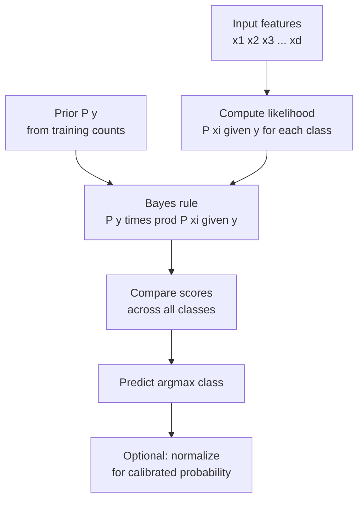

# 🔬 Naive Bayes

> [!abstract] TL;DR
> Naive Bayes applies Bayes' theorem to classification by assuming that all features are **conditionally independent** given the class label — the "naive" assumption. Despite this often-wrong assumption, it works surprisingly well in practice (especially for text), trains instantly, requires minimal data, and scales to millions of samples. It is a strong baseline and still used in production spam filters today.

## Intuition — Analogy First

Imagine a doctor diagnosing a patient with three symptoms: fever, cough, and fatigue. A **naive** doctor treats each symptom as if it gives independent evidence about the disease — they compute the probability that each symptom appears given each disease, multiply those probabilities, and pick the most likely disease. The doctor ignores that fever and fatigue often co-occur (correlated symptoms).

This is Naive Bayes: it evaluates each feature independently, multiplies the individual likelihoods, and combines them with the prior probability of each class. It's naive because features in the real world are never truly independent, but in practice the **rankings** between classes are often preserved despite the wrong absolute probabilities.

The payoff: because we only need to store $P(x_i | y)$ for each feature-class pair (not all joint combinations), the model is tiny, fast, and works with little data.

## How It Works — Mechanics

**Bayes' theorem applied to classification:**

$$P(y | x) = \frac{P(y) \cdot P(x | y)}{P(x)}$$

Since $P(x)$ is constant across classes, we only need to compare numerators:

$$\hat{y} = \arg\max_y P(y) \prod_{i=1}^{d} P(x_i | y)$$

**The naive assumption:** $P(x | y) = \prod_{i=1}^{d} P(x_i | y)$ — features are conditionally independent given the label.

**Three variants for different feature types:**

| Variant | Feature type | Likelihood model |
|---|---|---|
| **Gaussian NB** | Continuous | $P(x_i\|y) = \mathcal{N}(\mu_{iy}, \sigma_{iy}^2)$ |
| **Multinomial NB** | Count/frequency (text) | $P(x_i\|y) \propto \theta_{iy}^{x_i}$ |
| **Bernoulli NB** | Binary presence/absence | $P(x_i\|y) = \theta_{iy}^{x_i}(1-\theta_{iy})^{1-x_i}$ |

**Laplace (additive) smoothing:** When a feature value never appears in a class during training, $P(x_i|y)=0$ zeroes out the entire product. Smoothing adds a pseudocount $\alpha$ to every count:

$$P(x_i | y) = \frac{\text{count}(x_i, y) + \alpha}{\text{count}(y) + \alpha \cdot V}$$

where $V$ is the vocabulary size.



## The Math

**Full generative model (classification):**

$$\hat{y} = \arg\max_y \left[\log P(y) + \sum_{i=1}^{d} \log P(x_i | y)\right]$$

Using log-probabilities prevents numerical underflow when multiplying many small probabilities.

**Gaussian NB likelihood:**

$$P(x_i | y = k) = \frac{1}{\sqrt{2\pi\sigma_{ik}^2}} \exp\left(-\frac{(x_i - \mu_{ik})^2}{2\sigma_{ik}^2}\right)$$

Parameters $\mu_{ik}$ and $\sigma_{ik}^2$ are estimated as the sample mean and variance of feature $i$ among all training examples of class $k$.

**Multinomial NB (text, word counts):**

$$P(w_i | y = k) = \frac{\text{count}(w_i \text{ in class } k) + \alpha}{\sum_j \text{count}(w_j \text{ in class } k) + \alpha V}$$

**Decision boundary**: Naive Bayes' log-odds for binary classification is:

$$\log\frac{P(y=1|x)}{P(y=0|x)} = \log\frac{P(y=1)}{P(y=0)} + \sum_i \log\frac{P(x_i|y=1)}{P(x_i|y=0)}$$

For Gaussian NB, this is a quadratic function of $x$ (each class has its own $\sigma$). If you constrain $\sigma_1 = \sigma_0$, the boundary becomes linear — equivalent to Linear Discriminant Analysis.

## Code Demo

```python
from sklearn.naive_bayes import GaussianNB, MultinomialNB, BernoulliNB
from sklearn.datasets import load_iris, fetch_20newsgroups
from sklearn.feature_extraction.text import TfidfVectorizer, CountVectorizer
from sklearn.model_selection import cross_val_score, train_test_split
from sklearn.pipeline import Pipeline
from sklearn.metrics import classification_report
import numpy as np

# --- Gaussian NB: continuous features ---
X, y = load_iris(return_X_y=True)
gnb = GaussianNB()
scores = cross_val_score(gnb, X, y, cv=5, scoring="accuracy")
print(f"Gaussian NB Iris CV accuracy: {scores.mean():.4f} ± {scores.std():.4f}")

gnb.fit(X, y)
print(f"Class priors: {gnb.class_prior_}")
print(f"Feature means per class:\n{gnb.theta_}")  # shape: (n_classes, n_features)

# --- Multinomial NB: text classification ---
# 20 Newsgroups: 4 categories
categories = ["sci.space", "sci.med", "talk.politics.guns", "rec.sport.hockey"]
train = fetch_20newsgroups(subset="train", categories=categories, remove=("headers", "footers", "quotes"))
test  = fetch_20newsgroups(subset="test",  categories=categories, remove=("headers", "footers", "quotes"))

pipe = Pipeline([
    ("tfidf", TfidfVectorizer(max_features=10000, sublinear_tf=True)),
    ("mnb", MultinomialNB(alpha=0.1)),  # alpha: Laplace smoothing
])
pipe.fit(train.data, train.target)
preds = pipe.predict(test.data)
print("\n20 Newsgroups (MultinomialNB):")
print(classification_report(test.target, preds, target_names=categories))

# --- Bernoulli NB: binary features (word presence/absence) ---
pipe_bern = Pipeline([
    ("cv", CountVectorizer(max_features=10000, binary=True)),  # binary=True: presence only
    ("bnb", BernoulliNB(alpha=1.0)),
])
pipe_bern.fit(train.data, train.target)
preds_b = pipe_bern.predict(test.data)
print("\nBernoulli NB accuracy:", (preds_b == test.target).mean():.4f)

# --- Inspecting top words per class (Multinomial NB) ---
tfidf = pipe.named_steps["tfidf"]
mnb   = pipe.named_steps["mnb"]
feature_names = tfidf.get_feature_names_out()

for idx, cat in enumerate(categories):
    top_idx = mnb.feature_log_prob_[idx].argsort()[-10:][::-1]
    top_words = [feature_names[i] for i in top_idx]
    print(f"\n{cat}: {', '.join(top_words)}")
```

## Real-World Example

**Gmail spam filter**: Google's spam classifier (and the original SpamAssassin) uses a form of Naive Bayes trained on millions of labeled emails. Multinomial NB on word counts is ideal: it trains on a new email in microseconds, classifies in microseconds, requires no feature engineering, and handles the high-dimensional sparse word-count feature space gracefully. Even as Gmail has layered in more sophisticated models, Naive Bayes remains a fast pre-filter.

**Why it still works on spam despite the naive assumption**: Spam words like "viagra," "click here," and "limited offer" are each individually strong signals. Even though they co-occur (violating independence), the model ranks the "spam" class highly because each word individually pushes the score up. The ranking is right even when the probabilities are overconfident.

## Trade-offs

| Dimension | Naive Bayes | Notes |
|---|---|---|
| Training speed | Extremely fast O(N×d) | Closed-form, single pass |
| Inference speed | Extremely fast | Simple arithmetic |
| Memory | Very small | Just per-class, per-feature statistics |
| Accuracy | Moderate | Often beaten by discriminative models |
| Calibration | Poor | Overconfident probabilities due to naive assumption |
| Text classification | Excellent | Sparse high-dim data suits it perfectly |
| Continuous features | Moderate | Gaussian assumption often violated |
| Correlated features | Penalized | Counts correlated features twice |

## When to Use vs Avoid

**Use when:**
- Text classification (spam, topic, sentiment) — fast, effective, interpretable
- Very small datasets where complex models overfit
- Real-time classification requiring microsecond inference
- Strong probabilistic baseline before trying complex models
- Online learning / streaming data — model can be updated incrementally

**Avoid when:**
- Features are heavily correlated (the independence assumption hurts)
- Well-calibrated probabilities are required (Naive Bayes is overconfident)
- Continuous features with complex non-Gaussian distributions
- You have sufficient data for discriminative models (Logistic Regression, SVM typically outperform)

## Common Pitfalls

1. **Numerical underflow**: Multiplying hundreds of small probabilities (each $P(x_i|y) < 1$) produces numbers so small they underflow to 0. Always use log-space arithmetic: sum log-probabilities, never multiply raw probabilities.
2. **Zero counts without smoothing**: If a word in the test set never appeared in a class during training, $P(x_i|y)=0$ kills the entire product. Always set `alpha > 0` (Laplace smoothing). Even `alpha=1e-10` helps.
3. **Wrong variant for your data**: Using GaussianNB on word counts (which are discrete, skewed, and sparse) is wrong. Use MultinomialNB for counts, BernoulliNB for presence/absence.
4. **Treating probability outputs as calibrated**: Naive Bayes probabilities (e.g., 0.9999 confidence) are not reliable probabilities. If you need calibrated probabilities, apply Platt scaling (`CalibratedClassifierCV`) on top.
5. **Ignoring feature scaling for Gaussian NB**: Gaussian NB estimates mean and variance per feature. If one feature has an outlier-dominated variance, the likelihood becomes nearly uniform (low discriminative power for that feature). Consider outlier removal or log-transforming skewed features.

## Related Concepts

- [[_MOC_Classical_ML|↑ Section MOC]]

- [[Probability_and_Statistics]] — Bayes' theorem, conditional probability foundations
- [[Logistic_Regression]] — discriminative alternative that often outperforms Naive Bayes when data is sufficient
- [[Feature_Engineering]] — TF-IDF for text, binarization for Bernoulli NB
- [[Text_Classification]] — Naive Bayes is a strong baseline for NLP
- [[Cross_Validation]] — needed to tune `alpha` and compare to discriminative models

## Review Questions

1. Naive Bayes is called "naive" because it assumes conditional independence of features. Give a concrete example where this assumption is clearly violated, yet Naive Bayes might still give correct classification rankings. Why?
2. Why do we compute log-probabilities instead of raw probabilities in Naive Bayes? What mathematical problem does this solve?
3. You are building a spam filter. Your training set has 10,000 ham emails and 100 spam emails. Without any correction, how will Naive Bayes be biased, and what parameter do you adjust to fix it?

## Sources

- Mitchell, T. M. (1997). *Machine Learning*, Ch. 6: Bayesian Learning. McGraw-Hill.
- Rish, I. (2001). *An empirical study of the naive Bayes classifier*. IJCAI Workshop on Empirical Methods in AI.
- scikit-learn Naive Bayes documentation: https://scikit-learn.org/stable/modules/naive_bayes.html

#naive-bayes #bayes-theorem #probabilistic #text-classification #spam-filter #supervised-learning
