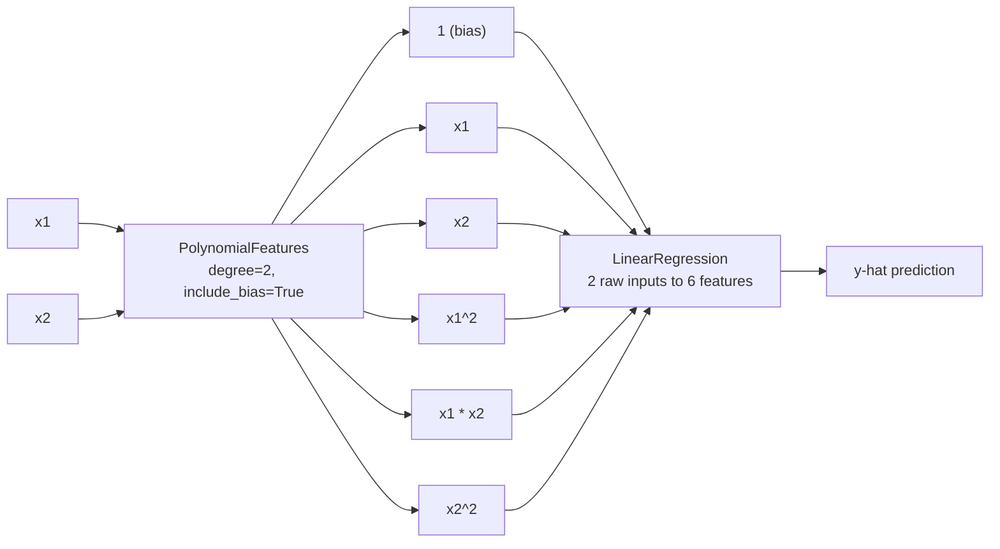
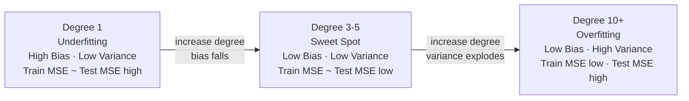

# 📐 Polynomial Regression

> [!abstract] TL;DR
> Polynomial regression fits nonlinear relationships by expanding input features into polynomial terms (x, x², x³, …) and running ordinary linear regression on them — it is **still linear regression**, just on a richer feature space. The key challenge is degree selection: too low underfits, too high overfits catastrophically. Cross-validation and Ridge regularization are the practical solutions.

---

## Intuition

**Analogy:** A straight ruler can only draw straight lines. If the path you need to trace is curved, you need a flexible ruler. Polynomial regression is that flexible ruler: instead of bending the model, you pre-bend the input features so that a straight line in the transformed space traces the curve you want in the original space.

The "bending" happens by adding x², x³, … as extra columns in the feature matrix. The linear regression model then fits a straight hyperplane in this higher-dimensional feature space — which, when projected back to the original x axis, looks like a smooth curve. No new algorithm is required. The problem stays linear in the parameters.

---

## How It Works

### Core Mechanics

1. **Start with raw features** — feature matrix X with shape (n_samples, n_features).

2. **Apply `PolynomialFeatures` transformer** — sklearn generates every monomial up to degree d:
   - degree=2, one feature x: outputs `[1, x, x²]`
   - degree=2, two features [x₁, x₂]: outputs `[1, x₁, x₂, x₁², x₁·x₂, x₂²]`
   - **Formula:** C(n_features + degree, degree) total output features (including bias)

3. **Fit `LinearRegression` or `Ridge`** — the problem is now a standard linear regression on expanded features. No new solver or loss function is needed.

4. **Key insight** — "linear" refers to linearity in the *weights*, not in the input variables. `ŷ = w₀ + w₁x + w₂x²` is linear in w₀, w₁, w₂. That is why polynomial regression inherits all of linear regression's guarantees (closed-form solution, convex loss, well-understood regularization).

**Feature count explosion — why this gets expensive fast:**

| n_input features | degree | Output features (with bias) |
|:---:|:---:|:---:|
| 1 | 3 | 4 |
| 5 | 3 | 56 |
| 10 | 3 | 286 |
| 10 | 5 | 3003 |

*Formula:* C(n + d, d) — for n=10, d=3: C(13, 3) = **286**

### Flow / Architecture

**Diagram 1 — Polynomial Feature Expansion (degree=2, two inputs)**



**Diagram 2 — Degree vs Error: Bias-Variance Tradeoff Curve**



---

## PolynomialFeatures Key Parameters

| Parameter | Default | Effect |
|---|---|---|
| `degree` | 2 | Maximum polynomial degree. Start at 2 or 3, tune via CV. |
| `include_bias` | True | Adds a column of ones. Set False when pipeline already has `LinearRegression(fit_intercept=True)`. |
| `interaction_only` | False | If True, only cross-product terms (x₁x₂, x₁x₃…) — no pure powers (x₁², x₁³). |

**`interaction_only=True` use case:** when you want multiplicative effects between features (price × volume as a signal) but squaring a feature makes no physical sense. For 3 input features at degree=2, this produces 6 features instead of 10 — keeping only `[x1, x2, x3, x1*x2, x1*x3, x2*x3]`.

---

## Code Demo

```python
import numpy as np
from sklearn.pipeline import Pipeline
from sklearn.preprocessing import StandardScaler, PolynomialFeatures
from sklearn.linear_model import LinearRegression, Ridge
from sklearn.model_selection import cross_val_score, train_test_split
from sklearn.metrics import mean_squared_error

# ── Synthetic data: noisy cubic curve ────────────────────────────────────────
np.random.seed(42)
X = np.sort(np.random.uniform(-3, 3, 200)).reshape(-1, 1)
y = 0.5 * X.ravel()**3 - 2 * X.ravel() + np.random.randn(200) * 2

X_train, X_test, y_train, y_test = train_test_split(
    X, y, test_size=0.25, random_state=42
)

# ── 1. Production pipeline: scale FIRST, then expand, then fit ───────────────
#    StandardScaler prevents x^3 from becoming astronomically large numbers.
poly_ridge = Pipeline([
    ("scaler", StandardScaler()),                        # CRITICAL: scale before poly
    ("poly",   PolynomialFeatures(degree=3, include_bias=False)),
    ("model",  Ridge(alpha=1.0)),                        # regularize to prevent overfit
])
poly_ridge.fit(X_train, y_train)
rmse = np.sqrt(mean_squared_error(y_test, poly_ridge.predict(X_test)))
print(f"Degree-3 Ridge  →  Test RMSE: {rmse:.3f}")

# ── 2. Feature explosion demo ────────────────────────────────────────────────
for n_in, deg in [(1, 3), (5, 3), (10, 3), (10, 5)]:
    pf = PolynomialFeatures(degree=deg, include_bias=True)
    n_out = pf.fit_transform(np.zeros((1, n_in))).shape[1]
    print(f"  n_input={n_in:2d}, degree={deg} -> {n_out:4d} features")
# n_input= 1, degree=3 ->    4 features
# n_input= 5, degree=3 ->   56 features
# n_input=10, degree=3 ->  286 features   (C(13,3) = 286)
# n_input=10, degree=5 -> 3003 features   (C(15,5) = 3003)

# ── 3. Overfitting diagnostic: train vs test RMSE across degrees ─────────────
#    Plain LinearRegression (no regularization) reveals raw overfitting behavior.
degrees = list(range(1, 11))
train_rmse, test_rmse = [], []

for d in degrees:
    pipe = Pipeline([
        ("scaler", StandardScaler()),
        ("poly",   PolynomialFeatures(degree=d, include_bias=False)),
        ("model",  LinearRegression()),
    ])
    pipe.fit(X_train, y_train)
    train_rmse.append(np.sqrt(mean_squared_error(y_train, pipe.predict(X_train))))
    test_rmse.append(np.sqrt(mean_squared_error(y_test,  pipe.predict(X_test))))

print("\nDegree | Train RMSE | Test RMSE")
for d, tr, te in zip(degrees, train_rmse, test_rmse):
    flag = " <- sweet spot" if te == min(test_rmse) else ""
    print(f"  {d:2d}   |   {tr:7.3f}  |  {te:7.3f}{flag}")
# Typical output:
#    1   |     5.124  |    5.198          <- underfitting
#    3   |     2.031  |    2.087  <- sweet spot
#    7   |     1.991  |    3.412          <- overfit beginning
#   10   |     1.854  |  189.441          <- catastrophic overfit

# ── 4. Production pattern: best degree via 5-fold cross-validation ───────────
best_degree, best_cv_rmse = 1, np.inf

for d in range(1, 11):
    pipe = Pipeline([
        ("scaler", StandardScaler()),
        ("poly",   PolynomialFeatures(degree=d, include_bias=False)),
        ("model",  Ridge(alpha=1.0)),
    ])
    # neg_root_mean_squared_error requires sklearn >= 0.24
    cv_rmse = -cross_val_score(
        pipe, X_train, y_train, cv=5,
        scoring="neg_root_mean_squared_error"
    ).mean()
    if cv_rmse < best_cv_rmse:
        best_cv_rmse, best_degree = cv_rmse, d

print(f"\nBest degree (5-fold CV): {best_degree}  (CV RMSE: {best_cv_rmse:.3f})")

# Refit final model on full training set with best degree
final_pipe = Pipeline([
    ("scaler", StandardScaler()),
    ("poly",   PolynomialFeatures(degree=best_degree, include_bias=False)),
    ("model",  Ridge(alpha=1.0)),
])
final_pipe.fit(X_train, y_train)
final_rmse = np.sqrt(mean_squared_error(y_test, final_pipe.predict(X_test)))
print(f"Final test RMSE: {final_rmse:.3f}")

# ── 5. Interaction terms only ────────────────────────────────────────────────
X_multi = np.random.randn(100, 3)   # features: price, volume, volatility
pf_interact = PolynomialFeatures(degree=2, interaction_only=True, include_bias=False)
X_interact = pf_interact.fit_transform(X_multi)
print(f"\ninteraction_only=True: 3 features -> {X_interact.shape[1]} features")
print(f"Names: {list(pf_interact.get_feature_names_out(['price', 'volume', 'vol']))}")
# Names: ['price', 'volume', 'vol', 'price volume', 'price vol', 'volume vol']
# No price^2, volume^2 — only cross-products
```

---

## Real-World Example

> **Example:** **Temperature-to-demand forecasting at electricity grid operators.** National Grid (UK) and similar operators embed polynomial regression components in their demand-forecasting pipelines. The temperature-to-demand relationship is classically U-shaped: demand rises in cold weather (heating) and hot weather (air conditioning) with a comfortable mid-range nadir. A degree-2 polynomial on temperature — `w₁·T + w₂·T²` — captures this parabola analytically. Fitted inside a Ridge-regularized sklearn Pipeline alongside time-of-day and calendar dummies, the polynomial term outperforms piecewise linear approximations while remaining interpretable: the positive sign of w₂ directly confirms the convex (U-shaped) relationship. Operators can audit and explain the model to regulators in terms of identifiable physical coefficients.

---

## Trade-offs

| Aspect | Polynomial Regression | Splines (`scipy`/`sklearn`) | Tree-Based (RF / GBM) | SVR (RBF kernel) |
|---|---|---|---|---|
| Interpretability | Medium — coefficients have meaning | Low-Medium | Low — black box | Low |
| Flexibility | Medium — global polynomial shape | High — local piecewise fit | Very high — arbitrary shapes | High |
| Extrapolation | Poor — diverges outside training range | Poor — undefined past knots | Very poor — flat beyond range | Moderate |
| Computation | Fast — still linear regression | Fast | Moderate to slow | Slow — kernel matrix O(n²) |
| Feature engineering needed | Yes — explicit `PolynomialFeatures` step | Yes — spline transformer | No | No |
| Overfitting control | Degree + Ridge alpha | Number of knots + smoothing | Depth, n_estimators, min_leaf | C, gamma |

**When to prefer each alternative:**
- **Splines** — relationship changes character in different regions (locally adaptive); use `SplineTransformer` in sklearn or `scipy.interpolate.UnivariateSpline`
- **Tree-based models** — many features, unknown functional form, non-smooth relationships
- **SVR with RBF kernel** — avoids explicit feature expansion via the kernel trick; the RBF kernel implicitly computes inner products in an infinite-dimensional polynomial space

---

## When to Use vs Avoid

**Use when:**
- The data shows a smooth, globally consistent nonlinear trend (quadratic dose-response, cubic growth, U-shaped demand curve)
- Degree is low (≤ 4) — the feature set remains tractable and regularization is effective
- Interpretability matters: the coefficient on x² directly answers "is the relationship convex or concave?"
- You are already using a sklearn Pipeline and want a minimal nonlinear upgrade from `LinearRegression`
- You want multiplicative effects between features without pure polynomial terms (`interaction_only=True`)

**Avoid when:**
- You have many input features (n > 5) and want high degree — feature explosion makes the model unwieldy and prone to multicollinearity
- The relationship is locally irregular (different shapes in different regions) — use splines or tree models instead
- Extrapolation beyond training range is required — polynomial curves diverge rapidly (Runge's phenomenon)
- You have no prior knowledge of functional form and are trying high degrees as a substitute for feature understanding

---

## Common Pitfalls

- **Skipping `StandardScaler` before `PolynomialFeatures`** — if a feature ranges 0–1000, its cube ranges 0–10⁹. The Normal Equation becomes numerically unstable; gradient descent diverges. The Pipeline order is always: `StandardScaler` → `PolynomialFeatures` → model. No exceptions.

- **High degree without regularization** — degree ≥ 5 with plain `LinearRegression` will overfit severely on any real dataset. The model memorizes training-set noise through wildly oscillating high-degree terms. Always pair high-degree polynomial features with `Ridge`. The higher the degree, the larger the `alpha` you likely need.

- **Feature explosion with many input variables** — 10 input features at degree 3 produces 286 features; at degree 5 produces 3003. These matrices slow training, create severe multicollinearity, and require enormous datasets to fit reliably. When n_features > 5, prefer splines applied per-feature or switch to tree-based models.

- **Trusting polynomial extrapolation** — a degree-5 polynomial trained on x ∈ [0, 10] can diverge to ±∞ at x = 12. This is Runge's phenomenon. Polynomial regression is a local interpolator, not a global model. Never use it to predict beyond the training range.

- **Selecting degree by training RMSE** — training RMSE decreases monotonically as degree increases. Observing "degree 10 has the lowest RMSE" from a training-set metric is meaningless. Always select degree using cross-validation on held-out folds, and lock the test set away until final evaluation.

---

## Related Concepts

- [[_MOC_Classical_ML|↑ Section MOC]]

- [[Linear_Regression]] — polynomial regression is linear regression on transformed features; all its math (Normal Equation, MSE, gradient descent) applies directly
- [[Regularization]] — Ridge is the standard companion to polynomial features; higher degree demands larger alpha; Lasso can zero out irrelevant polynomial terms (e.g., drives the x⁵ coefficient to exactly zero)
- [[Bias_Variance_Tradeoff]] — degree selection is a direct instantiation of this tradeoff: degree 1 → high bias; degree 10 → high variance; the validation curve diagnostic identifies the sweet spot
- [[Cross_Validation]] — the correct tool for selecting polynomial degree; plots CV RMSE vs degree without touching the test set
- [[Feature_Engineering]] — `PolynomialFeatures` is one of the canonical sklearn feature engineering transformers; sits naturally in any preprocessing Pipeline
- [[Regression_Metrics]] — RMSE and R² are the standard evaluation metrics; Adjusted R² penalizes for the extra feature columns added by polynomial expansion
- [[SVM]] — RBF kernel SVR is a kernel-based alternative that avoids explicit polynomial feature expansion entirely; the kernel trick implicitly maps inputs into an infinite-dimensional feature space
- [[Hyperparameter_Tuning]] — both degree and Ridge alpha are hyperparameters; GridSearchCV or Optuna over `(degree, alpha)` pairs is the production tuning pattern

---

## Review Questions

1. **Feature expansion math:** A dataset has 5 input features. You apply `PolynomialFeatures(degree=3, include_bias=True)`. How many output features are produced? Write the formula and show the arithmetic. Would the same dataset at degree=5 be practical to train on with 500 samples?

2. **Degree selection:** You train unregularized polynomial regression for degrees 1 through 10. Training RMSE drops monotonically from 4.2 to 0.1 as degree increases. Test RMSE bottoms out at 2.1 for degree 4 and rises to 18.7 at degree 10. What does this pattern diagnose? How would you use 5-fold cross-validation to make the degree decision correctly, without using the test set at all?

3. **Regularization choice:** You are fitting a degree-6 polynomial with `Ridge(alpha=1.0)` and the test RMSE is acceptable, but the model uses all 6 powers of x. A stakeholder asks whether you could simplify the model. Which regularizer would you switch to, and what would you expect to happen to the coefficients of x⁵ and x⁶? What must you verify before interpreting those zeroed-out coefficients as "those terms are physically irrelevant"?

4. **When not to use it:** A colleague proposes degree-5 polynomial regression to forecast electricity demand for a new region whose load profile was never observed in the training data (the training set covers x ∈ [0, 100] MW baseline; the forecast requires projecting to 150 MW). What specific failure mode would you warn them about, and what class of model would you recommend instead for this extrapolation requirement?

---

## Sources

- [scikit-learn PolynomialFeatures API](https://scikit-learn.org/stable/modules/generated/sklearn.preprocessing.PolynomialFeatures.html)
- [scikit-learn — Polynomial regression extending linear models with basis functions](https://scikit-learn.org/stable/modules/linear_model.html#polynomial-regression-extending-linear-models-with-basis-functions)
- [Géron, A. — Hands-On Machine Learning with Scikit-Learn, Keras & TensorFlow, Ch. 4 (3rd ed., O'Reilly, 2022)](https://www.oreilly.com/library/view/hands-on-machine-learning/9781098125967/)
- [James et al. — An Introduction to Statistical Learning, Ch. 7: Moving Beyond Linearity (2nd ed., Springer, 2021)](https://www.statlearning.com/)
- [Bishop, C. M. — Pattern Recognition and Machine Learning, Ch. 1.1: Polynomial Curve Fitting (Springer, 2006)](https://www.microsoft.com/en-us/research/publication/pattern-recognition-machine-learning/)

---

#regression #polynomial-regression #supervised-learning #overfitting #classical-ml
