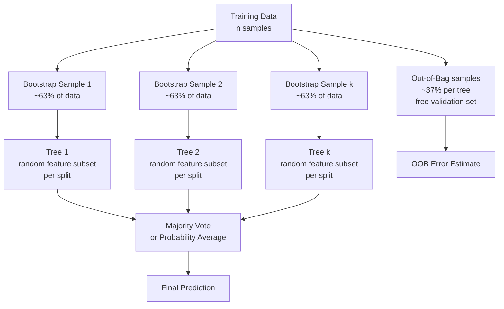

# 🌲🌲🌲 Random Forests

> [!abstract] TL;DR
> Random Forest builds many decision trees on bootstrapped data samples, each tree using a random subset of features per split, then aggregates predictions by majority vote — the ensemble variance is lower than any individual tree because the trees' errors are uncorrelated.

---

## Intuition — Analogy First

Would you trust one doctor's diagnosis, or would you want a second and third opinion? If you ask 100 independent doctors the same question, their individual errors tend to cancel out — no single doctor's blind spot dominates the final answer, as long as the doctors are working from different evidence and reaching different conclusions.

A Random Forest is exactly this: **100 decision trees, each trained on a different random bootstrap sample of the data, each tree making splits using only a random subset of features**. No single tree is highly accurate, but their majority vote is remarkably robust.

The key insight is **decorrelation**: if all trees made the same mistakes (correlated errors), averaging them would help nothing. Random feature subsampling ensures trees are forced to find different decision boundaries, so their errors are independent — and independent errors average away.

---

## How It Works — Mechanics

### Bagging + Feature Randomness



### Bootstrap Sampling

Each tree trains on a **bootstrap sample**: $n$ samples drawn **with replacement** from the original $n$ training examples. On average, each bootstrap sample contains about **63.2%** of unique training examples (since $(1 - 1/n)^n \to e^{-1} \approx 0.368$ samples are never selected — these are the out-of-bag samples).

### Feature Subsampling per Split

At each split within a tree, only $m$ features are randomly selected as candidates (not all $d$ features). This is the key differentiator from plain bagging:

- Classification default: $m = \sqrt{d}$
- Regression default: $m = d/3$

This forces different trees to discover different predictive signals.

### Out-of-Bag (OOB) Error

Each tree's training excluded ~37% of samples. Those samples can be used to evaluate the tree's performance — giving a **free validation estimate** without needing a held-out test set. The OOB error is a reliable estimate of generalization error.

### Why Variance Reduces with Averaging

If each tree has prediction variance $\sigma^2$ and tree errors have correlation $\rho$ (between 0 and 1):

$$\text{Var}(\text{average of } k \text{ trees}) = \rho\sigma^2 + \frac{1-\rho}{k}\sigma^2$$

As $k \to \infty$, the second term vanishes. The irreducible term is $\rho\sigma^2$ — which Random Forest reduces by decorrelating trees via feature subsampling (lowering $\rho$).

---

## The Math

### Bias-Variance Decomposition

For a single tree of depth $D$:
- **High variance**: small changes in training data → very different tree structure
- **Low to moderate bias**: deep trees are expressive enough to approximate the truth

Random Forest averaging:

$$\text{Var}(f_\text{RF}) = \rho(x) \cdot \sigma^2(x) + \frac{1-\rho(x)}{k}\sigma^2(x)$$

where $\rho(x)$ is the pairwise correlation between trees' predictions at point $x$ and $\sigma^2(x)$ is the per-tree variance. Reducing $\rho$ (via feature randomness) is the primary lever; increasing $k$ has diminishing returns.

### Feature Importance (Mean Decrease in Impurity)

$$\text{FI}(j) = \sum_{\text{trees}} \sum_{\text{nodes using feature } j} \frac{n_t}{n} \cdot \Delta G_t$$

where $n_t$ is samples at node $t$, $n$ is total samples, and $\Delta G_t$ is the impurity decrease at node $t$. Averaged over all trees.

**Caveat:** MDI over-rates high-cardinality features (many unique values). Prefer **permutation importance** for unbiased estimates.

---

## Code Demo

### Basic Random Forest

```python
import numpy as np
import pandas as pd
from sklearn.ensemble import RandomForestClassifier
from sklearn.datasets import load_breast_cancer
from sklearn.model_selection import train_test_split, cross_val_score
from sklearn.metrics import classification_report, roc_auc_score

data = load_breast_cancer()
X, y = data.data, data.target

X_train, X_test, y_train, y_test = train_test_split(
    X, y, test_size=0.2, random_state=42
)

rf = RandomForestClassifier(
    n_estimators=300,        # number of trees
    max_features='sqrt',     # sqrt(d) features per split (default for classification)
    max_depth=None,          # trees grow fully (variance controlled by bagging)
    min_samples_leaf=1,
    oob_score=True,          # enable out-of-bag error estimate
    n_jobs=-1,               # use all CPU cores (parallelizable!)
    random_state=42
)
rf.fit(X_train, y_train)

y_pred  = rf.predict(X_test)
y_proba = rf.predict_proba(X_test)[:, 1]

print(classification_report(y_test, y_pred, target_names=data.target_names))
print(f"Test ROC-AUC:  {roc_auc_score(y_test, y_proba):.4f}")
print(f"OOB score:     {rf.oob_score_:.4f}")    # free validation estimate
```

### Feature Importance: MDI vs Permutation

```python
from sklearn.inspection import permutation_importance

# MDI importance (built-in, fast)
mdi_importance = pd.Series(
    rf.feature_importances_,
    index=data.feature_names
).sort_values(ascending=False)

# Permutation importance (unbiased, slower)
perm = permutation_importance(rf, X_test, y_test, n_repeats=10, random_state=42)
perm_importance = pd.Series(
    perm.importances_mean,
    index=data.feature_names
).sort_values(ascending=False)

print("Top 5 MDI features:")
print(mdi_importance.head(5))

print("\nTop 5 Permutation features:")
print(perm_importance.head(5))
```

### OOB Score vs n_estimators

```python
import matplotlib.pyplot as plt

oob_errors = []
n_range = range(10, 301, 10)

for n_trees in n_range:
    rf_n = RandomForestClassifier(
        n_estimators=n_trees, oob_score=True, random_state=42, n_jobs=-1
    )
    rf_n.fit(X_train, y_train)
    oob_errors.append(1 - rf_n.oob_score_)

plt.plot(n_range, oob_errors)
plt.xlabel("n_estimators")
plt.ylabel("OOB error rate")
plt.title("OOB error stabilizes after ~100 trees")
plt.tight_layout()
plt.savefig("rf_oob_curve.png")
# OOB error drops fast, then plateaus — diminishing returns past ~100-200 trees
```

### Hyperparameter Tuning with Cross-Validation

```python
from sklearn.model_selection import RandomizedSearchCV

param_dist = {
    'n_estimators':    [100, 200, 300, 500],
    'max_features':    ['sqrt', 'log2', 0.5],
    'max_depth':       [None, 5, 10, 20],
    'min_samples_leaf':[1, 2, 5, 10],
}

search = RandomizedSearchCV(
    RandomForestClassifier(n_jobs=-1, random_state=42),
    param_distributions=param_dist,
    n_iter=20,
    cv=5,
    scoring='roc_auc',
    random_state=42,
    n_jobs=-1
)
search.fit(X_train, y_train)
print(f"Best params: {search.best_params_}")
print(f"Best CV ROC-AUC: {search.best_score_:.4f}")
```

---

## Real-World Example

**Kaggle Tabular Competitions.** Before gradient boosting (XGBoost, LightGBM) took over around 2014–2016, Random Forests won the majority of tabular data competitions on Kaggle. They remain a competitive baseline because they require minimal preprocessing (no scaling, handle missing values with imputation, handle high-cardinality without careful encoding), are parallelizable over trees (linear speedup with CPU cores), and provide reliable OOB estimates without a held-out set.

**Airbnb Pricing Model.** Airbnb's early host price suggestion tool was built on Random Forests over features like location, property type, amenities, seasonality, and historical booking rates. The feature importance output directly informed which factors the product team surfaced to hosts in the price suggestion UI — an example of model interpretability driving product design.

---

## Trade-offs

| Aspect | Random Forest | Single Decision Tree | Gradient Boosting |
|---|---|---|---|
| Variance | Low (averaging) | High | Lower (regularized) |
| Bias | Low-moderate | Low (deep) | Very low |
| Training speed | Fast (parallel) | Very fast | Slower (sequential) |
| Prediction speed | Slow (100+ trees) | Very fast | Slow (100+ trees) |
| Memory | High (stores all trees) | Low | Moderate |
| Hyperparameter sensitivity | Low | Medium | High |
| Interpretability | Medium (feature importance) | High (visual) | Low |

---

## When to Use vs Avoid

**Use when:**
- Strong performance with minimal hyperparameter tuning
- Interpretable feature importance needed
- Parallelism available (many CPU cores)
- Baseline for tabular data before trying gradient boosting
- Dataset has noise (boosting overfits noise more readily)

**Avoid when:**
- Prediction speed at inference matters (serving 100K req/s — a single tree or a logistic model is faster)
- Very high-dimensional sparse data (text) — gradient boosting or linear models work better
- Memory is constrained — storing 300 deep trees is expensive
- Absolute best performance is needed (XGBoost/LightGBM usually edges ahead on tabular data)

---

## Common Pitfalls

1. **Not setting `n_jobs=-1`.** Trees are fully independent and can be trained in parallel. A 16-core machine can train 300 trees in 1/16 the time. Not parallelizing is leaving performance on the table.

2. **Trusting MDI feature importance blindly.** High-cardinality features (like user IDs, zip codes) appear artificially important in MDI. Always cross-check with permutation importance.

3. **Using OOB score as a substitute for proper cross-validation on small datasets.** OOB is reliable for $n > 5000$; on small datasets, use stratified k-fold CV.

4. **Setting `max_depth` too small.** Unlike gradient boosting (which benefits from shallow trees), Random Forest benefits from **deep trees** because variance is controlled by averaging. Restricting depth reintroduces bias.

5. **Not checking for data leakage before feature importance.** A leaky feature will dominate importance and make the model look better than it is.

---

## Related Concepts

- [[_MOC_Classical_ML|↑ Section MOC]]

- [[Decision_Trees]] — the base learner that Random Forest builds on
- [[Ensemble_Methods]] — bagging, boosting, stacking — the broader framework
- [[Gradient_Boosting]] — sequential alternative with lower bias, higher variance sensitivity
- [[Bias_Variance_Tradeoff]] — RF specifically targets variance reduction

---

## Review Questions

1. **Scenario:** You compare a single deep decision tree (test accuracy 0.88) against a Random Forest with 500 trees (test accuracy 0.95). Your manager asks why the forest is so much better even though it uses the same base learner. Explain using bias-variance decomposition and the role of correlation between trees.

2. **Scenario:** You have a dataset with 1000 features, including `user_id` (a high-cardinality categorical). Your Random Forest feature importance puts `user_id` as the 2nd most important feature. Is this trustworthy? What test would you run, and what would you do?

3. **Scenario:** You are building a real-time fraud detection API that must respond in under 5ms. Your team proposes deploying a Random Forest with 1000 trees. What are the latency concerns, and what model architectural changes would you consider to meet the SLA?

---

## Sources

- Breiman, L. — *Random Forests*, Machine Learning 45 (2001) 5–32
- Géron, A. — *Hands-On Machine Learning with Scikit-Learn, Keras & TensorFlow*, Chapter 7 (3rd ed., O'Reilly, 2022)
- scikit-learn documentation — [RandomForestClassifier](https://scikit-learn.org/stable/modules/generated/sklearn.ensemble.RandomForestClassifier.html)
- Strobl et al. — *Bias in Random Forest Variable Importance Measures*, BMC Bioinformatics 8 (2007)

---

#random-forests #ensemble #bagging #feature-importance #supervised-learning #intermediate
