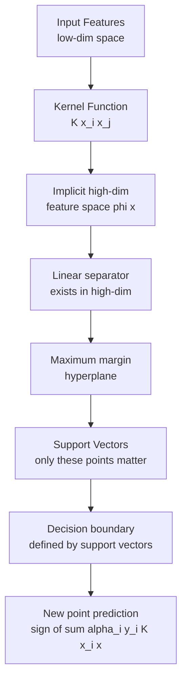

# 🎯 Support Vector Machine

> [!abstract] TL;DR
> SVM finds the hyperplane that **maximally separates** two classes. Only the training points closest to the boundary (support vectors) define it — the rest are irrelevant. The **kernel trick** implicitly maps data to a higher-dimensional space where it becomes linearly separable, without ever computing the high-dimensional coordinates explicitly. The **C parameter** controls the soft-margin trade-off between margin width and misclassification tolerance.

## Intuition — Analogy First

Imagine two cities on a map separated by terrain. You want to build the **widest possible road** between them — a road that has the most breathing room on both sides before it hits the nearest building. The buildings right at the road's edges are the **support vectors** — they are the only buildings that matter for road placement. You could remove every other building and the road position would not change.

The **kernel trick** is like lifting the map into 3D: cities that looked hopelessly interleaved on a flat map might become neatly separable when you pop them up to different elevations. The magic is you never need to actually compute the 3D coordinates — you just need a function (the kernel) that tells you how similar any two points are in the lifted space.

The **C parameter** controls the trade-off: high C = narrow road, few violations allowed (risk of overfitting); low C = wide road, some misclassifications tolerated (better generalization).

## How It Works — Mechanics

**Hard margin SVM (linearly separable):**
- Find $w, b$ such that $w^\top x + b = 0$ separates the classes.
- Maximize the margin $\frac{2}{\|w\|}$ subject to $y_i(w^\top x_i + b) \geq 1$ for all $i$.

**Soft margin SVM (real data, non-separable):**
- Introduce slack variables $\xi_i \geq 0$: allow some points to be inside the margin or on the wrong side.
- Minimize $\frac{1}{2}\|w\|^2 + C\sum_i \xi_i$ subject to $y_i(w^\top x_i + b) \geq 1 - \xi_i$.
- High $C$: less tolerance for slack → smaller margin, more complex boundary.
- Low $C$: more tolerance → wider margin, simpler boundary.

**Kernel trick:**
- Instead of computing $\phi(x)$ explicitly, use a kernel function $K(x_i, x_j) = \phi(x_i)^\top \phi(x_j)$.
- Common kernels: RBF (Gaussian), Polynomial, Sigmoid, Linear.
- The dual formulation depends on training data only through inner products — swap $x_i^\top x_j$ with $K(x_i, x_j)$ to get nonlinear SVM.



## The Math

**Primal optimization problem (soft margin):**

$$\min_{w, b, \xi} \frac{1}{2}\|w\|^2 + C\sum_{i=1}^{n}\xi_i$$

$$\text{s.t.} \quad y_i(w^\top x_i + b) \geq 1 - \xi_i, \quad \xi_i \geq 0 \quad \forall i$$

**Dual formulation** (via Lagrangian):

$$\max_{\alpha} \sum_{i=1}^{n}\alpha_i - \frac{1}{2}\sum_{i,j}\alpha_i\alpha_j y_i y_j K(x_i, x_j)$$

$$\text{s.t.} \quad 0 \leq \alpha_i \leq C, \quad \sum_{i=1}^{n}\alpha_i y_i = 0$$

**Prediction function:**

$$f(x) = \text{sign}\left(\sum_{i \in SV} \alpha_i y_i K(x_i, x) + b\right)$$

Points with $\alpha_i > 0$ are support vectors. All others contribute nothing.

**RBF kernel:**

$$K(x, x') = \exp\left(-\gamma \|x - x'\|^2\right)$$

$\gamma$ controls the "radius of influence" of a single training point. High $\gamma$ = very local influence (complex boundary, may overfit).

**SVR (Support Vector Regression):**

$$\min \frac{1}{2}\|w\|^2 + C\sum_i(\xi_i + \xi_i^*)$$

Predictions within $\epsilon$-tube of target incur no penalty. SVR is robust to outliers when $\epsilon$ is set appropriately.

## Code Demo

```python
from sklearn.svm import SVC, SVR
from sklearn.datasets import load_breast_cancer, make_moons
from sklearn.preprocessing import StandardScaler
from sklearn.model_selection import GridSearchCV, train_test_split
from sklearn.pipeline import Pipeline
from sklearn.metrics import classification_report
import numpy as np
import matplotlib.pyplot as plt

# --- Classification with RBF kernel ---
X, y = load_breast_cancer(return_X_y=True)
X_train, X_test, y_train, y_test = train_test_split(
    X, y, test_size=0.2, random_state=42, stratify=y
)

# CRITICAL: SVM requires feature scaling
pipe = Pipeline([
    ("scaler", StandardScaler()),
    ("svm", SVC(kernel="rbf", probability=True)),
])

# Tune C and gamma with grid search
param_grid = {
    "svm__C": [0.1, 1, 10, 100],
    "svm__gamma": ["scale", "auto", 0.001, 0.01],
}
grid = GridSearchCV(pipe, param_grid, cv=5, scoring="roc_auc", n_jobs=-1)
grid.fit(X_train, y_train)

print(f"Best params: {grid.best_params_}")
print(f"CV AUC: {grid.best_score_:.4f}")
print(classification_report(y_test, grid.predict(X_test)))

# --- Visualizing decision boundary on 2D data ---
X2d, y2d = make_moons(n_samples=300, noise=0.2, random_state=42)
scaler = StandardScaler()
X2d_scaled = scaler.fit_transform(X2d)

for C_val in [0.1, 1.0, 10.0]:
    clf = SVC(kernel="rbf", C=C_val, gamma="scale")
    clf.fit(X2d_scaled, y2d)
    print(f"C={C_val}: {len(clf.support_vectors_)} support vectors")

# --- SVR for regression ---
from sklearn.datasets import fetch_california_housing
Xr, yr = fetch_california_housing(return_X_y=True)
Xr_train, Xr_test, yr_train, yr_test = train_test_split(
    Xr[:5000], yr[:5000], test_size=0.2, random_state=42
)
svr_pipe = Pipeline([
    ("scaler", StandardScaler()),
    ("svr", SVR(kernel="rbf", C=10, epsilon=0.1, gamma="scale")),
])
svr_pipe.fit(Xr_train, yr_train)
from sklearn.metrics import mean_squared_error
print(f"SVR RMSE: {mean_squared_error(yr_test, svr_pipe.predict(Xr_test), squared=False):.3f}")
```

## Real-World Example

**Text classification (pre-deep learning era)**: SVMs with linear kernels dominated text classification tasks (spam detection, sentiment analysis, topic classification) from ~2000–2012. The key insight: text features (TF-IDF vectors) are very high-dimensional and sparse, making them nearly linearly separable — exactly where linear SVM excels. The SVM spam filter in early SpamAssassin installations used a linear kernel trained on thousands of hand-labeled examples.

**Face detection (Viola-Jones era)**: RBF SVMs were used for face/non-face classification on Haar feature vectors before CNNs. Turk & Pentland's eigenface work and Osuna et al.'s SVM face detector showed SVMs outperforming neural networks of the era on standardized benchmarks.

## Trade-offs

| Dimension | SVM | Notes |
|---|---|---|
| High-dimensional data | Excellent | Works well even when dims > samples |
| Training time | O(n²) to O(n³) | Doesn't scale to large datasets |
| Inference time | O(n_sv × d) | Can be slow with many support vectors |
| Memory | Stores support vectors only | Scales with dataset complexity, not size |
| Feature scaling required | Yes (critical) | Must StandardScale before SVM |
| Probability outputs | Not native | Requires Platt scaling (slow, approximate) |
| Interpretability | Low (nonlinear kernel) | Linear SVM: weights interpretable |
| Multiclass | One-vs-One by default | Slow for many classes |

## When to Use vs Avoid

**Use when:**
- High-dimensional, sparse data (text, genomics) with linear kernel
- Small-to-medium dataset (< 100K samples) where you need strong accuracy
- Non-linear boundary needed with a well-understood kernel (RBF, polynomial)
- Dataset has more features than samples (SVMs handle this gracefully)

**Avoid when:**
- Large datasets (> 100K rows) — training complexity is prohibitive; use gradient boosting or logistic regression with SGD
- You need fast probability calibration — SVM probabilities via Platt scaling are slow and approximate
- Many classes — one-vs-one creates $O(k^2)$ classifiers
- Features are not scaled and you cannot preprocess (unusual scenario)

## Common Pitfalls

1. **Forgetting to scale features**: SVM is extremely sensitive to feature scale. Without `StandardScaler`, features with large ranges dominate the distance computation. This is the single most common SVM mistake.
2. **Using RBF kernel on high-dimensional sparse data**: RBF computes Euclidean distance — in sparse high-dimensional space (e.g., TF-IDF), most pairwise distances are similar. Use a linear kernel for text.
3. **Treating C backward**: Beginners think "higher C = more regularization." It's the opposite. $C$ is the **penalty for violations** — high $C$ = less regularization = more complex model.
4. **Not budgeting for $O(n^2)$ training**: Fitting an SVM on 500K samples will likely exhaust memory. Use `LinearSVC` (liblinear solver, scales to millions) for linear problems.
5. **Ignoring `class_weight='balanced'` for imbalanced data**: SVM's margin optimization is biased toward the majority class by default. Set `class_weight='balanced'` to correct this.

## Related Concepts

- [[_MOC_Classical_ML|↑ Section MOC]]

- [[Logistic_Regression]] — softer probabilistic alternative; scales better
- [[Feature_Engineering]] — kernel selection depends on data geometry
- [[Regularization]] — the C parameter is inverse regularization strength
- [[Kernel_Methods]] — broader family SVM belongs to
- [[Bias_Variance_Tradeoff]] — C controls this trade-off directly

## Review Questions

1. Explain why only support vectors (points with $\alpha_i > 0$) determine the SVM decision boundary. What happens to the boundary if you remove a non-support-vector training point?
2. The kernel trick allows SVM to operate in infinite-dimensional feature spaces (e.g., RBF kernel). Why does this not cause computational problems, despite the infinite dimensionality?
3. A colleague fits an SVM with `C=1000` and gets 99% training accuracy but 72% test accuracy. What is likely happening, and what would you try to fix it?

## Sources

- Cortes, C., & Vapnik, V. (1995). *Support-Vector Networks*. Machine Learning, 20(3), 273–297.
- Schölkopf, B., & Smola, A. J. (2002). *Learning with Kernels*. MIT Press.
- scikit-learn SVM documentation: https://scikit-learn.org/stable/modules/svm.html

#svm #support-vector-machine #kernel-methods #classification #supervised-learning #maximum-margin
