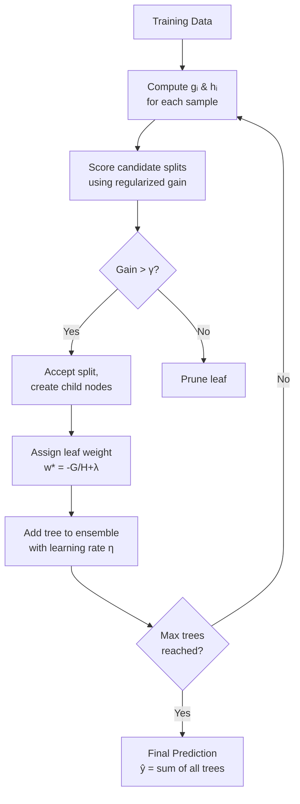

# ⚡ XGBoost

> [!abstract] TL;DR
> XGBoost is a regularized gradient boosting framework that uses second-order gradient (Newton's method) to fit trees, adds L1+L2 penalties on leaf weights, and handles missing values natively. It became the dominant algorithm for structured/tabular data competitions and production ML before deep learning took over NLP and CV.

## Intuition — Analogy First

Vanilla gradient boosting is like a sculptor who looks at the residual clay error and removes a bit each pass — guided only by the **slope** (first derivative) of the error surface. XGBoost is a sculptor with a **curved chisel**: it uses both the slope *and* the curvature (second derivative) of the error to decide how much clay to remove in each pass. The curvature tells you whether to take a small careful scrape or a confident big cut. Using curvature (Newton's method) means fewer passes to a better result.

On top of that, XGBoost adds a **pruner** that discourages overly complex trees: it penalizes having too many leaves (γ) or leaves with extreme weight values (λ), keeping the ensemble lean and generalizable.

## How It Works — Mechanics

XGBoost builds trees sequentially. At each step, a new tree is fit to the **negative gradient** of the loss, but unlike vanilla GBM it uses a second-order Taylor expansion of the loss to get a better quadratic approximation:

1. **Second-order gradient stats**: For each sample compute gᵢ (gradient) and hᵢ (hessian) of the loss with respect to the current prediction.
2. **Regularized objective**: Each split is scored by how much it reduces the regularized objective, not raw residual.
3. **Approximate split finding**: For large datasets, XGBoost uses weighted quantile sketches to find split candidates efficiently instead of scanning all values.
4. **Sparsity-aware**: Missing values are routed to a learned default direction — no imputation needed.
5. **Parallel tree construction**: Feature sorting and split evaluation happen in parallel across features (not trees — trees are still sequential).
6. **Column (feature) subsampling**: Randomly sample columns per tree or per level, reducing correlation between trees.



## The Math

**Objective function at step t:**

$$\mathcal{L}^{(t)} = \sum_{i=1}^{n} \left[ g_i f_t(x_i) + \frac{1}{2} h_i f_t(x_i)^2 \right] + \Omega(f_t)$$

where:
- $g_i = \partial_{\hat{y}^{(t-1)}} l(y_i, \hat{y}^{(t-1)})$ — first derivative (gradient)
- $h_i = \partial^2_{\hat{y}^{(t-1)}} l(y_i, \hat{y}^{(t-1)})$ — second derivative (hessian)
- $\Omega(f) = \gamma T + \frac{1}{2}\lambda \|w\|^2$ — regularization: $T$ leaves, $w$ leaf weights

**Optimal leaf weight** (closed form, makes XGBoost fast):

$$w_j^* = -\frac{G_j}{H_j + \lambda}$$

**Gain from a split** (used to decide whether to split):

$$\text{Gain} = \frac{1}{2}\left[\frac{G_L^2}{H_L+\lambda} + \frac{G_R^2}{H_R+\lambda} - \frac{(G_L+G_R)^2}{H_L+H_R+\lambda}\right] - \gamma$$

The $-\gamma$ term means a split must overcome a minimum gain threshold — this is the built-in pruning.

## Code Demo

```python
import xgboost as xgb
from sklearn.datasets import load_breast_cancer
from sklearn.model_selection import train_test_split
from sklearn.metrics import roc_auc_score
import matplotlib.pyplot as plt

# Data
X, y = load_breast_cancer(return_X_y=True)
X_train, X_test, y_train, y_test = train_test_split(
    X, y, test_size=0.2, random_state=42, stratify=y
)
X_tr, X_val, y_tr, y_val = train_test_split(
    X_train, y_train, test_size=0.2, random_state=42, stratify=y_train
)

# Model with regularization
model = xgb.XGBClassifier(
    n_estimators=1000,
    learning_rate=0.05,
    max_depth=4,
    subsample=0.8,
    colsample_bytree=0.8,
    reg_alpha=0.1,      # L1 on leaf weights
    reg_lambda=1.0,     # L2 on leaf weights
    min_child_weight=3, # controls leaf sample size
    gamma=0.1,          # min gain to split
    use_label_encoder=False,
    eval_metric="auc",
    random_state=42,
)

# Early stopping prevents overfitting
model.fit(
    X_tr, y_tr,
    eval_set=[(X_val, y_val)],
    early_stopping_rounds=50,
    verbose=False,
)

preds = model.predict_proba(X_test)[:, 1]
print(f"Test AUC: {roc_auc_score(y_test, preds):.4f}")
print(f"Best iteration: {model.best_iteration}")

# Feature importance
xgb.plot_importance(model, max_num_features=10, importance_type="gain")
plt.tight_layout()
plt.show()

# DMatrix API for large-scale use
dtrain = xgb.DMatrix(X_tr, label=y_tr)
dval   = xgb.DMatrix(X_val, label=y_val)
params = {"objective": "binary:logistic", "eval_metric": "auc",
          "eta": 0.05, "max_depth": 4, "lambda": 1.0}
bst = xgb.train(
    params, dtrain,
    num_boost_round=1000,
    evals=[(dval, "val")],
    early_stopping_rounds=50,
    verbose_eval=False,
)
```

## Real-World Example

**Uber Surge Pricing** and hundreds of Kaggle competition winners (2015–2019). XGBoost won or placed in nearly every major structured-data competition on Kaggle, leading Chen & Guestrin (its creators) to note it was used in 17 of 29 winning solutions at the 2015 KDD Cup. At Uber, gradient boosting variants including XGBoost drive demand forecasting and surge multiplier prediction on tabular trip features.

The key pattern: a dataset with ~100 engineered features, 1M rows, binary or regression target — XGBoost is often the first model you reach for, and often the last one standing.

## Trade-offs

| Dimension | XGBoost | Notes |
|---|---|---|
| Accuracy (tabular) | Excellent | Best-in-class for structured data |
| Training speed | Moderate | Slower than LightGBM on large data |
| Memory usage | High | Needs sorted feature columns in memory |
| Handles missing values | Native | Learns best direction, no imputation |
| Interpretability | Moderate | Feature importance, SHAP compatible |
| Hyperparameter sensitivity | High | Many knobs; needs tuning |
| GPU support | Yes | `device="cuda"` in recent versions |
| Categorical features | No | Requires encoding (OHE / target enc.) |

## When to Use vs Avoid

**Use when:**
- Structured/tabular data with mixed feature types
- You need a strong baseline fast
- Dataset is small-to-medium (< 5M rows) — or use GPU for larger
- Interpretability via SHAP is required
- Competition or benchmark setting

**Avoid when:**
- Raw images, audio, text (deep learning dominates)
- Dataset is massive (100M+ rows) — prefer LightGBM
- Real-time inference latency is < 1ms (tree ensembles are slow to score)
- Features are all categorical and high-cardinality (CatBoost may be better)

## Common Pitfalls

1. **Not using early stopping**: Setting `n_estimators` too high without early stopping leads to overfitting and wasted compute. Always provide an eval set.
2. **Ignoring the learning rate / n_estimators trade-off**: Lower `learning_rate` needs more trees. Common pattern: start with `lr=0.1, n=100` for exploration, then `lr=0.01, n=5000` for final model.
3. **Wrong `scale_pos_weight` for imbalanced classes**: For binary classification with class imbalance, set `scale_pos_weight = negative_count / positive_count`.
4. **Leaking the eval set into feature engineering**: If your features were computed using the full dataset (e.g., target encoding without CV), your early stopping AUC is optimistic.
5. **Using `importance_type='weight'` for feature selection**: Weight (split count) is misleading. Use `importance_type='gain'` or SHAP values instead.
6. **Not sorting data for time-series**: XGBoost's random subsampling assumes i.i.d. data. For time series, use `TimeSeriesSplit` from sklearn.

## Related Concepts

- [[_MOC_Classical_ML|↑ Section MOC]]

- [[Gradient_Boosting]] — the base algorithm XGBoost improves upon
- [[LightGBM]] — faster alternative with leaf-wise growth
- [[Decision_Trees]] — the weak learners XGBoost combines
- [[Hyperparameter_Tuning]] — Optuna / grid search strategies for XGBoost
- [[Regularization]] — L1/L2 concepts underlying the Ω term
- [[Bias_Variance_Tradeoff]] — boosting primarily reduces bias

## Review Questions

1. XGBoost uses both the first and second derivatives of the loss. Why does incorporating the second derivative (hessian) lead to better tree splits compared to using only the gradient?
2. What does the regularization term $\Omega(f) = \gamma T + \frac{1}{2}\lambda\|w\|^2$ penalize, and how does each component affect model complexity?
3. How does XGBoost handle missing values during training, and why is this preferable to pre-imputing missing values?

## Sources

- Chen, T., & Guestrin, C. (2016). *XGBoost: A Scalable Tree Boosting System*. KDD 2016. https://arxiv.org/abs/1603.02754
- XGBoost Documentation: https://xgboost.readthedocs.io
- Friedman, J. H. (2001). *Greedy Function Approximation: A Gradient Boosting Machine*. Annals of Statistics.

#xgboost #boosting #ensemble #gradient-boosting #tabular-data #supervised-learning
