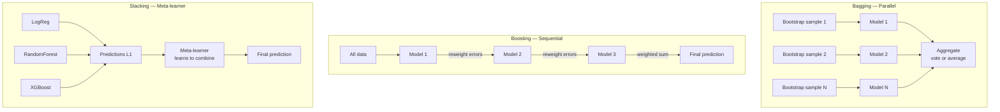

# 🗳️ Ensemble Methods

> [!abstract] TL;DR
> Ensemble methods combine multiple "weak" learners to create a stronger predictor. Three paradigms: **Bagging** (parallel training on bootstrap samples, reduces variance — Random Forest), **Boosting** (sequential training, each model corrects predecessor's errors, reduces bias — XGBoost, AdaBoost), and **Stacking** (a meta-learner combines base model predictions). Diversity among base learners is the key ingredient for all ensembles.

## Intuition — Analogy First

Imagine asking a single expert to predict stock prices. Even the best expert is fallible — they have blind spots, biases, and gaps in knowledge. Now imagine asking 100 diverse experts — economists, data scientists, market traders, sociologists — and taking the average. The individual errors cancel out. This is ensemble learning.

The key word is **diverse**. If you ask 100 people who all read the same newspaper and think the same way, you're not getting 100 independent opinions — you're amplifying one biased view. Ensemble methods only work when base learners make *different* errors.

**Three committee meeting styles:**
- **Bagging** — each committee member researches the question independently (parallel), then you vote. Good for reducing each member's overconfidence (variance).
- **Boosting** — each member specifically studies the cases that the previous member got wrong (sequential). Good for making the team collectively smarter (reducing bias).
- **Stacking** — different types of experts (a doctor, a lawyer, an engineer) each give their opinion, and a fourth expert synthesizes them using their relative expertise (meta-learner).

## How It Works — Mechanics

**Bagging (Bootstrap Aggregating):**
1. Create B bootstrap samples (sample n points with replacement) from training data
2. Train a base model on each sample independently
3. Aggregate: majority vote (classification) or average (regression)

Result: reduces variance because individual errors average out. Each model sees ~63% of the original training data (bootstrap sampling probability).

**Random Forest** = Bagging + additional feature randomness (each split considers $\sqrt{d}$ random features). The feature randomness decorrelates the trees, making the ensemble more powerful than plain bagging.

**Boosting:**
1. Train base model $f_1$ on all data
2. Increase sample weights on misclassified examples
3. Train $f_2$ focusing on $f_1$'s failures
4. Repeat for B rounds
5. Final prediction: weighted vote/sum

Result: reduces bias by iteratively focusing on hard examples. Key implementations: AdaBoost (reweights samples), Gradient Boosting (fits residuals), XGBoost/LightGBM/CatBoost (optimized GBM).

**Stacking (Stacked Generalization):**
1. Split training data into K folds
2. Train L diverse base models on K-1 folds each
3. Collect out-of-fold predictions from each base model → meta-features
4. Train a meta-learner (level-2 model) on the meta-features
5. Prediction: run input through all base models, feed their outputs to meta-learner



## The Math

**Bagging variance reduction:**
For B uncorrelated models each with variance $\sigma^2$ and pairwise correlation $\rho$:
$$\text{Var}(\text{ensemble}) = \rho \sigma^2 + \frac{1-\rho}{B}\sigma^2$$

As $B \to \infty$: $\text{Var} \to \rho\sigma^2$. If trees are uncorrelated ($\rho = 0$), variance → 0. The goal is to minimize $\rho$ (hence Random Forest's feature randomness) while keeping each model's $\sigma^2$ manageable.

**Boosting — AdaBoost update rule:**
After round $m$, model $f_m$ has weighted error $\epsilon_m = \sum_i w_i \mathbf{1}[y_i \neq f_m(x_i)]$.

Model weight: $\alpha_m = \frac{1}{2}\ln\frac{1-\epsilon_m}{\epsilon_m}$

Sample weight update: $w_i \leftarrow w_i \cdot \exp(-\alpha_m y_i f_m(x_i))$

Final prediction: $F(x) = \text{sign}\left(\sum_m \alpha_m f_m(x)\right)$

**Gradient Boosting** generalizes boosting to any differentiable loss. Each new model $f_m$ is fit to the **negative gradient** of the loss with respect to the current ensemble's predictions:
$$r_m = -\left[\frac{\partial \mathcal{L}(y_i, F(x_i))}{\partial F(x_i)}\right]$$

For MSE loss: $r_m = y_i - F(x_i)$ (residuals). For log-loss: $r_m = y_i - p_i$ (probability residuals).

**Diversity principle:** The key theorem: a model added to an ensemble improves the ensemble whenever:
$$\text{Err}(f_m) < \text{Err}(\text{ensemble without } f_m) / 2$$

i.e., a new model just needs to be better than random to help, *as long as it's different from existing models*.

## Code Demo

```python
import numpy as np
import matplotlib.pyplot as plt
from sklearn.datasets import make_classification
from sklearn.tree import DecisionTreeClassifier
from sklearn.linear_model import LogisticRegression
from sklearn.svm import SVC
from sklearn.neighbors import KNeighborsClassifier
from sklearn.ensemble import (
    BaggingClassifier, RandomForestClassifier, GradientBoostingClassifier,
    AdaBoostClassifier, VotingClassifier, StackingClassifier
)
from sklearn.model_selection import cross_val_score, StratifiedKFold
from sklearn.preprocessing import StandardScaler
from sklearn.pipeline import Pipeline

# Generate dataset
X, y = make_classification(n_samples=1000, n_features=20, n_informative=10,
                            n_redundant=5, random_state=42)
cv = StratifiedKFold(5, shuffle=True, random_state=42)

# ============================================================
# 1. BAGGING
# ============================================================
# Base weak learner (shallow tree)
base_tree = DecisionTreeClassifier(max_depth=5, random_state=42)
base_score = cross_val_score(base_tree, X, y, cv=cv).mean()

bagging = BaggingClassifier(
    estimator=DecisionTreeClassifier(max_depth=5),
    n_estimators=100,
    max_samples=0.8,
    max_features=0.8,
    bootstrap=True,
    random_state=42
)
bag_score = cross_val_score(bagging, X, y, cv=cv).mean()

rf = RandomForestClassifier(n_estimators=100, random_state=42)
rf_score = cross_val_score(rf, X, y, cv=cv).mean()

print("=== Bagging ===")
print(f"Single tree:    {base_score:.3f}")
print(f"BaggingClf:    {bag_score:.3f}")
print(f"Random Forest: {rf_score:.3f}")

# Show variance reduction
n_iter = 20
single_scores = [cross_val_score(DecisionTreeClassifier(max_depth=5, random_state=i),
                                  X, y, cv=cv).mean() for i in range(n_iter)]
bag_scores = [cross_val_score(BaggingClassifier(n_estimators=50, random_state=i),
                               X, y, cv=cv).mean() for i in range(n_iter)]
print(f"Single tree variance: {np.std(single_scores):.4f}")
print(f"Bagging variance:    {np.std(bag_scores):.4f}")

# ============================================================
# 2. BOOSTING
# ============================================================
ada = AdaBoostClassifier(n_estimators=100, learning_rate=0.5, random_state=42)
gbm = GradientBoostingClassifier(n_estimators=100, learning_rate=0.1,
                                  max_depth=3, random_state=42)

print("\n=== Boosting ===")
print(f"AdaBoost:  {cross_val_score(ada, X, y, cv=cv).mean():.3f}")
print(f"GradBoost: {cross_val_score(gbm, X, y, cv=cv).mean():.3f}")

# Number of estimators vs accuracy
train_scores_gbm, test_scores_gbm = [], []
for n in range(10, 200, 10):
    g = GradientBoostingClassifier(n_estimators=n, learning_rate=0.1,
                                    max_depth=3, random_state=42)
    g.fit(X[:800], y[:800])
    train_scores_gbm.append(g.score(X[:800], y[:800]))
    test_scores_gbm.append(g.score(X[800:], y[800:]))

plt.figure(figsize=(8, 4))
plt.plot(range(10, 200, 10), train_scores_gbm, label='Train')
plt.plot(range(10, 200, 10), test_scores_gbm, label='Test')
plt.xlabel('Number of boosting rounds')
plt.ylabel('Accuracy')
plt.title('GBM: Learning Curve vs Estimators')
plt.legend()
plt.tight_layout()
plt.show()

# ============================================================
# 3. VOTING CLASSIFIER
# ============================================================
lr = LogisticRegression(max_iter=1000)
knn = KNeighborsClassifier(n_neighbors=5)
rf_small = RandomForestClassifier(n_estimators=50, random_state=42)

# Hard voting (majority vote on class labels)
voting_hard = VotingClassifier(
    estimators=[('lr', lr), ('knn', knn), ('rf', rf_small)],
    voting='hard'
)

# Soft voting (average probabilities — generally better)
voting_soft = VotingClassifier(
    estimators=[('lr', lr), ('knn', knn), ('rf', rf_small)],
    voting='soft'
)

print("\n=== Voting Classifier ===")
print(f"Logistic Regression:  {cross_val_score(lr, X, y, cv=cv).mean():.3f}")
print(f"KNN:                  {cross_val_score(knn, X, y, cv=cv).mean():.3f}")
print(f"Random Forest (50):   {cross_val_score(rf_small, X, y, cv=cv).mean():.3f}")
print(f"Hard Voting:          {cross_val_score(voting_hard, X, y, cv=cv).mean():.3f}")
print(f"Soft Voting:          {cross_val_score(voting_soft, X, y, cv=cv).mean():.3f}")

# ============================================================
# 4. STACKING
# ============================================================
base_estimators = [
    ('lr', LogisticRegression(max_iter=1000)),
    ('rf', RandomForestClassifier(n_estimators=50, random_state=42)),
    ('knn', KNeighborsClassifier(n_neighbors=5)),
]

stacking = StackingClassifier(
    estimators=base_estimators,
    final_estimator=LogisticRegression(max_iter=1000),
    cv=5,  # Inner CV for generating meta-features
    passthrough=False  # Don't pass original features to meta-learner
)

print("\n=== Stacking ===")
print(f"Stacking (LR meta): {cross_val_score(stacking, X, y, cv=cv).mean():.3f}")

# With a more powerful meta-learner
stacking_gbm = StackingClassifier(
    estimators=base_estimators,
    final_estimator=GradientBoostingClassifier(n_estimators=50, random_state=42),
    cv=5
)
print(f"Stacking (GBM meta): {cross_val_score(stacking_gbm, X, y, cv=cv).mean():.3f}")
```

## Real-World Example

**Netflix Prize (2009) — Stacking:**
The $1M Netflix Prize for predicting movie ratings was won by a massive ensemble (stacking). The winning "BellKor's Pragmatic Chaos" team combined 107 diverse models including matrix factorization variants, neighborhood methods, RBMs, and temporal models. A stacking meta-learner combined their outputs. The ensemble improved 10.06% over Netflix's baseline — no single model achieved more than ~8% improvement. This seminal win made ensembles the default approach for competitive ML.

**Kaggle Competition Winners — Boosting:**
The most frequent winners on Kaggle's tabular data competitions use XGBoost, LightGBM, or CatBoost (gradient boosting variants). A 2019 analysis found that ~60% of Kaggle tabular competition winners used some form of gradient boosting, and ~75% of top solutions involved ensembles of GBM variants.

## Trade-offs

| Method | Bias | Variance | Interpretability | Training speed | Best for |
|---|---|---|---|---|---|
| Bagging | Same as base | Lower | Low | Fast (parallel) | High-variance base models |
| Random Forest | Slightly lower | Much lower | Medium (importances) | Fast (parallel) | General purpose |
| AdaBoost | Lower | Similar | Low | Medium | Low-dimensional data |
| Gradient Boosting | Much lower | Depends on regularization | Low | Sequential (slower) | Tabular data, Kaggle |
| Voting | Average of bases | Depends | Low | Parallel | Diverse base models |
| Stacking | Can be lower | Can be lower | Very low | Slower (CV required) | Maximum performance |

## When to Use vs Avoid

**Use Ensembles when:**
- Maximum predictive performance is the goal
- Competition/Kaggle setting
- Base models are diverse (different algorithms, different feature views)
- Production latency is not the primary constraint

**Avoid/reduce ensembles when:**
- Interpretability is required (a single decision tree is more explainable than 100 trees)
- Strict latency constraints (serving a 100-tree ensemble at 10ms is hard)
- Small dataset — ensembles of unstable models may still overfit
- Debugging is important — hard to diagnose which component model caused an error

## Common Pitfalls

1. **Using identical base models** — 100 identical decision trees with the same hyperparameters don't help much. Diversity requires different algorithms, different feature subsets, or different hyperparameters.

2. **Stacking with data leakage** — using the full training set predictions as meta-features leaks information. Always use out-of-fold predictions (cross-validation within stacking).

3. **Not controlling boosting overfitting** — boosting with too many rounds on noisy data will overfit. Always use early stopping (`n_iter_no_change` in GBM or `early_stopping_rounds` in XGBoost).

4. **Treating ensemble size as "more is always better"** — beyond ~100–500 trees, the marginal improvement from adding more trees is negligible. Profile your cost-benefit.

5. **Averaging probabilities vs averaging decisions** — for classification, always use soft voting (average probabilities) rather than hard voting (majority label). Soft voting preserves calibration information.

## Related Concepts

- [[_MOC_Classical_ML|↑ Section MOC]]

- [[Random_Forests]] — the canonical bagging ensemble; has its own dedicated note
- [[Gradient_Boosting]] — the canonical boosting ensemble; covers XGBoost, LightGBM
- [[XGBoost]] — highly optimized GBM variant; dominant in tabular ML
- [[Bias_Variance_Tradeoff]] — ensembles are the primary practical tool for controlling this tradeoff
- [[Hyperparameter_Tuning]] — ensemble hyperparameters (n_estimators, learning_rate) need CV tuning

## Review Questions

1. You have a dataset and you train a bagging ensemble of 100 decision trees. The variance drops significantly, but the bias stays the same as a single tree. Now you switch to boosting with 100 rounds. What happens to bias and variance, and why does each change differently than with bagging?

2. A colleague builds a stacking ensemble: they train 3 base models on the training set, generate predictions on the training set from these same models, then train a meta-learner on these predictions. What is the problem with this approach, and what is the correct procedure?

3. The Netflix Prize winning team used 107 diverse models in their stacking ensemble. What does "diverse" mean in this context, and why do 107 similar models perform worse than 107 diverse ones?

## Sources

- Breiman, L. (1996). "Bagging predictors." *Machine Learning*, 24(2), 123–140.
- Schapire, R.E. (1990). "The strength of weak learnability." *Machine Learning*, 5(2), 197–227.
- Wolpert, D.H. (1992). "Stacked generalization." *Neural Networks*, 5(2), 241–259.
- Friedman, J.H. (2001). "Greedy function approximation: a gradient boosting machine." *Annals of Statistics*, 29(5), 1189–1232.
- Koren, Y. (2009). "The BellKor solution to the Netflix grand prize." Netflix prize documentation.

#ensemble-methods #bagging #boosting #stacking #random-forest #gradient-boosting #voting-classifier
