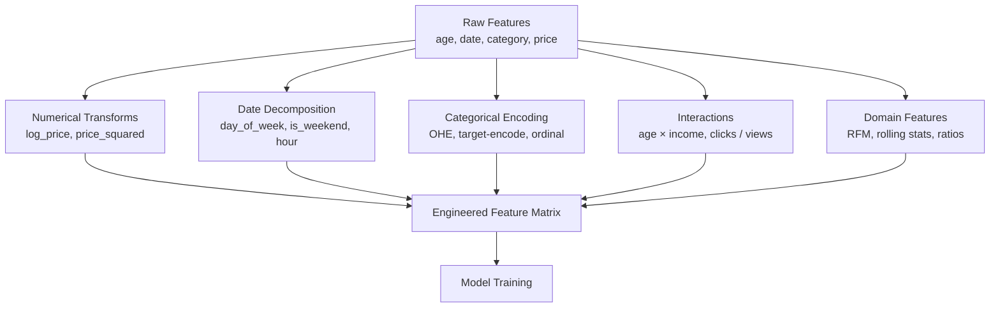

# 🔪 Feature Engineering

> [!abstract] TL;DR
> Feature engineering is the process of transforming raw data into features that better represent the underlying problem to predictive models, improving accuracy. It's often more impactful than algorithm choice. Techniques include polynomial features, interaction terms, log transforms, date decomposition, categorical encoding, and domain-specific constructions. The best features embed domain knowledge.

## Intuition — Analogy First

Think of a chef preparing ingredients for a meal. The raw vegetables from the garden are your raw data. But no chef throws whole, uncut, unseasoned vegetables into a dish. You peel, chop, marinate, season, and pre-cook specific ingredients in specific ways — depending on what dish you're making.

Feature engineering is the same: the raw data is your ingredient, and feature engineering is the mise en place — the preparation that makes the model's job possible. A model can't "discover" that `date` means anything without you first extracting `day_of_week`, `is_weekend`, `month`, `days_until_payday`. The model is the cooking; feature engineering is the prep.

**Why it matters more than algorithm choice:** A carefully engineered feature set with a linear model often beats raw features with a deep neural net. This is especially true for tabular data, where most real-world ML happens.

## How It Works — Mechanics

**1. Numerical Transformations:**
- **Log transform** — compress right-skewed distributions (income, price, population)
- **Polynomial features** — $x^2, x^3, x_1 x_2$ — capture non-linear relationships for linear models
- **Ratios** — `clicks / impressions = CTR`, `income / debt = DTI ratio`
- **Binning** — convert continuous to ordinal (`age → age_bucket: 0–18, 18–35, 35–65, 65+`)
- **Clipping/Winsorizing** — cap extreme values to reduce outlier influence

**2. Date/Time Features:**
- `hour`, `day_of_week`, `week_of_year`, `month`, `quarter`, `year`
- `is_weekend`, `is_holiday`, `days_since_last_event`
- `time_since_signup`, `days_until_deadline`
- Cyclical encoding: `sin(2π × hour/24)`, `cos(2π × hour/24)` — for circular time features

**3. Categorical Encoding:**
- **One-Hot Encoding (OHE)** — binary column per category; best for low-cardinality nominals
- **Ordinal Encoding** — integer code; for truly ordered categories (small < medium < large)
- **Target Encoding** — replace category with mean target value; high-cardinality with signal
- **Binary Encoding** — category → integer → binary bits; compact for high-cardinality
- **Frequency Encoding** — replace with count/frequency; useful when frequency carries signal

**4. Text Features:**
- Word count, character count, sentence count
- Contains specific keywords (binary flags)
- Readability score, sentiment score

**5. Domain-Specific Features:**
- E-commerce: Recency, Frequency, Monetary (RFM) from transaction history
- Finance: rolling means, volatility, momentum, Sharpe ratio
- Healthcare: age + diagnosis interaction, days_since_last_admission
- Geospatial: distance to nearest hospital, population density, census region



## The Math

**Polynomial features** expand $(x_1, x_2)$ to:
$$\phi(x) = [1, x_1, x_2, x_1^2, x_1 x_2, x_2^2, \ldots]$$

For degree 2 with d features, the number of output features is $\binom{d+2}{2} = \frac{(d+1)(d+2)}{2}$. Grows quadratically — be careful with d > 20.

**Cyclical encoding** for hour of day (0–23):
$$h_{\sin} = \sin\left(\frac{2\pi \cdot \text{hour}}{24}\right), \quad h_{\cos} = \cos\left(\frac{2\pi \cdot \text{hour}}{24}\right)$$

This ensures hour 23 is close to hour 0 (they're adjacent), which integer encoding violates.

**Log transform** — useful when the relationship between feature and target is multiplicative, not additive:
$$x_{\text{new}} = \log(x + 1)$$
(+1 to handle zeros). Compresses large values, expands small ones, making right-skewed distributions more Gaussian-like.

**Target encoding** for categorical feature $c$:
$$\hat{x}_c = \frac{\sum_{i: c_i = c} y_i}{|\{i: c_i = c\}|}$$
Apply smoothing with prior to handle rare categories: $\hat{x}_c = \frac{n_c \bar{y}_c + \lambda \bar{y}}{n_c + \lambda}$

## Code Demo

```python
import numpy as np
import pandas as pd
from sklearn.preprocessing import PolynomialFeatures, OrdinalEncoder, StandardScaler
from sklearn.preprocessing import TargetEncoder  # sklearn 1.3+
from sklearn.pipeline import Pipeline
from sklearn.compose import ColumnTransformer
import warnings
warnings.filterwarnings('ignore')

# --- Simulate e-commerce dataset ---
np.random.seed(42)
n = 1000
df = pd.DataFrame({
    'age': np.random.randint(18, 70, n),
    'income': np.random.exponential(50000, n),  # Right-skewed
    'signup_date': pd.date_range('2022-01-01', periods=n, freq='h'),
    'last_purchase_date': pd.date_range('2023-01-01', periods=n, freq='2h'),
    'category': np.random.choice(['electronics', 'clothing', 'food', 'books'], n),
    'size': np.random.choice(['small', 'medium', 'large'], n),
    'clicks': np.random.poisson(50, n),
    'impressions': np.random.poisson(500, n),
})
df['target'] = (df['age'] * 0.01 + df['income'] / 10000 +
                (df['category'] == 'electronics').astype(int) * 2 +
                np.random.normal(0, 1, n) > 3).astype(int)

# --- 1. Numerical transforms ---
df['log_income'] = np.log1p(df['income'])
df['income_sqroot'] = np.sqrt(df['income'])
df['age_squared'] = df['age'] ** 2

# --- 2. Date/time features ---
df['signup_hour'] = df['signup_date'].dt.hour
df['signup_dayofweek'] = df['signup_date'].dt.dayofweek
df['signup_month'] = df['signup_date'].dt.month
df['is_weekend'] = df['signup_dayofweek'].isin([5, 6]).astype(int)

# Cyclical encoding for hour
df['hour_sin'] = np.sin(2 * np.pi * df['signup_hour'] / 24)
df['hour_cos'] = np.cos(2 * np.pi * df['signup_hour'] / 24)

# Days since events
df['days_since_purchase'] = (pd.Timestamp.now() - df['last_purchase_date']).dt.days

# --- 3. Ratio features ---
df['ctr'] = df['clicks'] / (df['impressions'] + 1)  # +1 avoid division by zero
df['income_per_age'] = df['income'] / df['age']

# --- 4. Interaction features ---
df['age_income_interaction'] = df['age'] * df['log_income']

# --- 5. Categorical encoding ---
# One-hot encoding (low cardinality)
df_ohe = pd.get_dummies(df, columns=['category'], drop_first=True)

# Ordinal encoding
ord_enc = OrdinalEncoder(categories=[['small', 'medium', 'large']])
df['size_ordinal'] = ord_enc.fit_transform(df[['size']])

# Target encoding (high-cardinality categoricals)
# Simulate a high-cardinality feature
df['city'] = np.random.choice([f'city_{i}' for i in range(100)], n)
te = TargetEncoder(smooth='auto')
df['city_target_enc'] = te.fit_transform(df[['city']], df['target'])

# --- 6. Binning ---
df['age_bin'] = pd.cut(df['age'],
                        bins=[0, 25, 35, 50, 100],
                        labels=['18-25', '26-35', '36-50', '50+'])

# --- 7. Polynomial features ---
poly = PolynomialFeatures(degree=2, include_bias=False, interaction_only=True)
X_interact = poly.fit_transform(df[['age', 'log_income', 'ctr']])
print(f"Interaction features from 3 inputs: {X_interact.shape[1]} features")
print(f"Feature names: {poly.get_feature_names_out(['age', 'log_income', 'ctr'])}")

# --- 8. RFM Features (e-commerce) ---
# Recency: days since last purchase
# Frequency: number of purchases
# Monetary: total spend
df['rfm_recency'] = df['days_since_purchase']
df['rfm_frequency'] = np.random.poisson(5, n)  # simulated
df['rfm_monetary'] = np.random.exponential(200, n)  # simulated
# RFM score: rank each and sum
for col in ['rfm_recency', 'rfm_frequency', 'rfm_monetary']:
    df[f'{col}_rank'] = pd.qcut(df[col], q=5, labels=[1,2,3,4,5]).astype(int)
df['rfm_score'] = df['rfm_recency_rank'] + df['rfm_frequency_rank'] + df['rfm_monetary_rank']

print("\nEngineered features created:")
print(f"Original: 8 features")
print(f"After FE: {df.shape[1]} columns")

# --- 9. Featuretools for automated FE ---
# import featuretools as ft
# es = ft.EntitySet(id="ecommerce")
# es = es.add_dataframe(dataframe_name="transactions", dataframe=df, index="id")
# feature_matrix, features = ft.dfs(entityset=es, target_dataframe_name="transactions",
#                                     max_depth=2)
```

## Real-World Example

**Uber Surge Pricing:**
Uber engineers use time-based features to predict demand and set surge prices. Raw datetime is useless — but `hour_of_day`, `day_of_week`, `is_weekend`, `is_holiday`, `minutes_until_rush_hour`, `days_since_last_surge_event` are powerful predictors. They also create interaction features: `hour × day_type` (rush hour on weekdays vs weekends has different demand patterns). The model itself is a gradient boosted tree — but 80% of the work is in feature engineering.

**E-commerce RFM Segmentation:**
Amazon and other retailers use Recency-Frequency-Monetary features constructed from raw transaction logs for customer lifetime value prediction and churn modeling. A customer who bought 3 days ago (low recency), 10 times (high frequency), for $500 total (high monetary) has a completely different profile than someone who bought once 365 days ago for $10. These aren't in the raw data — they must be engineered.

## Trade-offs

| Aspect | Pro | Con |
|---|---|---|
| Model performance | Often the highest-ROI improvement | Time-intensive; requires domain knowledge |
| Interpretability | Engineered features can be more intuitive | Can create redundant/correlated features |
| Generalization | Domain features generalize across model types | Overfitting risk if features are too specific |
| Automation (featuretools) | Scales feature search | Can generate thousands of irrelevant features |
| Polynomial/interaction | Captures non-linear relationships for linear models | Exponential feature explosion for high-d inputs |

## When to Use vs Avoid

**Use Feature Engineering when:**
- Working with tabular data (it always helps)
- Linear models or shallow trees are your baseline
- You have domain expertise to create meaningful features
- The raw features are timestamps, IDs, free text that models can't use directly
- High-cardinality categoricals need smarter encoding than OHE

**Reduce effort on FE when:**
- Working with images, audio, raw text — use deep learning architectures that learn features automatically
- Using XGBoost/LightGBM — tree models handle monotonic transforms and interactions natively
- Dataset is very small — engineered features may overfit with few examples

## Common Pitfalls

1. **Target leakage** — engineering a feature that uses future information or the target itself. The most dangerous bug in ML. Example: including `is_default` in loan approval features when predicting default.

2. **Not applying transforms consistently to train/test** — fit target encoders and scalers on train only; apply to test. Use sklearn `Pipeline` to enforce this.

3. **Feature explosion with polynomial features** — degree=3 on 100 features → 176,851 features. Apply on a curated small feature set only.

4. **Encoding ordinal as nominal** — using OHE on "small/medium/large" loses the ordering. Use `OrdinalEncoder`.

5. **Ignoring infinity/NaN from ratio features** — `x / y` where y can be 0 creates inf/NaN. Always add a small constant to denominators.

6. **Building features without business validation** — a feature that's statistically correlated but makes no business sense is often spurious. Validate with domain experts.

## Related Concepts

- [[_MOC_Classical_ML|↑ Section MOC]]

- [[Feature_Selection]] — after engineering, select the most informative subset
- [[Regularization]] — combats overfitting when you've created many features
- [[Handling_Imbalanced_Data]] — class imbalance is a data quality issue often addressed alongside FE
- [[Linear_Regression]] — benefits most from good feature engineering (vs tree models)
- [[PCA]] — an automated way to create linear combinations of features

## Review Questions

1. You have a `timestamp` column and want to capture that people shop more on Friday evenings. What specific features would you engineer from `timestamp`, and why are these better than using the raw timestamp integer?

2. You're encoding a `city` column with 500 unique values for a classification task. Compare one-hot encoding and target encoding for this column — when would you prefer each, and what risk does target encoding introduce?

3. A model trained on your features performs 20% better on training data than test data. You have 200 features, 50 of which are polynomial interactions. What's likely happening, and what are two ways to fix it using feature engineering techniques?

## Sources

- Zheng, A. & Casari, A. (2018). *Feature Engineering for Machine Learning*. O'Reilly Media.
- Kuhn, M. & Johnson, K. (2019). *Feature Engineering and Selection: A Practical Approach for Predictive Models*. CRC Press.
- Kanter, J.M. & Veeramachaneni, K. (2015). "Deep feature synthesis." *DSAA 2015* (Featuretools paper).
- Scikit-learn: [Preprocessing](https://scikit-learn.org/stable/modules/preprocessing.html)

#feature-engineering #preprocessing #tabular-data #encoding #polynomial-features #rfm
