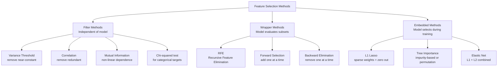

# 🧹 Feature Selection

> [!abstract] TL;DR
> Feature selection identifies and retains only the most informative features for a model, discarding redundant or irrelevant ones. Three categories: filter methods (rank by statistics, independent of model), wrapper methods (use model performance to evaluate subsets), and embedded methods (model learns which features matter during training). Reduces overfitting, speeds up training, and improves interpretability.

## Intuition — Analogy First

Imagine moving to a new house. You don't take everything from your old home — you declutter. You keep what matters (furniture, clothes, documents), discard what's redundant (three identical spatulas), and throw away what's irrelevant (broken appliances). Your new home has only what you need — it's organized, navigable, and nothing is distracting.

Feature selection is decluttering for your dataset. Redundant features (highly correlated with another feature) are three spatulas. Irrelevant features (no predictive power) are broken appliances. Keeping them wastes space (memory), slows cooking (training), and makes it harder to find what you need (interpretation).

**The key insight:** More features ≠ better model. Adding irrelevant or noisy features:
- Increases variance (overfitting risk)
- Slows training and inference
- Makes interpretation harder
- Hurts distance-based methods (curse of dimensionality)
- Can hurt even powerful models like gradient boosting

## How It Works — Mechanics

**Three families of methods:**

**1. Filter Methods** — score features independently of the learning algorithm
- Fast, scalable, model-agnostic
- Don't account for feature interactions
- Examples: correlation, mutual information, chi-squared, ANOVA F-test, variance threshold

**2. Wrapper Methods** — use a model to evaluate subsets of features
- Computationally expensive but account for interactions
- Examples: Recursive Feature Elimination (RFE), forward selection, backward elimination

**3. Embedded Methods** — feature selection occurs as part of model training
- Efficient (no extra training runs)
- Examples: L1 (Lasso) regularization, tree feature importance, elastic net



**Recursive Feature Elimination (RFE):**
1. Train model on all features
2. Rank features by importance (coefficients or impurity)
3. Remove the least important feature
4. Repeat until target number of features reached
Use `RFECV` to automatically choose the best number of features via cross-validation.

**Permutation Importance:**
For each feature, randomly shuffle its values and measure the drop in model performance. Features that don't hurt performance when shuffled = unimportant. Model-agnostic and more reliable than impurity-based importance.

## The Math

**Pearson Correlation** (filter method, linear relationships):
$$r = \frac{\sum_i (x_i - \bar{x})(y_i - \bar{y})}{\sqrt{\sum_i (x_i - \bar{x})^2 \sum_i (y_i - \bar{y})^2}}$$

Threshold: remove features where $|r| > 0.9$ with another feature (multicollinearity).

**Mutual Information** (filter method, captures non-linear dependence):
$$I(X; Y) = \sum_{x,y} p(x,y) \log\frac{p(x,y)}{p(x)p(y)}$$

$I(X;Y) = 0$ iff $X$ and $Y$ are independent. Always non-negative. Works for any dependency structure.

**Variance Threshold:**
Remove feature $j$ if $\text{Var}(X_j) < \text{threshold}$. Near-constant features carry no information.

**L1 (Lasso) for feature selection:**
$$\hat{\beta} = \arg\min_\beta \|y - X\beta\|^2 + \lambda \|\beta\|_1$$

The $\ell_1$ penalty drives many $\beta_j$ exactly to zero — those features are effectively deselected. Increasing $\lambda$ selects fewer features.

**ANOVA F-statistic** (filter for continuous features with categorical target):
$$F = \frac{\text{between-group variance}}{\text{within-group variance}} = \frac{\sum_k n_k (\bar{x}_k - \bar{x})^2 / (K-1)}{\sum_k \sum_{i \in C_k} (x_i - \bar{x}_k)^2 / (n-K)}$$

High F = feature separates classes well.

## Code Demo

```python
import numpy as np
import pandas as pd
import matplotlib.pyplot as plt
from sklearn.datasets import load_breast_cancer
from sklearn.feature_selection import (
    SelectKBest, f_classif, mutual_info_classif,
    VarianceThreshold, RFE, RFECV, SelectFromModel
)
from sklearn.linear_model import Lasso, LogisticRegression
from sklearn.ensemble import RandomForestClassifier, GradientBoostingClassifier
from sklearn.preprocessing import StandardScaler
from sklearn.model_selection import cross_val_score, StratifiedKFold
from sklearn.inspection import permutation_importance

# Load data
cancer = load_breast_cancer()
X, y = cancer.data, cancer.target
feature_names = cancer.feature_names
X_scaled = StandardScaler().fit_transform(X)

print(f"Original features: {X.shape[1]}")

# ============================================================
# 1. FILTER METHODS
# ============================================================

# Variance Threshold — remove near-constant features
vt = VarianceThreshold(threshold=0.01)
X_vt = vt.fit_transform(X_scaled)
print(f"After variance threshold: {X_vt.shape[1]} features")

# ANOVA F-test (for classification)
selector_f = SelectKBest(f_classif, k=10)
X_f = selector_f.fit_transform(X_scaled, y)
f_scores = selector_f.scores_
top10_f = feature_names[np.argsort(f_scores)[::-1][:10]]
print(f"\nTop 10 by F-test: {list(top10_f)}")

# Mutual Information (non-linear)
selector_mi = SelectKBest(mutual_info_classif, k=10)
X_mi = selector_mi.fit_transform(X_scaled, y)
mi_scores = selector_mi.scores_
top10_mi = feature_names[np.argsort(mi_scores)[::-1][:10]]
print(f"Top 10 by MI:     {list(top10_mi)}")

# Correlation-based removal
corr_matrix = pd.DataFrame(X_scaled, columns=feature_names).corr().abs()
upper = corr_matrix.where(np.triu(np.ones(corr_matrix.shape), k=1).astype(bool))
to_drop = [col for col in upper.columns if any(upper[col] > 0.9)]
print(f"\nFeatures to drop (correlation > 0.9): {len(to_drop)}")

# ============================================================
# 2. WRAPPER METHODS
# ============================================================

# RFE with Logistic Regression
lr = LogisticRegression(max_iter=1000, random_state=42)
rfe = RFE(estimator=lr, n_features_to_select=10, step=1)
X_rfe = rfe.fit_transform(X_scaled, y)
rfe_selected = feature_names[rfe.support_]
print(f"\nRFE selected features: {list(rfe_selected)}")

# RFECV — automatically selects optimal number of features
rfecv = RFECV(
    estimator=lr,
    step=1,
    cv=StratifiedKFold(5),
    scoring='accuracy',
    min_features_to_select=1,
    n_jobs=-1
)
rfecv.fit(X_scaled, y)
print(f"RFECV optimal features: {rfecv.n_features_}")

plt.figure(figsize=(8, 4))
plt.plot(range(1, len(rfecv.cv_results_['mean_test_score']) + 1),
         rfecv.cv_results_['mean_test_score'])
plt.xlabel("Number of features selected")
plt.ylabel("Cross-validation accuracy")
plt.title("RFECV: Accuracy vs Number of Features")
plt.axvline(rfecv.n_features_, color='r', linestyle='--',
            label=f'Optimal: {rfecv.n_features_}')
plt.legend()
plt.tight_layout()
plt.show()

# ============================================================
# 3. EMBEDDED METHODS
# ============================================================

# L1/Lasso for feature selection
lasso = LogisticRegression(penalty='l1', solver='liblinear', C=0.5)
sfm_lasso = SelectFromModel(lasso)
X_lasso = sfm_lasso.fit_transform(X_scaled, y)
lasso_selected = feature_names[sfm_lasso.get_support()]
print(f"\nLasso selected {len(lasso_selected)} features: {list(lasso_selected)}")

# Tree importance (Random Forest)
rf = RandomForestClassifier(n_estimators=100, random_state=42)
rf.fit(X_scaled, y)
importances = rf.feature_importances_
sorted_idx = np.argsort(importances)[::-1]

plt.figure(figsize=(10, 5))
plt.bar(range(X.shape[1]), importances[sorted_idx])
plt.xticks(range(X.shape[1]), feature_names[sorted_idx], rotation=90, fontsize=8)
plt.title("Random Forest Feature Importances")
plt.tight_layout()
plt.show()

# Permutation Importance (model-agnostic, more reliable)
perm_imp = permutation_importance(rf, X_scaled, y, n_repeats=10, random_state=42)
perm_sorted = np.argsort(perm_imp.importances_mean)[::-1]

plt.figure(figsize=(10, 5))
plt.boxplot(perm_imp.importances[perm_sorted[:10]].T,
            labels=feature_names[perm_sorted[:10]])
plt.xticks(rotation=45, ha='right', fontsize=8)
plt.title("Permutation Importance (top 10 features)")
plt.tight_layout()
plt.show()

# ============================================================
# 4. COMPARE METHODS
# ============================================================
cv = StratifiedKFold(5, shuffle=True, random_state=42)

methods = {
    'All features': X_scaled,
    'F-test top 10': X_f,
    'MI top 10': X_mi,
    'RFECV optimal': rfecv.transform(X_scaled),
    'Lasso embedded': X_lasso,
}

for name, X_sub in methods.items():
    lr_eval = LogisticRegression(max_iter=1000, random_state=42)
    score = cross_val_score(lr_eval, X_sub, y, cv=cv, scoring='accuracy').mean()
    print(f"{name:20s}: {X_sub.shape[1]:3d} features, accuracy = {score:.3f}")
```

## Real-World Example

**Genomics — High-Dimensional Feature Selection:**
A genomics study measures expression levels of 20,000 genes across 200 cancer patients to predict treatment response (binary). With n=200 and d=20,000, you're in extreme high-dimension territory (d >> n). Running any standard model directly will overfit catastrophically. The standard pipeline:
1. Variance threshold to remove genes with no variation across samples (→ ~15,000)
2. Mutual information filter to select top 1,000 genes most associated with response
3. L1 Lasso embedded selection to further reduce to ~50 genes
4. Final model on 50 genes

The resulting 50 genes are often clinically interpretable and become candidates for biomarker validation.

**Credit Scoring — Regulatory Feature Selection:**
Banks must justify every feature used in credit models to regulators. A feature selection pipeline that identifies the minimal feature set achieving near-maximal performance is therefore both an ML and compliance requirement. Permutation importance identifies which of 200 raw features are actually driving predictions, and features that contribute < 0.1% importance can be dropped with minimal performance impact.

## Trade-offs

| Method | Speed | Accounts for interactions | Model-dependent | Best for |
|---|---|---|---|---|
| Filter (variance, MI) | Very fast | No | No | Quick baseline, large d |
| Filter (correlation) | Fast | No | No | Removing redundancy |
| Wrapper (RFE) | Slow | Yes | Yes | Small-medium datasets |
| Wrapper (RFECV) | Slowest | Yes | Yes | Optimal K selection |
| Embedded (Lasso) | Fast | Partially | Yes (linear) | High-d, want sparsity |
| Embedded (RF importance) | Medium | Yes | Yes (trees) | Non-linear interactions |
| Permutation importance | Medium | Yes | Yes | Most reliable ranking |

## When to Use vs Avoid

**Use Feature Selection when:**
- n << d (more features than samples — genomics, text)
- Need interpretable model with few features
- Inference time is constrained (fewer features = faster predictions)
- Features include ID columns, noise columns, or near-constants
- Regularization isn't sufficient to handle multicollinearity

**Reduce emphasis when:**
- Deep learning on raw data (images, text) — the model learns features
- XGBoost/LightGBM with thousands of trees — they handle irrelevant features well
- Dataset is very small — feature selection can introduce selection bias

## Common Pitfalls

1. **Doing feature selection before train/test split** — fitting a selector on the full dataset leaks test information. Always fit inside a CV loop or Pipeline.

2. **Confusing filter selection with causality** — a feature ranked high by mutual information is correlated with the target, not necessarily causal. Never drop "irrelevant" features from a causal analysis.

3. **Using impurity-based tree importance for categorical features** — sklearn's `feature_importances_` is biased toward high-cardinality features. Use permutation importance instead.

4. **Selecting a fixed K without cross-validation** — use `RFECV` or hyperparameter search over K to find the optimal number of features.

5. **Removing correlated features without analysis** — two correlated features might represent different aspects of the same concept that are both useful. Check if removing one hurts performance.

## Related Concepts

- [[_MOC_Classical_ML|↑ Section MOC]]

- [[Feature_Engineering]] — creates features; selection decides which to keep
- [[Regularization]] — L1 and elastic net are embedded selection methods; [[Regularization]] covers the theory
- [[PCA]] — creates new features by combining old ones; unlike selection, PCA doesn't retain original features
- [[Random_Forests]] — tree-based importance is one of the best embedded selection methods
- [[Bias_Variance_Tradeoff]] — feature selection reduces variance at the cost of potentially increasing bias

## Review Questions

1. You use mutual information to rank 500 features and select the top 20, then train and evaluate your model on a test set. Your manager says the pipeline has data leakage. Where exactly is the leakage, and how do you fix it?

2. A Random Forest reports that feature X has importance 0.0005 (near zero). A colleague says you should remove it. What additional test would you run before removing it, and what could the importance score be missing?

3. Compare the use of L1 Lasso and RFE for feature selection on a dataset with 10,000 features. Which would you run first and why? What does each method do that the other cannot?

## Sources

- Guyon, I. & Elisseeff, A. (2003). "An introduction to variable and feature selection." *Journal of Machine Learning Research*, 3, 1157–1182.
- Breiman, L. (2001). "Random Forests." *Machine Learning*, 45(1), 5–32.
- Tibshirani, R. (1996). "Regression shrinkage and selection via the lasso." *JRSS-B*, 58(1), 267–288.
- Scikit-learn: [Feature Selection](https://scikit-learn.org/stable/modules/feature_selection.html)
- Strobl, C. et al. (2007). "Bias in random forest variable importance measures." *BMC Bioinformatics*, 8(1), 25.

#feature-selection #preprocessing #filter-methods #wrapper-methods #embedded-methods #lasso #rfe
