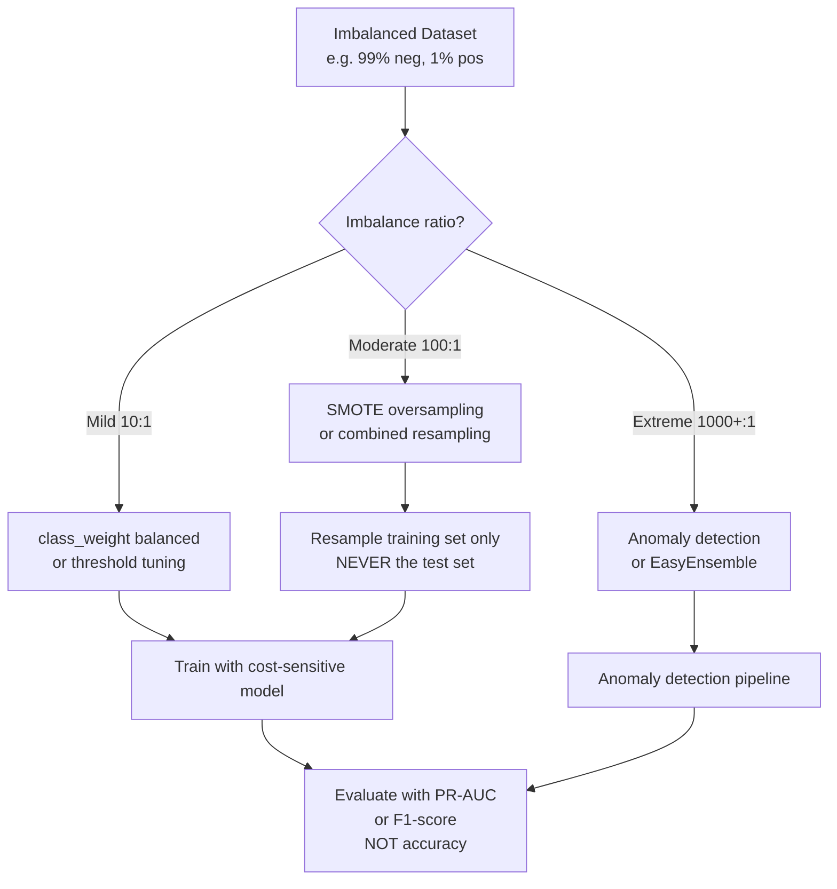

# ⚖️ Handling Imbalanced Data

> [!abstract] TL;DR
> When one class is far more common than another (e.g., 99% negative, 1% positive), standard models optimize for accuracy by predicting the majority class almost always — which is useless. Solutions: resampling (SMOTE oversampling, undersampling), cost-sensitive learning (`class_weight='balanced'`), threshold tuning, and using precision-recall metrics instead of accuracy. The right fix depends on why you care about the minority class.

## Intuition — Analogy First

Imagine a classroom exam where 99 out of 100 students pass and only 1 fails. A teacher who marks every single student as "pass" gets 99% accuracy. This teacher is useless — they've learned nothing about what distinguishes failure from success; they've just learned to always say "pass."

That's exactly what a model trained naively on imbalanced data does. It finds that always predicting "not fraud," "not cancer," "not failure" achieves 99%+ accuracy, so that's the path of least resistance. The model never learns to recognize the rare but critical events.

**Why it matters most:** The minority class is usually the *reason* you're building the model. In fraud detection, you care intensely about catching the 0.1% of fraudulent transactions. A model with 99.9% accuracy that never flags fraud is catastrophically worse than a model with 95% accuracy that catches 80% of fraud.

## How It Works — Mechanics

**Diagnosis first:**
- Check `y.value_counts()` — is the ratio 10:1? 100:1? 1000:1?
- Look at your evaluation metric — if using accuracy, switch to precision, recall, F1, or AUC-PR now
- Understand the cost asymmetry: is a false negative (missed fraud) worse than a false positive (flagged legitimate transaction)?

**Solutions:**

**1. Resampling the Training Set:**
- **Oversampling** — duplicate or synthesize minority class samples (SMOTE)
- **Undersampling** — remove majority class samples (random, Tomek links, ENN)
- **Combined** — oversample minority + undersample majority

**SMOTE (Synthetic Minority Over-sampling Technique):**
Instead of duplicating minority points, SMOTE creates *synthetic* samples by interpolating between existing minority points and their k-nearest minority neighbors:
$$x_{\text{new}} = x_i + \lambda \cdot (x_{nn} - x_i), \quad \lambda \sim U(0,1)$$

**2. Algorithm-Level Solutions:**
- `class_weight='balanced'` — automatically sets class weights inversely proportional to frequency: $w_i = \frac{n}{K \cdot n_i}$
- `scale_pos_weight` (XGBoost) — equivalent weight parameter
- Cost-sensitive learning — assign higher misclassification cost to minority class

**3. Threshold Tuning:**
Default decision threshold is 0.5. For imbalanced data, lower it to catch more minority instances. Use the precision-recall curve to choose a threshold that balances precision and recall for your use case.

**4. Algorithm Choice:**
- Ensemble methods (Random Forest, GBM) with `class_weight` are robust
- Anomaly detection approaches (Isolation Forest, One-Class SVM) for extreme imbalance (< 0.1%)
- `BalancedBaggingClassifier` or `EasyEnsembleClassifier` from imbalanced-learn



## The Math

**Class weight formula (balanced):**
$$w_k = \frac{n_{\text{total}}}{K \cdot n_k}$$

Where $n_{\text{total}}$ = total samples, $K$ = number of classes, $n_k$ = samples in class $k$.

**Example:** 900 negative, 100 positive. $w_{\text{neg}} = 1000/(2×900) = 0.56$, $w_{\text{pos}} = 1000/(2×100) = 5.0$. Minority class errors are penalized 5x more.

**SMOTE synthesis:**
$$x_{\text{new}} = x_i + \lambda \cdot (x_{\text{kNN}} - x_i), \quad \lambda \sim \text{Uniform}(0, 1)$$

**Precision and Recall** (the right metrics):
$$\text{Precision} = \frac{TP}{TP + FP}, \quad \text{Recall} = \frac{TP}{TP + FN}$$

$$F_\beta = (1 + \beta^2) \cdot \frac{\text{precision} \cdot \text{recall}}{(\beta^2 \cdot \text{precision}) + \text{recall}}$$

$\beta = 1$: equal weight (F1). $\beta = 2$: recall weighted 2x (use when missing a positive is worse). $\beta = 0.5$: precision weighted 2x.

**PR-AUC** (area under precision-recall curve):
Better than ROC-AUC for imbalanced datasets. ROC-AUC can be misleadingly high when the majority class is easy to classify. PR-AUC focuses on the minority class performance.

## Code Demo

```python
import numpy as np
import pandas as pd
import matplotlib.pyplot as plt
from sklearn.datasets import make_classification
from sklearn.linear_model import LogisticRegression
from sklearn.ensemble import RandomForestClassifier
from sklearn.metrics import (classification_report, confusion_matrix,
                              roc_auc_score, average_precision_score,
                              precision_recall_curve, RocCurveDisplay)
from sklearn.model_selection import train_test_split, StratifiedKFold
from imblearn.over_sampling import SMOTE, ADASYN
from imblearn.under_sampling import RandomUnderSampler, TomekLinks
from imblearn.combine import SMOTETomek
from imblearn.pipeline import Pipeline as ImbPipeline
from sklearn.preprocessing import StandardScaler

# --- Create highly imbalanced dataset (100:1 ratio) ---
X, y = make_classification(
    n_samples=10000, n_features=20, n_informative=5,
    n_redundant=5, weights=[0.99, 0.01], random_state=42
)
print(f"Class distribution: {np.bincount(y)} ({100*y.mean():.1f}% positive)")

X_train, X_test, y_train, y_test = train_test_split(
    X, y, test_size=0.2, random_state=42, stratify=y
)

# ============================================================
# Demonstrate the naive accuracy problem
# ============================================================
lr_naive = LogisticRegression(max_iter=1000)
lr_naive.fit(X_train, y_train)
y_pred_naive = lr_naive.predict(X_test)

print("\n--- Naive Logistic Regression ---")
print(classification_report(y_test, y_pred_naive))
print(f"ROC-AUC:  {roc_auc_score(y_test, lr_naive.predict_proba(X_test)[:,1]):.3f}")
print(f"PR-AUC:   {average_precision_score(y_test, lr_naive.predict_proba(X_test)[:,1]):.3f}")

# ============================================================
# Solution 1: class_weight='balanced'
# ============================================================
lr_weighted = LogisticRegression(class_weight='balanced', max_iter=1000)
lr_weighted.fit(X_train, y_train)
y_pred_weighted = lr_weighted.predict(X_test)
print("\n--- class_weight='balanced' ---")
print(classification_report(y_test, y_pred_weighted))
print(f"PR-AUC: {average_precision_score(y_test, lr_weighted.predict_proba(X_test)[:,1]):.3f}")

# ============================================================
# Solution 2: SMOTE (only on training data!)
# ============================================================
smote = SMOTE(k_neighbors=5, random_state=42)
X_train_smote, y_train_smote = smote.fit_resample(X_train, y_train)
print(f"\nAfter SMOTE: {np.bincount(y_train_smote)} ({100*y_train_smote.mean():.1f}% pos)")

lr_smote = LogisticRegression(max_iter=1000)
lr_smote.fit(X_train_smote, y_train_smote)
print("\n--- SMOTE + Logistic Regression ---")
print(classification_report(y_test, lr_smote.predict(X_test)))
print(f"PR-AUC: {average_precision_score(y_test, lr_smote.predict_proba(X_test)[:,1]):.3f}")

# ============================================================
# Solution 3: SMOTETomek (combined)
# ============================================================
smotetomek = SMOTETomek(random_state=42)
X_train_st, y_train_st = smotetomek.fit_resample(X_train, y_train)

# ============================================================
# Solution 4: imbalanced-learn Pipeline (prevents leakage)
# ============================================================
pipe = ImbPipeline([
    ('scaler', StandardScaler()),
    ('smote', SMOTE(random_state=42)),
    ('clf', LogisticRegression(max_iter=1000))
])
pipe.fit(X_train, y_train)
y_pred_pipe = pipe.predict(X_test)
print("\n--- Imbalanced Pipeline ---")
print(f"PR-AUC: {average_precision_score(y_test, pipe.predict_proba(X_test)[:,1]):.3f}")

# ============================================================
# Solution 5: Threshold tuning
# ============================================================
probs = lr_weighted.predict_proba(X_test)[:, 1]
precisions, recalls, thresholds = precision_recall_curve(y_test, probs)

# Find threshold that maximizes F1
f1_scores = 2 * precisions * recalls / (precisions + recalls + 1e-9)
best_thresh_idx = np.argmax(f1_scores)
best_threshold = thresholds[best_thresh_idx]
print(f"\nOptimal threshold: {best_threshold:.3f}")
print(f"At this threshold: precision={precisions[best_thresh_idx]:.3f}, "
      f"recall={recalls[best_thresh_idx]:.3f}, "
      f"F1={f1_scores[best_thresh_idx]:.3f}")

# Apply threshold
y_pred_tuned = (probs >= best_threshold).astype(int)
print(classification_report(y_test, y_pred_tuned))

# ============================================================
# Comparison plot: PR curves for all methods
# ============================================================
fig, axes = plt.subplots(1, 2, figsize=(14, 5))

# PR curves
methods = {
    'Naive LR': lr_naive,
    'Balanced LR': lr_weighted,
    'SMOTE LR': lr_smote,
}
for name, model in methods.items():
    p, r, _ = precision_recall_curve(y_test, model.predict_proba(X_test)[:,1])
    auc = average_precision_score(y_test, model.predict_proba(X_test)[:,1])
    axes[0].plot(r, p, label=f'{name} (AUC={auc:.3f})')
axes[0].set_xlabel('Recall')
axes[0].set_ylabel('Precision')
axes[0].set_title('Precision-Recall Curves')
axes[0].legend()
axes[0].set_xlim(0, 1)
axes[0].set_ylim(0, 1)

# Threshold tuning visualization
axes[1].plot(thresholds, precisions[:-1], label='Precision')
axes[1].plot(thresholds, recalls[:-1], label='Recall')
axes[1].plot(thresholds, f1_scores[:-1], label='F1')
axes[1].axvline(best_threshold, color='r', linestyle='--',
                label=f'Best threshold={best_threshold:.2f}')
axes[1].set_xlabel('Decision Threshold')
axes[1].set_title('Threshold Tuning')
axes[1].legend()

plt.tight_layout()
plt.show()
```

## Real-World Example

**Fraud Detection at Payment Networks:**
Visa and Mastercard process ~500M transactions per day; approximately 0.1% are fraudulent. A naive model that never predicts fraud achieves 99.9% accuracy. Their actual systems use a combination of:
1. `scale_pos_weight` in XGBoost (class weight equivalent)
2. SMOTE or ADASYN for rare fraud pattern types
3. Multiple decision thresholds: a high-precision model flags certain transactions for block; a high-recall model flags others for human review
4. Evaluation via F2-score (recall-weighted) and dollar value of caught fraud per false positive

**Medical Diagnosis — Rare Diseases:**
A dataset of 10,000 patients: 9,900 healthy, 100 with a rare autoimmune condition. Using SMOTE on the minority class and `class_weight='balanced'` in a Random Forest achieves recall of 0.85 on the disease class (vs 0.12 with naive logistic regression), meaning 85% of sick patients are correctly identified. The PR-AUC jumps from 0.31 to 0.79.

## Trade-offs

| Method | Best for | Risk |
|---|---|---|
| `class_weight='balanced'` | Quick fix; any sklearn model | May reduce majority class performance |
| SMOTE | Moderate imbalance (10:1 to 100:1) | Can create noise in high-d spaces |
| Undersampling | Very large datasets; fast | Loses majority class information |
| SMOTETomek | Cleaner decision boundary | Slower; more hyperparameters |
| Threshold tuning | Fine-tuning any model post-hoc | Doesn't change the model, only the cutoff |
| Anomaly detection | Extreme imbalance (> 1000:1) | Different problem formulation; no probabilities |

## When to Use vs Avoid

**Use imbalance handling when:**
- Minority class is what you care about predicting
- Accuracy is showing inflated scores you don't trust
- Precision-recall AUC is much lower than ROC-AUC
- Cost of false negatives >> cost of false positives

**Proceed carefully when:**
- Imbalance reflects true prevalence that should be respected
- You have enough minority examples (> 1000) — SMOTE may not help much
- Using deep learning — class weights are usually sufficient

## Common Pitfalls

1. **Resampling the test set** — NEVER apply SMOTE or undersampling to test data. The test set must reflect real-world class distribution. Only resample the training set.

2. **Using accuracy as the primary metric** — for 99:1 imbalance, a 99% accuracy model might catch 0% of minority instances. Switch to F1, PR-AUC, or F2.

3. **Applying SMOTE before train/test split** — if you resample before splitting, synthetic test points will be interpolations of training points → data leakage. Always: split first, then resample training only. Use `imbalanced-learn` Pipeline.

4. **Ignoring cost asymmetry** — in fraud detection, missing a fraud (FN) may cost $10,000; a false alert (FP) costs $5 in human review time. Build the cost asymmetry into your loss function or threshold, not just your metric.

5. **Using SMOTE in very high-dimensional spaces** — SMOTE interpolates between nearest neighbors. In 1000+ dimensions, nearest neighbors can be meaningless. Prefer class weighting.

## Related Concepts

- [[_MOC_Classical_ML|↑ Section MOC]]

- [[Classification_Metrics]] — precision, recall, F1, ROC-AUC, PR-AUC are the right tools here
- [[ROC_and_AUC]] — ROC-AUC vs PR-AUC; why PR-AUC is better for imbalanced data
- [[Random_Forests]] — `class_weight='balanced'` works naturally with forest methods
- [[Feature_Engineering]] — sometimes engineering better features eliminates the need for resampling
- [[Ensemble_Methods]] — BalancedBaggingClassifier wraps any base classifier with undersampling

## Review Questions

1. You train a fraud detection model and report 99.5% accuracy. Your manager is impressed. What single calculation would immediately reveal whether this is a good model or a useless one, and why?

2. A colleague applies SMOTE to the entire dataset before doing a 5-fold cross-validation split. What is wrong with this approach, and what is the correct procedure?

3. For a cancer screening model, a radiologist says "I'd rather have 10 false alarms than miss one real cancer." Translate this into a specific choice of: (a) evaluation metric and (b) decision threshold strategy.

## Sources

- Chawla, N.V., Bowyer, K.W., Hall, L.O., & Kegelmeyer, W.P. (2002). "SMOTE: Synthetic minority over-sampling technique." *JAIR*, 16, 321–357.
- Japkowicz, N. & Stephen, S. (2002). "The class imbalance problem: A systematic study." *Intelligent Data Analysis*, 6(5), 429–449.
- Imbalanced-learn documentation: https://imbalanced-learn.org/
- He, H. & Garcia, E.A. (2009). "Learning from imbalanced data." *IEEE TKDE*, 21(9), 1263–1284.
- Saito, T. & Rehmsmeier, M. (2015). "The precision-recall plot is more informative than the ROC plot when evaluating binary classifiers on imbalanced datasets." *PLOS ONE*.

#imbalanced-data #smote #class-imbalance #fraud-detection #precision-recall #oversampling #undersampling
