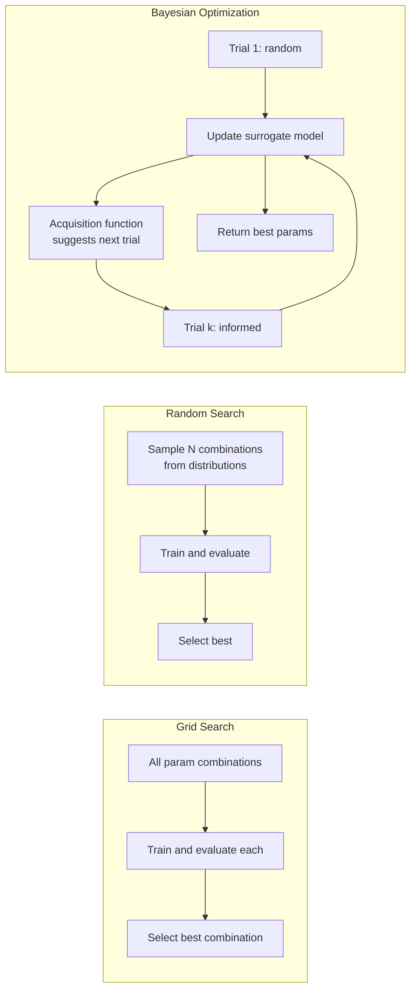

# 🔧 Hyperparameter Tuning

> [!abstract] TL;DR
> Hyperparameters are settings that control the learning process but are not learned from data (e.g., learning rate, depth of trees, regularization strength). Tuning finds the best combination. Grid search is exhaustive but exponentially expensive. Random search is surprisingly effective for high-dimensional spaces. Bayesian optimization (Optuna, Hyperopt) models the search space itself to direct trials toward promising regions — most efficient for expensive models.

## Intuition — Analogy First

Imagine perfecting a recipe for a complex dish. The oven temperature, baking time, amount of salt, and ratio of ingredients — you can't compute the perfect values from first principles. You have to try different combinations and taste the result.

You could try all combinations systematically (grid search) — every temperature (100°, 110°, 120°...) × every salt amount × every time. But with 5 parameters each with 10 values, that's 100,000 batches of food. Not practical.

Random search is more pragmatic — try 200 random combinations from the space. Bayesian optimization is a smart baker who remembers that salty + high temperature burned the last 3 batches, so they avoid that region and try something new. They build a model of "what setting combinations tend to work," using past experiments to direct future ones.

**The critical distinction:**
- **Parameters** are learned from data: model weights, tree splits, regression coefficients
- **Hyperparameters** are set before training: learning rate, regularization strength, tree depth, number of neighbors

## How It Works — Mechanics

**Grid Search:**
- Define a discrete grid over all hyperparameter combinations
- Train and cross-validate every combination
- Select the combination with best CV score
- Complexity: $O(\prod_i |V_i|)$ where $|V_i|$ is the number of values for hyperparameter $i$
- Good for: ≤ 3 hyperparameters, relatively cheap models

**Random Search:**
- Define distributions (not discrete grids) for each hyperparameter
- Sample and evaluate N random combinations
- Key insight (Bergstra & Bengio 2012): if only a few hyperparameters actually matter, random search finds good values faster than grid search by not wasting budget on irrelevant dimensions
- Rule of thumb: random search with 60 trials finds a value in the top 5% with 95% probability for the important hyperparameters

**Bayesian Optimization:**
- Maintain a **surrogate model** (Gaussian Process or Tree Parzen Estimator) of the objective function (CV score as a function of hyperparameters)
- Use an **acquisition function** to decide which hyperparameter combination to try next: balance exploration (uncertain regions) and exploitation (known good regions)
- After each trial, update the surrogate model with new information
- Convergence is much faster than random search for expensive models (20–50 trials often sufficient)

**Population-Based Training (PBT):**
- Evolves a population of models simultaneously
- Bad models inherit hyperparameters from good models with small random mutations
- Can adapt hyperparameters *during* training (schedules evolve naturally)
- Used in DeepMind's RL research



## The Math

**Random Search efficiency** (Bergstra & Bengio insight):
If $k$ hyperparameters actually matter and $n-k$ are irrelevant, with a budget of $B$ trials:
- Grid search: wastes $B^{n-k}/B^n$ of budget on irrelevant dimensions
- Random search: effectively allocates $B$ trials over the $k$ important dimensions regardless of $n$

For $n=9$, $k=2$, $B=60$: grid search with 3 values per hyperparameter tries $3^9 = 19,683$ combinations. Random search tries 60 combinations and still covers the important 2-hyperparameter space with 60 trials vs 9 ($3^2$).

**Gaussian Process surrogate:**
Model $f(\lambda) \sim \mathcal{GP}(\mu(\lambda), k(\lambda, \lambda'))$ where $k$ is a covariance kernel (RBF, Matérn).

After observing $n$ trials $\{(\lambda_i, f_i)\}$:
- Posterior mean: $\mu_n(\lambda) = k(\lambda, \Lambda)(K + \sigma^2 I)^{-1}f$
- Posterior variance: $\sigma^2_n(\lambda) = k(\lambda,\lambda) - k(\lambda,\Lambda)(K + \sigma^2 I)^{-1}k(\Lambda,\lambda)$

**Expected Improvement acquisition function:**
$$EI(\lambda) = \mathbb{E}[\max(f(\lambda) - f^*, 0)] = (\mu(\lambda) - f^*)\Phi(Z) + \sigma(\lambda)\phi(Z)$$
$$Z = \frac{\mu(\lambda) - f^*}{\sigma(\lambda)}$$

Where $f^* = \max_i f_i$ (current best), $\Phi$ = CDF, $\phi$ = PDF of standard normal.

**Tree Parzen Estimator (TPE)** — used by Optuna:
Instead of modeling $P(y|\lambda)$ directly, model $P(\lambda|y < y^*)$ and $P(\lambda|y \geq y^*)$ separately. Choose $\lambda$ that maximizes $P(\lambda|y < y^*) / P(\lambda|y \geq y^*)$.

## Code Demo

```python
import numpy as np
import matplotlib.pyplot as plt
from sklearn.datasets import make_classification
from sklearn.ensemble import GradientBoostingClassifier, RandomForestClassifier
from sklearn.model_selection import (GridSearchCV, RandomizedSearchCV,
                                      cross_val_score, StratifiedKFold)
from sklearn.preprocessing import StandardScaler
from scipy.stats import randint, uniform, loguniform
import time

# Generate dataset
X, y = make_classification(n_samples=2000, n_features=20, n_informative=10,
                            random_state=42)
cv = StratifiedKFold(5, shuffle=True, random_state=42)

# ============================================================
# 1. GRID SEARCH (small space only)
# ============================================================
param_grid = {
    'n_estimators': [50, 100, 200],
    'max_depth': [3, 5, 7],
    'learning_rate': [0.01, 0.1, 0.3],
}
# This is 27 combinations × 5 folds = 135 fits
gbm = GradientBoostingClassifier(random_state=42)
grid_search = GridSearchCV(gbm, param_grid, cv=cv, scoring='accuracy',
                            n_jobs=-1, verbose=0)
t0 = time.time()
grid_search.fit(X, y)
print(f"Grid Search: {time.time()-t0:.1f}s")
print(f"Best params: {grid_search.best_params_}")
print(f"Best CV score: {grid_search.best_score_:.4f}")

# ============================================================
# 2. RANDOM SEARCH (larger space)
# ============================================================
param_dist = {
    'n_estimators': randint(50, 500),
    'max_depth': randint(2, 15),
    'learning_rate': loguniform(1e-3, 1.0),  # Log-uniform: better for LR
    'min_samples_leaf': randint(1, 20),
    'subsample': uniform(0.6, 0.4),  # 0.6 to 1.0
    'max_features': uniform(0.3, 0.7),  # 0.3 to 1.0
}

random_search = RandomizedSearchCV(
    GradientBoostingClassifier(random_state=42),
    param_distributions=param_dist,
    n_iter=60,          # 60 random trials
    cv=cv,
    scoring='accuracy',
    n_jobs=-1,
    random_state=42
)
t0 = time.time()
random_search.fit(X, y)
print(f"\nRandom Search (60 iter): {time.time()-t0:.1f}s")
print(f"Best params: {random_search.best_params_}")
print(f"Best CV score: {random_search.best_score_:.4f}")

# ============================================================
# 3. BAYESIAN OPTIMIZATION with Optuna
# ============================================================
import optuna
optuna.logging.set_verbosity(optuna.logging.WARNING)

def objective(trial):
    params = {
        'n_estimators': trial.suggest_int('n_estimators', 50, 500),
        'max_depth': trial.suggest_int('max_depth', 2, 15),
        'learning_rate': trial.suggest_float('learning_rate', 1e-3, 1.0, log=True),
        'min_samples_leaf': trial.suggest_int('min_samples_leaf', 1, 20),
        'subsample': trial.suggest_float('subsample', 0.6, 1.0),
        'max_features': trial.suggest_float('max_features', 0.3, 1.0),
    }
    model = GradientBoostingClassifier(random_state=42, **params)
    score = cross_val_score(model, X, y, cv=cv, scoring='accuracy').mean()
    return score

study = optuna.create_study(
    direction='maximize',
    sampler=optuna.samplers.TPESampler(seed=42)
)
t0 = time.time()
study.optimize(objective, n_trials=60, show_progress_bar=False)
print(f"\nOptuna Bayesian (60 trials): {time.time()-t0:.1f}s")
print(f"Best params: {study.best_params}")
print(f"Best CV score: {study.best_value:.4f}")

# --- Optimization history plot ---
plt.figure(figsize=(10, 4))
plt.subplot(1, 2, 1)
trials_vals = [t.value for t in study.trials]
plt.plot(trials_vals, 'b.', alpha=0.5, label='Trial score')
plt.plot(np.maximum.accumulate(trials_vals), 'r-', label='Best so far')
plt.xlabel('Trial number')
plt.ylabel('CV Accuracy')
plt.title('Optuna Optimization History')
plt.legend()

# Parameter importance
plt.subplot(1, 2, 2)
importances = optuna.importance.get_param_importances(study)
plt.barh(list(importances.keys()), list(importances.values()))
plt.xlabel('Importance')
plt.title('Hyperparameter Importance')
plt.tight_layout()
plt.show()

# ============================================================
# 4. EARLY STOPPING (free hyperparameter with XGBoost)
# ============================================================
from xgboost import XGBClassifier
from sklearn.model_selection import train_test_split

X_train, X_val, y_train, y_val = train_test_split(X, y, test_size=0.2, random_state=42)

xgb = XGBClassifier(
    n_estimators=1000,      # Upper bound — early stopping will reduce this
    learning_rate=0.05,
    max_depth=5,
    early_stopping_rounds=20,  # Stop if no improvement for 20 rounds
    eval_metric='error',
    random_state=42,
    verbosity=0
)
xgb.fit(X_train, y_train,
        eval_set=[(X_val, y_val)],
        verbose=False)
print(f"\nXGBoost early stopping: best iteration = {xgb.best_iteration}")
print(f"Test accuracy: {xgb.score(X_val, y_val):.4f}")

# ============================================================
# 5. OPTUNA for Neural Networks (PyTorch)
# ============================================================
# Example structure (requires torch):
"""
def objective_nn(trial):
    # Search over architecture + training hyperparameters
    n_layers = trial.suggest_int('n_layers', 1, 4)
    hidden_sizes = [trial.suggest_int(f'n_units_{i}', 32, 512)
                    for i in range(n_layers)]
    dropout_rate = trial.suggest_float('dropout', 0.1, 0.5)
    lr = trial.suggest_float('lr', 1e-5, 1e-1, log=True)
    optimizer_name = trial.suggest_categorical('optimizer', ['Adam', 'RMSprop'])
    # ... build model, train, return val_accuracy
"""
```

## Real-World Example

**Optuna at Preferred Networks:**
Preferred Networks (Japan) open-sourced Optuna in 2019. Their use case: hyperparameter optimization for large-scale robotics models trained on hundreds of GPUs. With expensive training runs (minutes to hours each), random search wastes too many trials on bad regions. Optuna's TPE sampler converges to near-optimal hyperparameters in 50–100 trials for their models — vs 500+ needed for random search. Optuna is now used by PyTorch (Optuna integration), Hugging Face, and most serious deep learning teams.

**Ray Tune at Scale:**
Ray Tune (from UC Berkeley's RISELab) integrates with Ray for distributed hyperparameter search. Companies running large-scale ML pipelines (Uber, Netflix, Amazon SageMaker) use Ray Tune to parallelize hyperparameter search across 100s of workers. It supports early stopping (HyperBand, ASHA) to terminate unpromising trials early — multiplying effective search efficiency by 5-10x.

## Trade-offs

| Method | Efficiency | Scales to many params | Parallelizable | Best for |
|---|---|---|---|---|
| Grid Search | Low | No (exponential) | Yes | ≤ 3 params, cheap models |
| Random Search | Medium | Yes | Yes | ≥ 4 params, moderate budget |
| Bayesian (GP) | High | Moderate (< 20 params) | Partial | Expensive eval, < 100 trials |
| Bayesian (TPE) | High | Good | Yes (Optuna) | General purpose |
| HyperBand | High | Yes | Yes | Many params, early stopping |
| PBT | Very high | Yes | Yes (parallel) | RL, large-scale DL |

## When to Use vs Avoid

**Use Bayesian optimization (Optuna) when:**
- Each evaluation takes > 5 minutes (expensive models)
- Budget is limited (< 100 trials)
- You want to understand which hyperparameters matter most

**Use Random Search when:**
- Evaluation is fast and you can afford 200+ trials
- Many hyperparameters but most are unimportant
- Parallelism is available and simple is better

**Use Grid Search when:**
- Fewer than 3 hyperparameters to tune
- You already have strong prior knowledge on ranges
- Reproducibility and exhaustiveness are required

**Skip formal tuning when:**
- You're using XGBoost/LightGBM with early stopping — the key hyperparameters are `learning_rate` and `n_estimators` (early stopping handles the latter automatically)
- Default sklearn hyperparameters are usually "good enough" for a baseline

## Common Pitfalls

1. **Tuning on the test set** — using test set performance to guide hyperparameter search is data leakage. Always tune using cross-validation or a held-out validation set.

2. **Using linear grids for log-scale hyperparameters** — `learning_rate = [0.1, 0.2, 0.3, 0.4, 0.5]` wastes most of the budget where differences are small. Use `loguniform(1e-4, 1.0)` — the difference between 0.0001 and 0.001 matters as much as between 0.1 and 1.0.

3. **Tuning before the pipeline is right** — if your feature engineering has bugs or your data is leaking, hyperparameter tuning will find the "best" configuration for a broken pipeline. Fix the fundamentals first.

4. **Ignoring early stopping in boosting** — always use early stopping with GBM models. Don't tune `n_estimators` in a grid — just set it large and let early stopping find the optimum.

5. **Not fixing random seeds** — hyperparameter tuning results are noisy. Fix `random_state` everywhere. Without fixed seeds, your "best" hyperparameters may be different each run.

6. **Over-tuning on a small dataset** — with n=500, even small differences in CV scores are noise. Don't optimize to the 4th decimal place. Use a simpler model or get more data.

## Related Concepts

- [[_MOC_Classical_ML|↑ Section MOC]]

- [[Cross_Validation]] — the evaluation strategy inside every hyperparameter search
- [[Bias_Variance_Tradeoff]] — hyperparameter tuning is the practical implementation of bias-variance control
- [[XGBoost]] — the model where HPO matters most and is most tractable
- [[Ensemble_Methods]] — stacking and boosting have critical hyperparameters (learning rate, n_estimators)

## Review Questions

1. You're tuning 8 hyperparameters for an XGBoost model. Grid search with 3 values per parameter would require $3^8 = 6561$ model fits. A colleague suggests random search with 100 trials instead. Under what condition is random search with 100 trials likely to perform better than the full grid search? Be specific about what that condition implies about your 8 hyperparameters.

2. You use Optuna to tune hyperparameters and report the best CV score as your model's expected test performance. Your model then underperforms on the actual test set. What has gone wrong, and what is the correct procedure for unbiased performance estimation when hyperparameter tuning is involved?

3. Compare the information that Bayesian optimization uses that random search ignores. Specifically: after 20 trials, how does Optuna use those 20 results to decide on trial 21, and how does this differ from random search's decision process?

## Sources

- Bergstra, J. & Bengio, Y. (2012). "Random search for hyper-parameter optimization." *JMLR*, 13(10), 281–305.
- Snoek, J., Larochelle, H., & Adams, R.P. (2012). "Practical Bayesian optimization of machine learning algorithms." *NeurIPS 2012*.
- Akiba, T., Sano, S., Yanase, T., Ohta, T., & Koyama, M. (2019). "Optuna: A next-generation hyperparameter optimization framework." *KDD 2019*.
- Li, L. et al. (2017). "Hyperband: A novel bandit-based approach to hyperparameter optimization." *ICLR 2017*.
- Optuna documentation: https://optuna.readthedocs.io/

#hyperparameter-tuning #optuna #grid-search #random-search #bayesian-optimization #model-selection #cross-validation
