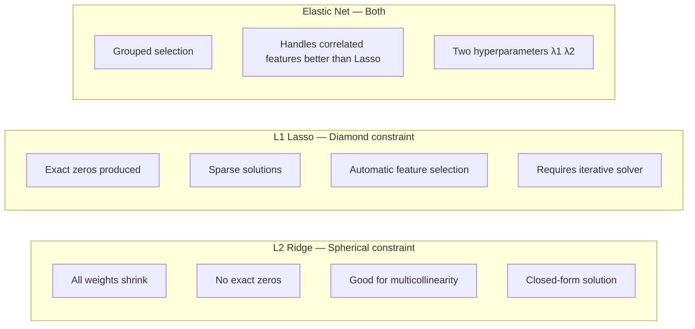

# 🎛️ Regularization

> [!abstract] TL;DR
> Regularization adds a penalty to the loss function that discourages large model weights, preventing overfitting by trading some bias for lower variance. L2 (Ridge) shrinks all weights toward zero but keeps them non-zero. L1 (Lasso) creates exactly-zero weights, performing feature selection. Elastic Net combines both. For neural networks, dropout is the dominant regularization approach.

## Intuition — Analogy First

William of Ockham (14th century) proposed: *"Among competing hypotheses, the one with the fewest assumptions should be selected."* This is Occam's Razor. Regularization is Occam's Razor encoded mathematically.

A complex model with 1000 free parameters can perfectly memorize 1000 training examples (perfect training accuracy). But it has essentially learned the training data — not the underlying pattern. It will fail spectacularly on new examples.

Regularization is a penalty for complexity. Imagine you're writing a contract. A contract with 1000 detailed clauses covering every edge case looks precise, but it's fragile — any situation not covered causes confusion. A simpler contract with 10 clear principles is more generalizable. Regularization says: "your model should prefer simpler explanations (smaller weights) unless the data strongly demands complexity."

**The core trade-off:**
- No regularization → large weights → fits training data perfectly → high variance, poor generalization
- Heavy regularization → weights pushed toward zero → model is simpler → high bias, underfits
- Right amount of regularization → sweet spot between bias and variance

## How It Works — Mechanics

**Standard loss (e.g., MSE):**
$$\mathcal{L}(\theta) = \frac{1}{n}\sum_{i=1}^n (y_i - \hat{y}_i)^2$$

**L2 Regularized loss (Ridge):**
$$\mathcal{L}_{\text{Ridge}} = \frac{1}{n}\sum_{i=1}^n (y_i - \hat{y}_i)^2 + \lambda \sum_j w_j^2$$

**L1 Regularized loss (Lasso):**
$$\mathcal{L}_{\text{Lasso}} = \frac{1}{n}\sum_{i=1}^n (y_i - \hat{y}_i)^2 + \lambda \sum_j |w_j|$$

**Elastic Net:**
$$\mathcal{L}_{\text{EN}} = \frac{1}{n}\sum_{i=1}^n (y_i - \hat{y}_i)^2 + \lambda_1 \sum_j |w_j| + \lambda_2 \sum_j w_j^2$$

**Why L1 creates sparsity and L2 doesn't:**

Geometrically, the constraint $\sum |w_j| \leq t$ (L1) defines a diamond/rhombus in weight space. The corners of this diamond lie on the axes. When the loss contours (ellipses) intersect the diamond, they almost always hit a corner — where one or more weights are exactly zero. This is sparsity.

The constraint $\sum w_j^2 \leq t$ (L2) defines a sphere. Ellipses intersect spheres at a tangent point on the surface — which is almost never exactly on an axis. So L2 shrinks weights toward zero but rarely reaches exactly zero.

**Dropout (neural networks):**
Randomly set each neuron's activation to zero with probability $p$ during training. At test time, multiply all activations by $(1-p)$ (or use inverted dropout: scale by $1/(1-p)$ during training). Forces the network to not rely on any single neuron — creates redundant, diverse representations. Equivalent to training an ensemble of $2^n$ thinned networks.



## The Math

**L2 Ridge solution** — unique closed form (unlike Lasso):
$$\hat{w}_{\text{Ridge}} = (X^TX + \lambda I)^{-1} X^T y$$

The $\lambda I$ term makes the matrix invertible even when $X^TX$ is singular (multicollinearity). This is why Ridge is preferred when features are highly correlated.

**L2 gradient update:**
$$\frac{\partial \mathcal{L}_{\text{Ridge}}}{\partial w_j} = \frac{\partial \mathcal{L}}{\partial w_j} + 2\lambda w_j$$

This means at each gradient step: $w_j \leftarrow w_j - \eta(\nabla_w \mathcal{L} + 2\lambda w_j) = (1 - 2\eta\lambda)w_j - \eta\nabla_w\mathcal{L}$

The factor $(1-2\eta\lambda)$ is called **weight decay** — at each step, weights are multiplied by a factor < 1, shrinking them toward zero. In deep learning, L2 regularization is almost always implemented as weight decay in the optimizer.

**L1 gradient (subgradient):**
$$\frac{\partial \mathcal{L}_{\text{Lasso}}}{\partial w_j} = \frac{\partial \mathcal{L}}{\partial w_j} + \lambda \cdot \text{sign}(w_j)$$

The sign function has discontinuity at 0 — this is what drives weights exactly to zero (via proximal gradient/soft thresholding).

**Elastic Net mixing parameter:** sklearn uses `l1_ratio` ∈ [0, 1]:
$$\mathcal{L}_{\text{EN}} = \mathcal{L} + \alpha \left[ \frac{1-\rho}{2}\|\mathbf{w}\|_2^2 + \rho\|\mathbf{w}\|_1 \right]$$

`l1_ratio=1` → Lasso. `l1_ratio=0` → Ridge.

**Optimal λ** — use cross-validation (`RidgeCV`, `LassoCV`, `ElasticNetCV`).

## Code Demo

```python
import numpy as np
import matplotlib.pyplot as plt
from sklearn.linear_model import Ridge, Lasso, ElasticNet, RidgeCV, LassoCV
from sklearn.preprocessing import StandardScaler
from sklearn.model_selection import train_test_split, cross_val_score
from sklearn.datasets import load_diabetes, make_regression
from sklearn.pipeline import Pipeline
import warnings
warnings.filterwarnings('ignore')

# --- 1. Basic comparison: Ridge vs Lasso vs ElasticNet ---
diabetes = load_diabetes()
X, y = diabetes.data, diabetes.target
feature_names = diabetes.feature_names

X_train, X_test, y_train, y_test = train_test_split(X, y, test_size=0.2, random_state=42)
scaler = StandardScaler()
X_train_s = scaler.fit_transform(X_train)
X_test_s = scaler.transform(X_test)

models = {
    'Ridge (α=1)': Ridge(alpha=1.0),
    'Lasso (α=0.1)': Lasso(alpha=0.1),
    'ElasticNet (α=0.1, l1=0.5)': ElasticNet(alpha=0.1, l1_ratio=0.5),
}

print("Model comparison on Diabetes dataset:")
for name, model in models.items():
    model.fit(X_train_s, y_train)
    test_r2 = model.score(X_test_s, y_test)
    n_nonzero = np.sum(np.abs(model.coef_) > 0.001)
    print(f"{name:40s}: R²={test_r2:.3f}, non-zero coefs={n_nonzero}/{len(model.coef_)}")

# --- 2. Regularization path: coefficients vs alpha ---
alphas = np.logspace(-3, 2, 100)

coefs_ridge = []
coefs_lasso = []

for alpha in alphas:
    r = Ridge(alpha=alpha).fit(X_train_s, y_train)
    l = Lasso(alpha=alpha, max_iter=10000).fit(X_train_s, y_train)
    coefs_ridge.append(r.coef_)
    coefs_lasso.append(l.coef_)

fig, axes = plt.subplots(1, 2, figsize=(14, 5))

# Ridge path
for i, name in enumerate(feature_names):
    axes[0].plot(alphas, [c[i] for c in coefs_ridge], label=name)
axes[0].set_xscale('log')
axes[0].set_xlabel('Alpha (regularization strength)')
axes[0].set_ylabel('Coefficient value')
axes[0].set_title('Ridge Regularization Path\n(all shrink, none exactly zero)')
axes[0].axhline(0, color='k', linestyle='--', linewidth=0.5)
axes[0].legend(fontsize=7, loc='upper right')

# Lasso path
for i, name in enumerate(feature_names):
    axes[1].plot(alphas, [c[i] for c in coefs_lasso], label=name)
axes[1].set_xscale('log')
axes[1].set_xlabel('Alpha (regularization strength)')
axes[1].set_ylabel('Coefficient value')
axes[1].set_title('Lasso Regularization Path\n(features driven to exactly zero)')
axes[1].axhline(0, color='k', linestyle='--', linewidth=0.5)
axes[1].legend(fontsize=7, loc='upper right')

plt.tight_layout()
plt.show()

# --- 3. Cross-validated alpha selection ---
ridge_cv = RidgeCV(alphas=np.logspace(-3, 3, 100), cv=5)
ridge_cv.fit(X_train_s, y_train)
print(f"\nBest Ridge alpha (CV): {ridge_cv.alpha_:.4f}")
print(f"Ridge CV R²: {ridge_cv.score(X_test_s, y_test):.3f}")

lasso_cv = LassoCV(alphas=np.logspace(-3, 1, 100), cv=5, max_iter=10000)
lasso_cv.fit(X_train_s, y_train)
print(f"Best Lasso alpha (CV): {lasso_cv.alpha_:.4f}")
print(f"Lasso CV R²: {lasso_cv.score(X_test_s, y_test):.3f}")
print(f"Lasso selected {np.sum(lasso_cv.coef_ != 0)}/{len(lasso_cv.coef_)} features")

# --- 4. Multicollinearity: Ridge vs Lasso ---
# Ridge handles correlated features better; Lasso arbitrarily picks one
np.random.seed(42)
n = 200
x1 = np.random.randn(n)
x2 = x1 + 0.01 * np.random.randn(n)  # Nearly identical to x1
y_corr = 2 * x1 + 2 * x2 + np.random.randn(n)  # True: both contribute equally

X_corr = np.column_stack([x1, x2])
X_corr_s = StandardScaler().fit_transform(X_corr)

ridge_corr = Ridge(alpha=1.0).fit(X_corr_s, y_corr)
lasso_corr = Lasso(alpha=0.1).fit(X_corr_s, y_corr)

print(f"\nCorrelated features (true coef: [2, 2]):")
print(f"Ridge coefs: {ridge_corr.coef_.round(3)}")  # Both ~2
print(f"Lasso coefs: {lasso_corr.coef_.round(3)}")  # One 0, other ~4

# --- 5. Dropout visualization concept (for neural networks) ---
print("\n--- Dropout Example (NumPy) ---")
def dropout(X, p=0.5, training=True):
    """Inverted dropout: scale by 1/(1-p) during training."""
    if not training:
        return X
    mask = np.random.binomial(1, 1-p, size=X.shape) / (1-p)
    return X * mask

X_layer = np.array([[1.0, 2.0, 3.0, 4.0, 5.0]])
print(f"Input:              {X_layer}")
print(f"Dropout p=0.5 (1): {dropout(X_layer, p=0.5)}")
print(f"Dropout p=0.5 (2): {dropout(X_layer, p=0.5)}")
print(f"At test time:       {dropout(X_layer, training=False)}")
```

## Real-World Example

**Ridge for Housing Price Models (Multicollinearity):**
A real estate prediction model has 50+ features, many highly correlated (square footage, number of rooms, number of bathrooms — all correlated with house size). Standard linear regression fails — the $(X^TX)$ matrix is nearly singular, producing wildly unstable coefficients (e.g., coefficient of -500,000 for square footage and +500,200 for bedrooms that cancel). Ridge regularization adds $\lambda I$ to make the matrix invertible, producing stable, shrunk coefficients that generalize.

**Lasso for Gene Selection in Genomics:**
A pharmaceutical research team has gene expression data for 20,000 genes and 300 patient outcomes. Lasso with cross-validated $\alpha$ reduces this to ~40 non-zero genes. These 40 genes are the model's prediction — but more importantly, they're hypotheses for biological mechanisms. The biologists can then design targeted experiments around these 40 genes rather than all 20,000.

## Trade-offs

| Method | Sparsity | Multicollinearity | Closed Form | Best for |
|---|---|---|---|---|
| Ridge (L2) | No | Excellent — distributes weight | Yes | Correlated features, stable solutions |
| Lasso (L1) | Yes | Poor — picks one arbitrarily | No | Feature selection, interpretability |
| Elastic Net | Yes | Good | No | High-dim with correlated groups |
| Dropout | N/A | N/A | N/A | Neural networks only |
| Weight Decay | No | Partial | N/A | DL optimizer-level L2 regularization |

## When to Use vs Avoid

**Use Ridge when:**
- Features are correlated (multicollinearity)
- You want to keep all features but reduce overfitting
- Need a closed-form solution (fast, stable)

**Use Lasso when:**
- You want automatic feature selection (sparse models)
- Interpretability matters (fewer active features)
- You believe most features are irrelevant

**Use Elastic Net when:**
- High-dimensional data with groups of correlated features
- Lasso alone is too aggressive (drops entire correlated groups)
- You want sparsity but Lasso's instability is a problem

**Use Dropout when:**
- Training neural networks (where L1/L2 on millions of parameters is less effective)
- Overfitting is severe in deep networks

## Common Pitfalls

1. **Not scaling before regularization** — regularization penalizes large weights. If feature A ranges 0–1 and feature B ranges 0–1,000,000, feature B's coefficients will naturally be small regardless of importance. Always scale features first.

2. **Setting λ (alpha) by hand instead of cross-validation** — use `RidgeCV`, `LassoCV`, or `GridSearchCV`. The right α is data-dependent.

3. **Using Lasso when features are correlated** — Lasso arbitrarily keeps one correlated feature and drops the others, which can be misleading. Elastic Net handles this better.

4. **Applying L1/L2 to tree models** — decision trees and random forests don't use linear weights; L1/L2 doesn't apply. Use `min_samples_leaf`, `max_depth`, or `max_features` for tree regularization.

5. **Not regularizing the bias term** — by convention, the bias (intercept) is not regularized. sklearn does this by default. Don't add the intercept to the penalty.

6. **Interpreting Lasso zero coefficients as "the feature doesn't matter"** — Lasso zeros out a feature when another correlated feature captures the same information. The zeroed feature may still be genuinely informative.

## Related Concepts

- [[_MOC_Classical_ML|↑ Section MOC]]

- [[Bias_Variance_Tradeoff]] — regularization is the primary mechanism for controlling bias-variance
- [[Linear_Regression]] — regularization is most directly applied to linear models
- [[Feature_Selection]] — L1/Lasso is an embedded feature selection method
- [[Dropout]] — regularization for neural networks; conceptually similar but implemented differently
- [[Ensemble_Methods]] — bagging (Random Forest) is another regularization-like variance reduction technique

## Review Questions

1. You train a Ridge regression and a Lasso regression on the same dataset. The Ridge model uses all 50 features; the Lasso uses 8. However, the Ridge model has slightly better test R². How do you decide which model to deploy in production?

2. Why does the L1 penalty produce exactly-zero coefficients while the L2 penalty does not? Use geometric reasoning (constraint regions in weight space) to explain.

3. You have two features that are 0.99 correlated with each other. You apply Lasso regularization and it keeps feature A (coefficient 3.5) and zeros out feature B (coefficient 0). What are two potential problems with interpreting this result, and how would Elastic Net handle it differently?

## Sources

- Tibshirani, R. (1996). "Regression shrinkage and selection via the lasso." *JRSS-B*, 58(1), 267–288.
- Hoerl, A.E. & Kennard, R.W. (1970). "Ridge regression: Biased estimation for nonorthogonal problems." *Technometrics*, 12(1), 55–67.
- Zou, H. & Hastie, T. (2005). "Regularization and variable selection via the elastic net." *JRSS-B*, 67(2), 301–320.
- Srivastava, N., Hinton, G., et al. (2014). "Dropout: A simple way to prevent neural networks from overfitting." *JMLR*, 15(56), 1929–1958.
- Scikit-learn: [Linear Models](https://scikit-learn.org/stable/modules/linear_model.html)

#regularization #ridge #lasso #elastic-net #overfitting #weight-decay #dropout #sparse-models
