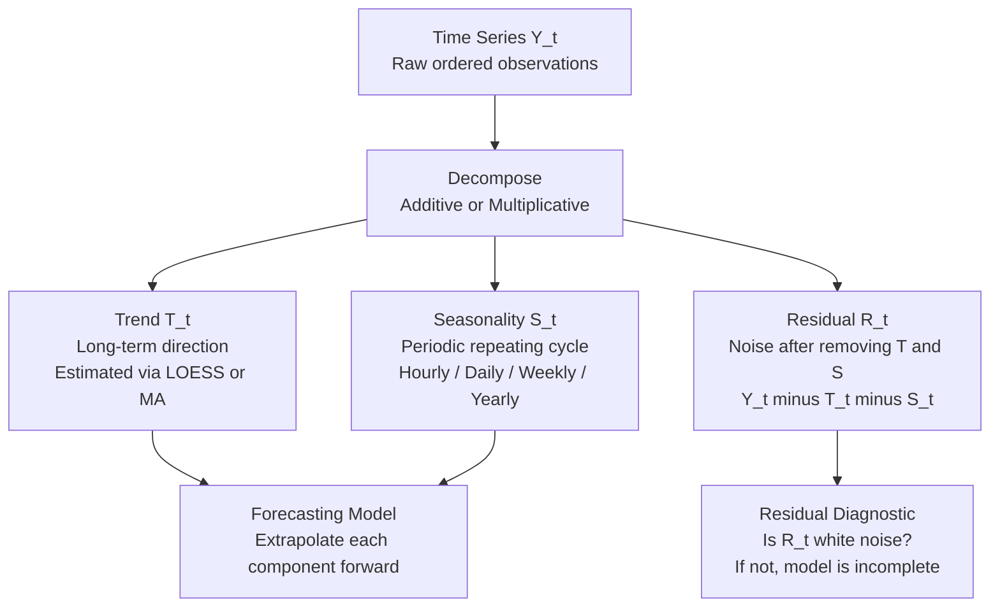

# 📈 Time Series Analysis and Forecasting

> [!abstract] TL;DR
> A time series is a sequence of observations ordered in time; forecasting uses past values to predict future ones. The core challenge is that observations are temporally correlated — violating the i.i.d. assumption — so specialized models (ARIMA, ETS, Prophet, LSTM, TFT) are required. The field divides into classical statistical models (interpretable, strong assumptions, small data) and modern ML/DL models (flexible, data-hungry, scalable to millions of series).

---

## Intuition — Analogy First

**Analogy:** Imagine you run a coffee shop and want to staff correctly every day. Your sales history shows three overlapping patterns: (1) sales slowly grow year-over-year as the neighbourhood expands — that is **trend**; (2) sales spike every Monday morning and every December — that is **seasonality**; (3) the exact number varies randomly even on otherwise identical days — that is **residual noise**. Forecasting means separating these three signals and extrapolating each one forward.

Every time series model — whether ARIMA or a neural network — is fundamentally a machine for decomposing these three components and projecting them into the future. The models differ only in how they parametrize and learn each component.

---

## Time Series Fundamentals

### What Makes Time Series Different from Regular Tabular Data

- **Order matters**: shuffling rows destroys the signal, unlike standard tabular ML.
- **Autocorrelation**: $y_t$ is correlated with $y_{t-1}, y_{t-2}, \ldots$ — the i.i.d. assumption is broken by definition.
- **Non-stationarity**: mean, variance, and covariance structure can shift over time.
- **Leakage via standard CV**: random train/test splits expose future data to training. Walk-forward splits are mandatory.

### Time Series Decomposition

A time series $Y_t$ decomposes into three components:

$$Y_t = T_t + S_t + R_t \quad \text{(Additive)}$$
$$Y_t = T_t \times S_t \times R_t \quad \text{(Multiplicative)}$$

| Component | Definition | Example |
|-----------|-----------|---------|
| Trend $T_t$ | Long-term direction | Annual revenue growth |
| Seasonality $S_t$ | Repeating periodic pattern | Black Friday spike each November |
| Residual $R_t$ | Noise after removing T + S | Random weather effect on foot traffic |

Use **multiplicative** decomposition when the seasonality amplitude grows proportionally with the trend level (e.g., retail sales that double seasonally as total volume doubles). Use **additive** when the seasonal swing is constant regardless of trend level.

**STL decomposition** (Seasonal-Trend using LOESS) is the robust modern standard: it handles multiple seasonal periods and is resistant to outliers, unlike classical additive decomposition.



---

### Stationarity

A **stationary** time series has constant mean, variance, and autocovariance over time. Most classical models (ARIMA) require stationarity as a precondition.

**Augmented Dickey-Fuller (ADF) test:**
- H₀: the series has a unit root — non-stationary
- p < 0.05: reject H₀, conclude stationary
- Limitation: low power; may fail to detect trend-stationary processes

**KPSS test:**
- H₀: the series is stationary
- p < 0.05: reject H₀, conclude non-stationary
- Use ADF + KPSS together: if both agree the series is non-stationary, difference it

**Achieving stationarity via differencing:**
- First difference: $\Delta y_t = y_t - y_{t-1}$ — removes linear trend (use $d=1$)
- Second difference: $\Delta^2 y_t = \Delta y_t - \Delta y_{t-1}$ — removes quadratic trend ($d=2$, rarely needed)
- Seasonal difference: $\Delta_m y_t = y_t - y_{t-m}$ — removes seasonality of period $m$

> [!tip] Practical rule
> Nearly all business and economic series need exactly one regular difference ($d=1$). Over-differencing is detectable: the ACF of the differenced series will cut off immediately negative at lag 1.

---

## Classical Statistical Models

### ARIMA — AutoRegressive Integrated Moving Average

ARIMA(p, d, q) combines three mechanisms:

| Component | Notation | Meaning |
|-----------|----------|---------|
| AutoRegressive | AR(p) | $y_t$ linearly depends on its own past $p$ values |
| Integrated | I(d) | Series is differenced $d$ times to achieve stationarity |
| Moving Average | MA(q) | $y_t$ depends on past $q$ forecast errors $\varepsilon$ |

**AR(p) equation:**
$$y_t = c + \phi_1 y_{t-1} + \phi_2 y_{t-2} + \cdots + \phi_p y_{t-p} + \varepsilon_t$$

**MA(q) equation:**
$$y_t = \mu + \varepsilon_t + \theta_1 \varepsilon_{t-1} + \theta_2 \varepsilon_{t-2} + \cdots + \theta_q \varepsilon_{t-q}$$

**Selecting p and q with ACF and PACF:**
- **ACF** (Autocorrelation Function): correlation of $y_t$ with $y_{t-k}$ at each lag $k$. Cuts off sharply after lag $q$ for a pure MA process.
- **PACF** (Partial Autocorrelation Function): correlation of $y_t$ with $y_{t-k}$ after removing the effect of intermediate lags. Cuts off after lag $p$ for a pure AR process.
- Use **AIC/BIC** for automated order selection across a grid of (p, d, q) combinations.

**Box-Jenkins Methodology (4 steps):**
1. **Identify**: plot series, test stationarity (ADF + KPSS), determine d; read ACF/PACF for candidate p and q
2. **Estimate**: fit ARIMA(p,d,q) via maximum likelihood estimation
3. **Diagnose**: verify residuals are white noise via Ljung-Box test and residual ACF plot
4. **Forecast**: generate point forecasts and confidence intervals; residuals must look like white noise for intervals to be valid

### SARIMA — Seasonal ARIMA

SARIMA(p,d,q)(P,D,Q,m) extends ARIMA with seasonal autoregressive, differencing, and moving average terms of period $m$:

$$\Phi_P(B^m)\,\phi_p(B)\,(1 - B^m)^D(1-B)^d\,y_t = \Theta_Q(B^m)\,\theta_q(B)\,\varepsilon_t$$

- $m$ = seasonal period (12 for monthly, 52 for weekly, 7 for daily data with a weekly season)
- $(P, D, Q)$ = seasonal counterparts of the regular $(p, d, q)$
- Practical default: SARIMA(1,1,1)(1,1,1,12) for monthly business data — often beats elaborate model selection

### Exponential Smoothing (ETS)

ETS models assign exponentially decaying weights to past observations — recent observations count more. Three levels of complexity:

| Model | Components Modelled | Use Case |
|-------|-----------|---------|
| Simple ES (SES) | Level only | Stationary series with no trend or seasonality |
| Holt's Linear ES | Level + Trend | Trending series, no clear seasonality |
| Holt-Winters | Level + Trend + Seasonality | Full seasonal business data (additive or multiplicative) |

**Holt-Winters additive update equations:**
$$L_t = \alpha(y_t - S_{t-m}) + (1-\alpha)(L_{t-1} + T_{t-1})$$
$$T_t = \beta(L_t - L_{t-1}) + (1-\beta)\,T_{t-1}$$
$$S_t = \gamma(y_t - L_t) + (1-\gamma)\,S_{t-m}$$

where $\alpha, \beta, \gamma \in [0,1]$ are smoothing parameters estimated by minimising SSE. ETS is fast, transparent, and often competitive with ARIMA on short horizons.

### Prophet — Meta's Forecasting Library

Prophet models the time series as a sum of interpretable components:
$$y(t) = g(t) + s(t) + h(t) + \varepsilon_t$$

- $g(t)$: **trend** — piecewise linear or logistic growth with automatic changepoint detection
- $s(t)$: **seasonality** — Fourier series with learnable amplitude and phase (yearly, weekly, daily)
- $h(t)$: **holiday effects** — user-supplied date lists with independently tunable prior strength
- $\varepsilon_t$: noise term assumed normal

**Strengths:** robust to missing data; handles irregular timestamps; works on irregular business calendars; business analysts can tune it without statistics expertise.

**Weaknesses:** assumes future = extrapolated past; struggles with structural breaks, highly irregular demand spikes, and complex cross-series dependencies. Slower than ARIMA on thousands of series.

---

## ML-Based Forecasting

Tree-based models ([[XGBoost]], [[LightGBM]]) become powerful forecasters when cast as regression problems through temporal [[Feature_Engineering]].

### Key Feature Types for Time Series

| Feature Type | Examples | Rationale |
|-------------|----------|-------|
| Lag features | $y_{t-1},\, y_{t-7},\, y_{t-28}$ | Direct representation of autocorrelation |
| Rolling statistics | $\text{mean}(y_{t-7:t-1}),\; \text{std}(y_{t-14:t-1})$ | Local level and volatility |
| Expanding statistics | $\text{mean}(y_{1:t-1})$ | Global historical level |
| Date features | hour, dayofweek, month, is\_holiday | Encode seasonality and calendar effects |
| Cyclical encoding | $\sin(2\pi\cdot\text{month}/12),\;\cos(2\pi\cdot\text{month}/12)$ | Preserves circular periodicity |
| Difference features | $y_{t-1} - y_{t-2},\; y_{t-1} - y_{t-8}$ | Rate of change and recent momentum |
| Target encoding | Category historical mean (on training data only) | Cross-series level information |

> [!warning] Leakage rule
> Every feature must be computable from **strictly past** information. Rolling means must use `.shift(1)` before `.rolling(w).mean()`. Lag 0 is always the target — never a feature.

**Why ML beats ARIMA at scale:**
- Handles exogenous variables (promotions, weather, price elasticity) naturally
- Learns non-linear interactions between covariates
- One global model can be trained across millions of related series simultaneously, sharing statistical strength

---

## Deep Learning for Time Series

### LSTM and GRU

Sequential models process a time series step by step, maintaining a hidden state that summarises temporal context. No explicit feature engineering is required — the model learns temporal patterns end-to-end.

**Forecasting setup:**
1. Create sliding window sequences: input $[y_{t-L}, \ldots, y_{t-1}]$ → target $[y_t, \ldots, y_{t+H}]$
2. Normalise per-series (zero mean, unit variance; reverse at inference)
3. Stack 2–3 LSTM/GRU layers with dropout between layers
4. Use gradient clipping (`max_norm=1.0`) — essential for RNN stability

See [[RNN_and_LSTM]] for LSTM cell mechanics and [[GRU]] for the efficient two-gate variant.

### Temporal Fusion Transformer (TFT)

TFT (Lim et al., 2021) is a purpose-built architecture for **multi-horizon forecasting** that handles multiple covariate types simultaneously:

| Input Type | Example | How TFT Uses It |
|------------|---------|-----------------|
| Static metadata | Store ID, product category | Variable selection + context vector |
| Known future covariates | Calendar features, planned promotions | Future encoder + decoder |
| Observed past covariates | Past sales, past weather | LSTM encoder |
| Target history | The series being forecast | LSTM encoder + self-attention |

**Key components:**
1. **Variable Selection Networks** — learn which features matter at each time step via gating
2. **Gated Residual Networks (GRNs)** — non-linear processing with skip connections; suppresses unused paths
3. **LSTM encoder-decoder** — captures local temporal dynamics
4. **Interpretable multi-head attention over encoder states** — learns which past time steps are most relevant
5. **Quantile outputs** — predicts P10, P50, P90 for calibrated uncertainty

TFT consistently outperformed ARIMA, DeepAR, and vanilla LSTM on the M5 Walmart demand forecasting competition.

### N-BEATS and N-HiTS

**N-BEATS** (Oreshkin et al., 2020): pure MLP-based forecaster with no recurrence or attention. Stacks of "blocks" each produce a **backcast** (explained variation removed from the input) and a **forecast** (their contribution to the output). The residual subtraction between blocks mirrors STL decomposition — implemented entirely in MLP layers.

**N-HiTS** (Challu et al., 2022): extends N-BEATS with multi-rate input sampling. Different blocks operate at different temporal resolutions (fine, medium, coarse) and interpolate their forecasts, making long-horizon forecasting substantially more efficient. Competitive with TFT at a fraction of the complexity.

### Foundation Models for Time Series

**Chronos** (Amazon, 2024): tokenises time series values into discrete bins and pre-trains a T5-based seq2seq model on a large corpus of diverse real-world series. Achieves competitive zero-shot forecasting with no per-dataset training.

**TimesFM** (Google DeepMind, 2024): decoder-only transformer (similar to GPT) pre-trained on 100 billion real-world time points from Google internal datasets and public benchmarks. Achieves near-supervised performance in zero-shot mode.

Foundation models are the practical choice for **cold-start problems** (new series with insufficient history) and rapid prototyping across heterogeneous datasets.

---

## Evaluation Metrics

| Metric | Formula | Notes |
|--------|---------|-------|
| MAE | $\frac{1}{H}\sum_{t}\|y_t - \hat{y}_t\|$ | Robust to outliers; interpretable in original units |
| RMSE | $\sqrt{\frac{1}{H}\sum_t(y_t-\hat{y}_t)^2}$ | Penalises large errors heavily; preferred when big misses are costly |
| MAPE | $\frac{100\%}{H}\sum_t\bigl\|\frac{y_t - \hat{y}_t}{y_t}\bigr\|$ | Scale-free percentage; **breaks when $y_t \approx 0$** |
| sMAPE | $\frac{200\%}{H}\sum_t\frac{\|y_t-\hat{y}_t\|}{\|y_t\|+\|\hat{y}_t\|}$ | Symmetric; bounded; M4 competition standard metric |
| MASE | $\frac{\text{MAE of model}}{\text{MAE of seasonal naive}}$ | Scale-free; MASE < 1.0 means model beats the seasonal naive baseline |

**MASE** is the recommended cross-series metric. A MASE > 1.0 is a critical failure signal — the model is outperformed by simply repeating last season's values. Always compute it against the seasonal naïve baseline.

See [[Regression_Metrics]] for MAE, RMSE, MAPE fundamentals.

### Time Series Cross-Validation — Walk-Forward Validation

Standard k-fold CV is **invalid** for time series: it shuffles temporal order and exposes future values to the training set. The correct approach is walk-forward validation:

```
Fold 1: Train [t₁ ... t_n]          → Test [t_{n+1} ... t_{n+H}]
Fold 2: Train [t₁ ... t_{n+H}]      → Test [t_{n+H+1} ... t_{n+2H}]
Fold 3: Train [t₁ ... t_{n+2H}]     → Test [t_{n+2H+1} ... t_{n+3H}]
```

- **Expanding window**: training set grows each fold — preferred because it uses all available history
- **Sliding window**: fixed training size — use when the data distribution shifts significantly over time
- Always include a **gap** between train end and test start equal to the forecast horizon to prevent lag-feature leakage

Use `sklearn.model_selection.TimeSeriesSplit` in code. See [[Cross_Validation]] for the implementation.

---

## Multi-Step Forecasting Strategies

| Strategy | Mechanism | Pros | Cons |
|---------|-----------|------|------|
| Recursive | Predict 1 step; feed prediction back as input | Single model; simple to implement | Error accumulates over the forecast horizon |
| Direct | Train H separate models, one per horizon step | No error accumulation | H× training and maintenance cost |
| MIMO | Single model predicts all H steps simultaneously | Efficient; temporally consistent output | More complex output head; requires enough data |
| DirRec | Combine Direct + Recursive per horizon | Best empirical performance | Most complex to implement |

TFT and N-BEATS use MIMO natively. ARIMA uses recursive. XGBoost-based pipelines commonly use direct (one model per horizon) to avoid error compounding.

---

## Anomaly Detection in Time Series

**1. STL + residual thresholding:**
Decompose with STL; flag residuals beyond $\pm 3\sigma$ as anomalies. Interpretable, fast, good for additive seasonality. Fails on non-additive patterns.

**2. Isolation Forest on window feature vectors:**
Extract features per window (mean, std, slope, ACF at key lags); run Isolation Forest. Works well when anomalies are characterised by unusual statistical properties rather than just high residuals.

**3. LSTM reconstruction error:**
Train an LSTM autoencoder on normal-pattern windows. At inference, flag windows where reconstruction MSE exceeds a trained threshold. Learns complex multivariate patterns; requires representative normal data for training.

---

## Handling Special Cases

**Missing data:**
- Interpolate (linear or spline) for short gaps in regular-frequency series
- Prophet handles missing timestamps natively — just pass the dataframe with gaps; no imputation needed
- For ARIMA: impute before fitting, or use Kalman filter state-space models which handle missing observations in the E-step

**Multiple seasonalities:**
- SARIMA handles only one seasonal period
- Use **MSTL** (Multiple STL), **TBATS**, or **Prophet** (supports yearly + weekly + daily simultaneously via Fourier decomposition)
- For LSTM/TFT: include encoded time features (hour\_sin, hour\_cos, dayofweek\_sin, etc.) as covariates

**Exogenous variables:**
- ARIMA → ARIMAX / SARIMAX: include external regressors as additional columns
- Prophet: `model.add_regressor('promo_flag', prior_scale=0.5)`
- XGBoost / LSTM: include exogenous features directly in the feature matrix, respecting temporal ordering

**Irregular time series (non-uniform timestamps):**
- Resample to a regular frequency via aggregation before applying classical models
- Prophet works with irregular timestamps out of the box
- Neural ODEs and continuous-time RNNs handle truly irregular sampling natively

---

## Code Demo

```python
import numpy as np
import pandas as pd
from statsmodels.tsa.stattools import adfuller, kpss
from statsmodels.tsa.arima.model import ARIMA
from statsmodels.tsa.statespace.sarimax import SARIMAX

# --- Synthetic monthly sales: trend + seasonality + noise ---
np.random.seed(42)
dates = pd.date_range('2019-01-01', periods=72, freq='MS')
trend = np.linspace(100, 160, 72)
seasonality = 20 * np.sin(2 * np.pi * np.arange(72) / 12)
noise = np.random.normal(0, 5, 72)
sales = trend + seasonality + noise

ts = pd.Series(sales, index=dates, name='sales')
train, test = ts.iloc[:-12], ts.iloc[-12:]

# --- 1. Stationarity testing: ADF + KPSS together ---
def check_stationarity(series, name='series'):
    adf_stat, adf_p = adfuller(series, autolag='AIC')[:2]
    kpss_stat, kpss_p = kpss(series, regression='c', nlags='auto')[:2]
    adf_verdict = 'STATIONARY' if adf_p < 0.05 else 'NON-STATIONARY'
    kpss_verdict = 'NON-STATIONARY' if kpss_p < 0.05 else 'STATIONARY'
    print(f"{name:22s} | ADF p={adf_p:.4f} {adf_verdict:14s} | KPSS p={kpss_p:.4f} {kpss_verdict}")

check_stationarity(ts, 'original')
check_stationarity(ts.diff().dropna(), 'first_diff')
# Expected: original is NON-STATIONARY; first_diff is STATIONARY

# --- 2. ARIMA(1,1,1) ---
arima = ARIMA(train, order=(1, 1, 1)).fit()
arima_fc = arima.forecast(steps=12)
arima_mae = np.mean(np.abs(test.values - arima_fc.values))
print(f"\nARIMA(1,1,1)         MAE: {arima_mae:.2f}")

# --- 3. SARIMA(1,1,1)(1,1,1,12): seasonal extension ---
sarima = SARIMAX(train, order=(1, 1, 1), seasonal_order=(1, 1, 1, 12)).fit(disp=False)
sarima_fc = sarima.forecast(steps=12)
sarima_mae = np.mean(np.abs(test.values - sarima_fc.values))
print(f"SARIMA(1,1,1)×12     MAE: {sarima_mae:.2f}")

# --- 4. Seasonal naive baseline (repeat last year's values) ---
naive_fc = train.iloc[-12:].values
naive_mae = np.mean(np.abs(test.values - naive_fc))
print(f"Seasonal Naive       MAE: {naive_mae:.2f}")

# MASE: model MAE / naive MAE — below 1.0 means the model beats the naive baseline
print(f"\nARIMA  MASE: {arima_mae / naive_mae:.3f}  (< 1.0 = beats naive)")
print(f"SARIMA MASE: {sarima_mae / naive_mae:.3f}")

# --- 5. ML-based: XGBoost / GBM with lag features ---
from sklearn.ensemble import GradientBoostingRegressor

def make_ts_features(series, lags, rolling_windows):
    df = pd.DataFrame({'y': series})
    for lag in lags:
        df[f'lag_{lag}'] = df['y'].shift(lag)
    for w in rolling_windows:
        # .shift(1) ensures no look-ahead leakage
        df[f'roll_mean_{w}'] = df['y'].shift(1).rolling(w).mean()
        df[f'roll_std_{w}']  = df['y'].shift(1).rolling(w).std()
    df['month'] = df.index.month
    df['month_sin'] = np.sin(2 * np.pi * df['month'] / 12)
    df['month_cos'] = np.cos(2 * np.pi * df['month'] / 12)
    return df.dropna()

feat_df = make_ts_features(ts, lags=[1, 2, 3, 6, 12], rolling_windows=[3, 6, 12])
X = feat_df.drop('y', axis=1)
y_all = feat_df['y']

split_idx = len(feat_df) - 12
X_train, X_test = X.iloc[:split_idx], X.iloc[split_idx:]
y_train, y_test = y_all.iloc[:split_idx], y_all.iloc[split_idx:]

gbm = GradientBoostingRegressor(
    n_estimators=200, max_depth=3, learning_rate=0.05,
    subsample=0.8, random_state=42
)
gbm.fit(X_train, y_train)
gbm_fc = gbm.predict(X_test)
gbm_mae = np.mean(np.abs(y_test.values - gbm_fc))
print(f"GBM + lag features   MAE: {gbm_mae:.2f}")
print(f"GBM  MASE: {gbm_mae / naive_mae:.3f}")

# --- 6. Walk-forward CV using TimeSeriesSplit ---
from sklearn.model_selection import TimeSeriesSplit, cross_val_score

tscv = TimeSeriesSplit(n_splits=5, gap=12)  # gap prevents lag-feature leakage
cv_scores = cross_val_score(
    GradientBoostingRegressor(n_estimators=100, random_state=42),
    X, y_all,
    cv=tscv,
    scoring='neg_mean_absolute_error'
)
print(f"\nWalk-forward CV MAE: {-cv_scores.mean():.2f} +/- {cv_scores.std():.2f}")

# --- 7. Prophet (requires: pip install prophet) ---
# from prophet import Prophet
#
# df_p = ts.reset_index().rename(columns={'index': 'ds', 'sales': 'y'})
# train_p, test_p = df_p.iloc[:-12], df_p.iloc[-12:]
#
# m = Prophet(yearly_seasonality=True, weekly_seasonality=False, daily_seasonality=False)
# m.fit(train_p)
# future = m.make_future_dataframe(periods=12, freq='MS')
# forecast = m.predict(future)
# prophet_fc = forecast.iloc[-12:]['yhat'].values
# prophet_mae = np.mean(np.abs(test.values - prophet_fc))
# print(f"Prophet              MAE: {prophet_mae:.2f}")
```

---

## Real-World Example

> **Meta Ads Revenue Forecasting** uses **Prophet** internally to forecast ad revenue across hundreds of markets and country-level seasonalities. The choice was deliberate: finance analysts (not ML engineers) needed to add holiday effects (Super Bowl, Diwali, Ramadan, Singles Day) and adjust seasonality parameters interactively. Prophet's decomposable model + interpretable components made this operational. The output feeds capacity planning for data centres — a 5% forecast error at Meta's revenue scale translates to hundreds of millions in misallocated infrastructure spend.

> **Amazon Demand Forecasting (DeepAR)** forecasts demand for 400M+ product-warehouse combinations using an LSTM-based **global model** trained across all series simultaneously. Unlike per-series ARIMA (which ignores cross-series patterns), DeepAR transfers statistical strength from high-volume items to low-history items. This cold-start advantage translates directly to inventory efficiency — fewer stockouts, less overstock.

---

## Trade-offs

| Model | Strengths | Weaknesses | Best For |
|-------|-----------|-----------|---------|
| ARIMA / SARIMA | Principled; interpretable; fast; valid confidence intervals | Manual order selection; univariate only; linear | Short series, single variable, interpretability required |
| ETS / Holt-Winters | Fast; robust on seasonal data; automatic parameter estimation | Linear trend assumption; single seasonal period | Business dashboards, automated short-horizon reporting |
| Prophet | Handles missing data, holidays, irregular timestamps; analyst-friendly | Struggles with complex non-linear patterns; slow for many series | Business forecasting with strong calendar effects |
| XGBoost + lags | Non-linear; handles covariates; scales to millions of series globally | Requires careful FE; recursive error accumulates on long horizons | Tabular forecasting at scale, rich covariate information |
| LSTM / GRU | Learns features automatically; captures complex temporal patterns | Data-hungry; slow to train; sensitive to hyperparameters | Moderate-length series, complex patterns, no covariates |
| TFT | Multi-horizon; rich covariate support; uncertainty quantification | Complex architecture; needs PyTorch Forecasting or Darts | Retail, energy, finance with static + temporal covariates |
| N-BEATS / N-HiTS | Strong benchmark results; no domain knowledge needed; fast | Requires sufficient data; limited native covariate support | Large-scale univariate benchmarks (M4/M5-style) |
| Chronos / TimesFM | Zero-shot; no training; works on new series instantly | May underperform a tuned supervised model with abundant data | Cold-start, prototyping, heterogeneous portfolios |

---

## When to Use vs Avoid

**Use classical models (ARIMA, ETS, Prophet) when:**
- Series are short (fewer than ~200 observations)
- Interpretability and valid confidence intervals are required
- Decomposition components (trend, seasonality) must be explained to decision-makers
- Computational budget is tight — real-time inference or thousands of series in batch

**Use ML / DL models when:**
- Many exogenous variables are available (promotions, weather, price elasticity)
- Complex non-linear seasonality or multiple seasonal periods are present
- Training a global model across thousands of related series to share statistical strength
- Forecast horizon is long (TFT, N-HiTS outperform ARIMA beyond 10-step horizons)

**Avoid any model when:**
- Fewer than ~30 observations exist — no model will learn generalizable structure
- A structural break has occurred (COVID shock, product discontinuation) — retrain on post-break data or use intervention modelling

---

## Common Pitfalls

- **Using standard k-fold CV** — randomly shuffled folds expose future data to training. Always use `TimeSeriesSplit` or walk-forward validation. See [[Cross_Validation]].
- **Skipping stationarity tests before ARIMA** — fitting ARIMA on a non-stationary series produces meaningless parameter estimates. Run ADF + KPSS first; difference until both confirm stationarity.
- **Lag feature leakage** — using `y_t` directly as a feature when predicting `y_t` (shift=0), or omitting the `.shift(1)` guard before rolling statistics. This creates a perfect information leak — model appears excellent in CV but fails in production.
- **Reporting MAPE on near-zero targets** — retail long-tail SKUs with 0–2 weekly sales make MAPE astronomically large and uninformative. Use MAE or MASE for series that touch zero.
- **Recursive error accumulation** — forecasting 30 steps ahead recursively compounds errors multiplicatively. Switch to direct or MIMO strategies for horizons beyond 5–10 steps.
- **No seasonal naive baseline** — always benchmark against seasonal naïve (repeat last season's values). A model with MASE > 1.0 is worse than this trivial baseline and must not be deployed.
- **Over-differencing** — taking d=2 when d=1 suffices makes the series harder to model and inflates uncertainty intervals. The signature: ACF of differenced series has a strong negative spike at lag 1.
- **Not normalising per-series for deep learning** — training LSTMs or TFT on raw values from series spanning orders of magnitude in scale causes the network to overfit to high-volume series. Always standardise per series before input.

---

## Related Concepts

- [[_MOC_Classical_ML|↑ Section MOC — Classical ML]]
- [[_MOC_Deep_Learning|↑ Section MOC — Deep Learning]]

- [[RNN_and_LSTM]] — LSTM is the foundational sequence model for DL-based time series forecasting; its cell state is specifically designed to carry long-range temporal information without vanishing gradients
- [[GRU]] — LSTM's streamlined sibling with two gates; preferred for shorter series and edge/embedded deployment; both handle step-by-step temporal modelling
- [[Gradient_Boosting]] — the algorithmic foundation of XGBoost and LightGBM; when combined with lag feature engineering, gradient boosting is a highly competitive tabular forecaster
- [[XGBoost]] — dominant ML model for tabular forecasting; requires temporal feature engineering (lags, rolling stats) to capture autocorrelation
- [[LightGBM]] — faster histogram-based boosting variant; commonly used in production demand forecasting pipelines handling millions of series
- [[Feature_Engineering]] — lag features, rolling statistics, expanding window stats, and cyclical date encoding are the critical techniques for ML-based time series models
- [[Cross_Validation]] — standard k-fold CV is strictly invalid for time series; `TimeSeriesSplit` with a gap equal to the forecast horizon is the correct protocol
- [[Regression_Metrics]] — MAE, RMSE, MAPE, and sMAPE all originate from regression evaluation; MASE adds the seasonal naive scaling specific to the forecasting domain
- [[Attention_Mechanism]] — the core of TFT's interpretable temporal attention layer, which assigns learned importance weights to past encoder hidden states across horizons

---

## Review Questions

1. A retail dataset has daily sales with clear weekly and yearly seasonality, a slow upward trend, and several missing weeks due to store closures. Walk through which model you would select first and why, describing all required preprocessing steps before fitting.
2. You engineer lag features [1, 7, 14, 28] and a rolling 7-day mean for an XGBoost forecaster. Walk-forward CV scores look excellent, but production accuracy is poor. Name two specific data leakage patterns that could cause this discrepancy and explain how you would detect each one in code.
3. Compare recursive, direct, and MIMO multi-step forecasting strategies for a 30-day ahead demand forecast that is retrained daily. Which strategy do you recommend? Justify your answer in terms of error accumulation, implementation cost, and model consistency across horizons.

---

## Sources

- Hyndman, R.J. & Athanasopoulos, G. (2021). [*Forecasting: Principles and Practice* (3rd ed.)](https://otexts.com/fpp3/) — free online; the canonical reference
- Box, G.E.P. & Jenkins, G.M. (1976). *Time Series Analysis: Forecasting and Control*. Holden-Day.
- Taylor, S.J. & Letham, B. (2018). [*Forecasting at Scale*](https://peerj.com/preprints/3190/) — Prophet paper, Meta Research
- Lim, B. et al. (2021). [*Temporal Fusion Transformers for Interpretable Multi-horizon Time Series Forecasting*](https://arxiv.org/abs/1912.09363) — TFT, Google
- Oreshkin, B.N. et al. (2020). [*N-BEATS: Neural basis expansion analysis for interpretable time series forecasting*](https://arxiv.org/abs/1905.10437)
- Challu, C. et al. (2022). [*N-HiTS: Neural Hierarchical Interpolation for Time Series Forecasting*](https://arxiv.org/abs/2201.12886)
- Ansari, A. et al. (2024). [*Chronos: Learning the Language of Time Series*](https://arxiv.org/abs/2403.07815) — Amazon
- Das, A. et al. (2024). [*A decoder-only foundation model for time-series forecasting*](https://arxiv.org/abs/2310.10688) — TimesFM, Google DeepMind
- Hyndman, R.J. & Koehler, A.B. (2006). [*Another look at measures of forecast accuracy*](https://doi.org/10.1016/j.ijforecast.2006.03.001) — MASE definition

---

#time-series #forecasting #arima #sarima #prophet #lstm #ets #tft #anomaly-detection #stationarity #walk-forward-validation #mase #deep-learning
