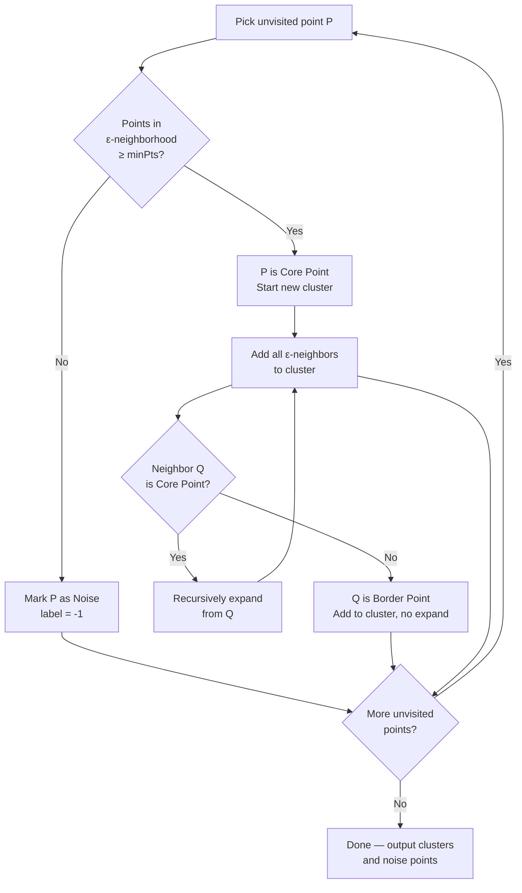

# 🔵 DBSCAN

> [!abstract] TL;DR
> DBSCAN groups points that are densely packed together and marks isolated points as noise. Unlike K-Means, you don't specify K — clusters emerge from density. It naturally handles arbitrary shapes, detects outliers, and is robust to noise. The two parameters are epsilon (neighborhood radius) and minPts (minimum neighbors to be a core point).

## Intuition — Analogy First

Imagine looking at a satellite map of a country at night. You see dense clusters of lights (cities), smaller clusters (towns), a few isolated lights (farms), and darkness (ocean). You didn't decide there are 5 cities — you just defined "dense enough" (a brightness threshold) and "close enough" (within X km). The cities emerge naturally. The isolated farmhouses are noise — they don't belong to any city.

That's DBSCAN. Dense neighborhoods form clusters organically. Lonely points become noise. You never tell the algorithm how many clusters to find.

**Three types of points:**
- **Core point** — has at least `minPts` neighbors within radius `ε`
- **Border point** — within `ε` of a core point but has fewer than `minPts` neighbors itself
- **Noise point** — not within `ε` of any core point (label = −1)

## How It Works — Mechanics

**Algorithm:**
1. For each unvisited point $p$:
   - Find all points within distance $\varepsilon$ of $p$ (its $\varepsilon$-neighborhood)
   - If fewer than `minPts` neighbors: mark $p$ as noise (temporarily)
   - If at least `minPts` neighbors: $p$ is a **core point** — start a new cluster
2. **Expand the cluster**: recursively add all density-reachable points
   - Border points join the cluster but don't expand it further
   - Core points expand recursively

**Key concepts:**
- **Directly density-reachable**: $q$ is directly reachable from core point $p$ if $q$ is within $\varepsilon$ of $p$
- **Density-reachable**: chain of directly reachable points from $p$ to $q$
- **Density-connected**: $p$ and $q$ are both density-reachable from some common core point $o$



**Choosing ε and minPts:**
- **minPts rule of thumb**: set to `2 × dimensions` at minimum; larger datasets benefit from larger minPts
- **ε selection**: sort distances to the k-th nearest neighbor (k = minPts) for all points; plot sorted distances; the "knee" in the curve is a good ε

**HDBSCAN** (Hierarchical DBSCAN):
- Builds a complete clustering hierarchy over all ε values
- Extracts the most stable clusters automatically
- More robust to varying densities (DBSCAN's main weakness)
- Use `hdbscan` library or `sklearn.cluster.HDBSCAN` (sklearn 1.3+)

## The Math

**ε-neighborhood of a point $p$:**
$$N_\varepsilon(p) = \{q \in D \mid dist(p, q) \leq \varepsilon\}$$

**Core point condition:**
$$|N_\varepsilon(p)| \geq \text{minPts}$$

**Density-reachability** (not symmetric): $q$ is density-reachable from $p$ if there exists a chain:
$$p = p_1, p_2, \ldots, p_n = q$$
where each $p_{i+1}$ is directly density-reachable from $p_i$.

**Density-connectivity** (symmetric): $p$ and $q$ are density-connected if there exists a point $o$ from which both $p$ and $q$ are density-reachable.

**Time complexity:** O(n log n) with spatial index (k-d tree, ball tree); O(n²) without.

## Code Demo

```python
import numpy as np
import matplotlib.pyplot as plt
from sklearn.cluster import DBSCAN, KMeans
from sklearn.datasets import make_moons, make_circles, make_blobs
from sklearn.preprocessing import StandardScaler
from sklearn.neighbors import NearestNeighbors

# --- Show where K-Means fails and DBSCAN succeeds ---
datasets = [
    make_moons(n_samples=300, noise=0.05, random_state=42),
    make_circles(n_samples=300, factor=0.5, noise=0.05, random_state=42),
    make_blobs(n_samples=300, centers=3, random_state=42),
]

fig, axes = plt.subplots(3, 2, figsize=(10, 12))

for idx, (X, y) in enumerate(datasets):
    X = StandardScaler().fit_transform(X)

    # K-Means
    km = KMeans(n_clusters=2, random_state=42)
    km_labels = km.fit_predict(X)

    # DBSCAN
    db = DBSCAN(eps=0.3, min_samples=5)
    db_labels = db.fit_predict(X)

    axes[idx, 0].scatter(X[:, 0], X[:, 1], c=km_labels, cmap='viridis', s=10)
    axes[idx, 0].set_title(f'K-Means (dataset {idx+1})')

    axes[idx, 1].scatter(X[:, 0], X[:, 1], c=db_labels, cmap='viridis', s=10)
    n_clusters = len(set(db_labels)) - (1 if -1 in db_labels else 0)
    n_noise = list(db_labels).count(-1)
    axes[idx, 1].set_title(f'DBSCAN: {n_clusters} clusters, {n_noise} noise pts')

plt.tight_layout()
plt.show()

# --- Choosing ε via k-distance plot ---
X_moon, _ = make_moons(n_samples=300, noise=0.05, random_state=42)
X_moon = StandardScaler().fit_transform(X_moon)

min_pts = 5
nbrs = NearestNeighbors(n_neighbors=min_pts).fit(X_moon)
distances, _ = nbrs.kneighbors(X_moon)
distances = np.sort(distances[:, min_pts - 1])

plt.figure(figsize=(8, 4))
plt.plot(distances)
plt.xlabel('Points sorted by distance')
plt.ylabel(f'{min_pts}-NN distance')
plt.title('K-Distance Graph — knee suggests ε')
plt.axhline(y=0.3, color='r', linestyle='--', label='ε = 0.3')
plt.legend()
plt.show()

# --- HDBSCAN (sklearn 1.3+) ---
from sklearn.cluster import HDBSCAN

hdb = HDBSCAN(min_cluster_size=10, min_samples=5)
hdb_labels = hdb.fit_predict(X_moon)
print(f"HDBSCAN clusters: {len(set(hdb_labels)) - (1 if -1 in hdb_labels else 0)}")
print(f"HDBSCAN noise: {list(hdb_labels).count(-1)}")

# --- Anomaly detection use case ---
# Points labeled -1 by DBSCAN are anomalies
X_fraud, _ = make_blobs(n_samples=500, centers=2, cluster_std=0.5, random_state=42)
# Inject outliers
outliers = np.random.uniform(low=-6, high=6, size=(20, 2))
X_fraud = np.vstack([X_fraud, outliers])

db_fraud = DBSCAN(eps=0.8, min_samples=10)
fraud_labels = db_fraud.fit_predict(X_fraud)
anomalies = X_fraud[fraud_labels == -1]
print(f"Detected {len(anomalies)} anomalies out of {len(X_fraud)} points")
```

## Real-World Example

**GPS-Based Geographic Clustering (Uber/Lyft):**
Ride-sharing companies use DBSCAN on GPS pickup coordinates to automatically discover "hotspot" zones — airports, stadiums, downtown cores, transit hubs — without pre-specifying how many zones exist. Isolated pickups (noise) are just individual rides. This informs surge pricing zone definitions and driver repositioning.

**Astronomical Object Detection:**
The Sloan Digital Sky Survey used density-based clustering to detect galaxy clusters and superclusters from millions of stellar coordinates. K-Means would impose spherical clusters on what are actually filamentary, irregular cosmic web structures. DBSCAN naturally finds elongated galaxy filaments and identifies isolated objects (noise) as potentially interesting anomalies.

**Cybersecurity — Network Intrusion Detection:**
DBSCAN on network traffic features (packet size, frequency, port patterns) identifies normal traffic clusters and flags outlier (noise) connections as potential intrusions. No need to label attack patterns upfront.

## Trade-offs

| Aspect | Pro | Con |
|---|---|---|
| K specification | No need to specify K | Need to tune ε and minPts instead |
| Cluster shapes | Handles arbitrary shapes (moons, rings) | Struggles with varying density clusters |
| Outlier detection | Naturally identifies noise points | High-density regions can absorb outliers |
| Scalability | O(n log n) with spatial index | O(n²) without index; slow on large datasets |
| Determinism | Fully deterministic | Border point assignment can vary |
| High dimensions | Works in any dimension | ε becomes hard to set in high-D (use HDBSCAN) |

## When to Use vs Avoid

**Use DBSCAN when:**
- Clusters have arbitrary, non-convex shapes
- You don't know K and can't easily estimate it
- Outlier/anomaly detection is part of the goal
- Data has regions of varying density... but those regions are internally consistent
- Geographic data (latitude/longitude clusters)

**Avoid DBSCAN when:**
- Clusters have very different densities (use HDBSCAN instead)
- High-dimensional data without good distance metrics (curse of dimensionality)
- You need probabilistic cluster membership
- The dataset is enormous and you can't afford O(n²) without an index
- Very high-dimensional sparse data (e.g., raw text TF-IDF — use topic models)

## Common Pitfalls

1. **Not scaling features** — DBSCAN is distance-based; unscaled features create meaningless neighborhoods. Always `StandardScaler` first.

2. **Choosing ε blindly** — Always plot the k-distance graph. The knee tells you what ε means geometrically for your data.

3. **Treating noise as bad** — Noise points (-1 labels) are often exactly what you want in anomaly detection. Don't discard them.

4. **Expecting DBSCAN to handle varying density** — Classic DBSCAN uses one global ε. If your data has both tight and spread-out clusters, use HDBSCAN.

5. **Confusing "no cluster found" with "wrong model"** — If DBSCAN labels everything as noise, ε is too small. If one cluster contains everything, ε is too large. The k-distance plot helps.

6. **Ignoring computational cost** — On 10M points without a spatial index (k-d tree), DBSCAN becomes O(n²). Use `algorithm='ball_tree'` or `algorithm='kd_tree'` in sklearn and set `n_jobs=-1`.

## Related Concepts

- [[_MOC_Classical_ML|↑ Section MOC]]

- [[KMeans]] — centroid-based; requires K; assumes spherical clusters
- [[Hierarchical_Clustering]] — builds dendrogram; no K needed; also handles non-spherical
- [[Handling_Imbalanced_Data]] — DBSCAN's noise detection is a form of anomaly detection
- [[Feature_Engineering]] — feature quality and scaling are critical for distance-based methods
- [[PCA]] — dimensionality reduction often necessary before DBSCAN in high-D

## Review Questions

1. A dataset of GPS coordinates has clusters of varying density — a packed city center and a sparse suburban area. DBSCAN with a single ε fails to capture both. What algorithm would you use instead, and why?

2. After running DBSCAN, 40% of your points are labeled as noise (-1). What are two possible interpretations of this result, and what would you check first?

3. Explain why DBSCAN can find a ring-shaped cluster but K-Means cannot, using the concepts of density-reachability and centroid-based assignment.

## Sources

- Ester, M., Kriegel, H.P., Sander, J., & Xu, X. (1996). "A density-based algorithm for discovering clusters in large spatial databases with noise." *KDD-96 Proceedings*, 226–231.
- Campello, R.J.G.B., Moulavi, D., & Sander, J. (2013). "Density-Based Clustering Based on Hierarchical Density Estimates." *PAKDD 2013*.
- Scikit-learn documentation: [DBSCAN](https://scikit-learn.org/stable/modules/generated/sklearn.cluster.DBSCAN.html)
- McInnes, L., Healy, J., & Astels, S. (2017). "hdbscan: Hierarchical density based clustering." *Journal of Open Source Software*, 2(11), 205.

#clustering #unsupervised-learning #dbscan #anomaly-detection #density-based #outlier-detection
