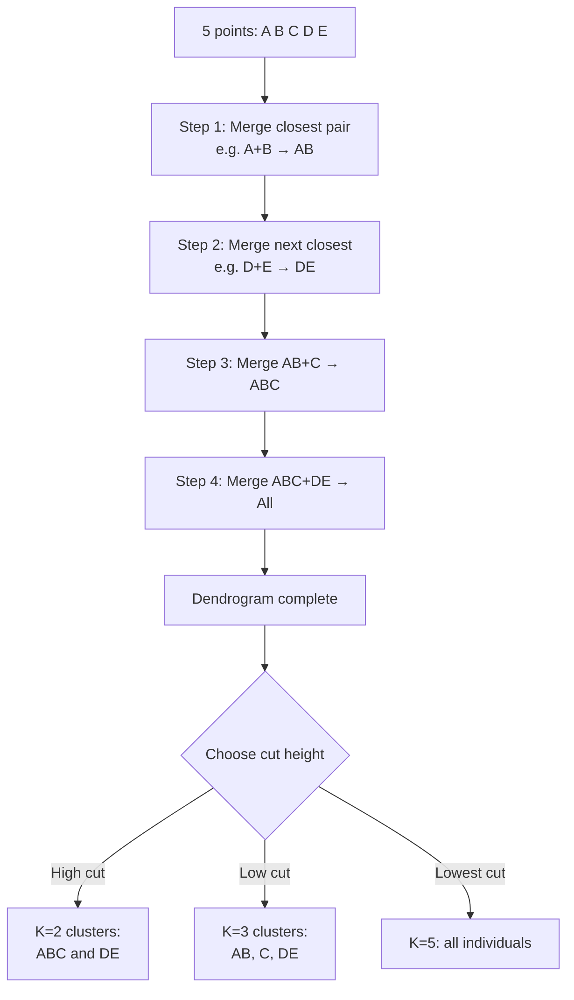

# 🌳 Hierarchical Clustering

> [!abstract] TL;DR
> Hierarchical clustering builds a tree (dendrogram) of nested cluster merges. Agglomerative (bottom-up) starts with each point as its own cluster and merges the closest pair at each step. You don't need to specify K upfront — you cut the dendrogram at any height to get any number of clusters. The linkage criterion controls how "closeness" between clusters is measured.

## Intuition — Analogy First

Think of constructing a family tree (genealogy). Everyone starts as an individual. You find the two most closely related people and make them siblings. Then find the next closest relatives. Keep merging upward until everyone traces back to a single ancestor. The resulting tree is a dendrogram.

Now to answer "how many family groups are there?", you simply draw a horizontal line across the tree at a chosen generation level. Where the line crosses branches is how many groups you have. Cut high — few large groups. Cut low — many small groups. You make this choice *after* seeing the tree.

That flexibility is hierarchical clustering's superpower: **explore the structure at every level of granularity from one run.**

## How It Works — Mechanics

**Agglomerative (Bottom-Up) — most common:**

1. Start: N clusters, one point each
2. Compute pairwise distance matrix
3. Merge the two closest clusters
4. Update the distance matrix (using linkage criterion)
5. Repeat steps 3–4 until 1 cluster remains
6. Record merge history → dendrogram

**Divisive (Top-Down):**
Starts with one cluster containing all points, recursively splits. Less common due to computational cost.

**Linkage Criteria** — how to measure distance between *clusters* (not points):

| Linkage | Distance Definition | Behavior |
|---|---|---|
| Single | Minimum distance between any two points | Elongated, chain-like clusters; sensitive to noise |
| Complete | Maximum distance between any two points | Compact, spherical clusters; sensitive to outliers |
| Average | Mean distance between all pairs | Compromise between single and complete |
| Ward | Minimize increase in total within-cluster variance | Most compact, similar to K-Means shape; most popular |

**Reading the Dendrogram:**
- Y-axis = distance at which merge occurred
- Long vertical lines = large gaps between natural clusters
- Cut height = your chosen K: count how many branches are below the cut



## The Math

**Distance metrics** (applied between individual points):

Euclidean: $d(p,q) = \sqrt{\sum_i (p_i - q_i)^2}$

Manhattan: $d(p,q) = \sum_i |p_i - q_i|$

Cosine: $d(p,q) = 1 - \frac{p \cdot q}{\|p\|\|q\|}$

**Ward linkage** — merges clusters $A$ and $B$ that minimize the increase in total within-cluster variance:

$$\Delta(A, B) = \frac{|A||B|}{|A|+|B|} \|\bar{x}_A - \bar{x}_B\|^2$$

Where $|A|$ and $|B|$ are cluster sizes, and $\bar{x}_A$, $\bar{x}_B$ are their centroids.

**Cophenetic Correlation Coefficient** — measures how faithfully the dendrogram preserves pairwise distances:
$$r_c = \frac{\sum_{i<j}(d_{ij} - \bar{d})(c_{ij} - \bar{c})}{\sqrt{\sum_{i<j}(d_{ij}-\bar{d})^2 \cdot \sum_{i<j}(c_{ij}-\bar{c})^2}}$$
Where $d_{ij}$ = original distance, $c_{ij}$ = cophenetic distance (height at which $i$ and $j$ merge). Closer to 1.0 is better.

**Complexity:** O(n³) time, O(n²) space for naive implementation; O(n² log n) with optimized algorithms.

## Code Demo

```python
import numpy as np
import matplotlib.pyplot as plt
from scipy.cluster.hierarchy import dendrogram, linkage, fcluster, cophenet
from scipy.spatial.distance import pdist
from sklearn.cluster import AgglomerativeClustering
from sklearn.datasets import make_blobs
from sklearn.preprocessing import StandardScaler
from sklearn.metrics import silhouette_score

# Generate data
X, y_true = make_blobs(n_samples=50, centers=4, cluster_std=0.7, random_state=42)
X = StandardScaler().fit_transform(X)

# --- Scipy: build dendrogram ---
# Linkage options: 'single', 'complete', 'average', 'ward'
Z = linkage(X, method='ward', metric='euclidean')

# Cophenetic correlation
c, coph_dists = cophenet(Z, pdist(X))
print(f"Cophenetic correlation (Ward): {c:.3f}")

# --- Plot dendrogram ---
fig, axes = plt.subplots(1, 2, figsize=(14, 6))

# Full dendrogram
dendrogram(Z, ax=axes[0], leaf_rotation=90, leaf_font_size=8)
axes[0].set_title('Full Dendrogram (Ward linkage)')
axes[0].set_xlabel('Sample index')
axes[0].set_ylabel('Distance')
axes[0].axhline(y=3.5, color='r', linestyle='--', label='Cut at 3.5 → 4 clusters')
axes[0].legend()

# Truncated dendrogram (last 12 merges) for clarity
dendrogram(Z, ax=axes[1], truncate_mode='lastp', p=12,
           leaf_rotation=90, leaf_font_size=10, show_contracted=True)
axes[1].set_title('Truncated Dendrogram (last 12 merges)')
plt.tight_layout()
plt.show()

# --- Cut dendrogram at different heights ---
for n_clusters in [2, 3, 4, 5]:
    labels = fcluster(Z, n_clusters, criterion='maxclust')
    sil = silhouette_score(X, labels)
    print(f"K={n_clusters}: Silhouette={sil:.3f}")

# --- Sklearn AgglomerativeClustering ---
for linkage_method in ['ward', 'complete', 'average', 'single']:
    agg = AgglomerativeClustering(n_clusters=4, linkage=linkage_method)
    labels = agg.fit_predict(X)
    sil = silhouette_score(X, labels)
    print(f"Linkage={linkage_method:8s}: Silhouette={sil:.3f}")

# --- Gene expression example simulation ---
np.random.seed(42)
n_genes, n_samples = 100, 20
# Simulate 3 gene expression patterns
gene_data = np.vstack([
    np.random.normal(5, 0.5, (33, n_samples)),   # High expression group
    np.random.normal(0, 0.5, (34, n_samples)),   # Low expression group
    np.random.normal(2.5, 0.5, (33, n_samples)), # Medium expression group
])
gene_data += np.random.normal(0, 0.1, gene_data.shape)

Z_genes = linkage(gene_data, method='ward')
plt.figure(figsize=(10, 4))
dendrogram(Z_genes, no_labels=True)
plt.title('Gene Expression Dendrogram (simulated)')
plt.ylabel('Ward distance')
plt.show()
```

## Real-World Example

**Gene Expression Clustering in Bioinformatics:**
RNA-seq experiments measure expression levels of ~20,000 genes across dozens of cancer patients. Hierarchical clustering (Ward linkage) on the gene matrix reveals which genes are co-regulated (co-expressed), forming functional gene modules. The dendrogram lets researchers explore coarse groupings (immune vs. metabolism genes) and fine groupings (specific signaling pathways) from one analysis. Tools like heatmap + dendrogram are the standard visualization in bioinformatics papers.

**Document Hierarchical Organization:**
A law firm uses hierarchical clustering on TF-IDF document embeddings to organize 50,000 legal documents. The dendrogram reveals high-level categories (contracts, litigation, compliance) and fine-grained subcategories (employment contracts, IP licensing, M&A). Cutting at different heights allows different organizational views without re-running the algorithm.

## Trade-offs

| Aspect | Pro | Con |
|---|---|---|
| K specification | No need to specify K upfront | Computational cost to build full dendrogram |
| Interpretability | Dendrogram shows complete merge history | O(n²) memory — impractical for n > ~10,000 |
| Flexibility | One run gives all K values | Cannot update with new data (non-incremental) |
| Determinism | Fully deterministic | Greedy merges can't be undone (no backtracking) |
| Linkage options | Multiple linkage criteria for different use cases | Linkage choice significantly affects results |
| Shape handling | Ward handles compact; single handles elongated | Single linkage prone to chaining effect |

## When to Use vs Avoid

**Use Hierarchical Clustering when:**
- You don't know K and want to explore multiple granularities
- Dataset is small to medium (n < 10,000) — memory allows O(n²)
- You need a full dendrogram visualization for interpretation
- Domain requires hierarchical organization (taxonomy, biology, document hierarchy)
- You want deterministic, reproducible results

**Avoid Hierarchical Clustering when:**
- n > 10,000 — memory and compute become prohibitive
- You already know K — K-Means is faster and equally good
- Data is streaming or needs incremental updates
- Clusters are highly variable density (DBSCAN or HDBSCAN preferred)
- You need probabilistic cluster assignments

## Common Pitfalls

1. **Using single linkage on noisy data** — single linkage is highly sensitive to noise and creates "chaining" (long, snake-like clusters merging through a few close points). Use Ward or complete linkage for compact clusters.

2. **Not scaling features** — pairwise distances dominate cluster structure; unscaled features create nonsensical hierarchies.

3. **Trusting only the dendrogram visually** — large dendrograms are hard to read. Always compute cophenetic correlation and silhouette scores numerically.

4. **Applying to large datasets** — hierarchical clustering with n=100,000 requires ~80GB just to store the distance matrix. Use mini-batch K-Means or approximate algorithms instead.

5. **Ignoring that merges are irreversible** — hierarchical clustering is greedy. A merge made early based on local information can prevent better global clustering. There's no backtracking.

## Related Concepts

- [[_MOC_Classical_ML|↑ Section MOC]]

- [[KMeans]] — flat, centroid-based; much faster; requires K upfront
- [[DBSCAN]] — density-based; handles noise; no K needed; handles arbitrary shapes
- [[PCA]] — often applied before clustering to reduce noise dimensions
- [[Feature_Engineering]] — distance-based methods are sensitive to feature representation

## Review Questions

1. You have a dendrogram where the longest vertical line (biggest gap between consecutive merges) appears at height 4.2, splitting the tree into 3 branches below it. What does this tell you about the natural cluster structure, and how many clusters would you choose?

2. Compare Ward linkage and single linkage. For which type of cluster shape would you prefer each, and why?

3. A bioinformatics team wants to cluster 50,000 gene expression samples. They propose using AgglomerativeClustering. What problem will they encounter, and what alternative approaches would you suggest?

## Sources

- Ward, J.H. (1963). "Hierarchical grouping to optimize an objective function." *Journal of the American Statistical Association*, 58(301), 236–244.
- Murtagh, F. & Contreras, P. (2012). "Algorithms for hierarchical clustering: an overview." *WIREs Data Mining and Knowledge Discovery*, 2(1), 86–97.
- Scipy documentation: [scipy.cluster.hierarchy](https://docs.scipy.org/doc/scipy/reference/cluster.hierarchy.html)
- Scikit-learn documentation: [AgglomerativeClustering](https://scikit-learn.org/stable/modules/generated/sklearn.cluster.AgglomerativeClustering.html)

#clustering #unsupervised-learning #hierarchical-clustering #dendrogram #agglomerative #bioinformatics
