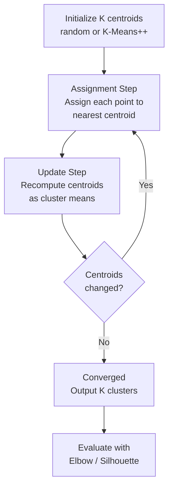

# 🎯 K-Means Clustering

> [!abstract] TL;DR
> K-Means partitions data into K clusters by iteratively assigning each point to its nearest centroid and recomputing centroids until convergence. It minimizes within-cluster variance. Simple, fast, and widely used — but assumes spherical clusters and requires K upfront.

## Intuition — Analogy First

Imagine emptying a bag of mixed fruit (apples, oranges, bananas) onto a table. You don't have labels — you just start sorting by similarity. You pick K piles at random, toss each fruit to its nearest pile, then shift the "center" of each pile to wherever the average fruit actually sits. Repeat until the piles stop changing. That's K-Means.

The key insight: **the algorithm alternates between two simple steps** — assigning points to the nearest cluster center, and moving cluster centers to the mean of their assigned points. Neither step ever makes things worse, so the algorithm must converge (though possibly to a local minimum).

## How It Works — Mechanics

**Algorithm Steps:**

1. **Initialize** K centroids (random or K-Means++)
2. **Assignment step** — assign each point to its nearest centroid: $c^{(i)} = \arg\min_k \|x^{(i)} - \mu_k\|^2$
3. **Update step** — recompute each centroid as the mean of its assigned points: $\mu_k = \frac{1}{|C_k|} \sum_{x \in C_k} x$
4. **Repeat** steps 2–3 until centroids stop moving (convergence)

**K-Means++ Initialization:**
Instead of random initialization, K-Means++ selects initial centroids with probability proportional to their distance from already-chosen centroids. This reduces the chance of getting stuck in bad local minima and typically converges faster.

**Choosing K:**
- **Elbow method** — plot inertia (within-cluster sum of squares) vs K; the "elbow" suggests the right K
- **Silhouette score** — measures how well-separated clusters are (range −1 to 1; higher is better)
- **Gap statistic** — compares inertia to random baseline



## The Math

**Objective — minimize total within-cluster variance:**

$$J = \sum_{i=1}^{K} \sum_{x \in C_i} \|x - \mu_i\|^2$$

Where:
- $K$ = number of clusters
- $C_i$ = set of points assigned to cluster $i$
- $\mu_i$ = centroid of cluster $i$
- $\|x - \mu_i\|^2$ = squared Euclidean distance

**Why it converges:** Each step monotonically decreases $J$.
- Assignment step: assigning to the nearest centroid cannot increase $J$
- Update step: the mean minimizes squared distances for a fixed set of points

Therefore $J$ decreases (or stays constant) at every step, and since there are finitely many assignments, convergence is guaranteed — though to a local, not global, minimum.

**Silhouette score for point $i$:**

$$s(i) = \frac{b(i) - a(i)}{\max(a(i), b(i))}$$

Where $a(i)$ = mean intra-cluster distance, $b(i)$ = mean nearest-cluster distance.

## Code Demo

```python
import numpy as np
import matplotlib.pyplot as plt
from sklearn.cluster import KMeans
from sklearn.metrics import silhouette_score
from sklearn.datasets import make_blobs
from sklearn.preprocessing import StandardScaler

# Generate synthetic data
X, y_true = make_blobs(n_samples=300, centers=4, cluster_std=0.8, random_state=42)
X = StandardScaler().fit_transform(X)

# --- Elbow Method to choose K ---
inertias = []
silhouettes = []
K_range = range(2, 10)

for k in K_range:
    km = KMeans(n_clusters=k, init='k-means++', n_init=10, random_state=42)
    km.fit(X)
    inertias.append(km.inertia_)
    silhouettes.append(silhouette_score(X, km.labels_))

fig, axes = plt.subplots(1, 2, figsize=(12, 4))
axes[0].plot(K_range, inertias, 'bo-')
axes[0].set_xlabel('K'); axes[0].set_ylabel('Inertia')
axes[0].set_title('Elbow Method')

axes[1].plot(K_range, silhouettes, 'ro-')
axes[1].set_xlabel('K'); axes[1].set_ylabel('Silhouette Score')
axes[1].set_title('Silhouette Scores')
plt.tight_layout()
plt.show()

# --- Fit with optimal K ---
km_best = KMeans(n_clusters=4, init='k-means++', n_init=10, random_state=42)
labels = km_best.fit_predict(X)

print(f"Inertia: {km_best.inertia_:.2f}")
print(f"Silhouette Score: {silhouette_score(X, labels):.3f}")
print(f"Cluster sizes: {np.bincount(labels)}")

# --- Image compression via color quantization ---
from sklearn.datasets import load_sample_image
from sklearn.utils import shuffle

china = load_sample_image("china.jpg").astype(np.float64) / 255
w, h, d = china.shape
image_array = china.reshape(-1, 3)
image_sample = shuffle(image_array, random_state=42)[:1000]

km_color = KMeans(n_clusters=64, random_state=42).fit(image_sample)
labels_color = km_color.predict(image_array)
compressed = km_color.cluster_centers_[labels_color].reshape(w, h, d)
print(f"Compression ratio: {3}/{64*3 + len(labels_color):.0f} colors per pixel")
```

## Real-World Example

**Customer Segmentation at Retail Banks:**
A bank with 10M customers uses K-Means on features like transaction frequency, average balance, product holdings, and tenure. With K=5, they discover segments: "High-value loyals", "Young digitals", "Dormant accounts", "Small-business users", "Credit-dependent". Each segment gets tailored marketing, reducing churn by targeting the right offer.

**Image Compression (Color Quantization):**
A 24-bit PNG uses 16M possible colors. K-Means with K=64 clusters all pixel colors into 64 representative colors. Each pixel is then stored as a 6-bit cluster index instead of 24 bits — roughly 4x compression with minimal visual quality loss. This is how early GIF compression worked.

## Trade-offs

| Aspect | Pro | Con |
|---|---|---|
| Speed | O(nKt) — very fast for large datasets | Sensitive to initialization (use K-Means++) |
| Simplicity | Easy to implement and interpret | Must specify K upfront |
| Scalability | MiniBatchKMeans scales to millions | Assumes spherical, equal-size clusters |
| Convergence | Always converges | Converges to local minimum, not global |
| Outliers | — | Very sensitive to outliers (use median or DBSCAN) |
| Cluster shape | Works perfectly for blob-like clusters | Fails on rings, crescents, elongated shapes |

## When to Use vs Avoid

**Use K-Means when:**
- Clusters are roughly spherical and similarly sized
- You have a rough idea of K (or can use elbow/silhouette)
- Dataset is large (> 100K points) — it's fast
- You need a hard partition (every point belongs to exactly one cluster)
- Preprocessing step for other algorithms (e.g., vector quantization)

**Avoid K-Means when:**
- Clusters have irregular shapes (use DBSCAN)
- You don't know K and the data has no obvious elbow (use DBSCAN or hierarchical)
- Dataset has many outliers (they strongly pull centroids)
- Features are on very different scales (always standardize first!)
- Clusters have very different densities or sizes

## Common Pitfalls

1. **Not scaling features** — K-Means uses Euclidean distance, so a feature with range 0–10,000 dominates one with range 0–1. Always use `StandardScaler` or `MinMaxScaler`.

2. **Using accuracy to evaluate** — K-Means is unsupervised. Use silhouette score, Davies-Bouldin index, or domain-specific validation, not classification accuracy.

3. **Trusting the elbow blindly** — Real data often doesn't have a clean elbow. Use silhouette alongside inertia, and apply domain knowledge.

4. **Running K-Means once** — Due to random initialization, always set `n_init=10` or higher. The default in sklearn is 10, but confirm.

5. **Treating K-Means as density-aware** — K-Means divides space; it does NOT find noise or outliers. All points are forced into a cluster, including anomalies.

6. **Ignoring the curse of dimensionality** — Euclidean distance becomes less meaningful in high dimensions. Apply PCA first.

## Related Concepts

- [[_MOC_Classical_ML|↑ Section MOC]]

- [[DBSCAN]] — density-based clustering; handles arbitrary shapes and finds outliers
- [[Hierarchical_Clustering]] — builds a dendrogram; no need to specify K upfront
- [[PCA]] — dimensionality reduction often applied before clustering
- [[Feature_Engineering]] — feature quality directly determines clustering quality
- [[Feature_Selection]] — reducing dimensions improves K-Means in high-dim spaces

## Review Questions

1. Why is K-Means++ initialization better than random initialization, and what probability distribution does it use to select the next centroid?

2. You run K-Means on customer data and get an inertia curve that decreases smoothly with no clear elbow. What does this tell you about the data, and what alternative approaches would you try?

3. K-Means is applied to a dataset with two features: age (18–80) and salary ($20K–$200K). The algorithm ignores age entirely and clusters only by salary. What went wrong, and how do you fix it?

## Sources

- Lloyd, S.P. (1982). "Least squares quantization in PCM." *IEEE Transactions on Information Theory*, 28(2), 129–137.
- Arthur, D. & Vassilvitskii, S. (2007). "K-Means++: The Advantages of Careful Seeding." *SODA 2007*.
- Scikit-learn documentation: [KMeans](https://scikit-learn.org/stable/modules/generated/sklearn.cluster.KMeans.html)
- Rousseeuw, P.J. (1987). "Silhouettes: a graphical aid to the interpretation and validation of cluster analysis." *Journal of Computational and Applied Mathematics*, 20, 53–65.

#clustering #unsupervised-learning #k-means #dimensionality-reduction #customer-segmentation
