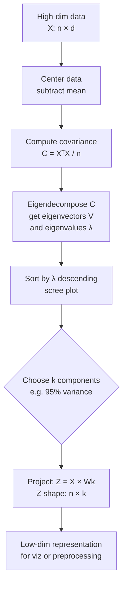

# 📐 Principal Component Analysis (PCA)

> [!abstract] TL;DR
> PCA finds the directions of maximum variance in high-dimensional data and projects data onto a lower-dimensional subspace along those directions (principal components). It's the eigenvectors of the covariance matrix, sorted by eigenvalue magnitude. PCA is linear, so it works best when structure is approximately linear — for non-linear structure, use t-SNE or UMAP.

## Intuition — Analogy First

Hold a 3D object (say, a crumpled piece of paper) and shine a light on it. The shadow on the wall is a 2D projection. Most 3D shapes look flat and unhelpful from some angles, but from the right angle you can see the most detail — the shadow captures the most "shape information." PCA finds that best angle automatically.

More precisely: imagine data as a cloud of points in 100 dimensions. Most of the variation happens along a few key directions. PCA rotates your coordinate system so that the first axis points toward maximum variance, the second axis points toward the remaining maximum variance (perpendicular to the first), and so on. The last axes capture almost no variance — you can throw them away without much loss.

**Two uses of PCA:**
1. **Visualization** — project to 2D/3D to see structure
2. **Preprocessing** — remove redundant/noisy dimensions before feeding to a model

## How It Works — Mechanics

**Steps:**
1. **Center the data** — subtract the mean from each feature: $\tilde{X} = X - \bar{X}$
2. **Compute covariance matrix**: $C = \frac{1}{n}\tilde{X}^T\tilde{X}$ (shape: d × d)
3. **Eigendecompose** $C = V \Lambda V^T$ where:
   - $V$ = matrix of eigenvectors (principal components)
   - $\Lambda$ = diagonal matrix of eigenvalues (variances explained)
4. **Sort** eigenvectors by eigenvalue (descending)
5. **Project** data: $Z = \tilde{X} W_k$ where $W_k$ = top-k eigenvectors

**Alternatively via SVD:**
$\tilde{X} = U \Sigma V^T$ — the right singular vectors $V$ are the principal components. This is how sklearn implements it — more numerically stable than eigendecomposition.

**Explained variance ratio:**
$$\text{EVR}_k = \frac{\lambda_k}{\sum_i \lambda_i}$$

Sum of top-k EVRs tells you how much variance is retained when keeping k components.



## The Math

**Covariance matrix** (for zero-mean data):
$$C = \frac{1}{n} X^T X \in \mathbb{R}^{d \times d}$$

**Eigendecomposition:**
$$C v_i = \lambda_i v_i$$

The $i$-th principal component $v_i$ is the direction of the $i$-th largest variance $\lambda_i$.

**Projection onto k components:**
$$z = W_k^T x \quad \text{where } W_k = [v_1, v_2, \ldots, v_k]$$

**Reconstruction (approximate):**
$$\hat{x} = W_k z + \bar{x} = W_k W_k^T (x - \bar{x}) + \bar{x}$$

**Reconstruction error** (Frobenius norm):
$$\|X - \hat{X}\|_F^2 = \sum_{i=k+1}^{d} \lambda_i$$

The dropped eigenvalues directly equal the reconstruction error — elegant.

**Optimal low-rank approximation** (Eckart-Young theorem):
The PCA projection is the **best** rank-k linear approximation to the data in terms of squared error. No other k-dimensional linear subspace does better.

**Whitening (ZCA/PCA whitening):**
$$z_{\text{white}} = \Lambda^{-1/2} V^T x$$
Decorrelates features AND normalizes variance to 1. Useful before neural net training.

## Code Demo

```python
import numpy as np
import matplotlib.pyplot as plt
from sklearn.decomposition import PCA
from sklearn.datasets import load_digits, load_breast_cancer
from sklearn.preprocessing import StandardScaler
from sklearn.linear_model import LogisticRegression
from sklearn.pipeline import Pipeline
from sklearn.model_selection import cross_val_score

# --- Basic PCA on digits dataset ---
digits = load_digits()
X, y = digits.data, digits.target  # 1797 samples, 64 features

scaler = StandardScaler()
X_scaled = scaler.fit_transform(X)

# Fit PCA
pca = PCA()
pca.fit(X_scaled)

# --- Scree plot ---
fig, axes = plt.subplots(1, 2, figsize=(12, 4))

# Cumulative explained variance
cumvar = np.cumsum(pca.explained_variance_ratio_)
axes[0].plot(cumvar, 'b-o', markersize=3)
axes[0].axhline(0.95, color='r', linestyle='--', label='95% variance')
axes[0].set_xlabel('Number of Components')
axes[0].set_ylabel('Cumulative Explained Variance')
axes[0].set_title('Scree Plot (Cumulative)')
n_95 = np.argmax(cumvar >= 0.95) + 1
axes[0].axvline(n_95, color='g', linestyle='--', label=f'{n_95} components for 95%')
axes[0].legend()

# Individual explained variance (first 20)
axes[1].bar(range(1, 21), pca.explained_variance_ratio_[:20])
axes[1].set_xlabel('Component')
axes[1].set_ylabel('Explained Variance Ratio')
axes[1].set_title('Individual Component Variance')
plt.tight_layout()
plt.show()
print(f"Components for 95% variance: {n_95}")

# --- 2D visualization ---
pca_2d = PCA(n_components=2)
X_2d = pca_2d.fit_transform(X_scaled)

plt.figure(figsize=(10, 8))
scatter = plt.scatter(X_2d[:, 0], X_2d[:, 1], c=y, cmap='tab10', alpha=0.6, s=15)
plt.colorbar(scatter, label='Digit class')
plt.xlabel(f'PC1 ({pca_2d.explained_variance_ratio_[0]:.1%} variance)')
plt.ylabel(f'PC2 ({pca_2d.explained_variance_ratio_[1]:.1%} variance)')
plt.title('PCA 2D Projection of Digits Dataset')
plt.show()

# --- PCA as preprocessing: compare accuracy with/without ---
cancer = load_breast_cancer()
X_c, y_c = cancer.data, cancer.target

pipe_no_pca = Pipeline([
    ('scale', StandardScaler()),
    ('clf', LogisticRegression(max_iter=1000))
])
pipe_pca = Pipeline([
    ('scale', StandardScaler()),
    ('pca', PCA(n_components=0.95)),  # Keep 95% variance
    ('clf', LogisticRegression(max_iter=1000))
])

score_no_pca = cross_val_score(pipe_no_pca, X_c, y_c, cv=5).mean()
score_pca = cross_val_score(pipe_pca, X_c, y_c, cv=5).mean()
print(f"Accuracy without PCA: {score_no_pca:.3f}")
print(f"Accuracy with PCA:    {score_pca:.3f}")

# --- Biplot: visualize loadings ---
pca_bio = PCA(n_components=2).fit(X_scaled[:, :10])
loadings = pca_bio.components_.T * np.sqrt(pca_bio.explained_variance_)
plt.figure(figsize=(8, 6))
for i, (x, y_load) in enumerate(loadings):
    plt.arrow(0, 0, x, y_load, head_width=0.03, color='r', alpha=0.7)
    plt.text(x * 1.1, y_load * 1.1, f'F{i+1}', fontsize=8)
plt.xlabel('PC1'); plt.ylabel('PC2')
plt.title('PCA Biplot (loadings)')
plt.grid(True, alpha=0.3)
plt.show()

# --- Eigenfaces ---
from sklearn.datasets import fetch_olivetti_faces

faces = fetch_olivetti_faces()
X_faces = faces.data  # 400 × 4096

pca_faces = PCA(n_components=50, whiten=True).fit(X_faces)
eigenfaces = pca_faces.components_.reshape((50, 64, 64))

fig, axes = plt.subplots(5, 10, figsize=(15, 8))
for i, ax in enumerate(axes.flat):
    ax.imshow(eigenfaces[i], cmap='gray')
    ax.axis('off')
plt.suptitle('Top 50 Eigenfaces')
plt.show()
```

## Real-World Example

**Eigenfaces — Face Recognition (Turk & Pentland, 1991):**
One of the earliest successful face recognition systems. Each face image (e.g., 256×256 pixels = 65,536 dimensions) is projected onto the top 50-150 principal components ("eigenfaces"). Recognition is done in this compressed space. The eigenfaces capture lighting, facial structure, and expression variation. A 65,536-D distance comparison becomes a 100-D comparison — 600x faster, with better discrimination.

**Financial Portfolio Analysis:**
A hedge fund has 500 stocks with correlated daily returns. PCA reveals that ~10 principal components explain 80% of variance. These components correspond to market-wide risk, sector risk, and factor exposures (value, momentum, size). Portfolio managers use PCA to understand risk concentration and build decorrelated positions.

## Trade-offs

| Aspect | Pro | Con |
|---|---|---|
| Speed | Fast for large d, uses SVD | O(min(n,d)²·max(n,d)) — slow for very large d |
| Interpretability | Explained variance is exact | Components are abstract linear combinations |
| Preprocessing | Removes multicollinearity for linear models | Loses feature names / interpretability |
| Linear structure | Optimal linear approximation (Eckart-Young) | Can't capture non-linear structure |
| Reconstruction | Exact inverse transform available | Information is lost (unless keeping all components) |
| Whitening | Can decorrelate and normalize | Can amplify noise in low-variance directions |

## When to Use vs Avoid

**Use PCA when:**
- Features are highly correlated (multicollinearity) — helps linear models
- Visualization in 2D/3D of linear structure
- Compression before computing expensive pairwise distances
- Preprocessing before clustering (K-Means, GMM)
- Memory/speed constraints demand lower dimensions
- `n_components=0.95` as a general-purpose denoiser

**Avoid PCA when:**
- Data has non-linear structure — use t-SNE or UMAP for visualization
- You need interpretable features — PCA mixes all original features
- Features are categorical or binary — PCA assumes continuous, approximately Gaussian features
- You're doing tree-based models (Random Forest, XGBoost) — they're invariant to feature scale and handle correlated features natively

## Common Pitfalls

1. **Not centering/scaling first** — PCA maximizes variance. If one feature has range 0–10,000, it dominates. Always `StandardScaler` before PCA.

2. **Choosing components by number instead of explained variance** — "let's use 10 components" is arbitrary. Use `PCA(n_components=0.95)` to retain 95% of variance, or use the scree plot.

3. **Applying PCA to categorical features** — PCA computes covariance; it assumes continuous numerical features. For mixed data, use MCA or encode categoricals first.

4. **Confusing PCA with feature selection** — PCA creates new features (linear combinations). It does NOT select original features. For original feature selection, use [[Feature_Selection]] methods.

5. **Leaking test data** — always fit PCA on training data only, then transform both train and test. In sklearn, use a `Pipeline` to prevent leakage.

6. **Ignoring reconstruction error** — if you're using PCA for compression, check the reconstruction error. Throwing away 90% of variance may destroy critical signal.

## Related Concepts

- [[_MOC_Classical_ML|↑ Section MOC]]

- [[Linear_Algebra]] — PCA is entirely based on eigendecomposition and SVD
- [[tSNE]] — non-linear dimensionality reduction for visualization
- [[UMAP]] — faster non-linear reduction; preserves global structure better than t-SNE
- [[Feature_Selection]] — keeps original features; PCA creates new ones
- [[KMeans]] — often applied on PCA output for better clustering in reduced dimensions
- [[Regularization]] — both PCA and regularization combat overfitting from high dimensionality

## Review Questions

1. You apply PCA to a dataset with 200 features and find that the first principal component explains 60% of variance, and the first 5 explain 90%. What does this tell you about the data's intrinsic dimensionality, and how many components would you keep?

2. A colleague applies PCA to their entire dataset (train + test combined) and then splits into train/test sets for model evaluation. What has gone wrong, and how does it affect their reported performance?

3. PCA is applied to face images (each 64×64 pixels = 4096 features) and the top 50 components are kept. If you then compute the reconstruction by projecting back to pixel space, what determines the reconstruction error, and which faces will be reconstructed most accurately?

## Sources

- Pearson, K. (1901). "On lines and planes of closest fit to systems of points in space." *Philosophical Magazine*, 2(11), 559–572.
- Turk, M. & Pentland, A. (1991). "Eigenfaces for recognition." *Journal of Cognitive Neuroscience*, 3(1), 71–86.
- Jolliffe, I.T. (2002). *Principal Component Analysis* (2nd ed.). Springer.
- Scikit-learn documentation: [PCA](https://scikit-learn.org/stable/modules/generated/sklearn.decomposition.PCA.html)
- Eckart, C. & Young, G. (1936). "The approximation of one matrix by another of lower rank." *Psychometrika*, 1(3), 211–218.

#dimensionality-reduction #pca #unsupervised-learning #linear-algebra #eigenfaces #preprocessing
