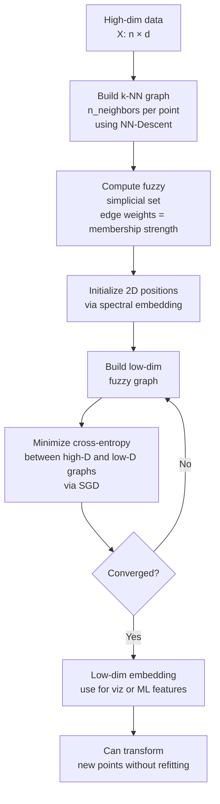
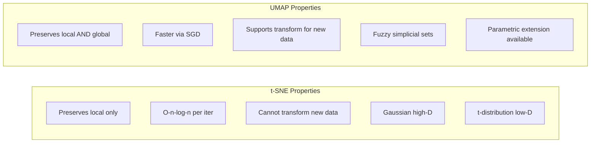

# 🗺️ UMAP

> [!abstract] TL;DR
> UMAP is a non-linear dimensionality reduction algorithm based on topological data analysis (Riemannian geometry + fuzzy simplicial sets). It is faster than t-SNE, preserves both local AND global structure, and can project new data without refitting. The key parameters are `n_neighbors` (local vs global balance) and `min_dist` (how tightly points cluster in the embedding). UMAP can also be used for actual dimensionality reduction (not just visualization).

## Intuition — Analogy First

t-SNE is like drawing a neighborhood map — every block looks perfect, but if you try to navigate from one neighborhood to another, the distances are all wrong. UMAP is like drawing a proper map of an entire country — the neighborhoods still look good, AND you can navigate between them because relative positions across the country are preserved.

More concretely: if you have word embeddings where "king" is close to "queen" and "Paris" is close to "France," t-SNE will show you two tight clusters (royalty words, country-capital pairs) but might place them randomly relative to each other. UMAP will show the same two tight clusters AND will place them appropriately relative to each other in 2D space based on their high-dimensional relationships.

**The core idea:** Model the high-dimensional data as a weighted graph where nearby points have strong connections (fuzzy sets on a Riemannian manifold). Find a low-dimensional graph that has the same topological structure. The optimization finds 2D positions that make the two graphs look the same.

## How It Works — Mechanics

**Phase 1: Build high-dimensional graph**
1. For each point, find its `n_neighbors` nearest neighbors using a fast approximation (NN-Descent)
2. Construct a weighted fuzzy simplicial set (weighted graph) where edge weights represent "membership strength" — how confidently two points are neighbors on the manifold
3. The local metric around each point is normalized so that the nearest neighbor has distance 1

**Phase 2: Build and optimize low-dimensional graph**
1. Initialize low-dim positions (using spectral embedding by default, or random)
2. Build a low-dim fuzzy simplicial set using a parameterized family of curves
3. Minimize the cross-entropy between the two fuzzy graphs using stochastic gradient descent

**Key parameters:**
- **`n_neighbors`** (default 15) — how many neighbors to consider in high-D. Low → captures fine local structure. High → preserves more global structure.
- **`min_dist`** (default 0.1) — minimum distance between points in the embedding. Low → tighter clusters, more empty space. High → more even spread.
- **`n_components`** — target dimensionality (not just 2! Can use 10, 50, etc. for ML features)
- **`metric`** — distance metric (euclidean, cosine, manhattan, etc.)



**UMAP vs t-SNE comparison:**



## The Math

**Riemannian metric around point $x_i$:**
UMAP assumes data lies on a Riemannian manifold. Locally, the manifold is approximated as Euclidean with a distance scaled so that the $k$-th nearest neighbor is at distance 1.

**Fuzzy set membership (high-dim):**
$$v_{ij} = \exp\left(\frac{-\max(0, d(x_i, x_j) - \rho_i)}{\sigma_i}\right)$$

Where $\rho_i$ = distance to nearest neighbor (local connectivity guarantee), $\sigma_i$ = bandwidth from binary search to achieve uniform coverage.

**Symmetrization (combine directed memberships):**
$$w_{ij} = v_{ij} + v_{ji} - v_{ij} \cdot v_{ji}$$

**Low-dim similarity (parametric family):**
$$\phi(y_i, y_j) = \left(1 + a \cdot \|y_i - y_j\|^{2b}\right)^{-1}$$

The constants $a$ and $b$ are fit to match a smooth approximation of the family of curves parameterized by `min_dist`.

**Loss function (cross-entropy between fuzzy graphs):**
$$\mathcal{L} = \sum_{(i,j) \in E} \left[ w_{ij} \log\phi_{ij} + (1 - w_{ij}) \log(1 - \phi_{ij}) \right]$$

Optimized with negative sampling SGD — similar to Word2Vec's objective.

**Complexity:**
- O(n^{1.14}) empirically (roughly O(n log n) for k-NN construction + O(n) per SGD step)
- Typically 5-10x faster than t-SNE for large datasets

## Code Demo

```python
import numpy as np
import matplotlib.pyplot as plt
from sklearn.datasets import load_digits
from sklearn.preprocessing import StandardScaler
from sklearn.decomposition import PCA
from sklearn.manifold import TSNE
import umap  # pip install umap-learn

# Load data
digits = load_digits()
X, y = digits.data, digits.target
X_scaled = StandardScaler().fit_transform(X)

# --- 1. Basic UMAP 2D visualization ---
reducer = umap.UMAP(
    n_components=2,
    n_neighbors=15,
    min_dist=0.1,
    metric='euclidean',
    random_state=42
)
X_umap = reducer.fit_transform(X_scaled)

fig, axes = plt.subplots(1, 3, figsize=(18, 5))
# PCA
pca_2d = PCA(n_components=2).fit_transform(X_scaled)
axes[0].scatter(pca_2d[:, 0], pca_2d[:, 1], c=y, cmap='tab10', s=8, alpha=0.7)
axes[0].set_title('PCA (linear)')

# t-SNE
tsne = TSNE(n_components=2, perplexity=30, init='pca', random_state=42)
X_tsne = tsne.fit_transform(X_scaled)
axes[1].scatter(X_tsne[:, 0], X_tsne[:, 1], c=y, cmap='tab10', s=8, alpha=0.7)
axes[1].set_title('t-SNE (local only)')

# UMAP
axes[2].scatter(X_umap[:, 0], X_umap[:, 1], c=y, cmap='tab10', s=8, alpha=0.7)
axes[2].set_title('UMAP (local + global)')
for ax in axes:
    ax.axis('off')
plt.suptitle('PCA vs t-SNE vs UMAP on Digits Dataset')
plt.tight_layout()
plt.show()

# --- 2. Effect of n_neighbors and min_dist ---
fig, axes = plt.subplots(2, 3, figsize=(15, 10))
configs = [
    {'n_neighbors': 5, 'min_dist': 0.1},
    {'n_neighbors': 15, 'min_dist': 0.1},
    {'n_neighbors': 50, 'min_dist': 0.1},
    {'n_neighbors': 15, 'min_dist': 0.0},
    {'n_neighbors': 15, 'min_dist': 0.5},
    {'n_neighbors': 15, 'min_dist': 0.99},
]
for ax, cfg in zip(axes.flat, configs):
    r = umap.UMAP(random_state=42, **cfg).fit_transform(X_scaled)
    ax.scatter(r[:, 0], r[:, 1], c=y, cmap='tab10', s=5, alpha=0.7)
    ax.set_title(f"n_nbrs={cfg['n_neighbors']}, min_dist={cfg['min_dist']}")
    ax.axis('off')
plt.suptitle('UMAP: Effect of Hyperparameters')
plt.tight_layout()
plt.show()

# --- 3. UMAP for dimensionality reduction (not just viz) ---
from sklearn.pipeline import Pipeline
from sklearn.linear_model import LogisticRegression
from sklearn.model_selection import cross_val_score

# UMAP to 10D then classify
pipe_umap = Pipeline([
    ('scale', StandardScaler()),
    ('umap', umap.UMAP(n_components=10, random_state=42)),
    ('clf', LogisticRegression(max_iter=1000))
])
score_umap = cross_val_score(pipe_umap, digits.data, y, cv=5).mean()
print(f"UMAP (10D) + LR accuracy: {score_umap:.3f}")

# Baseline: PCA to 10D
from sklearn.decomposition import PCA
pipe_pca = Pipeline([
    ('scale', StandardScaler()),
    ('pca', PCA(n_components=10)),
    ('clf', LogisticRegression(max_iter=1000))
])
score_pca = cross_val_score(pipe_pca, digits.data, y, cv=5).mean()
print(f"PCA (10D) + LR accuracy:  {score_pca:.3f}")

# --- 4. Transform new data (t-SNE cannot do this!) ---
from sklearn.model_selection import train_test_split
X_train, X_test, y_train, y_test = train_test_split(
    X_scaled, y, test_size=0.2, random_state=42
)

# Fit on train, transform test
reducer_fit = umap.UMAP(n_components=2, random_state=42).fit(X_train)
X_test_umap = reducer_fit.transform(X_test)  # New data without refitting!
print(f"Transformed {len(X_test)} test points without refitting UMAP")

plt.figure(figsize=(8, 6))
plt.scatter(reducer_fit.embedding_[:, 0], reducer_fit.embedding_[:, 1],
            c=y_train, cmap='tab10', s=5, alpha=0.3, label='Train')
plt.scatter(X_test_umap[:, 0], X_test_umap[:, 1],
            c=y_test, cmap='tab10', s=30, marker='*', label='Test')
plt.legend()
plt.title('UMAP: Train + Transform Test Points')
plt.axis('off')
plt.show()
```

## Real-World Example

**Spotify Music Embedding Visualization:**
Spotify uses audio feature vectors (tempo, key, loudness, danceability, etc. — ~100 dimensions per track) plus collaborative filtering embeddings. UMAP projects these into 2D for their internal "music map" exploratory tools. Unlike t-SNE, the UMAP map preserves genre relationships — jazz and classical are far apart globally, while jazz and blues are nearby locally. Product teams use this to explain recommendations to users.

**Drug Discovery — Single-Cell Proteomics:**
Moderna and other pharma companies use UMAP on high-dimensional protein expression data from individual cells. UMAP's ability to handle batch correction (multiple experiments) and project new drug-treated cells onto an existing reference map (via `.transform()`) makes it indispensable. This workflow is standard in Scanpy's single-cell analysis pipeline.

**NLP Embedding Analysis:**
When fine-tuning BERT for a classification task, teams use UMAP on the [CLS] token embeddings of training examples to verify that the model has learned class-separable representations. UMAP (not t-SNE) is preferred because you can project validation set examples onto the existing training embedding without refitting.

## Trade-offs

| Aspect | UMAP | t-SNE | PCA |
|---|---|---|---|
| Speed | Fast (5-10x faster than t-SNE) | Slow (O(n log n) per iter) | Very fast |
| Global structure | Preserved | Not preserved | Preserved (linear) |
| New data transform | Yes (`.transform()`) | No | Yes |
| Non-linearity | Yes | Yes | No |
| Dimensionality target | Any (2, 10, 50+) | 2–3 only | Any |
| Theory | Topological (Riemannian manifolds) | Statistical (KL divergence) | Linear algebra |
| Reproducibility | Stochastic, set `random_state` | Stochastic, set `random_state` | Deterministic |

## When to Use vs Avoid

**Use UMAP when:**
- You need non-linear dimensionality reduction for actual ML (not just visualization)
- You need to project new data after fitting (production pipelines)
- Dataset is large (n > 10K) — UMAP is much faster than t-SNE
- You want to preserve both local and global structure
- Integrating multiple datasets (via supervised UMAP or metric learning mode)

**Avoid UMAP when:**
- You need strict mathematical interpretability of distances
- The theory matters to your stakeholders and they're uncomfortable with topological arguments
- Extremely small datasets (n < 100) — k-NN graph is unreliable
- You need PCA-style variance explanation (use PCA for that)

## Common Pitfalls

1. **Using UMAP output distances as true distances** — like t-SNE, UMAP distorts distances. Don't compute absolute distances in UMAP space and treat them as meaningful magnitudes.

2. **Not setting `random_state`** — UMAP is stochastic. Always set `random_state=42` (or any integer) for reproducible results.

3. **Using min_dist=0** — creates extremely tight, fragmented clusters that look dramatic but over-segment the data. Start with 0.1.

4. **Conflating visualization UMAP (n_components=2) with reduction UMAP (n_components=50)** — these serve different purposes. For ML features, use n_components=10–50; for viz, use 2–3.

5. **Using cosine metric without knowing why** — for text/embedding data, cosine is often better than Euclidean. But verify: if you've already L2-normalized your vectors, Euclidean and cosine are equivalent.

6. **Skipping normalization** — UMAP, like t-SNE and PCA, is sensitive to feature scale. Always standardize first.

## Related Concepts

- [[_MOC_Classical_ML|↑ Section MOC]]

- [[tSNE]] — predecessor; local-only; slower; no transform for new data
- [[PCA]] — linear; use as first-pass or preprocessing before UMAP
- [[Word_Embeddings]] — UMAP is the preferred visualization and analysis tool for embedding spaces
- [[Feature_Selection]] — UMAP can serve as non-linear feature extraction; compare with selection methods
- [[KMeans]] — often applied on UMAP output to formalize clusters

## Review Questions

1. Your colleague runs UMAP with `n_neighbors=5` and gets many tiny, isolated clusters. Then they run with `n_neighbors=100` and get one large amorphous blob. Explain what each extreme setting represents geometrically, and what you'd recommend.

2. You have a trained UMAP model embedded in a production ML pipeline. New data arrives daily. Explain the exact workflow for projecting new data without the O(n²) cost of refitting, and why t-SNE cannot do this.

3. UMAP is grounded in topological data analysis — specifically Riemannian manifolds and fuzzy simplicial sets. Without getting into the mathematics, explain in 3–4 sentences the core geometric intuition of what UMAP is trying to preserve and why this is different from what PCA preserves.

## Sources

- McInnes, L., Healy, J., & Melville, J. (2018). "UMAP: Uniform Manifold Approximation and Projection for Dimension Reduction." *arXiv:1802.03426*.
- McInnes, L. & Healy, J. (2018). "UMAP: Uniform Manifold Approximation and Projection." *Journal of Open Source Software*, 3(29), 861.
- UMAP documentation: https://umap-learn.readthedocs.io/
- Becht, E. et al. (2019). "Dimensionality reduction for visualizing single-cell data using UMAP." *Nature Biotechnology*, 37, 38–44.
- How to Use UMAP: https://pair-code.github.io/understanding-umap/

#dimensionality-reduction #umap #visualization #unsupervised-learning #manifold-learning #topology #embeddings
